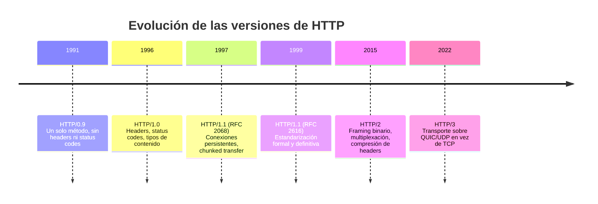
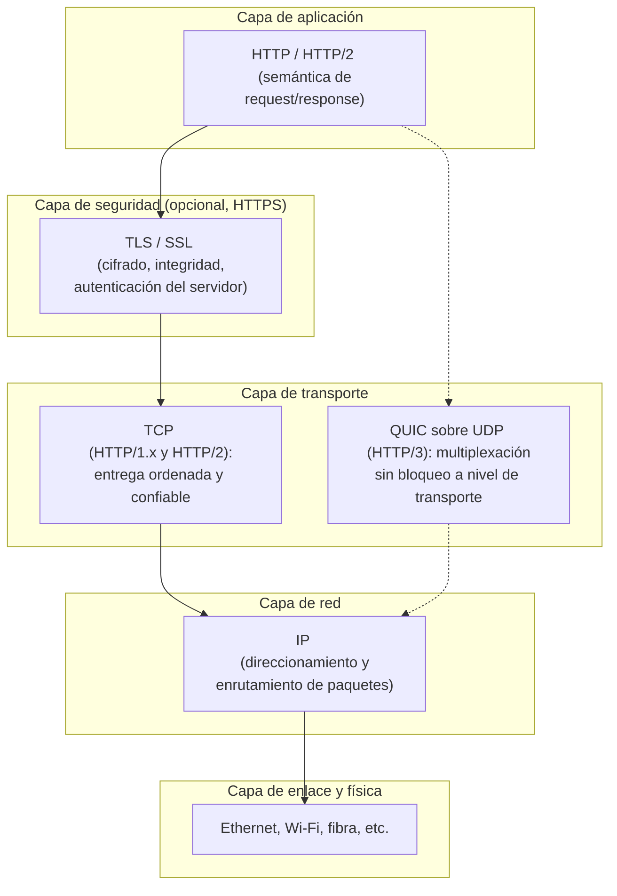
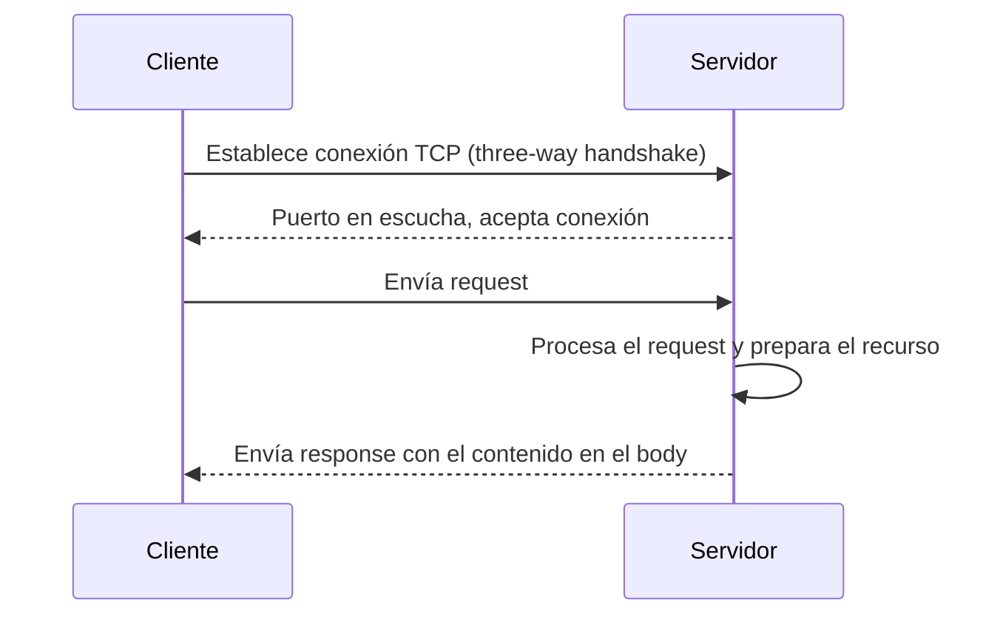
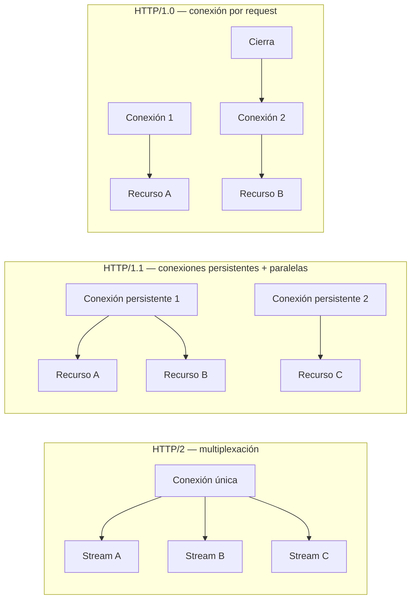
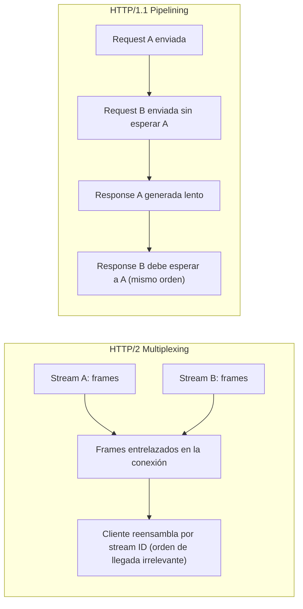

# Protocolo HTTP — Parte 1

Este apunte presenta el protocolo HTTP como pieza central de la arquitectura web: qué problema resuelve, sus características técnicas fundamentales, su historia, cómo se ubica sobre TCP/IP y el ciclo de vida de una conexión, desde el establecimiento hasta la evolución de las conexiones persistentes.

## Qué problema resuelve HTTP

Antes de que existiera un protocolo estandarizado para intercambiar documentos de hipertexto, cada sistema definía su propio formato de comunicación: no había manera uniforme de que un programa le pidiera un documento a otro programa corriendo en una máquina distinta y obtuviera una respuesta interpretable. HTTP (HyperText Transfer Protocol) nace para resolver un problema puntual y concreto: permitir que un cliente pida un recurso identificado por una dirección, y que un servidor responda con ese recurso, usando un formato de mensaje simple, legible y extensible.

El Protocolo de Transferencia de Hipertexto es, en su definición más precisa, un protocolo **sin estado a nivel de aplicación**, basado en solicitudes (*request*) y respuestas (*response*), que utiliza una semántica extensible y cargas de mensajes autodescriptivas para lograr una interacción flexible con sistemas de información de hipertexto distribuidos en una red. Como desarrolladores web, tener un buen conocimiento de HTTP no es opcional: es la base sobre la que se apoya prácticamente cualquier interacción entre cliente y servidor en la Web, ya sea cargar una página, invocar una API o sincronizar datos en segundo plano.

La palabra clave es *extensible*. HTTP no intentó anticipar todos los usos futuros de la Web (hoy transporta APIs REST, streaming de video, actualizaciones en tiempo casi real), pero su diseño de cabeceras arbitrarias y cuerpo de longitud variable permitió que esos usos se sumaran sin romper la compatibilidad con clientes y servidores más antiguos. Esta es una lección de diseño de protocolos que trasciende HTTP: un formato de mensaje que reserva espacio para metadatos no anticipados envejece mucho mejor que uno que codifica rígidamente cada campo posible. Debido justamente a esta extensibilidad, el protocolo se utiliza no solo para obtener documentos de hipertexto, sino también imágenes y videos, o para enviar contenido a servidores, como ocurre con los resultados de formularios HTML.

La clave conceptual del protocolo está en separar dos capas de responsabilidad que conviene distinguir con precisión. Por un lado, **el transporte**: cómo viajan los bytes de un punto a otro de la red sin pérdidas ni desorden, cómo se detecta congestión, cómo se retransmite lo perdido. Por otro, **la semántica de la aplicación**: qué significa "pedir un recurso" y "responder con su contenido". HTTP se ocupa exclusivamente de la segunda capa, y delega la primera en TCP (Transmission Control Protocol), o en una conexión TCP cifrada con TLS, aunque, en teoría, HTTP podría transportarse sobre cualquier protocolo de transporte suficientemente confiable.

Esta separación no es un detalle de implementación menor: es lo que permite que HTTP evolucione (de HTTP/1.0 a HTTP/1.1 y HTTP/2) sin que cambie necesariamente el modelo de transporte subyacente. Un desarrollador que escribe código contra la API `fetch` del navegador no necesita saber los detalles de cómo se establece la conexión por debajo: esa es, precisamente, la garantía que ofrece la separación de capas.

## Características técnicas del protocolo

Antes de profundizar en su historia y en el detalle de las conexiones, conviene fijar con precisión las características que definen a HTTP como protocolo, porque son la base conceptual de todo lo que sigue:

- **Protocolo de request-response.** Toda interacción HTTP se estructura como un par: un request del cliente y un response del servidor. No existe, en el modelo básico de HTTP/1.x, la posibilidad de que el servidor inicie una comunicación sin que medie un request previo del cliente.
- **Modelo cliente-servidor.** HTTP asume roles asimétricos: un cliente activo que inicia la comunicación, y un servidor pasivo que espera y responde. Esta asimetría simplifica el protocolo y es coherente con el modelo general de las arquitecturas cliente-servidor en redes.
- **Puertos por defecto en TCP/IP.** El puerto convencional para un servidor HTTP es el **80**, y el **443** para HTTPS (HTTP sobre TLS). En entornos de desarrollo es habitual usar otros puertos, como 8080 u 8082, para no requerir privilegios especiales del sistema operativo ni interferir con un servidor de producción que ya esté escuchando en el puerto estándar.
- **Sin estado (stateless), pero no sin sesión (sessionless).** HTTP no guarda estado entre los mensajes intercambiados dentro de la misma conexión: cada request se procesa como si fuera la primera, sin memoria de interacciones anteriores por parte del protocolo mismo. Sin embargo, esto no implica que las aplicaciones web no puedan tener sesiones: el uso de cookies, por ejemplo, permite construir sesiones con estado (*stateful sessions*) por encima de un protocolo que, en su capa base, no las ofrece. Distinguir estas dos nociones (stateless a nivel de protocolo, con posibilidad de sesión a nivel de aplicación) es una de las primeras intuiciones que hay que afinar al estudiar HTTP.

  En la práctica, este mecanismo funciona de la siguiente manera: el servidor, en algún response, incluye una cookie (un fragmento de información que el navegador debe guardar y devolver en requests futuras hacia ese mismo dominio). En cada request subsiguiente, el navegador adjunta automáticamente esa cookie, permitiendo que el servidor identifique que se trata del mismo cliente que en la interacción anterior, aunque el protocolo HTTP en sí mismo no conserve ninguna memoria entre un request y el siguiente. Es importante notar que quien construye y mantiene esa noción de sesión es siempre la aplicación, o el framework que la implementa, nunca el protocolo: HTTP se limita a transportar la cookie como una cabecera más, sin darle ningún tratamiento especial ni interpretarla semánticamente.

  Esta separación de responsabilidades tiene una consecuencia práctica relevante para quien diseña una aplicación web: como el servidor no puede confiar en que el protocolo le "recuerde" nada del cliente, toda lógica de autenticación, carrito de compras o preferencias de usuario debe apoyarse explícitamente en mecanismos construidos sobre HTTP: cookies, tokens en cabeceras de autorización, o almacenamiento del lado del cliente. Nunca puede asumir que existe un canal persistente equivalente al de, por ejemplo, una conexión de base de datos que se mantiene abierta y con estado propio durante toda la sesión de trabajo.
- **Extensible.** El uso de cabeceras (*headers*) hace que este protocolo sea fácil de extender: nuevas funcionalidades pueden incorporarse como cabeceras adicionales sin romper la compatibilidad con implementaciones que no las reconocen, simplemente ignorándolas.
- **Versión vigente y evolución reciente.** La versión HTTP/1.1 agrega, respecto de HTTP/1.0, varias funcionalidades relevantes: conexiones persistentes, codificación de transferencia por fragmentos (*chunked transfer-coding*) y headers de control de caché. En 2015 se estandarizó HTTP/2, que encapsula los mensajes HTTP dentro de tramas (*frames*) binarias, cambiando el formato de transporte sin alterar la semántica de request/response. Más recientemente, HTTP/3 avanzó un paso más al reemplazar incluso TCP como protocolo de transporte subyacente, un cambio que se detalla más adelante en este apunte.

## Historia en breve

El protocolo se gestó en el CERN entre 1989 y 1991, como parte del proyecto de Tim Berners-Lee para enlazar documentos científicos mediante hipertexto y facilitar que investigadores en distintas instituciones compartieran información sin depender de formatos propietarios o sistemas centralizados. HTTP fue diseñado a principios de los años 90 y, desde entonces, ha evolucionado de forma continua sin perder su carácter extensible original.

La primera implementación, retrospectivamente llamada HTTP/0.9, era deliberadamente mínima: solo existía para probar que la idea de "pedir un documento por su dirección" funcionaba en la práctica. No tenía headers ni códigos de estado, y el único método disponible era un request de una sola línea que pedía un documento y recibía como response directamente su contenido en HTML.

Recién con la masificación de la Web a mediados de los años 90 aparece la necesidad de un protocolo con headers, códigos de estado y métodos adicionales: a medida que se sumaban imágenes, formularios y otros tipos de contenido, un protocolo que solo devolviera HTML sin indicar su tipo dejaba de ser suficiente. Esto da lugar a HTTP/1.0, y posteriormente a la estandarización formal de HTTP/1.1, que consolidó y refinó el comportamiento que ya se observaba de facto en implementaciones de HTTP/1.0, agregando comportamientos por defecto más eficientes como las conexiones persistentes, la codificación de transferencia por fragmentos y headers de control de caché.

Este recorrido histórico explica varias decisiones de diseño que de otro modo parecerían arbitrarias. La simplicidad del formato de texto plano en HTTP/1.x responde a que el protocolo nació para ser depurable a simple vista: un desarrollador de los años 90 podía inspeccionar una conexión y leer las líneas de un request directamente, sin herramientas especializadas. No fue sino hasta que el volumen de tráfico web lo justificó que se priorizó la eficiencia de un formato binario sobre esa legibilidad original, lo cual dio lugar, ya en 2015, a HTTP/2, que encapsula los mensajes HTTP en tramas binarias para permitir optimizaciones como la compresión de headers y la multiplexación de mensajes sobre una misma conexión.

También vale la pena situar este protocolo en el contexto más amplio de la historia de Internet: HTTP no fue el primer protocolo de aplicación diseñado para compartir documentos a través de una red. Ya existían, por ejemplo, FTP (File Transfer Protocol) para transferencia de archivos entre sistemas, y Gopher, un protocolo de principios de los 90 que organizaba el contenido de un servidor como un sistema de menús jerárquicos navegables, sin el concepto de hipervínculo embebido dentro del propio documento que caracteriza al hipertexto. La diferencia con HTTP no es menor: mientras que Gopher exigía navegar recurso por recurso a través de una estructura de menús predefinida por el servidor, HTTP, combinado con HTML, permite que cualquier punto dentro del contenido de un documento se convierta en un enlace hacia otro recurso, sin restricción de estructura jerárquica. Fue precisamente esa flexibilidad de enlazado, sumada a la aparición de los primeros navegadores gráficos a inicios de los años 90, lo que catalizó el crecimiento explosivo de la Web tal como la conocemos hoy, en detrimento de alternativas previas como Gopher, cuyo uso declinó rápidamente una vez que la Web ofreció una experiencia de navegación más flexible y visualmente más rica.

Un dato adicional que ayuda a dimensionar la velocidad de esta transición: en apenas un puñado de años (de la publicación informal de HTTP/0.9 en 1991 a la estandarización de HTTP/1.1 en 1997, refrendada por la RFC 2616 en 1999), el protocolo pasó de ser una prueba de concepto interna de un laboratorio de física de partículas a convertirse en el protocolo de aplicación más utilizado de Internet, sosteniendo el crecimiento de la Web comercial que se produjo en paralelo durante esos mismos años.

El siguiente timeline resume las versiones del protocolo junto con su cambio técnico principal, para tener de un vistazo la progresión completa que se detalló en esta sección:



**Figura 1 — Timeline de versiones de HTTP.** Cada versión resuelve una limitación concreta de la anterior: HTTP/0.9 solo probaba el concepto, HTTP/1.0 agregó los metadatos que faltaban, HTTP/1.1 optimizó el uso de conexiones, y HTTP/2 y HTTP/3 atacaron, cada uno a su manera, el problema de la latencia y la concurrencia sobre la red.

## HTTP y Hypertext

El nombre del protocolo no es casual: fue diseñado específicamente para transportar **hypertext**. El hipertexto es un sistema de organización de la información basado en enlaces (*hyperlinks*) que permiten conectar documentos entre sí: en lugar de leer de forma estrictamente lineal, quien consulta el contenido puede "saltar" de un recurso a otro siguiendo vínculos.

Tim Berners-Lee creó la Web a fines de los años 80 y principios de los 90 con la idea de unir tres piezas complementarias:

1. **Un lenguaje de marcado**: HTML (HyperText Markup Language), que permitiera crear documentos con enlaces hacia otros documentos.
2. **Un sistema de identificación**: URL (Uniform Resource Locator), para poder localizar cualquier recurso de manera unívoca en la red.
3. **Un protocolo de transferencia**: HTTP, encargado de transportar esos documentos de hipertexto desde un servidor hasta un cliente, típicamente el navegador.

De esta tríada se desprende una distinción conceptual que conviene tener clara: el **hipertexto** es el contenido en sí (documentos enlazados entre sí); **HTML** es el formato concreto en el que se escribe ese contenido; **HTTP** es el protocolo que transporta ese contenido de un lugar a otro; y la **Web**, como ecosistema, surge precisamente de la unión de estas tres piezas trabajando en conjunto.

Con el paso del tiempo, la noción de "documento enlazado" se amplió considerablemente en la práctica: HTML no solo enlaza documentos de texto, sino también otros recursos que complementan y enriquecen al documento principal, como hojas de estilo CSS (que definen presentación y estilos), JavaScript (que añade interactividad y lógica de aplicación), e imágenes, videos, fuentes tipográficas e íconos. Todos estos recursos adicionales se cargan a través de HTTP (o su variante cifrada, HTTPS) mediante peticiones que el navegador dispara automáticamente a medida que interpreta el documento HTML principal, sin que el usuario deba solicitarlas explícitamente.

Esta arquitectura de "documento que referencia recursos" tiene una consecuencia práctica directa sobre el volumen de tráfico: cargar una única página web casi nunca implica una sola request HTTP. El documento HTML inicial suele referenciar decenas de recursos adicionales, cada uno de los cuales requiere su propia request/response. Esta característica es, precisamente, la que motiva buena parte de las optimizaciones de conexión que se describen en la última sección de este apunte: si cada recurso implicara una conexión TCP completamente nueva, con su propio costo de establecimiento, el costo acumulado de cargar una página moderna sería considerable en términos de latencia.

## La variante cifrada HTTPS

Aunque HTTP fue diseñado originalmente sin cifrado, la necesidad de proteger información sensible transmitida entre cliente y servidor (credenciales, datos de pago, información personal) llevó a que, ya en 1994, Netscape desarrollara **HTTPS** (HyperText Transfer Protocol Secure), la variante segura del protocolo. HTTPS no es un protocolo distinto de HTTP en su semántica de request/response: es HTTP transportado sobre una conexión cifrada mediante TLS (Transport Layer Security) o su predecesor, SSL (Secure Sockets Layer), hoy considerado obsoleto e inseguro.

Conviene precisar en qué capa opera cada pieza de esta combinación: HTTP sigue operando en la capa de aplicación, definiendo la semántica de los mensajes; TLS opera en una capa por debajo, encargándose de cifrar el canal de transporte antes de que los mensajes HTTP viajen por él. Esta separación de responsabilidades es coherente con el principio general de capas independientes que se discutió al comienzo de este apunte: HTTP no necesita saber nada sobre cifrado, y TLS no necesita saber nada sobre la semántica de HTTP; simplemente uno se apoya sobre el otro.

HTTPS cumple tres funciones de seguridad concretas que HTTP sin cifrar no ofrece: **confidencialidad** (el contenido de los mensajes no puede ser leído por un tercero que intercepte el tráfico), **integridad** (los mensajes no pueden ser alterados en tránsito sin que el receptor lo detecte) y **autenticación del servidor** (mediante certificados digitales, el cliente puede verificar que efectivamente se está comunicando con el servidor legítimo, y no con un atacante interpuesto en la comunicación, lo que se conoce como un ataque de intermediario, o *man-in-the-middle*).

Aunque su adopción fue gradual durante buena parte de la historia de la Web (limitada, durante años, a formularios de login o pasarelas de pago), HTTPS se convirtió progresivamente en el estándar de facto para prácticamente cualquier sitio web, al punto de que hoy más del 90% de los sitios en la Web lo utilizan como protocolo por defecto. Este cambio de práctica estuvo motivado tanto por la creciente concientización sobre privacidad y seguridad, como por decisiones concretas de los navegadores y buscadores (que penalizan o advierten explícitamente sobre sitios servidos sin cifrar) y por la disponibilidad de certificados TLS gratuitos y de emisión automatizada, que redujeron drásticamente la barrera de costo y complejidad para adoptarlo.

En términos de convención de puertos, HTTPS mantiene la distinción ya mencionada: mientras HTTP sin cifrar utiliza por defecto el puerto 80, HTTPS utiliza el puerto 443. Esta distinción de puertos es, en la práctica, la señal que usan tanto navegadores como servidores para saber, desde el mismo inicio de la conexión TCP, qué variante del protocolo esperar por ese canal.

Un dato adicional sobre la evolución de las versiones de HTTP más allá de HTTP/2: existe ya una versión HTTP/3, que reemplaza TCP por QUIC (un protocolo de transporte sobre UDP) buscando reducir la latencia de establecimiento de conexión y evitar que la pérdida de un paquete bloquee a los demás streams de una misma conexión, algo que en HTTP/2 puede seguir ocurriendo a nivel de TCP aunque ya no ocurra a nivel de aplicación. Su adopción, aunque creciente, todavía convive con HTTP/2 en una porción significativa de los sitios de la Web, en un proceso de transición gradual similar al que experimentaron las versiones anteriores del protocolo.

Con HTTPS y HTTP/3 ya mencionados, conviene fijar en un solo diagrama el stack completo de protocolos que participan en una comunicación web típica, y en qué capa se ubica cada uno:



**Figura 2 — Stack de protocolos de una comunicación HTTP.** HTTP (y HTTP/2) definen la semántica de aplicación sin conocer los detalles de las capas inferiores; TLS agrega cifrado quedando entre la aplicación y el transporte cuando se usa HTTPS; por debajo, HTTP/1.x y HTTP/2 dependen de TCP para una entrega ordenada, mientras que HTTP/3 delega esa función en QUIC sobre UDP; IP se encarga del enrutamiento entre redes, y la capa de enlace transporta los bits sobre el medio físico concreto (cableado, radio, etc.). Cada capa ignora los detalles internos de las demás: es la misma separación de responsabilidades discutida al principio de este apunte, aplicada ahora a la pila completa.

## Precisiones sobre el modelo cliente-servidor

Conviene precisar qué significan "cliente" y "servidor" en el contexto de HTTP, porque son roles del protocolo, no tipos fijos de programa. Un navegador web es el ejemplo más habitual de cliente HTTP, pero cualquier programa que envíe un request y espere un response cumple ese rol: un script de línea de comandos, una aplicación móvil que consume una API, o incluso otro servidor que a su vez actúa como cliente de un tercer servicio (un patrón habitual en arquitecturas donde un servidor intermedio agrega datos de varias fuentes antes de responder a su propio cliente). De manera análoga, un servidor HTTP puede ser un servidor de archivos estáticos, una aplicación que genera contenido dinámicamente, o un proxy que reenvía el request hacia otro servidor.

Esta flexibilidad de roles introduce un matiz relevante: los mismos principios de HTTP se aplican tanto si el "servidor" es una única máquina física dedicada, como si en realidad es una capa de proxies y múltiples instancias de aplicación, todas presentándose ante el cliente como un único punto de contacto identificado por un nombre de host. Desde la perspectiva del protocolo, esa complejidad interna es irrelevante: el cliente solo necesita saber que, al enviar un request a una dirección determinada, va a recibir un response coherente, sin que le importe cuántos componentes internos colaboraron para producirla.

El carácter *stateless* del protocolo refuerza este modelo: como cada request se procesa de forma independiente, un servidor puede, en principio, atender la primera request de un cliente y la segunda puede ser procesada por una máquina física completamente distinta (por ejemplo, detrás de un balanceador de carga), sin que el cliente lo perciba ni deba coordinarse explícitamente con una instancia particular. Esta propiedad es una de las razones por las que HTTP resultó tan apto como base para arquitecturas distribuidas y escalables horizontalmente: agregar más instancias de servidor para atender más tráfico no exige ningún cambio en el protocolo ni en el cliente, siempre que el estado de aplicación (si lo hay, construido mediante cookies o mecanismos equivalentes) se maneje de forma compartida entre esas instancias.

## Estableciendo la conexión sobre TCP/IP

En los protocolos de tipo cliente-servidor, es siempre el cliente quien establece la conexión. TCP/IP es la pila de protocolos que garantiza la entrega confiable de datos entre dos hosts, y sobre la cual se apoyó HTTP desde su origen. TCP aporta tres propiedades que HTTP necesita y deliberadamente no reimplementa: **entrega ordenada**, **confiabilidad** (detecta y retransmite segmentos perdidos) y **control de flujo y congestión**. El puerto por defecto para HTTP es el 80, y 443 para HTTPS.

Cuando un cliente (típicamente un navegador, aunque también puede ser otra aplicación) quiere comunicarse con un servidor HTTP, primero debe establecerse una **conexión TCP** mediante el conocido saludo de tres vías (*three-way handshake*): el cliente envía un segmento con la bandera `SYN`, el servidor responde con un segmento `SYN-ACK`, y el cliente confirma con un `ACK`. Recién sobre esa conexión ya establecida se transmiten los mensajes HTTP.

Resulta útil describir, paso a paso, lo que ocurre en una **sesión HTTP** típica una vez que esa conexión ya está disponible, entendiendo "sesión" aquí en el sentido de un ciclo completo de interacción, no como sinónimo de estado persistente de aplicación:

1. El cliente inicia un request HTTP estableciendo una conexión TCP hacia un puerto determinado en el servidor (el three-way handshake recién descrito).
2. El servidor, con su puerto en estado de escucha (*listening*), espera un request.
3. El servidor atiende el request y prepara los recursos correspondientes: puede ser un documento HTML estático o el resultado de algún procesamiento dinámico.
4. El servidor envía el response, incluyendo el contenido en el body del mensaje.

Una precisión importante sobre este ciclo: desde HTTP/1.1, la conexión ya no se finaliza automáticamente al completar este intercambio. Por el contrario, al cliente se le otorga la posibilidad de realizar nuevas requests sobre la misma conexión, de modo que el ciclo de request/response puede repetirse reiteradas veces sin necesidad de establecer una conexión TCP nueva cada vez. Este comportamiento, las conexiones persistentes, es uno de los cambios más significativos que introdujo HTTP/1.1 respecto de su predecesor, y se retoma con más detalle más adelante en este mismo apunte.



**Figura 3 — Ciclo de una sesión HTTP sobre TCP.** Tras el establecimiento de la conexión TCP, el cliente inicia el request; el servidor, que permanecía escuchando en su puerto, atiende el request, procesa lo necesario para producir el recurso solicitado y responde con el contenido en el body del mensaje. Desde HTTP/1.1, esta secuencia puede repetirse varias veces sobre la misma conexión.

Una limitación estructural del modelo cliente-servidor es que el servidor no puede enviar datos sin que el cliente haya iniciado un request. Como workaround, las aplicaciones web recurren a: pings periódicos mediante `fetch`, WebSockets (canal bidireccional persistente), o Server-Sent Events (servidor mantiene abierto un response enviando actualizaciones sobre una conexión HTTP de larga duración).

```javascript
// Ejemplo conceptual: un request HTTP simple usando fetch (API del navegador).
// El código de aplicación no gestiona la conexión TCP directamente:
// esa responsabilidad queda delegada en el motor de red del navegador.
async function obtenerRecurso(url) {
  const response = await fetch(url); // dispara la conexión TCP si hace falta, o reutiliza una existente
  if (!response.ok) {
    throw new Error(`Respuesta no exitosa: ${response.status}`);
  }
  return response.text();
}
```

Un matiz relevante sobre el fragmento anterior: `fetch` solo rechaza su promesa cuando ocurre un error de red (por ejemplo, el servidor es inalcanzable). Un código de estado de error no provoca por sí mismo que la promesa se rechace: el request llegó, se procesó y hubo un response HTTP válido, solo que ese response indica un fallo semántico. Distinguir "la comunicación falló" de "la comunicación tuvo éxito pero el resultado es un error" es una intuición central para trabajar con HTTP desde código.

Así como la apertura de una conexión TCP sigue un protocolo explícito, su cierre también lo hace: cualquiera de las dos partes puede iniciarlo enviando un segmento con la bandera `FIN`, indicando que no tiene más datos para transmitir. La otra parte confirma con un `ACK` y, cuando a su vez termina de enviar lo que tuviera pendiente, envía su propio `FIN`, que se confirma con un último `ACK`. Este cierre ordenado en cuatro pasos es lo que permite que ninguna de las dos partes pierda datos que estuvieran en tránsito en el momento en que se decide cerrar la conexión. En el contexto de HTTP/1.0, donde cada recurso implicaba abrir y cerrar una conexión, este costo de cierre se sumaba al costo de apertura en cada request, reforzando aún más la motivación detrás de las conexiones persistentes que introduce HTTP/1.1.

### Alternativas al modelo request-response

Existen dos mecanismos estandarizados para superar la limitación de que el servidor no puede iniciar comunicación: WebSockets (canal bidireccional) y Server-Sent Events (flujo unidireccional servidor-cliente). Ambos se profundizan en el Anexo 2 de este apunte.

La elección depende del patrón de comunicación: sondeo para actualizaciones poco frecuentes, SSE para flujo unidireccional servidor-cliente, y WebSockets para comunicación bidireccional de baja latencia.

## Evolución de las conexiones persistentes

El manejo de conexiones es uno de los puntos donde más cambió el protocolo a lo largo de sus versiones, y conviene mirarlo en perspectiva histórica para entender por qué cada solución sucesiva existe.

En **HTTP/1.0** cada par request/response exigía una conexión nueva (corta duración). Si una página enlazaba diez imágenes, el navegador debía establecer diez conexiones, introduciendo latencia significativa y acumulativa, especialmente en redes con tiempos de ida y vuelta (RTT) altos.

En **HTTP/1.1** se permiten conexiones persistentes, reutilizando una única conexión TCP para varios pares request/response. Sin embargo, las requests deben procesarse en orden: un response lento bloquea los siguientes, aun cuando estén listos. Los navegadores lo resuelven abriendo múltiples conexiones en paralelo hacia cada dominio (típicamente 6 conexiones actualmente).

El *domain sharding* (distribuir recursos entre subdominios) fue una técnica antigua que multiplicaba conexiones en HTTP/1.1. Hoy está obsoleta: HTTP/2 multiplexación elimina esa necesidad. Se profundiza en el Anexo 1.

**HTTP/2** resuelve este problema introduciendo la **multiplexación**: entrelaza múltiples mensajes sobre una única conexión, de modo que un response lento no bloquea los demás, eliminando la necesidad de conexiones paralelas.



**Figura 4 — Evolución del modelo de conexiones.** HTTP/1.0 abre y cierra una conexión por cada recurso; HTTP/1.1 reutiliza conexiones persistentes y las combina con conexiones paralelas hacia el mismo host para ganar concurrencia; HTTP/2 logra esa misma concurrencia sobre una única conexión, multiplexando streams independientes que no se bloquean entre sí.

Un ejemplo adicional en código muestra cómo, desde una aplicación, se pueden disparar varias requests hacia el mismo host sin que el desarrollador necesite gestionar manualmente cuántas conexiones se abren o cómo se multiplexan:

```javascript
// Dispara varias requests al mismo host: el navegador decide internamente
// si las multiplexa sobre una conexión (HTTP/2) o si abre conexiones paralelas (HTTP/1.1).
async function precargarRecursos(urls) {
  const promesas = urls.map((url) => fetch(url));
  const respuestas = await Promise.all(promesas);
  return respuestas.filter((response) => response.ok);
}
```

Desde la perspectiva del código de aplicación, esta diferencia de transporte es completamente invisible: el `fetch` se comporta igual sin importar si el servidor habla HTTP/1.1, HTTP/2 o HTTP/3, y el desarrollador no necesita escribir código distinto en cada caso. Esa transparencia es, precisamente, uno de los objetivos de diseño explícitos del protocolo: la evolución de las versiones no debería requerir cambios en el código de las aplicaciones que lo consumen, sino a lo sumo en la configuración del servidor.

**HTTP/3** lleva esta evolución un paso más allá, atacando un límite que la multiplexación de HTTP/2 no llega a resolver del todo: aunque los streams ya no se bloquean entre sí a nivel de la aplicación, siguen viajando sobre una única conexión TCP, y TCP garantiza la entrega en orden de todos sus datos. Si un paquete se pierde en la red, TCP retiene el resto de los datos ya llegados hasta poder retransmitir el paquete faltante, lo que termina bloqueando a todos los streams multiplexados por igual, un fenómeno conocido como *head-of-line blocking a nivel de transporte*. HTTP/3 elimina ese remanente de bloqueo reemplazando TCP por **QUIC**, un protocolo de transporte que corre sobre UDP y que, a diferencia de TCP, mantiene *conciencia de streams* también a nivel de transporte: cada stream es una secuencia de bytes ordenada e independiente de las demás, de modo que la pérdida de un paquete afecta únicamente al stream cuyos datos viajaban en él, sin retener al resto.

QUIC aporta, además, dos beneficios que van más allá de resolver el bloqueo de HTTP/2. El primero es la integración nativa de **TLS 1.3**: en vez de negociar por separado la conexión de transporte y luego el cifrado (como ocurre con TCP + TLS, que demanda dos *round-trips* completos para una conexión nueva), QUIC combina ambos handshakes en una sola operación, reduciendo una conexión nueva a un único *round-trip*, y permitiendo, si el cliente ya tiene parámetros de una sesión TLS previa cacheados, enviar datos en el primer paquete sin esperar ningún *round-trip* adicional (lo que se conoce como **0-RTT**). El segundo beneficio es la **migración de conexión**: TCP identifica una conexión mediante la combinación de IP y puerto de origen y destino, de modo que si un dispositivo cambia de red (por ejemplo, pasa de Wi-Fi a datos móviles) esa conexión se corta y hay que reestablecerla desde cero; QUIC, en cambio, identifica cada conexión mediante un **Connection ID** independiente de la dirección IP, por lo que la conexión sigue viva aun cuando cambie la red subyacente, algo particularmente valioso para dispositivos móviles.

La adopción de HTTP/3 es ya considerable sin haber desplazado a HTTP/2: está soportado en todos los navegadores principales, en los proveedores de CDN más importantes (Cloudflare, Google Cloud, AWS CloudFront, Fastly, Akamai) y en servidores como LiteSpeed, Caddy, NGINX e IIS. Como el cliente no sabe de antemano si un servidor soporta HTTP/3, este se anuncia mediante el header `Alt-Svc` (por ejemplo, `Alt-Svc: h3=":443"; ma=86400`) en una primera conexión por HTTP/2, o mediante registros DNS de tipo `HTTPS` que permiten conocer el soporte desde la primera visita.

## Conclusión

HTTP resuelve un problema de comunicación entre cliente y servidor definiendo una semántica de request/response estable, apoyada en un modelo cliente-servidor asimétrico y en una separación clara respecto de su capa de transporte. Estas características técnicas (request-response, cliente-servidor, sin estado pero no sin sesión, extensible) se mantienen consistentes desde HTTP/0.9 hasta HTTP/3, aunque el manejo concreto de las conexiones haya evolucionado radicalmente: de una conexión nueva por cada recurso, a conexiones persistentes combinadas con paralelismo, a la multiplexación sobre una única conexión TCP, y finalmente al reemplazo de TCP por QUIC para eliminar el bloqueo que persistía a nivel de transporte.

Conviene remarcar cómo se articulan entre sí los tres bloques recorridos en este apunte. Las **características técnicas** del protocolo (qué significa que sea stateless, extensible y de tipo request-response) son el marco conceptual fijo que no cambia entre versiones. La **historia** del protocolo explica por qué ese marco conceptual se implementó primero de forma minimalista (HTTP/0.9) y fue ganando funcionalidad progresivamente a medida que la Web creció en complejidad y en volumen de tráfico. Y el **manejo de conexiones** es, en última instancia, el terreno concreto donde esa presión de escala se manifestó con más fuerza: cada mejora sucesiva (conexiones persistentes, paralelismo, multiplexación) responde a la misma tensión de fondo entre la simplicidad del modelo original y la necesidad de servir páginas cada vez más pesadas, con más recursos, a más usuarios simultáneos.

Entender esta base (el problema que resuelve HTTP, sus características definitorias, su historia y su relación con TCP/IP) es la base conceptual indispensable para interpretar correctamente el formato concreto de los mensajes que intercambian cliente y servidor: sus headers, sus métodos y sus códigos de estado, que son el terreno donde esa semántica de request/response se materializa en la práctica cotidiana del desarrollo web.

## Anexo 1 — HTTP Pipelining & Multiplexing

El cuerpo de este apunte ya presentó, en la sección sobre conexiones persistentes, la multiplexación como la solución de HTTP/2 al problema de *head-of-line blocking*. Este anexo profundiza esa idea distinguiendo con precisión dos mecanismos que suelen confundirse por su nombre parecido y su propósito compartido (reducir la cantidad de conexiones necesarias para cargar una página), pero que funcionan de manera completamente distinta y con resultados prácticos muy diferentes: el **pipelining** de HTTP/1.1 y la **multiplexación** de HTTP/2.

### La promesa incumplida del pipelining

El *pipelining* es una característica introducida en HTTP/1.1 que permite enviar múltiples requests sobre una misma conexión TCP sin esperar el response de cada uno antes de enviar el siguiente. En lugar de seguir el ciclo estricto de "enviar request, esperar response, enviar la siguiente request", el cliente podía despachar varias requests en sucesión, con el objetivo teórico de mejorar los tiempos de carga, un beneficio especialmente notable en conexiones de alta latencia.

El problema del pipelining está en su propia regla de funcionamiento: aunque las requests se envíen sin esperar, el servidor está obligado a devolver las responses **en el mismo orden** en que llegaron las requests. Esta restricción recrea, dentro de una única conexión "pipelineada", el mismo cuello de botella que el pipelining pretendía evitar: si la primera response tarda en generarse, todas las que le siguen quedan bloqueadas detrás de ella en la cola de salida, aunque ya estuvieran listas para enviarse. Este fenómeno, el mismo *head-of-line blocking a nivel de aplicación* mencionado en la sección de conexiones persistentes, es la razón principal por la que el pipelining nunca tuvo una adopción práctica significativa.

A esa limitación estructural se sumaron problemas de implementación en el ecosistema real: muchos servidores antiguos no soportaban pipelining correctamente, y los proxies intermedios (muy comunes en redes corporativas o de operadores) con frecuencia manejaban mal las requests pipelineadas, a veces reordenándolas o directamente rompiendo la conexión. Además, pipelinear requests con métodos no idempotentes (como `POST`) es riesgoso: si la conexión se corta a mitad del pipeline, no hay forma segura de saber cuáles de esas requests no idempotentes ya se procesaron y cuáles no, lo cual desalentaba su uso salvo para métodos *safe* como `GET`.

Como consecuencia de estos problemas combinados, la mayoría de los navegadores nunca activaron pipelining por defecto, y para 2017, con la adopción ya mayoritaria de HTTP/2, la funcionalidad quedó obsoleta en la práctica, aunque formalmente siga siendo parte de la especificación de HTTP/1.1.

### La solución de raíz de HTTP/2

La **multiplexación** de HTTP/2 resuelve el mismo problema que el pipelining intentaba resolver (evitar abrir múltiples conexiones para cargar varios recursos en paralelo), pero elimina de raíz la restricción de orden que hacía fallar al pipelining. En vez de enviar mensajes completos en una secuencia que debe respetarse estrictamente, HTTP/2 divide cada mensaje en fragmentos binarios pequeños llamados *frames*, cada uno etiquetado con un identificador de *stream*. Múltiples streams, cada uno representando un par request/response independiente, pueden entrelazar sus frames sobre la misma conexión TCP, y el receptor los reordena y reensambla usando esos identificadores, sin importar en qué orden llegaron físicamente los frames.

Esta diferencia es la que rompe la dependencia de orden estricto: si el response de un stream tarda en generarse, los frames de los demás streams siguen viajando y entregándose con normalidad, en lugar de quedar todos bloqueados detrás del más lento. Dicho de otro modo, el pipelining intentaba lograr concurrencia manteniendo un orden estricto de entrega; la multiplexación logra una concurrencia genuina abandonando esa restricción de orden, gracias a que cada frame lleva la información necesaria para reensamblarse correctamente en el destino sin importar la secuencia de llegada.



**Figura 5 — Pipelining vs. multiplexing.** El pipelining de HTTP/1.1 permite enviar varias requests sin esperar cada response, pero exige devolverlas en el mismo orden de llegada, lo cual recrea el bloqueo que buscaba evitar; la multiplexación de HTTP/2 fragmenta los mensajes en frames identificados por stream, permitiendo que se entrelacen y reensamblen sin depender del orden de llegada.

### Optimizaciones que quedaron obsoletas

La multiplexación no es solo una mejora técnica interna: cambió qué prácticas de optimización siguen teniendo sentido en el desarrollo web. Bajo HTTP/1.1, con su límite de conexiones paralelas por host y sin multiplexación real, se volvieron habituales varias técnicas para maximizar la concurrencia disponible:

- **Domain sharding** (ya mencionado en la sección de conexiones persistentes de este apunte): distribuir recursos entre subdominios para multiplicar la cantidad de conexiones paralelas permitidas por el navegador. Con HTTP/2, esta técnica quedó obsoleta: al soportar solicitudes concurrentes prácticamente ilimitadas sobre una única conexión, dividir recursos entre subdominios artificiales solo agrega el costo de resoluciones DNS y *handshakes* TCP/TLS adicionales, sin ningún beneficio de concurrencia a cambio.
- **Concatenación de archivos** (combinar múltiples hojas de estilo o scripts en un solo archivo): bajo HTTP/1.1 reducía la cantidad de requests, que era el recurso escaso. Bajo HTTP/2, esta práctica puede ser contraproducente: un archivo concatenado grande invalida por completo la caché del navegador ante el cambio de una sola línea, mientras que archivos más pequeños y granulares se benefician de políticas de caché independientes, y la multiplexación ya elimina el costo de hacer más requests individuales.
- **Inlining de recursos** (incrustar CSS o imágenes directamente dentro del HTML como *data URIs*, para evitar requests adicionales): bajo HTTP/2 pierde buena parte de su justificación, porque impide que ese recurso se cachee de forma independiente y además distorsiona la priorización de streams que el protocolo maneja internamente.

Estas prácticas no son "incorrectas" en abstracto: eran respuestas racionales a las limitaciones reales de HTTP/1.1. Lo que cambió es el costo-beneficio subyacente, una vez que la multiplexación de HTTP/2 elimina la escasez de conexiones concurrentes que esas técnicas buscaban paliar. Otras prácticas de optimización, en cambio, siguen siendo válidas sin importar la versión del protocolo: minimizar resoluciones DNS, aprovechar CDNs, usar caché del navegador correctamente, reducir el tamaño de los payloads y evitar redirects innecesarios.

```javascript
// Ejemplo: verificar desde el cliente si la conexión negociada es HTTP/2,
// útil para decidir en tiempo de diagnóstico si ciertas optimizaciones
// heredadas de HTTP/1.1 (como fragmentar en subdominios) siguen aplicando.
async function verificarProtocolo(url) {
  const response = await fetch(url);
  // El navegador expone el protocolo negociado en el Performance API,
  // no directamente en el objeto Response.
  const [entry] = performance.getEntriesByType('resource')
    .filter((e) => e.name === url);
  return entry ? entry.nextHopProtocol : 'desconocido'; // "h2", "http/1.1", etc.
}
```

## Anexo 2 — Comunicación en tiempo real

Todo lo desarrollado hasta acá asume el modelo de HTTP puro: el cliente inicia cada request y el servidor solo puede responder a eso, nunca "avisar" espontáneamente. Para aplicaciones que necesitan comunicación en tiempo real (chats, notificaciones, cotizaciones en vivo, paneles de monitoreo) ese modelo es una limitación real, y existen dos mecanismos estandarizados para superarla sin renunciar a HTTP como punto de partida: **WebSocket** y **Server-Sent Events (SSE)**.

### Canal bidireccional con WebSocket

**WebSocket** es un protocolo que abre, sobre una única conexión TCP, un canal de comunicación **full-duplex** (bidireccional simultáneo) entre cliente y servidor: ambas partes pueden enviar mensajes en cualquier momento, sin que cada mensaje tenga que ser la respuesta a un request previo.

La conexión no empieza como un protocolo aparte, sino como un request HTTP normal que pide ser "actualizado" (*upgrade*). El cliente envía un header `Upgrade: websocket` junto con un valor aleatorio en `Sec-WebSocket-Key`; si el servidor soporta el protocolo, responde con status code `101 Switching Protocols` y un header `Sec-WebSocket-Accept` calculado a partir de esa clave. A partir de ese momento, la misma conexión TCP deja de hablar HTTP y pasa a intercambiar mensajes con el formato binario propio de WebSocket, sin volver a repetir headers en cada mensaje como sí ocurre en HTTP.

```http
GET /chat HTTP/1.1
Host: ejemplo.com
Upgrade: websocket
Connection: Upgrade
Sec-WebSocket-Key: dGhlIHNhbXBsZSBub25jZQ==
Sec-WebSocket-Version: 13

HTTP/1.1 101 Switching Protocols
Upgrade: websocket
Connection: Upgrade
Sec-WebSocket-Accept: s3pPLMBiTxaQ9kYGzzhZRbK+xOo=
```

La URL de un WebSocket usa su propio esquema, análogo al de HTTP: `ws://` para conexiones sin cifrar y `wss://` para conexiones sobre TLS (el equivalente de HTTPS), siempre preferible en producción.

Del lado del cliente, la API `WebSocket` expone la conexión como un objeto con eventos:

```javascript
// Ejemplo: cliente WebSocket que se conecta, envía y recibe mensajes.
const socket = new WebSocket('wss://ejemplo.com/chat');

socket.addEventListener('open', () => {
  socket.send(JSON.stringify({ tipo: 'saludo', texto: 'Hola' }));
});

socket.addEventListener('message', (event) => {
  const mensaje = JSON.parse(event.data);
  console.log('Mensaje recibido del servidor:', mensaje);
});

socket.addEventListener('close', () => {
  console.log('Conexión cerrada');
});

socket.addEventListener('error', (event) => {
  console.error('Error en la conexión WebSocket:', event);
});
```

Del lado del servidor, en Node.js, la conexión persistente requiere una librería dedicada (el módulo nativo `http` no implementa el protocolo WebSocket) o manejar el upgrade manualmente:

```javascript
// Ejemplo conceptual en Node.js con la librería 'ws':
// un servidor que reenvía a todos los clientes conectados
// cada mensaje que recibe de uno de ellos.
import { WebSocketServer } from 'ws';

const wss = new WebSocketServer({ port: 8080 });

wss.on('connection', (socket) => {
  socket.on('message', (datos) => {
    for (const cliente of wss.clients) {
      if (cliente.readyState === cliente.OPEN) {
        cliente.send(datos.toString());
      }
    }
  });
});
```

Esta persistencia tiene un costo que hay que administrar explícitamente: cada conexión abierta consume un socket TCP y memoria en el servidor durante todo el tiempo que dura la sesión, a diferencia de un request HTTP corriente que libera sus recursos apenas se envía el response. Escalar un servidor con miles de conexiones WebSocket simultáneas exige el mismo tipo de arquitectura non-blocking (event loop, event demultiplexing) discutida para servidores web en general, aplicada ahora a conexiones de larga duración en lugar de requests breves.

### Canal unidireccional con Server-Sent Events

Cuando la necesidad real es más acotada (el servidor necesita empujar actualizaciones al cliente, pero el cliente no necesita responder por el mismo canal), WebSocket es más protocolo del que hace falta. **Server-Sent Events (SSE)** resuelve exactamente ese caso más simple: un canal **unidireccional**, siempre del servidor hacia el cliente, que **no** requiere ningún upgrade de protocolo. Corre sobre una conexión HTTP común, con la única particularidad de que el servidor no cierra el response: lo mantiene abierto y va escribiendo eventos a medida que ocurren.

El servidor anuncia este comportamiento con el header `Content-Type: text/event-stream`, y cada evento se transmite como texto plano con el prefijo `data:`:

```http
HTTP/1.1 200 OK
Content-Type: text/event-stream
Cache-Control: no-cache
Connection: keep-alive

data: {"precio": 105.20}

data: {"precio": 105.35}

```

En Node.js, servir un stream de SSE consiste en escribir directamente sobre el objeto `response` sin llamar nunca a `res.end()` mientras la conexión siga activa:

```javascript
// Ejemplo en Node.js: endpoint que empuja una actualización cada 5 segundos.
import http from 'node:http';

const servidor = http.createServer((req, res) => {
  if (req.url === '/cotizacion') {
    res.writeHead(200, {
      'Content-Type': 'text/event-stream',
      'Cache-Control': 'no-cache',
      Connection: 'keep-alive',
    });

    const intervalo = setInterval(() => {
      const precio = (100 + Math.random() * 10).toFixed(2);
      res.write(`data: ${JSON.stringify({ precio })}\n\n`);
    }, 5000);

    req.on('close', () => clearInterval(intervalo));
  }
});

servidor.listen(3000);
```

Del lado del cliente, la API `EventSource` abstrae todo el parseo del stream:

```javascript
// Ejemplo: cliente que se suscribe a un stream de SSE.
const fuente = new EventSource('/cotizacion');

fuente.addEventListener('message', (event) => {
  const { precio } = JSON.parse(event.data);
  console.log('Nueva cotización:', precio);
});

fuente.onerror = () => {
  console.error('Se perdió la conexión con el stream');
};
```

Una ventaja práctica de SSE frente a WebSocket es que `EventSource` **reconecta automáticamente** ante un corte de red, sin que el código del cliente tenga que implementar esa lógica a mano; WebSocket, en cambio, requiere manejar la reconexión de forma explícita en el código de la aplicación.

### Cuándo usar cada uno

La elección entre ambos mecanismos depende de la dirección real del flujo de datos que necesita la aplicación: si el cliente también necesita enviar datos con la misma frecuencia y latencia que recibe (un chat, un juego multijugador, edición colaborativa), WebSocket es la herramienta correcta. Si el flujo es predominantemente del servidor hacia el cliente (notificaciones, feeds de noticias, progreso de una tarea larga, cotizaciones), SSE ofrece la misma capacidad de *push* con menos complejidad de protocolo y reconexión gratuita. Ninguno de los dos reemplaza a HTTP como modelo general: ambos son mecanismos complementarios para el subconjunto de casos donde el modelo estricto de request/response no alcanza.

## Anexo 3 — El formato de intercambio JSON

Los ejemplos de body de este apunte y del resto del curso usan con frecuencia **JSON** (*JavaScript Object Notation*) como formato de datos, sin detenerse a definirlo formalmente. JSON es un formato de texto para representar datos estructurados, derivado de la sintaxis de objetos literales de JavaScript pero independiente de cualquier lenguaje: prácticamente todos los lenguajes de programación modernos incluyen una biblioteca para leerlo y producirlo.

Su estructura se apoya en solo dos formas de agrupar valores. El **objeto**, delimitado por llaves, es una colección no ordenada de pares clave-valor, donde las claves son siempre strings entre comillas dobles:

```json
{
  "nombre": "Ana",
  "edad": 29,
  "activa": true
}
```

El **arreglo**, delimitado por corchetes, es una lista ordenada de valores, que pueden ser de cualquier tipo válido en JSON, incluidos otros objetos o arreglos anidados:

```json
{
  "usuario": "Ana",
  "pedidos": [
    { "id": 1, "total": 450.5 },
    { "id": 2, "total": 120.0 }
  ]
}
```

Los tipos de valor permitidos son deliberadamente pocos: string (siempre entre comillas dobles, nunca simples), number (sin distinguir entero de decimal como tipos separados), boolean (`true`/`false`), `null`, y los propios objeto y arreglo. JSON **no** admite comentarios, ni *trailing commas* (una coma después del último elemento de una lista), ni claves sin comillas, restricciones que lo hacen más estricto que un objeto literal de JavaScript aunque comparta buena parte de su sintaxis visual.

En JavaScript, el objeto global `JSON` provee los dos métodos que hacen de puente entre el texto y las estructuras de datos del lenguaje: `JSON.stringify()` convierte un valor de JavaScript en un string JSON, y `JSON.parse()` hace el camino inverso.

```javascript
// Ejemplo: convertir un objeto de JavaScript a JSON y de vuelta.
const pedido = {
  id: 42,
  producto: 'Teclado mecánico',
  cantidad: 2,
  entregado: false,
};

const textoJson = JSON.stringify(pedido);
// '{"id":42,"producto":"Teclado mecánico","cantidad":2,"entregado":false}'

const pedidoRecuperado = JSON.parse(textoJson);
console.log(pedidoRecuperado.producto); // "Teclado mecánico"
```

`JSON.stringify()` acepta dos parámetros adicionales útiles en la práctica: una función de reemplazo (para filtrar u ordenar qué propiedades se serializan) y un valor de indentación, que produce una salida legible para humanos en lugar de una sola línea compacta.

```javascript
// Ejemplo: serializar con indentación de 2 espacios, para logs o debugging.
console.log(JSON.stringify(pedido, null, 2));
```

Es importante notar qué pierde JSON en esa conversión: no puede representar directamente valores como `undefined`, funciones, ni instancias de `Date` (que `JSON.stringify` convierte automáticamente a un string en formato ISO, perdiendo el tipo original hasta que el código que lee el JSON lo reconstruye a mano). Tampoco preserva referencias circulares: un objeto que se referencia a sí mismo, directa o indirectamente, hace que `JSON.stringify()` lance una excepción.

Del lado del servidor, en Node.js, trabajar con JSON en el body de un request HTTP sigue el mismo patrón ya visto para otros tipos de contenido: leer el stream de datos entrante y parsearlo una vez completo.

```javascript
// Ejemplo en Node.js: leer un body JSON desde un request HTTP entrante.
function leerBodyJson(req) {
  return new Promise((resolve, reject) => {
    let datos = '';
    req.on('data', (fragmento) => { datos += fragmento; });
    req.on('end', () => {
      try {
        resolve(JSON.parse(datos));
      } catch (error) {
        reject(new Error('Body no es JSON válido'));
      }
    });
  });
}
```

Esta es, en definitiva, la razón de que JSON se haya vuelto el formato por defecto de las Web APIs modernas: es liviano en comparación con formatos más verbosos como XML, tiene soporte nativo en JavaScript (el lenguaje del cliente por excelencia) y cuenta con parsers maduros y eficientes en el resto de los lenguajes de servidor, lo que lo convierte en un punto de encuentro neutral entre cliente y servidor sin importar en qué tecnología esté escrito cada uno.

## Bibliografía consultada

- Wikipedia (inglés). (s.f.). *HTTP*. Definición del protocolo, tabla de versiones (0.9 a 3) con año de estandarización y estado, tecnología de transporte por versión, y datos de adopción de HTTPS/HTTP2/HTTP3. https://en.wikipedia.org/wiki/HTTP
- Internet Engineering Task Force (IETF). (1999). *RFC 2616 — Hypertext Transfer Protocol -- HTTP/1.1*. Secciones 1 (Introduction) y 8 (Connections). https://datatracker.ietf.org/doc/html/rfc2616
- Mozilla Developer Network (MDN). (s.f.). *HTTP*. Sección de introducción general al protocolo y su rol en la arquitectura web. https://developer.mozilla.org/es/docs/Web/HTTP
- Mozilla Developer Network (MDN). (s.f.). *Evolution of HTTP*. Recorrido histórico de versiones, con apartados dedicados a HTTP/0.9, HTTP/1.0, HTTP/1.1 y HTTP/2. https://developer.mozilla.org/en-US/docs/Web/HTTP/Guides/Evolution_of_HTTP
- Mozilla Developer Network (MDN). (s.f.). *HTTP Guides*. Apartado sobre conexiones, rendimiento y comportamiento de red del protocolo, incluida la sección sobre domain sharding. https://developer.mozilla.org/en-US/docs/Web/HTTP/Guides
- Mozilla Developer Network (MDN). (s.f.). *Referencias y especificaciones de HTTP*. Índice de especificaciones relacionadas. https://developer.mozilla.org/es/docs/Web/HTTP/Reference/Resources_and_specifications
- Wikipedia (español). (s.f.). *Protocolo seguro de transferencia de hipertexto (HTTPS)*. Definición, relación entre HTTP y TLS/SSL, historia (Netscape, 1994; RFC 2818, 2000) y puerto por defecto (443). https://es.wikipedia.org/wiki/Protocolo_seguro_de_transferencia_de_hipertexto
- Mozilla Developer Network (MDN). (s.f.). *Glossary: Domain sharding*. Definición, mecanismo y estado obsoleto respecto a HTTP/2. https://developer.mozilla.org/en-US/docs/Glossary/Domain_sharding
- Barthwal, R. (s.f.). *HTTP/2 and website optimization*. Medium (swlh). Cambios en prácticas de optimización (concatenación, domain sharding, inlining) motivados por la multiplexación de HTTP/2. https://medium.com/swlh/http-2-and-website-optimization-b919cd0de7b5
- IETF HTTP Working Group. (s.f.). *HTTP Specifications*. Índice de RFCs vigentes (RFC 9110, 9111, 9112 para HTTP/1.1; RFC 9113 para HTTP/2; RFC 9114 para HTTP/3), que obsoletan las RFCs anteriores (1945, 2068, 2616, 2617, 7230-7235, 7540). https://httpwg.org/specs/
- http.dev. (s.f.). *HTTP/3*. QUIC como reemplazo de TCP, head-of-line blocking a nivel de transporte, integración de TLS 1.3 con 0-RTT/1-RTT, migración de conexión con Connection ID, estado de adopción en navegadores y servidores, y anuncio del protocolo vía header `Alt-Svc` y registros DNS `HTTPS`. https://http.dev/3
- Cloudflare Blog. (s.f.). *HTTP/2 for web developers*. Explicación de multiplexación, compresión de headers, priorización de streams y server push; prácticas de optimización obsoletas (concatenación, inlining, domain sharding). https://blog.cloudflare.com/http-2-for-web-developers/
- Wikipedia (inglés). (s.f.). *HTTP pipelining*. Definición, funcionamiento, problemas de adopción (head-of-line blocking, soporte de proxies/servidores), y reemplazo por multiplexación en HTTP/2. https://en.wikipedia.org/wiki/HTTP_pipelining
- @0xbughunter. (s.f.). *HTTP Pipelining & Multiplexing*. Medium. Comparación directa entre pipelining (HTTP/1.1) y multiplexing (HTTP/2): orden de entrega, framing binario, identificadores de stream. https://medium.com/@0xbughunter/http-pipelining-multiplexing-82a6d173b390
- Mozilla Developer Network (MDN). (s.f.). *WebSocket API*. Handshake HTTP con upgrade, headers `Sec-WebSocket-Key`/`Sec-WebSocket-Accept`, esquema de URL (ws/wss), interfaz `WebSocket` y sus eventos. https://developer.mozilla.org/en-US/docs/Web/API/WebSockets_API
- Mozilla Developer Network (MDN). (s.f.). *Server-sent events*. Diferencias con WebSocket, formato del stream (`text/event-stream`, prefijo `data:`), reconexión automática, interfaz `EventSource`. https://developer.mozilla.org/en-US/docs/Web/API/Server-sent_events
- Mozilla Developer Network (MDN). (s.f.). *Working with JSON*. Sintaxis de objetos y arreglos JSON, tipos de valor permitidos, métodos `JSON.stringify()` y `JSON.parse()`. https://developer.mozilla.org/en-US/docs/Learn_web_development/Core/Scripting/JSON
