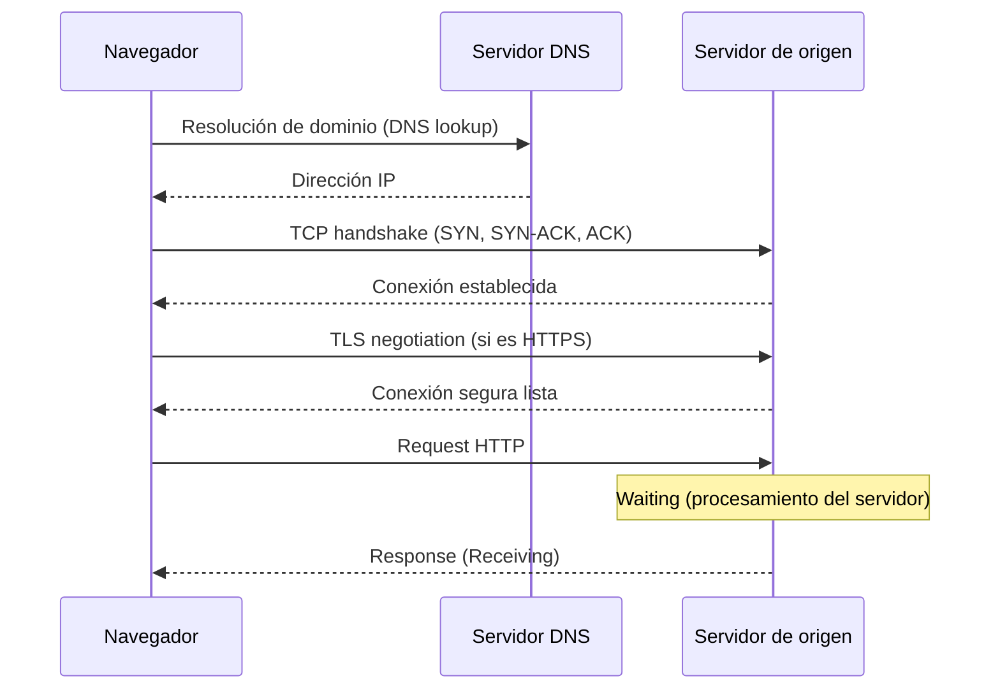
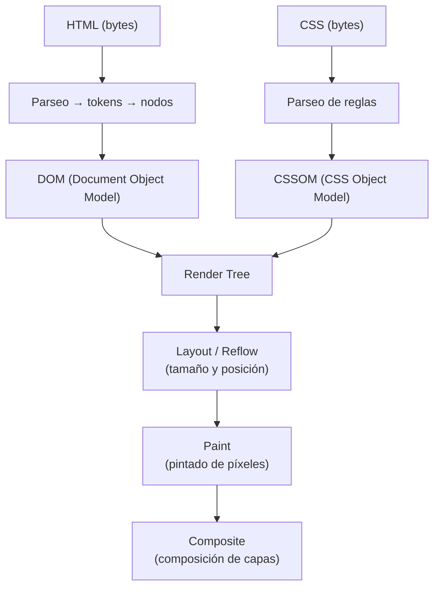
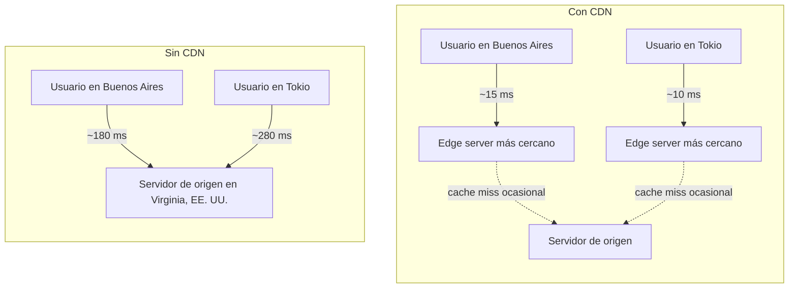

# Optimización de aplicaciones web

## Encabezado

Este apunte cierra el recorrido de la materia abordando la **optimización del rendimiento web** (web performance), es decir, el conjunto de técnicas orientadas a que una página o aplicación cargue rápido, responda con fluidez a la interacción del usuario y desperdicie la menor cantidad posible de recursos de red, CPU y batería. Vamos a estudiar por qué el rendimiento importa desde la experiencia de usuario, cómo se compone la latencia de una petición, qué es el critical rendering path y cuáles son sus recursos bloqueantes, y una batería de técnicas concretas: optimización de imágenes, reducción de requests HTTP, minificación, uso de CDN, eliminación de redirects innecesarios, caching, compresión GZIP y bundlers con code splitting. El objetivo es que puedas mirar cualquier aplicación web y detectar, con criterio técnico, dónde está perdiendo tiempo y qué palanca conviene accionar primero.

## Por qué importa el rendimiento web

Cuando hablamos de **performance** en el contexto de la web no nos referimos únicamente a la velocidad cruda de un servidor o de una red, sino a la **eficiencia percibida por quien usa la aplicación**. MDN lo plantea con una comparación útil: una aplicación que procesa mil transacciones por segundo pero responde de forma fluida y predecible suele ser preferida por los usuarios sobre una que procesa cien millones de transacciones por segundo, pero se siente lenta o "trabada" al interactuar. Esto se conoce como **user-perceived performance** (rendimiento percibido por el usuario, UPP), y es la métrica que en última instancia le importa al negocio: una aplicación más rápida retiene más usuarios, convierte más y genera menos frustración.

MDN identifica varias dimensiones de rendimiento que conviene distinguir porque cada una tiene sus propias técnicas de optimización:

- **Responsividad (responsiveness):** el tiempo entre que el usuario hace algo (toca la pantalla, hace clic, escribe) y el momento en que el sistema reacciona visualmente. Si el usuario no ve un cambio inmediato, interpreta que la aplicación lo está ignorando.
- **Frame rate (tasa de cuadros):** la cantidad de fotogramas por segundo que la interfaz es capaz de dibujar durante animaciones o scroll. El estándar de referencia es **60 cuadros por segundo (FPS)**, umbral por encima del cual el ojo humano deja de percibir mejoras notables de fluidez.
- **Uso de memoria:** no es percibido directamente por el usuario, pero una aplicación que acapara memoria innecesariamente puede degradar el resto del sistema y, en dispositivos móviles, forzar al sistema operativo a cerrar procesos en segundo plano.
- **Consumo de energía:** en dispositivos móviles, cada ciclo de CPU y cada intervalo de red que se ejecuta sin necesidad real drena batería; el objetivo es usar el mínimo de energía necesario para sostener la experiencia.

MDN, en su guía sobre umbrales de tiempo de respuesta ("How long is too long?"), traduce estas dimensiones en números concretos que conviene memorizar porque funcionan como referencia de diseño:

| Umbral | Percepción del usuario |
|---|---|
| < 50 ms | La respuesta se siente inmediata |
| 50–100 ms | Respuesta aceptable, aún se percibe como rápida |
| 100–200 ms | Empieza a notarse una transición perceptible |
| > 200 ms | Se rompe la sensación de conexión directa entre acción y respuesta |
| 16.7 ms por frame | Presupuesto de tiempo para sostener 60 FPS (de los cuales una fracción se destina a scripting, layout y pintado, y el resto al propio renderizado) |
| ~1 segundo | Punto en el que conviene mostrar alguna señal de que el contenido está cargando |
| 3–4 segundos | Punto crítico en el que buena parte de los usuarios abandona si no hay ninguna señal de progreso |

Lo importante de esta tabla no es memorizar los milisegundos exactos, sino entender el principio subyacente: el usuario tolera la espera si percibe que algo está pasando, pero no tolera el silencio. De ahí que estrategias como mostrar un color de fondo, un esqueleto de interfaz (skeleton screen) o un indicador de progreso sean, en términos de percepción, casi tan importantes como acortar el tiempo real de carga.

## El costo oculto de la latencia

Antes de optimizar cualquier recurso conviene entender de dónde sale el tiempo que tarda una petición HTTP en completarse. MDN define la **latencia** como el tiempo que demora un paquete de datos en viajar desde el origen hasta el destino, es decir, la demora entre que el cliente emite una solicitud y recibe la respuesta. En una primera conexión a un servidor, esa latencia se compone de varias etapas sucesivas:



**Figura 1 — Etapas de latencia en una primera conexión HTTP.** Resolución DNS, negociación TCP y TLS, tiempo de espera del servidor (TTFB) y transferencia de la respuesta se suman antes de que el usuario reciba el primer byte útil; las conexiones subsiguientes al mismo origen se saltan varios de estos pasos porque el socket y la sesión TLS ya existen.

Cada una de esas etapas (resolución DNS, negociación TCP, negociación TLS, espera del servidor y transferencia de la respuesta) suma latencia antes de que el usuario vea un solo byte de contenido útil. Las conexiones subsiguientes al mismo origen son más baratas porque el socket TCP y la sesión TLS ya están establecidos, lo cual es una de las razones por las que **reducir la cantidad de orígenes distintos** (dominios, subdominios, CDNs de terceros) reduce directamente la latencia acumulada de una página.

La latencia de red no es la única latencia relevante: también existe la **latencia de disco/procesamiento** en el servidor, el tiempo que transcurre entre que el servidor recibe la solicitud y empieza a emitir la respuesta. Esta última suele medirse como **Time to First Byte (TTFB)**, y es sensible al uso de bases de datos, cómputo síncrono en el backend o contención de recursos del servidor.

Para anticipar parte de esta latencia sin esperar a que el navegador descubra que necesita conectarse a un dominio externo, existen **resource hints** declarados en el `<head>` del documento:

```html
<head>
  <meta charset="utf-8" />
  <!-- Resuelve el DNS de un origen externo por adelantado, sin abrir la conexión TCP todavía -->
  <link rel="dns-prefetch" href="https://fonts.googleapis.com/" />
  <!-- Resuelve DNS + abre TCP + negocia TLS: se reserva para orígenes críticos -->
  <link rel="preconnect" href="https://cdn.example.com/" crossorigin />
</head>
```

`dns-prefetch` solo tiene sentido para orígenes **cross-origin**: el dominio propio ya fue resuelto por el navegador al pedir el documento HTML, así que anticiparlo no aporta nada. `preconnect` va un paso más allá porque, además de resolver el nombre, establece la conexión TCP y (si corresponde) negocia TLS; como este trabajo adicional consume recursos del navegador y del servidor, MDN recomienda reservarlo para un puñado de orígenes verdaderamente críticos y usar `dns-prefetch` para el resto.

## Visión general de la optimización web

Optimizar un sitio web no es aplicar una única técnica sino trabajar sobre varios frentes en simultáneo, todos orientados a acortar el camino entre "el usuario pide la página" y "el usuario puede usarla". web.dev resume algunas prácticas generales a nivel de HTML que conviene tener siempre presentes:

- **Minimizar redirects.** Cada redirect (por ejemplo, un código de estado 301 o 302) obliga al navegador a completar un round-trip HTTP adicional antes de poder solicitar el recurso real. Si un enlace interno apunta a una URL que redirige a otra, conviene corregir el enlace para que apunte directamente al destino final.
- **Cachear el HTML de forma estratégica.** Para HTML estático puede usarse un tiempo de cache corto (algunos minutos); para contenido personalizado, evitar el cacheo por completo o usar validadores como `ETag` para permitir respuestas `304 Not Modified`, que evitan retransmitir el cuerpo completo cuando el contenido no cambió.
- **Vigilar el tiempo de respuesta del servidor (TTFB).** Afecta directamente métricas de carga percibida como el **Largest Contentful Paint (LCP)** y el **First Contentful Paint (FCP)**.
- **Comprimir la respuesta.** Usar Brotli cuando esté disponible (entre 15 % y 20 % más eficiente que GZIP para contenido de texto) y aplicar compresión estática para activos que no cambian, y compresión dinámica para HTML generado en cada request.
- **Servir desde una CDN** para acercar geográficamente el contenido al usuario y reducir el round-trip time.

Estas prácticas generales conviven con técnicas más específicas que desarrollamos en el resto del apunte: optimización de imágenes, reducción de requests, minificación, gestión del critical rendering path, CDN, eliminación de redirects, caching, compresión GZIP y bundlers.

## Optimización de imágenes y scaled images

Las imágenes suelen representar la mayor porción del peso total de una página. Dos errores muy comunes son: (a) servir una imagen en una resolución mucho mayor que la que efectivamente se va a mostrar en pantalla ("scaled images", imágenes escaladas por el navegador), y (b) usar un formato de compresión inadecuado para el tipo de contenido.

Servir una imagen escalada significa, por ejemplo, subir un archivo de 3000×2000 píxeles y mostrarlo en un contenedor de 300×200 píxeles vía CSS; el navegador descarga los 3000×2000 píxeles completos y luego los reduce visualmente, desperdiciando ancho de banda y tiempo de decodificación en datos que nunca se van a ver. La solución consiste en **servir la imagen ya al tamaño real de renderizado**, generando distintas variantes según el contexto (thumbnail, tarjeta, imagen destacada) y aprovechando los atributos `srcset` y `sizes` del elemento `` para que el navegador elija automáticamente el archivo más adecuado según el ancho de la ventanilla (viewport) y la densidad de píxeles del dispositivo:

```html

```

Con `srcset` y `sizes`, el navegador calcula qué variante descargar según el ancho efectivo con el que la imagen se va a pintar, evitando el escalado innecesario. El atributo `loading="lazy"` complementa esta optimización difiriendo la descarga de imágenes fuera del viewport inicial hasta que el usuario se aproxima a ellas al hacer scroll, lo cual reduce la cantidad de bytes que compiten por ancho de banda durante la carga inicial. Declarar explícitamente `width` y `height` (o su equivalente en `aspect-ratio` vía CSS) es además clave para que el navegador reserve el espacio correcto en el layout antes de que la imagen termine de descargar, evitando saltos de contenido (content layout shift) que afectan la estabilidad visual de la página.

En cuanto a formatos, aunque el detalle de codecs específicos excede el alcance de este apunte, vale como principio general de "content efficiency" (eficiencia de contenido) que menciona web.dev: conviene usar el formato más eficiente para cada tipo de imagen (fotografías versus ilustraciones planas versus iconografía) y aplicar herramientas de optimización automatizada como parte del proceso de build, del mismo modo en que se automatiza la minificación de CSS y JavaScript.

## Reducir la cantidad de requests HTTP

Cada recurso adicional que una página solicita (una hoja de estilos, un script, una fuente tipográfica, un ícono) implica, como vimos en la sección de latencia, un costo de conexión y de espera que se suma al tiempo total de carga, incluso si el archivo en sí es pequeño. Este efecto es particularmente marcado en conexiones de alta latencia (redes móviles, usuarios geográficamente lejanos del servidor), donde el "peso" en milisegundos de abrir una nueva conexión puede superar ampliamente el tiempo de transferencia del archivo.

Algunas técnicas para reducir la cantidad de requests sin sacrificar organización del código:

- **Bundlers** que combinan múltiples archivos JavaScript o CSS en un número menor de archivos finales (desarrollado en la sección dedicada a bundlers).
- **Sprites de CSS** o el uso de fuentes de íconos (icon fonts) o SVG en línea para agrupar múltiples imágenes pequeñas en un único recurso.
- **Inlining de recursos críticos pequeños**, como el CSS necesario para renderizar el contenido visible en el viewport inicial (critical CSS), directamente en el `<head>` del HTML, evitando una petición de red adicional para ese fragmento.
- **HTTP/2 y HTTP/3**, que permiten multiplexar varias solicitudes sobre una misma conexión, reduciendo (aunque no eliminando) el impacto de la cantidad de recursos individuales, ya que sigue existiendo el costo de parseo y procesamiento de cada respuesta.

Conviene aclarar que "reducir requests" no significa perseguir un único archivo gigante a toda costa: como vamos a ver en la sección de bundlers y code splitting, en aplicaciones grandes es preferible dividir el código en partes que se cargan cuando se necesitan, en lugar de forzar al usuario a descargar de entrada todo el código de la aplicación.

## Minificar CSS y JavaScript

La **minificación** es una técnica de optimización de contenido que consiste en eliminar caracteres innecesarios y redundantes del código fuente sin alterar su comportamiento. web.dev lo resume con precisión: minificar "es una forma de remover caracteres innecesarios y redundantes usados en el código fuente"; el navegador no necesita comentarios, indentación ni nombres de variables descriptivos para ejecutar el programa, esos elementos existen únicamente para que las personas que programan puedan leer y mantener el código.

Entre lo que un proceso de minificación típicamente elimina o transforma:

- **Comentarios**: tanto comentarios de CSS (`/* ... */`) como de HTML (`<!-- ... -->`) y de JavaScript (`// ...` y `/* ... */`).
- **Espacios en blanco, tabulaciones y saltos de línea** que no afectan el contenido visible ni la semántica del programa.
- **Nombres de identificadores** (en el caso de JavaScript, un paso más agresivo llamado *uglification*): variables y funciones locales se renombran a identificadores cortos (`a`, `b`, `c`) cuando su alcance lo permite, sin cambiar el comportamiento observable del programa.
- **Declaraciones CSS redundantes**, que un compresor "inteligente" puede detectar y colapsar en una sola regla equivalente.

Veamos un ejemplo concreto de CSS antes y después de minificar:

```css
/* Antes: legible para el desarrollador */
.card {
  display: flex;
  flex-direction: column;
  padding: 16px;
  /* Sombra sutil para dar sensación de elevación */
  box-shadow: 0 1px 3px rgba(0, 0, 0, 0.12);
}
```

```css
/* Después: equivalente funcional, optimizado para transferencia */
.card{display:flex;flex-direction:column;padding:16px;box-shadow:0 1px 3px rgba(0,0,0,.12)}
```

Es fundamental distinguir la minificación de la **compresión a nivel de transferencia** (GZIP o Brotli, que desarrollamos en la sección siguiente). Ambas técnicas son complementarias y aditivas, pero operan en capas distintas: la minificación reescribe el código fuente eliminando contenido que no aporta valor semántico, mientras que la compresión busca patrones repetibles dentro de un payload de texto y los reemplaza por referencias más cortas, sin conocer ni interpretar la sintaxis del lenguaje. Por eso siempre conviene minificar primero y comprimir después; de hecho, un archivo ya minificado suele seguir comprimiendo bien porque persisten patrones repetidos (nombres de propiedades CSS, palabras clave de JavaScript), aunque el minificado ya haya eliminado buena parte del "relleno" evidente.

En la práctica, la minificación no se hace a mano: es un paso automatizado que ejecutan los **bundlers** (Vite, webpack, esbuild, entre otros) como parte del proceso de build previo al despliegue, de manera que el código fuente que mantiene el equipo de desarrollo permanece legible mientras que el artefacto que efectivamente viaja por la red está optimizado para transferencia.

## Critical rendering path y recursos render-blocking

Para entender por qué ciertos recursos "bloquean" el renderizado de una página conviene repasar la secuencia de pasos que el navegador ejecuta para convertir HTML, CSS y JavaScript en píxeles visibles, lo que se conoce como **critical rendering path (ruta crítica de renderizado)**. web.dev la define como la cantidad mínima de recursos necesarios para realizar el primer render de la página, y MDN detalla sus etapas:



**Figura 2 — El critical rendering path.** El DOM y el CSSOM se construyen en paralelo a partir de HTML y CSS; ambos se combinan en el render tree, que alimenta las etapas de layout, paint y composite hasta producir el primer render visible.

1. **Construcción del DOM.** El navegador parsea el HTML de forma incremental: convierte bytes en tokens, los tokens en nodos, y los nodos en el árbol DOM. Como es incremental, el navegador puede empezar a procesar contenido antes de haber recibido el documento completo.
2. **Construcción del CSSOM.** El navegador parsea las hojas de estilo y arma el árbol de objetos CSS. A diferencia del DOM, **el CSS es render-blocking por definición**: como cualquier regla posterior puede sobrescribir una anterior (por ejemplo, por especificidad o por cascada), el navegador necesita el CSSOM completo antes de poder calcular los estilos finales de cualquier nodo, y por lo tanto bloquea el renderizado hasta terminar de descargar y procesar todo el CSS declarado como bloqueante.
3. **Render Tree.** Combina el DOM y el CSSOM en un árbol que contiene únicamente los nodos que efectivamente se van a pintar (excluye, por ejemplo, elementos con `display: none` y sus descendientes).
4. **Layout (reflow).** El navegador calcula el tamaño y la posición exactos de cada nodo del render tree, en función del tamaño del viewport. Esta etapa se repite cada vez que se modifica algo que afecta geometría, y su costo crece con la cantidad de nodos involucrados.
5. **Paint.** El navegador pinta los píxeles correspondientes a cada nodo en las capas de composición.

En cuanto a JavaScript, un `<script>` declarado sin atributos especiales en el `<head>` también es render-blocking, pero por un motivo distinto al del CSS: el parser de HTML debe **detenerse**, descargar el script (si es externo), ejecutarlo por completo, y solo entonces continuar parseando el resto del documento, porque ese script podría usar `document.write` o modificar el DOM de manera que afecte cómo se interpreta el HTML restante.

Las estrategias más habituales para evitar que estos recursos bloqueen el primer render son:

```html
<head>
  <meta charset="utf-8" />
  <!-- CSS crítico para el contenido visible en el viewport inicial, inline -->
  <style>
    body { margin: 0; font-family: system-ui, sans-serif; }
    header { min-height: 64px; background: #111; }
  </style>
  <!-- CSS no crítico, cargado sin bloquear el render -->
  <link rel="stylesheet" href="/styles/full.css" media="print" onload="this.media='all'" />
  <!-- Script que no debe bloquear el parseo y debe respetar el orden del documento -->
  <script src="/app.js" defer></script>
  <!-- Script independiente (analytics), sin orden garantizado -->
  <script src="/analytics.js" async></script>
</head>
```

- **`defer`**: descarga el script en paralelo al parseo del HTML, pero pospone su ejecución hasta que el documento terminó de parsearse, y respeta el orden relativo entre varios scripts `defer`. Es la opción más segura para lógica de aplicación que depende del DOM completo.
- **`async`**: descarga el script en paralelo y lo ejecuta **tan pronto como termina de descargar**, sin esperar al resto del parseo ni garantizar orden entre scripts. Es adecuado para código independiente, como analítica o widgets de terceros que no interactúan con el resto de la aplicación.
- **CSS crítico inline**: incluir directamente en el `<head>`, dentro de una etiqueta `<style>`, únicamente las reglas necesarias para pintar el contenido visible sin scroll, y cargar el resto de la hoja de estilos de forma diferida (como en el ejemplo, con el truco de `media="print"` que se reescribe a `all` una vez cargada, o mediante la propiedad `rel="preload"` combinada con `onload`).

Vale mencionar también el **preload scanner**, un segundo parser de HTML que el navegador ejecuta en paralelo al parser principal: escanea el HTML crudo en busca de recursos referenciados (imágenes, scripts, hojas de estilo) para empezar a descargarlos especulativamente antes de que el parser principal llegue a esa línea. Este mecanismo solo detecta recursos declarados directamente en el marcado HTML; los recursos que se solicitan dinámicamente desde JavaScript, o que están anidados dentro de un `@import` de CSS, quedan fuera de su alcance, razón por la cual conviene evitar `@import` y preferir múltiples elementos `<link rel="stylesheet">` (que además cargan en paralelo, mientras que las cadenas de `@import` cargan de forma consecutiva).

## Layout thrashing

Además de los recursos que bloquean el primer render, existe un patrón de código que puede degradar el rendimiento **después** de que la página ya cargó, típicamente durante interacciones o animaciones controladas por JavaScript: el **layout thrashing** (a veces traducido como "sacudida de layout").

El orden habitual en el que el navegador procesa una actualización es: ejecución de JavaScript, recálculo de estilos, y finalmente layout. El problema aparece cuando el código JavaScript **lee** una propiedad geométrica del DOM (como `offsetWidth`, `offsetHeight`, `getBoundingClientRect()`) inmediatamente después de **escribir** un cambio de estilo, porque el navegador se ve forzado a aplicar ese cambio y recalcular el layout de manera síncrona, fuera de su orden habitual, para poder responder con un valor actualizado. Si este patrón de lectura/escritura intercalada ocurre dentro de un bucle sobre muchos elementos, el costo de cada reflow forzado se multiplica en cada iteración.

Veamos el patrón problemático y su corrección, tal como lo ilustra web.dev:

```javascript
// Mal patrón: layout thrashing
// En cada iteración se lee una propiedad geométrica y luego se escribe una nueva,
// forzando un reflow síncrono en cada vuelta del bucle
const boxes = document.querySelectorAll('.box');

boxes.forEach((box) => {
  const width = box.offsetWidth; // lectura: fuerza reflow si hubo escrituras pendientes
  box.style.width = `${width / 2}px`; // escritura: invalida el layout otra vez
});
```

```javascript
// Buena práctica: separar lecturas de escrituras (batching)
const boxes = document.querySelectorAll('.box');

// Fase de lectura: se toman todas las medidas necesarias primero
const widths = Array.from(boxes).map((box) => box.offsetWidth);

// Fase de escritura: recién ahora se modifica el DOM, en un solo lote
boxes.forEach((box, index) => {
  box.style.width = `${widths[index] / 2}px`;
});
```

Separar explícitamente la fase de lectura de la fase de escritura elimina el ciclo de reflow forzado, porque el navegador puede acumular todos los cambios de estilo y aplicarlos en un único recálculo de layout al final del ciclo de eventos, en lugar de uno por cada elemento procesado. Herramientas como las DevTools de Chrome exponen este problema mediante un indicador específico ("Forced reflow"), y librerías como FastDOM automatizan este patrón de batching para código que necesita hacerlo de forma recurrente. El mismo principio de "leer todo, después escribir todo" es el que sostiene por qué conviene animar propiedades como `transform` y `opacity`: como vimos en el critical rendering path, esas dos propiedades pueden resolverse en la etapa de composición sin pasar por layout ni por paint, mientras que animar `width`, `height`, `top` o `left` dispara un reflow en cada cuadro de la animación.

## Uso de CDN

Una **Content Delivery Network (CDN)**, o red de distribución de contenido, es una infraestructura de servidores distribuidos geográficamente que replica los recursos estáticos de un sitio (imágenes, hojas de estilo, scripts, fuentes) y los sirve desde el nodo más cercano a la ubicación del usuario. Como vimos en la sección de latencia, buena parte del tiempo de una petición HTTP no depende del tamaño del archivo sino de la distancia física (y de red) que separa al cliente del servidor; una CDN ataca directamente ese componente del problema.



**Figura 3 — Efecto de una CDN sobre la latencia geográfica.** Sin CDN, cada usuario viaja hasta el servidor de origen sin importar su ubicación; con CDN, la mayoría de los requests se resuelven contra el edge server más cercano, y solo un cache miss ocasional llega hasta el origen.

Los beneficios de una CDN son, en esencia, dos:

1. **Reducción de la latencia geográfica**, al acercar físicamente la copia del recurso al usuario, disminuyendo el round-trip time de la conexión.
2. **Distribución de la carga**, al descargar al servidor de origen de la responsabilidad de atender cada solicitud individual de recursos estáticos, dejándolo disponible para procesar la lógica de negocio (renderizado dinámico, consultas a base de datos, autenticación).

Como mencionamos al hablar de rendimiento general de HTML, una CDN también mejora el TTFB cuando se usa para servir HTML generado dinámicamente pero cacheable (por ejemplo, contenido que puede compartirse entre usuarios durante un intervalo corto), no solo activos verdaderamente estáticos.

## Evitar redirects 301

Un **redirect** HTTP (código de estado 301 para redirecciones permanentes, 302 para temporales, entre otros) indica al navegador que el recurso solicitado se encuentra en otra URL. Aunque los redirects son a veces necesarios (por ejemplo, al migrar contenido a una nueva ruta, o al forzar HTTPS sobre HTTP), cada redirect implica un **round-trip HTTP completo adicional**: el navegador debe recibir la respuesta con el código 3xx y el header `Location`, y recién entonces emitir una nueva solicitud a la URL de destino, repitiendo potencialmente buena parte del proceso de resolución de latencia que vimos antes (aunque la conexión TCP/TLS pueda reutilizarse si el destino está en el mismo origen).

web.dev es específico en esta recomendación: al construir enlaces internos dentro de la propia aplicación, conviene apuntar **directamente a la URL final**, en lugar de a una URL que se sabe que redirige a otra. Una cadena de varios redirects sucesivos (por ejemplo, HTTP a HTTPS, luego sin `www` a con `www`, luego una ruta antigua a una nueva) puede sumar varios cientos de milisegundos de latencia acumulada antes de que el navegador reciba el primer byte de contenido útil, un costo completamente evitable si el enlace original hubiera apuntado a la URL correcta desde el principio.

## Caching de recursos estáticos

El **caching** (almacenamiento en caché) evita que el navegador tenga que solicitar de nuevo un recurso que ya descargó y que no cambió desde la última vez. HTTP ofrece mecanismos de cabecera (`Cache-Control`, `Expires`, validadores como `ETag` y `Last-Modified`) para que el servidor le indique al navegador durante cuánto tiempo puede reutilizar una copia local sin volver a preguntar, y cómo puede revalidar esa copia de forma económica cuando el tiempo de validez expiró.

Un ejemplo de configuración de cache en un servidor Node.js con Express, diferenciando activos estáticos versionados (que pueden cachearse de forma agresiva porque su nombre de archivo cambia con cada versión) de HTML dinámico (que requiere una política más conservadora):

```js
import express from 'express';
const app = express();

// Activos con hash en el nombre de archivo (ej. app.a1b2c3.js): cache agresivo,
// porque cualquier cambio de contenido implica una URL distinta
app.use(
  '/static',
  express.static('build/static', {
    maxAge: '1y',
    immutable: true,
  })
);

// HTML dinámico: cache corto y revalidación obligatoria en cada solicitud
app.get('/', (req, res) => {
  res.set('Cache-Control', 'no-cache');
  res.set('ETag', computeEtag(req)); // función propia de la aplicación
  res.send(renderHomePage());
});

app.listen(3000);
```

Cuando el navegador vuelve a solicitar un recurso con `Cache-Control: no-cache` y envía el header `If-None-Match` con el `ETag` recibido previamente, el servidor puede responder con **304 Not Modified** y sin cuerpo si el contenido no cambió, ahorrando la transferencia completa del recurso aunque no se haya evitado el round-trip de la solicitud en sí. Para activos verdaderamente inmutables (archivos con hash de contenido en el nombre, como suelen generar los bundlers), la estrategia óptima es indicar `Cache-Control: max-age=31536000, immutable`, de modo que el navegador ni siquiera necesite revalidar: simplemente reutiliza la copia local durante todo el tiempo de vida configurado.

## Habilitar compresión GZIP

La **compresión GZIP** (y su sucesora Brotli, que suele superarla en eficiencia para contenido de texto) opera a nivel de transferencia: toma la respuesta HTTP ya generada (HTML, CSS, JavaScript, JSON) y busca patrones repetidos dentro del payload para reemplazarlos por referencias más cortas, reduciendo la cantidad de bytes que efectivamente viajan por la red. A diferencia de la minificación, GZIP no necesita entender la sintaxis del lenguaje que está comprimiendo: aplica el mismo algoritmo estadístico sobre cualquier contenido de texto, y por eso es efectiva tanto sobre CSS como sobre JavaScript, HTML o respuestas JSON de una API.

Un ejemplo de cómo habilitar compresión GZIP en un servidor Node.js con Express, usando el middleware `compression`:

```js
import express from 'express';
import compression from 'compression';

const app = express();

// Comprime automáticamente las respuestas cuyo tamaño supere el umbral por defecto
// y cuyo Accept-Encoding del cliente incluya gzip o br
app.use(compression());

app.get('/api/products', (req, res) => {
  res.json(getProductCatalog()); // el middleware comprime esta respuesta antes de enviarla
});

app.listen(3000);
```

El navegador anuncia qué algoritmos de compresión soporta mediante el header de request `Accept-Encoding: gzip, deflate, br`, y el servidor responde con `Content-Encoding: gzip` (o `br`) cuando decide comprimir. Como mencionamos al repasar el rendimiento general de HTML, conviene aplicar **compresión estática** (comprimir el archivo una sola vez, en tiempo de build, y servir siempre la versión comprimida) para activos que no cambian, reservando la **compresión dinámica** (comprimir en cada request) para contenido generado sobre la marcha, donde el costo de CPU de comprimir en cada solicitud debe balancearse contra el ahorro de bytes transferidos.

## Bundlers y code splitting

A medida que una aplicación crece, el código fuente suele organizarse en decenas o cientos de módulos separados por responsabilidad. Servir cada uno de esos módulos como un archivo HTTP independiente sería, como vimos en la sección de reducción de requests, muy costoso en términos de latencia acumulada. Un **bundler** (empaquetador) es la herramienta que resuelve este problema: analiza el grafo de dependencias del código fuente (qué módulo importa a qué otro) y produce uno o varios archivos finales optimizados para producción, aplicando en el proceso minificación, eliminación de código muerto (tree shaking) y, cuando corresponde, división en partes (code splitting).

El **code splitting** es la contracara de "empaquetar todo en un solo archivo": en lugar de forzar al usuario a descargar el JavaScript completo de la aplicación antes de poder interactuar con la primera pantalla, el bundler genera varios archivos ("chunks") y el código solicita cada uno **solo cuando efectivamente se necesita**. web.dev señala que cargar recursos JavaScript grandes de entrada afecta significativamente la velocidad percibida, porque el parseo y la compilación de ese código puede volver la interfaz no responsiva justo en el momento en que el usuario intenta empezar a usarla; dividir el código en partes más chicas reduce el trabajo que el hilo principal debe hacer durante la carga inicial, lo cual mejora métricas de interactividad como el **Interaction to Next Paint (INP)**.

El mecanismo que un bundler moderno reconoce para dividir el código es la sintaxis de **importación dinámica**, `import()`, que a diferencia de un `import` estático (resuelto en tiempo de compilación) devuelve una promesa que solicita el recurso en el momento en que el código la ejecuta:

```javascript
// form-validation.mjs se solicita recién cuando el usuario interactúa con el formulario,
// no como parte del bundle inicial de la página
const emailInput = document.querySelector('#email');

emailInput.addEventListener('focus', async () => {
  const { validateForm } = await import('./form-validation.mjs');
  validateForm(emailInput);
});
```

Bundlers como webpack reconocen automáticamente estas llamadas a `import()` y generan, mediante mecanismos como `SplitChunksPlugin`, chunks separados: los que corresponden a `import` estático se consideran "initial" (parte de la carga inicial), y los que provienen de `import()` dinámico se consideran "async" (se cargan bajo demanda). Otras estrategias habituales de code splitting son:

- **División por ruta (route-based splitting):** cada vista o página de una aplicación de una sola página (single-page application) se empaqueta en un chunk separado, que solo se descarga cuando el usuario navega a esa ruta.
- **División por componente:** un componente pesado y usado ocasionalmente (por ejemplo, un editor de texto enriquecido, un visor de mapas, un modal complejo) se separa en su propio chunk y se importa dinámicamente solo cuando el usuario lo activa, como en el ejemplo de validación de formulario.

En definitiva, un bundler bien configurado resuelve simultáneamente varios de los problemas que fuimos repasando en este apunte: reduce la cantidad de requests HTTP agrupando módulos relacionados, automatiza la minificación de CSS y JavaScript, y mediante code splitting evita que el usuario tenga que pagar por adelantado el costo de descargar y parsear código que quizás nunca llegue a usar.

## Conclusión

El rendimiento web no es un adorno técnico sino una dimensión central de la experiencia de usuario, con impacto directo en retención y conversión. A lo largo de este apunte vimos que optimizar una aplicación web implica trabajar en capas complementarias: entender de dónde sale la latencia de cada request (DNS, TCP, TLS, distancia geográfica) y anticiparla con resource hints o con una CDN; reducir el peso y la cantidad de recursos mediante minificación, compresión GZIP/Brotli, optimización de imágenes al tamaño real de renderizado y bundlers con code splitting; y comprender el critical rendering path para identificar qué recursos bloquean el primer render y aplicar `defer`, `async` o CSS crítico inline según corresponda. A eso se suma la disciplina de evitar redirects innecesarios, aprovechar el caching de recursos estáticos y prevenir patrones de código, como el layout thrashing, que degradan el rendimiento incluso después de que la página ya cargó. Ninguna de estas técnicas actúa de forma aislada: una aplicación verdaderamente rápida es el resultado de aplicar todas ellas de forma consistente, midiendo siempre contra la percepción real del usuario y no solo contra números de laboratorio.

## Bibliografía consultada

- MDN Web Docs. "Web performance fundamentals." *Web Performance Guides*. Secciones: "What is performance?", "Aspects of performance" (responsiveness, frame rate, memory usage, power usage), "Coding tips" (CSS animations, `requestAnimationFrame`, transforms), "Optimizing startup". https://developer.mozilla.org/en-US/docs/Web/Performance/Guides/Fundamentals
- MDN Web Docs. "Understanding latency." *Web Performance Guides*. Secciones: "What is latency?", "Sources of latency" (DNS lookup, TCP handshake, TLS negotiation), "Network timing phases", "Network throttling". https://developer.mozilla.org/en-US/docs/Web/Performance/Guides/Understanding_latency
- MDN Web Docs. "How long is too long?" *Web Performance Guides*. Sección: umbrales de tiempo de respuesta (responsiveness, frame rate, idling, carga inicial). https://developer.mozilla.org/en-US/docs/Web/Performance/Guides/How_long_is_too_long
- MDN Web Docs. "dns-prefetch." *Web Performance Guides*. Secciones: "What problem does dns-prefetch solve?", sintaxis del elemento `<link rel="dns-prefetch">`, comparación con `preconnect`. https://developer.mozilla.org/en-US/docs/Web/Performance/Guides/dns-prefetch
- MDN Web Docs. "Optimizing startup performance." *Web Performance Guides*. Secciones: carga asincrónica con `defer`/`async`, Web Workers, reducción de recursos bloqueantes, rendimiento percibido. https://developer.mozilla.org/en-US/docs/Web/Performance/Guides/Optimizing_startup_performance
- MDN Web Docs. "CSS and JavaScript animation performance." *Web Performance Guides*. Secciones: Off Main Thread Animation (OMTA), propiedades baratas de animar (`transform`, `opacity`), fases de layout/paint/composite. https://developer.mozilla.org/en-US/docs/Web/Performance/Guides/CSS_JavaScript_animation_performance
- web.dev. "General HTML performance considerations." *Learn Performance*. Secciones: minimizar redirects, cacheo de HTML, TTFB, compresión, CDN. https://web.dev/learn/performance/general-html-performance
- web.dev. "Optimizing content efficiency." *Articles*. Sección: "Minification / preprocessing / context-specific optimizations". https://web.dev/articles/optimizing-content-efficiency-optimize-encoding-and-transfer#minification-preprocessing--context-specific-optimizations
- web.dev. "Understanding the critical path." *Learn Performance*. Secciones: definición del critical rendering path, recursos render-blocking, TTFB, `defer`/`async`, Largest Contentful Paint. https://web.dev/learn/performance/understanding-the-critical-path
- MDN Web Docs. "Critical rendering path." *Web Performance Guides*. Secciones: construcción del DOM, CSSOM, render tree, layout/reflow, paint, recursos render-blocking. https://developer.mozilla.org/en-US/docs/Web/Performance/Guides/Critical_rendering_path
- web.dev. "Avoid large, complex layouts and layout thrashing." *Articles*. Secciones: definición de layout thrashing, patrón de lectura/escritura forzada, batching de operaciones DOM. https://web.dev/articles/avoid-large-complex-layouts-and-layout-thrashing
- web.dev. "Optimize resource loading." *Learn Performance*. Secciones: minificación y CSS no usado, `@import` vs `<link>`, CSS crítico inline, `async`/`defer`, preload scanner. https://web.dev/learn/performance/optimize-resource-loading
- web.dev. "Code-split JavaScript." *Learn Performance*. Secciones: qué es code splitting, `import()` dinámico, `SplitChunksPlugin` de webpack, división por ruta y por componente. https://web.dev/learn/performance/code-split-javascript
