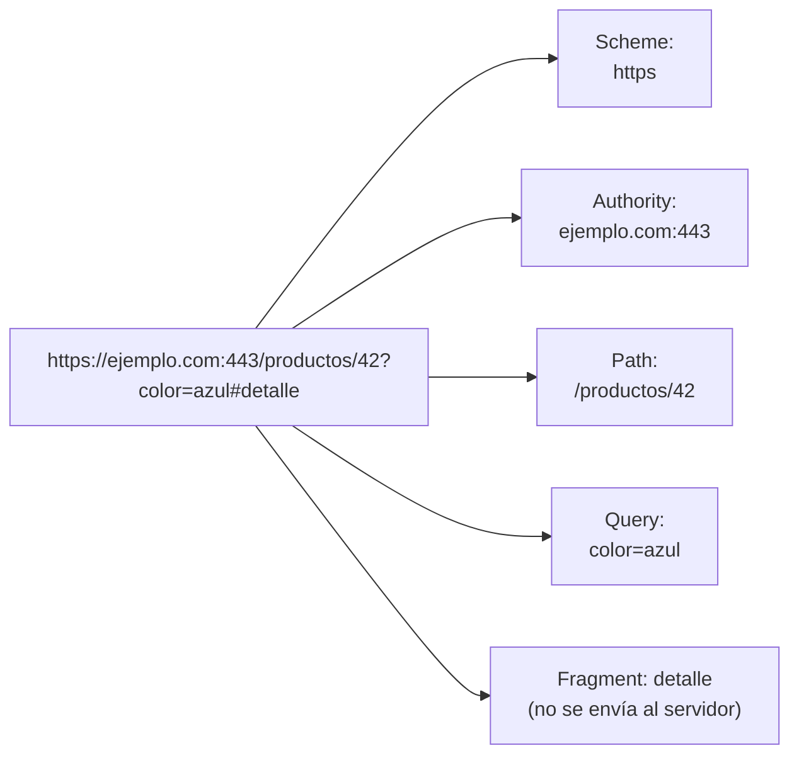
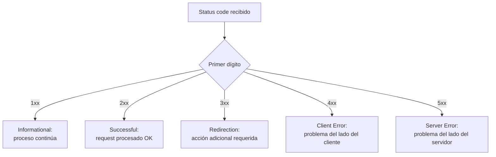

# Protocolo HTTP — Parte 2

Este apunte continúa el estudio del protocolo HTTP, ahora enfocado en el formato concreto de los mensajes: qué es una URL y un URI, qué es el user agent, cómo se estructura un request (solicitud) y un response (respuesta), qué información viaja en las cabeceras (*headers*) y en el cuerpo (*body*), qué métodos existen y qué significan sus propiedades de *safe* e idempotencia, y cómo se clasifican los códigos de estado.

## Identificación de recursos con URL y URI

Antes de poder pedir un recurso, hace falta un esquema uniforme para identificarlo sin ambigüedad. Ese esquema es el **URI** (Uniform Resource Identifier): una secuencia única de caracteres que identifica un recurso, abstracto o físico. Un URI no necesita ser accesible por Internet ni referirse a un documento web: puede identificar una página, una dirección de correo, un libro o cualquier otro recurso, siempre que exista una forma de nombrarlo sin ambigüedad.

Dentro de la familia de los URI existen dos subtipos con propósitos distintos. Un **URL** (Uniform Resource Locator) especifica *cómo localizar* un recurso, indicando tanto el mecanismo de acceso como su ubicación en la red: es análogo a una dirección postal, que te dice exactamente dónde encontrar algo. Un **URN** (Uniform Resource Name), en cambio, identifica un recurso *por nombre*, sin indicar cómo acceder a él: es análogo al nombre de una persona, que la identifica sin decir dónde vive. Un ejemplo de URN es `urn:isbn:0-486-27557-4`, que identifica un libro específico por su ISBN sin decir en qué biblioteca o librería conseguirlo. La relación entre estos tres conceptos es de inclusión: todo URL es un URI, todo URN es un URI, pero no todo URI es necesariamente un URL o un URN.

La sintaxis general de un URI sigue esta forma:

```
URI = scheme ":" ["//" authority] path ["?" query] ["#" fragment]
```

Cada componente cumple un rol específico:

- **Scheme (esquema):** el protocolo a usar para acceder al recurso (`http`, `https`, `mailto`, `ftp`, entre otros). Indica al cliente qué mecanismo aplicar para interpretar el resto de la URL.
- **Authority (autoridad):** combina, opcionalmente, información de usuario, el host (dominio o dirección IP) y el puerto, separados por dos puntos cuando el puerto se especifica explícitamente.
- **Path (ruta):** la ubicación del recurso dentro del servidor, expresada como una secuencia de segmentos separados por barras. En aplicaciones web modernas, el path suele ser un identificador abstracto más que una ruta literal en el sistema de archivos del servidor.
- **Query (consulta):** información adicional en pares clave-valor, precedida por `?` y con los pares separados por `&`. Se usa habitualmente para parametrizar el request: filtros, paginación, términos de búsqueda.
- **Fragment (fragmento o anclaje):** un identificador secundario, precedido por `#`, que referencia una sección específica dentro del recurso ya descargado. Es importante remarcar que el fragmento **nunca se envía al servidor**: se resuelve enteramente del lado del cliente, una vez que el recurso ya fue descargado.

Un ejemplo concreto ayuda a fijar estos componentes: en `https://developer.mozilla.org/en-US/docs/Learn_web_development?q=URL#summary`, el esquema es `https`, el dominio es `developer.mozilla.org`, la ruta es `/en-US/docs/Learn_web_development`, la query es `q=URL` y el fragmento es `summary`. Cada una de estas piezas cumple un rol distinto, y un cliente HTTP, o un desarrollador leyendo el código de una aplicación, debe poder identificarlas para razonar correctamente sobre qué recurso se está solicitando y con qué parámetros.



**Figura 1 — Componentes de una URL.** Cada URL se descompone en esquema, autoridad, ruta, query y fragmento; el fragmento es el único componente que el navegador resuelve localmente sin transmitirlo en el request HTTP.

### Diseñando rutas para recursos

Más allá de su definición formal, vale la pena detenerse en cómo se usan en la práctica el path y la query al diseñar los endpoints de una aplicación. El path suele organizarse de forma jerárquica para reflejar relaciones entre recursos: por ejemplo, `/usuarios/42/pedidos/7` sugiere que el pedido con identificador `7` pertenece al usuario con identificador `42`, sin necesidad de que la aplicación consulte nada adicional para entender esa relación: la jerarquía ya está codificada en la propia ruta.

La query, en cambio, se reserva habitualmente para parámetros que no identifican unívocamente al recurso, sino que modifican cómo se lo recupera: filtros (`?estado=activo`), paginación (`?pagina=2&porPagina=20`), u ordenamiento (`?ordenarPor=fecha&direccion=desc`). Una distinción práctica útil para decidir si algo va en el path o en la query es preguntarse: ¿esta información identifica *qué* recurso quiero, o *cómo* quiero que se me presente? Un identificador de recurso (el `42` del usuario) va en el path; un criterio de presentación (ordenar por fecha) va en la query.

```javascript
// Ejemplo: construir una URL con path jerárquico y query de filtrado,
// usando el constructor URL en vez de concatenar strings manualmente.
function construirUrlPedidos(usuarioId, { estado, pagina } = {}) {
  const url = new URL(`https://ejemplo.com/usuarios/${usuarioId}/pedidos`);
  if (estado) url.searchParams.set('estado', estado);
  if (pagina) url.searchParams.set('pagina', String(pagina));
  return url.toString();
}
// construirUrlPedidos(42, { estado: 'activo', pagina: 2 })
// => "https://ejemplo.com/usuarios/42/pedidos?estado=activo&pagina=2"
```

Usar el constructor `URL` (y su propiedad `searchParams`) en lugar de concatenar strings manualmente evita errores comunes de codificación de caracteres especiales en la query (espacios, símbolos `&` o `=` dentro de un valor) que, de no escaparse correctamente, romperían el parseo de la URL tanto del lado del cliente como del servidor.

## Identificación del cliente con User Agent

El **user agent** es un software que actúa en nombre del usuario ante un servidor. En el caso del navegador, este le informa al servidor, mediante el header `User-Agent`, información sobre sí mismo y sobre el sistema operativo en el que corre, lo cual permite al servidor personalizar el contenido que devuelve según las capacidades del cliente.

El formato típico de un user agent de navegador sigue una estructura histórica algo particular: `Mozilla/[versión] ([información del sistema]) [plataforma] ([detalles de plataforma]) [extensiones]`. Por ejemplo, un user agent real puede verse así: `Mozilla/5.0 (iPad; U; CPU OS 3_2_1 like Mac OS X; en-us) AppleWebKit/531.21.10 (KHTML, like Gecko) Mobile/7B405`. La cadena incluye el motor de renderizado, detalles del sistema operativo y, a veces, información de dispositivos móviles.

Los rastreadores automáticos (*bots*), en cambio, suelen usar formatos más simples que incluyen información de contacto para quienes administran el sitio visitado, como `Googlebot/2.1 (+http://www.google.com/bot.html)`, lo cual permite que un administrador identifique de dónde proviene el tráfico automatizado y, si corresponde, contacte a quien lo opera.

El user agent cumple, en concreto, tres funciones prácticas:

- **Content negotiation (negociación de contenido):** el servidor puede seleccionar contenido apropiado según las capacidades declaradas del cliente.
- **Identificación de bots:** los rastreadores web incluyen información de contacto para que administradores de sitios puedan comunicarse con quien opera el bot.
- **Control de acceso:** los sitios pueden excluir ciertos agentes automatizados mediante archivos `robots.txt`, que indican qué user agents tienen permitido o prohibido rastrear determinadas rutas.

Vale la pena notar que los navegadores principales están migrando gradualmente de depender del `User-Agent` hacia un mecanismo llamado *Client Hints*, pensado como alternativa más consciente de la privacidad para comunicar las capacidades del navegador, ya que la cadena de user agent tradicional expone más información de la estrictamente necesaria y puede usarse con fines de identificación no deseados del usuario (*fingerprinting*).

```javascript
// Ejemplo en Node.js: leer el User-Agent del cliente con el módulo http nativo.
import http from 'node:http';

const servidor = http.createServer((req, res) => {
  const userAgent = req.headers['user-agent'];
  console.log(`Request recibida de: ${userAgent}`);
  res.end('Recurso solicitado');
});

servidor.listen(3000);
```

## Formato general de los mensajes HTTP

Los mensajes HTTP son el mecanismo mediante el cual cliente y servidor intercambian datos. Existen dos tipos: **requests** (del cliente hacia el servidor) y **responses** (del servidor hacia el cliente), y ambos comparten una estructura común de cuatro partes:

1. **Línea de inicio (start-line):** una única línea que describe la versión de HTTP junto con, en el caso de un request, el método y el recurso solicitado, o, en el caso de un response, el código de estado.
2. **Headers HTTP:** metadatos opcionales sobre el mensaje.
3. **Línea vacía:** marca el fin de los headers y el comienzo del body, si lo hay.
4. **Body:** los datos de la carga útil, opcionales según el tipo de mensaje.

### Los mensajes HTTP a nivel de bytes

Los bloques de ejemplo de este apunte muestran los mensajes HTTP ya separados en líneas prolijas, como si el protocolo tuviera una noción visual de "renglón". En realidad, en HTTP/1.x, un mensaje completo viaja sobre la conexión TCP como una única secuencia continua de bytes: no hay ningún separador especial de "línea" en el sentido de una estructura de datos, sino un carácter concreto que cumple esa función por convención.

Ese carácter es la secuencia `CRLF` (*Carriage Return* + *Line Feed*, en bytes: `\r\n`, es decir `0x0D 0x0A`), heredada de las convenciones de terminales de texto de los sistemas Unix/Windows de los años 70 y 80. Cada línea del mensaje (la línea de inicio, y cada header) termina con un `\r\n`. La línea vacía que separa headers de body no es una línea "en blanco" en un sentido abstracto: es, literalmente, un segundo `\r\n` que aparece inmediatamente después del último header, sin ningún header en el medio. Visto como una única cadena de texto, el ejemplo de request de la sección siguiente se transmite así, byte a byte:

```
POST /users HTTP/1.1\r\n
Host: ejemplo.com\r\n
Content-Type: application/x-www-form-urlencoded\r\n
Content-Length: 49\r\n
\r\n
nombre=Ana&email=ana%40ejemplo.com
```

Nótese el `\r\n\r\n` (CRLF doble) justo antes del body: ese es el punto exacto donde termina la sección de headers y comienza la carga útil. Esta es la razón práctica por la que el header `Content-Length` es importante: como el body no tiene ningún delimitador de cierre propio (no hay un CRLF final que indique "acá termina el body"), el receptor necesita saber de antemano cuántos bytes leer después del CRLF doble, y ese dato lo provee `Content-Length` (o, alternativamente, `Transfer-Encoding: chunked`, donde el propio body se fragmenta en partes que sí anuncian su tamaño).

A diferencia de un protocolo con formato binario fijo (donde cada campo ocupa una cantidad exacta y predefinida de bits), un mensaje HTTP/1.x es, en esencia, un stream de bytes de longitud variable segmentado por el propio contenido (las secuencias `CRLF`), no por offsets numéricos preestablecidos. Aun así, resulta útil visualizar de forma simbólica sus cuatro secciones como tramos consecutivos de una misma cadena, sin que los anchos representen una cantidad real de bytes:


**Figura 2 — Estructura de un request HTTP como secuencia de secciones.** Aunque los ejemplos de este apunte se muestran en líneas separadas por claridad visual, en la conexión TCP el mensaje viaja como una única cadena continua: la línea de inicio, los headers, el CRLF doble que los separa del body, y el body mismo son tramos consecutivos de esa cadena, sin que ninguno tenga un tamaño fijo predefinido como en un formato binario.

Esta representación en texto plano refleja una decisión de diseño explícita de HTTP/1.x: priorizar la legibilidad humana del formato sobre la eficiencia binaria, algo que HTTP/2 (con su framing binario, detallado más abajo) deja de lado en favor del rendimiento.

### Formato de un request

La línea de inicio de un request sigue el patrón `<método> <recurso-objetivo> <protocolo>`. Por ejemplo:

```http
POST /users HTTP/1.1
Host: ejemplo.com
Content-Type: application/x-www-form-urlencoded
Content-Length: 49

nombre=Ana&email=ana%40ejemplo.com
```

El **recurso-objetivo** (*request-target*) puede tomar distintas formas según el método y el contexto: la **forma de origen** (`/path?query=valor`) es la más común en requests directas de navegador a servidor; la **forma absoluta** (`https://ejemplo.com/path`) se usa típicamente cuando el request pasa por un proxy; la **forma de autoridad** (`ejemplo.com:443`) es exclusiva del método `CONNECT`; y la **forma de asterisco** (`*`) se usa con `OPTIONS` cuando quiere consultarse sobre el servidor en su conjunto, no sobre un recurso puntual.

Solo los métodos `POST`, `PUT` y `PATCH` suelen incluir un body en el request, que puede contener datos de formulario (pares clave-valor), un objeto JSON, o datos multipart (que se detallan más abajo).

### Formato de un response

La línea de inicio de un response sigue el patrón `<protocolo> <código-de-estado> <frase-de-razón>`. Por ejemplo:

```http
HTTP/1.1 201 Created
Content-Type: application/json
Location: http://ejemplo.com/users/123

{
  "mensaje": "Usuario creado",
  "usuario": { "id": 123, "nombre": "Ana" }
}
```

La **frase de razón** (*reason-phrase*, como "Created" en el ejemplo) es un texto legible por humanos que acompaña al código numérico, aunque en la práctica el código numérico es lo que las aplicaciones interpretan programáticamente; la frase es principalmente informativa.

Un matiz importante sobre el formato en HTTP/2: en esta versión, los mensajes ya no viajan como texto plano con una línea de inicio literal, sino empaquetados en un **framing binario**. En su lugar, HTTP/2 usa **pseudo-headers** (con nombres que comienzan con `:`) para representar la misma información que antes iba en la línea de inicio: `:method`, `:scheme`, `:authority` y `:path` en requests, y `:status` en responses. Este cambio de formato habilita la multiplexación de múltiples mensajes sobre una misma conexión y la compresión de headers mediante el algoritmo HPACK, pero preserva exactamente la misma semántica de mensaje que HTTP/1.1: un cliente que arma un request contra un servidor HTTP/2 razona en los mismos términos de método, ruta y headers que contra uno HTTP/1.1.

```javascript
// Ejemplo: construir un request con fetch, especificando método,
// headers y body — las tres piezas centrales de un mensaje HTTP.
async function crearUsuario(nombre, email) {
  const response = await fetch('https://ejemplo.com/users', {
    method: 'POST',
    headers: {
      'Content-Type': 'application/json',
    },
    body: JSON.stringify({ nombre, email }),
  });
  return response.json();
}
```

## Metadatos del mensaje con HTTP Headers

Los headers le permiten al cliente y al servidor enviar información adicional en el request o en el response, más allá del body del mensaje. Cada header consiste en un nombre (sin distinción entre mayúsculas y minúsculas), seguido de dos puntos y un valor: `nombre: valor`.

Los headers pueden agruparse según distintos criterios. Según el **contexto** en el que se usan:

- **General headers:** aplican tanto al request como al response, pero no tienen relación directa con los datos transmitidos en el body. Ejemplos: `Date`, `Cache-Control`, `Connection`.
- **Request headers:** contienen información sobre el recurso a obtener o sobre el cliente mismo. Ejemplos: `Accept`, `Cookie`, `User-Agent`, `Authorization`.
- **Response headers:** brindan más información sobre el response o sobre el servidor mismo. Ejemplos: `Server`, `Location`, `Set-Cookie`.
- **Representation headers:** describen el body del recurso: su formato, codificación e idioma. Ejemplos: `Content-Type`, `Content-Encoding`, `Content-Language`.
- **Payload headers:** brindan información sobre los datos de la carga, independiente de su representación. Ejemplos: `Content-Length`, `Transfer-Encoding`.

Otra clasificación relevante, particularmente cuando la comunicación atraviesa proxies intermedios, distingue entre:

- **End-to-end headers:** deben transmitirse sin modificaciones hasta el destinatario final; cualquier proxy intermedio debe retransmitirlas intactas. Ejemplo: `Authorization: Bearer <token>`.
- **Hop-by-hop headers:** son relevantes únicamente para una conexión de transporte específica y no deben retransmitirse ni cachearse por proxies. Ejemplos: `Connection: keep-alive`, `Transfer-Encoding: chunked`.

Existen también categorías por finalidad: headers de **autenticación** (`Authorization`, `Proxy-Authenticate`), de **caching** (`Age`, `Cache-Control`, `Expires`), de **condicionales** (`ETag`, `If-Match`, `Last-Modified`), de **gestión de conexión** (`Connection`, `Keep-Alive`), de **content negotiation** (`Accept`, `Accept-Charset`, `Accept-Encoding`), de **cookies** (`Cookie`, `Set-Cookie`), de **CORS** (`Access-Control-Allow-*`), de **descargas** (`Content-Disposition`), de **información del body** (`Content-Length`, `Content-Type`, `Content-Encoding`), de **redirects** (`Location`) y de **contexto del request** (`From`, `Host`, `Referer`, `User-Agent`), entre muchas otras.

### Content negotiation

Un caso de uso particularmente relevante de los headers es la **negociación de contenido** (*content negotiation*): el mecanismo por el cual cliente y servidor acuerdan qué representación de un recurso enviar cuando existe más de una posible. Un mismo recurso (por ejemplo, un endpoint de una API) puede estar disponible en varios formatos (JSON, XML), varios idiomas o varias codificaciones de compresión, y es mediante headers de request que el cliente indica sus preferencias:

- `Accept`: indica qué tipos de contenido (MIME types) el cliente puede procesar, opcionalmente con un valor de calidad relativo entre ellos. Por ejemplo, `Accept: application/json, text/html;q=0.8` le dice al servidor que el cliente prefiere JSON, pero acepta HTML como alternativa de menor prioridad.
- `Accept-Charset`: indica qué codificaciones de caracteres puede interpretar el cliente.
- `Accept-Encoding`: indica qué algoritmos de compresión soporta el cliente (por ejemplo, `gzip`, `br`), permitiendo que el servidor comprima el response y reduzca el volumen de datos transmitido.
- `Accept-Language`: indica el idioma o idiomas preferidos del cliente, permitiendo que el servidor devuelva contenido localizado cuando existe más de una versión de idioma disponible.

El servidor, al recibir estos headers, decide qué representación enviar y lo confirma mediante los headers de representación correspondientes en el response (típicamente `Content-Type`, y opcionalmente `Content-Language` o `Content-Encoding`). Si el servidor no puede satisfacer ninguna de las preferencias declaradas por el cliente, puede responder con el código `406 Not Acceptable`, aunque en la práctica muchos servidores optan por devolver de todos modos una representación por defecto antes que fallar el request.

```javascript
// Ejemplo: indicar preferencia de formato de response mediante Accept.
async function obtenerPerfil(id) {
  const response = await fetch(`https://ejemplo.com/perfil/${id}`, {
    headers: {
      Accept: 'application/json',
      'Accept-Language': 'es-AR, es;q=0.9, en;q=0.5',
    },
  });
  return response.json();
}
```

### Validación condicional de caché

Otro uso importante de los headers, íntimamente relacionado con el rendimiento, es la validación condicional de recursos ya cacheados. Cuando un cliente descargó previamente un recurso, no necesariamente debe volver a descargarlo entero para saber si cambió: puede enviar un request condicional que le pregunte al servidor "¿este recurso cambió desde la última vez que lo tuve?", y el servidor responde con `304 Not Modified` si no hubo cambios, ahorrando la transmisión completa del body.

Este mecanismo se apoya en dos headers de representación que el servidor incluye en un response inicial: `ETag` (un identificador opaco que cambia si el contenido del recurso cambia) y `Last-Modified` (la fecha de la última modificación). En requests posteriores, el cliente devuelve esos valores mediante `If-None-Match` (con el `ETag` previamente recibido) o `If-Modified-Since` (con la fecha previamente recibida), y el servidor compara ese valor contra el estado actual del recurso: si coincide, responde `304` sin body; si no coincide, responde normalmente con el recurso actualizado y un nuevo `ETag`.

## Tipos de body en request y response

La parte final de un request o response, cuando existe, es el body (o *payload*). No todos los mensajes tienen body: requests del tipo `GET`, `HEAD`, `DELETE` u `OPTIONS` habitualmente no lo llevan, mientras que operaciones que crean o actualizan un recurso (`POST`, `PUT`) sí suelen incluir datos en el body. Algunos responses con código `201` o `204` tampoco contienen datos, aun cuando la operación haya sido exitosa.

Los bodies de mensaje se pueden dividir en dos categorías:

- **Single resource:** consiste en un único archivo, definido por dos headers: `Content-Type` (qué tipo de contenido es) y `Content-Length` (cuántos bytes ocupa). También puede tener longitud variable desconocida de antemano, en cuyo caso se usa codificación por fragmentos (`Transfer-Encoding: chunked`) en lugar de declarar el tamaño exacto.
- **Multi-resource:** consiste en un body de tipo `multipart`, donde cada parte contiene información distinta, típicamente separada por un delimitador (*boundary*). Este formato se asocia habitualmente al envío de formularios HTML con archivos adjuntos.

El tipo de contenido `multipart` (definido en la especificación MIME, de la cual HTTP hereda buena parte de su vocabulario de tipos de contenido) permite combinar múltiples conjuntos de datos en un único body de mensaje, cada uno con su propia estructura y formato. La estructura se organiza mediante un parámetro obligatorio llamado *boundary*, que define un separador único: cada parte comienza con una línea compuesta por dos guiones seguidos del valor del boundary, puede incluir sus propios headers opcionales, una línea en blanco, y luego su body; la última parte cierra con el boundary seguido de dos guiones adicionales. Existen varios subtipos de `multipart`, cada uno con una semántica distinta: **mixed** (partes independientes que se muestran secuencialmente, el caso típico de un formulario con archivos), **alternative** (distintas versiones del mismo contenido, para que el cliente elija la más adecuada), **digest** (colecciones de mensajes) y **parallel** (partes pensadas para presentarse simultáneamente).

```javascript
// Ejemplo: enviar un formulario multipart (con un archivo adjunto)
// usando FormData, que arma automáticamente el body multipart y el boundary.
async function subirArchivo(nombre, archivo) {
  const formData = new FormData();
  formData.append('nombre', nombre);
  formData.append('archivo', archivo);
  // No se especifica Content-Type manualmente: el navegador genera
  // automáticamente el header con el boundary correcto.
  const response = await fetch('https://ejemplo.com/subir', {
    method: 'POST',
    body: formData,
  });
  return response.json();
}
```

### Codificación chunked con Transfer-Encoding

El header `Content-Length` exige un dato que no siempre está disponible al momento de empezar a enviar un response: el tamaño exacto, en bytes, del body completo. Esto ocurre, por ejemplo, cuando el servidor genera contenido dinámicamente y lo va escribiendo a medida que lo produce (streaming de una consulta grande a una base de datos, generación progresiva de un archivo, un proxy que retransmite datos que todavía está recibiendo de otro origen): en esos casos, esperar a tener el body completo en memoria antes de empezar a responder anularía buena parte del beneficio de streamear la respuesta. La codificación por fragmentos, activada con el header `Transfer-Encoding: chunked`, resuelve exactamente ese problema: le permite al servidor empezar a enviar datos sin haber calculado todavía cuántos bytes va a mandar en total.

Con `chunked`, el body ya no es una única secuencia de bytes de tamaño declarado, sino una serie de fragmentos (*chunks*) independientes, cada uno con su propio tamaño anunciado justo antes de su contenido. El formato de cada fragmento es, en sí mismo, otro ejemplo del formato de texto plano ya visto: una línea con el tamaño del fragmento en hexadecimal, seguida de `CRLF`, seguida de esa cantidad exacta de bytes de datos, seguida de otro `CRLF`. La serie completa termina con un fragmento de tamaño cero, que funciona como marca de fin:

```
HTTP/1.1 200 OK
Content-Type: text/plain
Transfer-Encoding: chunked

7\r\n
Mozilla\r\n
9\r\n
Developer\r\n
7\r\n
Network\r\n
0\r\n
\r\n
```

En este ejemplo, `7` (hexadecimal, equivalente a 7 en decimal) indica que el fragmento que sigue tiene 7 bytes ("Mozilla"), `9` indica 9 bytes ("Developer"), y así sucesivamente; el fragmento final `0\r\n\r\n` le informa al cliente que no hay más datos, sin que en ningún momento haya sido necesario declarar por adelantado el tamaño total del body (que en este caso sería la suma de las tres palabras, mezclada con overhead de protocolo que el cliente descarta al reensamblar el contenido real).

Dos precisiones importantes sobre esta codificación. Primero, `Content-Length` y `Transfer-Encoding: chunked` son **mutuamente excluyentes**: un mensaje no puede declarar ambos a la vez, porque son dos estrategias alternativas para resolver el mismo problema (saber dónde termina el body). Segundo, `Transfer-Encoding` es un header **hop-by-hop** (a diferencia de `Content-Length`, que es end-to-end): un proxy intermedio puede recibir un response chunked y retransmitirlo al cliente final ya con un `Content-Length` fijo, si en algún punto de la cadena se terminó de acumular el contenido completo, porque la codificación de transferencia es una decisión de cada tramo de la conexión, no una propiedad inmutable del recurso.

En Node.js, el módulo nativo `http` activa automáticamente la codificación chunked cuando el código no fija explícitamente un `Content-Length` antes de empezar a escribir el body en múltiples llamadas a `res.write()`:

```javascript
// Ejemplo en Node.js: response chunked generada por streaming,
// sin conocer de antemano el tamaño total del contenido.
import http from 'node:http';

const servidor = http.createServer((req, res) => {
  res.writeHead(200, { 'Content-Type': 'text/plain' });
  // No se declara Content-Length: Node.js agrega automáticamente
  // el header "Transfer-Encoding: chunked" al detectar múltiples writes.
  res.write('Mozilla');
  res.write('Developer');
  res.write('Network');
  res.end();
});

servidor.listen(3000);
```

Del lado del cliente, esta complejidad queda completamente oculta: la API `fetch` (o cualquier cliente HTTP moderno) reensambla los fragmentos de forma transparente, y el código que consume el response nunca necesita saber si el body llegó de una sola vez o fragmentado.

Vale una última precisión sobre la vigencia de este mecanismo: `Transfer-Encoding` es una convención de texto plano específica de HTTP/1.x, y HTTP/2 **prohíbe explícitamente su uso**, ya que su framing binario resuelve el mismo problema (transmitir contenido sin conocer su tamaño total de antemano) a nivel de protocolo, mediante frames de datos delimitados que no requieren un header adicional para señalar dónde termina cada uno.

## Métodos HTTP

Los métodos HTTP (también llamados verbos) especifican la acción a aplicar sobre un recurso identificado por su URL. Cada uno implementa una semántica distinta:

- **GET** *(retrieve)*: obtiene un recurso existente. La URL contiene toda la información necesaria para localizar y recuperar ese recurso.
- **POST** *(create)*: crea un nuevo recurso. Las requests `POST` suelen llevar un payload con los datos necesarios para crear el recurso nuevo.
- **PUT** *(update)*: actualiza completamente un recurso existente, reemplazando su representación entera con el contenido enviado.
- **PATCH** *(update parcial)*: actualiza parcialmente un recurso, cuando solo hace falta modificar un campo puntual sin reemplazar el recurso completo.
- **DELETE** *(delete)*: elimina un recurso existente.
- **HEAD**: idéntico a `GET`, pero sin retornar body en el response. Se usa para recuperar únicamente los headers y así verificar, por ejemplo, si un recurso cambió sin descargarlo completo.
- **OPTIONS**: solicita información sobre las opciones de comunicación disponibles o las capacidades del servidor para un recurso, sin iniciar la petición del recurso en sí. Es el mecanismo que usan los navegadores para las verificaciones previas de CORS entre dominios distintos.
- **TRACE**: realiza una prueba de bucle invertido (*loop-back*) a lo largo del camino hacia el recurso, devolviendo el request tal como fue recibido por el servidor final, principalmente con fines de diagnóstico.
- **CONNECT**: establece un túnel hacia el servidor identificado por el recurso, típicamente usado para establecer conexiones HTTPS a través de un proxy.

Como propuesta más reciente, el RFC 10008 (2026) estandariza el método **QUERY**, pensado para cubrir un caso que ni `GET` ni `POST` resuelven bien: consultas de solo lectura cuyos parámetros son demasiado voluminosos para codificarse en la URL. A diferencia de `GET`, `QUERY` admite un body en el request; a diferencia de `POST`, es explícitamente *safe* e idempotente, preservando la posibilidad de cachear la respuesta y reintentar el request sin riesgo.

Dos propiedades transversales de los métodos merecen atención especial, porque son una fuente frecuente de confusión conceptual:

**Safe (seguro).** Un método es *safe* cuando su invocación no altera el estado del servidor: no modifica recursos, y en principio se limita a operaciones de solo lectura. `GET`, `HEAD`, `OPTIONS` y `TRACE` son safe. Aun cuando su semántica sea de solo lectura, el servidor puede alterar internamente su propio estado (por ejemplo, registrar logs o estadísticas de acceso), pero lo importante es que, desde la perspectiva del cliente, invocar un método safe no le está pidiendo al servidor ningún cambio en los recursos que expone. Los métodos safe pueden cachearse sin riesgo, precisamente porque repetirlos no tiene efectos secundarios sobre el estado de la aplicación.

**Idempotente.** Un método cumple esta propiedad cuando puede invocarse múltiples veces sin producir resultados distintos entre sí: no importa si se llama una vez o varias, el estado resultante del sistema es el mismo. Esta noción se refiere al estado del sistema *después* de que el request se completó, no al response en sí (que puede variar, por ejemplo en su código de estado). Todos los métodos safe son, por definición, idempotentes. `PUT` y `DELETE` también lo son: enviar el mismo request `PUT` dos veces deja el recurso en el mismo estado final que enviarlo una sola vez, y enviar el mismo `DELETE` dos veces deja el recurso igualmente eliminado (aunque la segunda invocación probablemente devuelva un `404`, ya que el recurso ya no existe, lo cual no contradice la idempotencia: el *estado* resultante es el mismo, aunque el código de status difiera). `POST` y `PATCH`, en cambio, no son idempotentes en general: invocar `POST /agregar_fila` tres veces agrega tres filas distintas, no una sola.

```javascript
// Ejemplo: los métodos idempotentes toleran reintentos automáticos sin riesgo.
// PUT puede reintentarse ante una falla de red sin duplicar el efecto.
async function actualizarPerfil(id, datos, intentos = 3) {
  for (let intento = 0; intento < intentos; intento++) {
    try {
      const response = await fetch(`https://ejemplo.com/perfil/${id}`, {
        method: 'PUT', // idempotente: reintentar es seguro
        headers: { 'Content-Type': 'application/json' },
        body: JSON.stringify(datos),
      });
      if (response.ok) return response.json();
    } catch (error) {
      // reintentar solo tiene sentido porque PUT es idempotente
      console.warn(`Intento ${intento + 1} falló, reintentando...`);
    }
  }
  throw new Error('No se pudo actualizar el perfil tras varios intentos');
}
```

## Interpretando el response con Status codes

Con URLs y verbos, el cliente puede iniciar requests hacia el servidor. El servidor responde con un código de estado (*status code*) y, opcionalmente, un body de mensaje. El código de estado es fundamental porque le indica al cliente cómo debe interpretar el response recibido. La especificación agrupa los códigos en cinco rangos, cada uno con una semántica propia:

- **1xx — Informational (100-199):** responses provisorios, que solo indican que el request fue recibido y el proceso continúa. Ejemplos: `100 Continue` (el cliente debe continuar enviando el resto del request), `101 Switching Protocols` (el servidor acepta cambiar de protocolo, como ocurre en el *upgrade* a WebSocket), `103 Early Hints` (permite precargar recursos mientras el servidor todavía prepara el response final).
- **2xx — Successful (200-299):** el request fue procesado satisfactoriamente. `200 OK` es el más común; `201 Created` indica que se creó un nuevo recurso (típico tras un `POST` o `PUT` exitoso); `204 No Content` señala éxito sin contenido en el response; `206 Partial Content` responde a requests de rango parcial de un recurso.
- **3xx — Redirection (300-399):** se requiere una acción adicional del cliente para completar el request, típicamente redirigirse a otra URL. `301 Moved Permanently` indica que el recurso cambió de dirección de forma permanente; `302 Found` indica un cambio temporal; `304 Not Modified` se usa en el contexto de caché condicional, para indicar que el recurso no cambió desde la última vez que el cliente lo pidió; `307 Temporary Redirect` redirige temporalmente preservando el método HTTP original del request.
- **4xx — Client Error (400-499):** el servidor considera que el error está del lado del cliente, ya sea porque se solicita un recurso inválido o el request está mal formado. `400 Bad Request` señala un request malformado; `401 Unauthorized` indica que se requiere autenticación; `403 Forbidden` indica que el cliente no tiene permisos, aunque esté autenticado; `404 Not Found` indica que el recurso no existe; `405 Method Not Allowed` indica que el método usado no está permitido para ese recurso; `429 Too Many Requests` señala que se superó un límite de tasa de envío (*rate limiting*).
- **5xx — Server Error (500-599):** hubo un error del servidor al procesar un request que, en principio, era válido. `500 Internal Server Error` es el más genérico; `502 Bad Gateway` indica que un servidor intermedio recibió un response inválido de otro servidor; `503 Service Unavailable` indica que el servidor no está disponible temporalmente, por mantenimiento o sobrecarga; `504 Gateway Timeout` indica que un gateway no obtuvo response a tiempo del servidor final.



**Figura 3 — Clasificación de status codes por rango.** El primer dígito del código de tres cifras determina la categoría general del response, permitiendo que el cliente decida su lógica de manejo (mostrar el contenido, seguir una redirección, reintentar, o reportar un error) sin necesidad de conocer el significado exacto de cada código individual.

```javascript
// Ejemplo: manejar distintas categorías de status code según su rango.
async function manejarRespuesta(url) {
  const response = await fetch(url);
  const categoria = Math.floor(response.status / 100);
  switch (categoria) {
    case 2:
      return response.json();
    case 3:
      console.log('Redirección manejada automáticamente por fetch');
      return response.json();
    case 4:
      throw new Error(`Error del cliente: ${response.status}`);
    case 5:
      throw new Error(`Error del servidor: ${response.status}`);
    default:
      throw new Error(`Status code inesperado: ${response.status}`);
  }
}
```

## Combinando verbos y status codes en el diseño de un endpoint

Entender la semántica precisa de los métodos y de los códigos de estado no es solo un ejercicio teórico: es lo que permite diseñar endpoints que se comportan de forma predecible para quien los consume. Un patrón habitual es hacer corresponder cada operación sobre un recurso con el método y el status code que reflejan más fielmente su intención:

| Operación | Método | Status code de éxito habitual |
|---|---|---|
| Obtener un recurso | `GET` | `200 OK` |
| Crear un recurso nuevo | `POST` | `201 Created` |
| Reemplazar un recurso completo | `PUT` | `200 OK` (o `204 No Content` si no se devuelve el recurso actualizado) |
| Modificar parcialmente un recurso | `PATCH` | `200 OK` |
| Eliminar un recurso | `DELETE` | `204 No Content` |
| Verificar existencia sin traer el body | `HEAD` | `200 OK` (sin body) |

Un error frecuente en el diseño de APIs es usar siempre `200 OK` sin importar la operación, o usar `POST` para todo, incluidas actualizaciones y eliminaciones. Esto rompe las expectativas que el protocolo ya ofrece de forma gratuita: si un cliente sabe que `PUT` es idempotente, puede reintentar automáticamente ante una falla de red sin arriesgarse a duplicar un efecto; si una API usa `POST` para una actualización que en realidad es idempotente, esa garantía se pierde y cualquier capa intermedia (un proxy, una biblioteca HTTP genérica) ya no puede asumir que reintentar es seguro.

```javascript
// Ejemplo: un pequeño cliente que respeta la semántica de métodos y status codes
// al interactuar con una API que sigue estas convenciones.
async function eliminarRecurso(id) {
  const response = await fetch(`https://ejemplo.com/recursos/${id}`, {
    method: 'DELETE',
  });
  if (response.status === 204) {
    return true; // eliminado, sin contenido en el response
  }
  if (response.status === 404) {
    return true; // ya no existe: el efecto neto es el mismo (idempotencia)
  }
  throw new Error(`No se pudo eliminar: ${response.status}`);
}
```

Este tipo de correspondencia entre método, status code y semántica de la operación es, en definitiva, el vocabulario común que permite que clientes y servidores, a menudo escritos por equipos distintos, en lenguajes distintos, sin conocerse entre sí, se entiendan correctamente con solo seguir la especificación del protocolo, sin necesidad de acordar convenciones propietarias adicionales.

## Conclusión

Este apunte completó, sobre la base conceptual del protocolo, el detalle concreto de sus mensajes: la identificación de recursos mediante URL y URI, la identificación del cliente mediante el user agent, la estructura común de requests y responses, la clasificación de los headers según su contexto y su alcance ante proxies, la distinción entre bodies de recurso único y multipart, los verbos HTTP con sus propiedades de *safe* e idempotencia, y la clasificación de los códigos de estado por rango.

Estas piezas (URL, mensajes, headers, métodos, status codes) son el vocabulario concreto con el que se construye cualquier interacción HTTP real. Dominar su semántica precisa (qué distingue a un método *safe* de uno que no lo es, qué implica la idempotencia para el diseño de una API tolerante a reintentos, o qué headers son responsabilidad del cliente y cuáles del servidor) es la base indispensable para diseñar, consumir o depurar cualquier comunicación entre cliente y servidor en la Web.

## Anexo 1 — El header `Idempotency-Key`

La idempotencia de `GET`, `PUT` y `DELETE` surge naturalmente de su semántica, pero `POST`, al crear un recurso nuevo en cada invocación, no la tiene por diseño. Sin embargo, en sistemas distribuidos esto es un problema real y frecuente: si un cliente envía un `POST` para crear una orden de compra y la conexión se corta antes de recibir el response, el cliente no sabe si la orden se creó o no. Reintentar sin más puede duplicar la orden; no reintentar puede dejar al usuario sin haber completado la operación que sí quería hacer. Este es, en esencia, el problema que la idempotencia busca resolver a nivel de diseño de API, más allá de la propiedad matemática del método.

**Por qué importa en sistemas distribuidos.** Las conexiones de red pueden fallar de forma parcial: el cliente puede no recibir el response aunque el servidor sí haya procesado el request con éxito. En ese escenario ambiguo, la única forma segura de reintentar sin arriesgarse a duplicar el efecto es que la propia operación tolere ejecutarse más de una vez sin generar resultados distintos. Esto es especialmente crítico en operaciones con consecuencias difíciles de revertir (transacciones de pago, creación de órdenes, envío de notificaciones), donde un duplicado no es un simple inconveniente sino un error de negocio con impacto real (cobrar dos veces, enviar un mismo correo duplicado).

**La estrategia de la Idempotency Key.** Como `POST` y `PATCH` no son idempotentes por sí mismos, la estrategia habitual para dotarlos de esa garantía es que el cliente genere y envíe un identificador único por operación (una *idempotency key*) en un header del request. El servidor usa esa clave para reconocer si ya procesó esa misma operación antes:

- **Primera vez que llega una clave:** el servidor ejecuta la operación normalmente, guarda el resultado asociado a esa clave, y responde.
- **Si la misma clave llega de nuevo** (por ejemplo, porque el cliente reintentó tras no recibir response): el servidor **no vuelve a ejecutar** la operación; en su lugar, devuelve el response que ya había guardado la primera vez, como si la hubiera procesado en ese momento.

Este patrón traslada la responsabilidad de la idempotencia del método HTTP al diseño del endpoint: aunque `POST` siga sin ser idempotente como método, la combinación de `POST` + idempotency key sí ofrece la garantía práctica que se necesita.

El header propuesto con este propósito es `Idempotency-Key`, que viaja en el request como cualquier otro header:

```http
POST /pedidos HTTP/1.1
Host: ejemplo.com
Content-Type: application/json
Idempotency-Key: 9c7d2b4a-0e1f-6c83-5a2d-1b0f4e3c5a7d

{ "producto": "42", "cantidad": 2 }
```

Su uso conlleva responsabilidades para ambas partes. El **cliente** debe generar una clave nueva y única por cada operación lógica distinta (típicamente un UUID), y reutilizar exactamente esa misma clave si necesita reenviar el request tras una falla de red. Nunca debe generar una clave nueva para lo que debería ser el mismo intento. El **servidor**, por su parte, debe almacenar temporalmente la asociación entre clave y resultado, y definir (documentándolo) durante cuánto tiempo la conserva antes de permitir que esa clave se reutilice para una operación distinta.

Existen responses de error específicos asociados a este mecanismo: un `400 Bad Request` si un endpoint que exige el header no lo recibe; un `409 Conflict` si llega un request con una clave que el servidor todavía está procesando (evitando que dos ejecuciones concurrentes de la misma clave se pisen entre sí); y, en implementaciones más estrictas que además calculan una huella (*fingerprint*) del contenido del request, un `422 Unprocessable Content` si la misma clave se reutiliza con un payload distinto al original, lo cual indicaría un error del cliente, no un reintento legítimo.

```javascript
// Ejemplo: cliente que genera una idempotency key por operación lógica
// y la reutiliza si necesita reintentar la misma operación.
async function crearPedido(datosPedido, idempotencyKey) {
  const response = await fetch('https://ejemplo.com/pedidos', {
    method: 'POST',
    headers: {
      'Content-Type': 'application/json',
      'Idempotency-Key': idempotencyKey, // misma clave en cada reintento
    },
    body: JSON.stringify(datosPedido),
  });
  if (response.status === 409) {
    // el servidor ya está procesando esta misma clave: no reintentar todavía
    throw new Error('Pedido en procesamiento, esperá antes de reintentar');
  }
  return response.json();
}
```

Del lado del servidor, la implementación típica en Node.js pasa por consultar un almacenamiento (en producción, una base de datos o un caché compartido; nunca solo memoria del proceso, que no sobrevive a un reinicio ni se comparte entre instancias) antes de ejecutar la operación:

```javascript
// Ejemplo conceptual en Node.js: verificar la idempotency key antes de procesar.
// almacenIdempotencia representa un almacenamiento persistente (DB o caché compartido).
async function manejarCrearPedido(req, res, almacenIdempotencia) {
  const clave = req.headers['idempotency-key'];
  if (!clave) {
    res.statusCode = 400;
    return res.end('Falta el header Idempotency-Key');
  }

  const resultadoPrevio = await almacenIdempotencia.buscar(clave);
  if (resultadoPrevio) {
    res.statusCode = resultadoPrevio.status;
    return res.end(JSON.stringify(resultadoPrevio.body));
  }

  const pedido = await crearPedidoEnBaseDeDatos(req.body);
  await almacenIdempotencia.guardar(clave, { status: 201, body: pedido });
  res.statusCode = 201;
  res.end(JSON.stringify(pedido));
}
```

Vale aclarar que `Idempotency-Key` es, al día de hoy, un header **experimental y no estandarizado de forma definitiva**: distintas APIs (pasarelas de pago, proveedores de nube) la implementan con matices propios, y antes de depender de ella hay que revisar la documentación específica del servicio contra el que se está integrando para confirmar que la soporta y cómo espera recibirla.

## Anexo 2 — Uso de `curl` para inspeccionar requests y responses

Todo lo desarrollado en este apunte (URL, headers, body, métodos, status codes) puede observarse directamente desde la terminal con `curl`, un cliente HTTP de línea de comandos disponible en prácticamente cualquier sistema operativo. Es la herramienta más directa para verificar, sin escribir código, exactamente qué request sale hacia el servidor y qué response llega.

**Un `GET` simple** trae por defecto solo el body del response, sin mostrar los headers:

```bash
curl https://ejemplo.com/usuarios/42
```

**Ver los headers del response** requiere la opción `-i` (*include*), que antepone la línea de estado y los headers al body:

```bash
curl -i https://ejemplo.com/usuarios/42
```

```http
HTTP/1.1 200 OK
Content-Type: application/json
Content-Length: 87
Cache-Control: max-age=3600

{"id":42,"nombre":"Ana"}
```

**Ver solo los headers**, sin descargar el body, se logra con `-I` (*head*), que internamente cambia el método a `HEAD` en lugar de `GET`:

```bash
curl -I https://ejemplo.com/usuarios/42
```

**Enviar un `POST` con body** combina la opción `-X` (para indicar el método) con `-d` (para el body) y `-H` (para agregar un header, típicamente `Content-Type`):

```bash
curl -X POST https://ejemplo.com/usuarios \
  -H "Content-Type: application/json" \
  -d '{"nombre":"Ana","email":"ana@ejemplo.com"}'
```

Cuando el body se pasa con `-d` y no se especificó `-X`, `curl` asume `POST` automáticamente, aunque es buena práctica declarar el método de forma explícita para que el comando sea autodescriptivo.

**Ver el request completo antes de que salga**, incluidos los headers que el propio `curl` agrega automáticamente (`Host`, `User-Agent`, `Accept`), se logra con `-v` (*verbose*), que imprime tanto el request como el response, distinguiendo cada dirección con `>` (lo que se envía) y `<` (lo que se recibe):

```bash
curl -v https://ejemplo.com/usuarios/42
```

```
> GET /usuarios/42 HTTP/1.1
> Host: ejemplo.com
> User-Agent: curl/8.4.0
> Accept: */*
>
< HTTP/1.1 200 OK
< Content-Type: application/json
< Content-Length: 87
<
{"id":42,"nombre":"Ana"}
```

Esta salida hace explícito algo que el resto del apunte trató de forma abstracta: el cliente siempre envía ciertos headers por defecto (`Host` es obligatorio desde HTTP/1.1, como se detalla en otro apartado de este apunte), incluso cuando el código de la aplicación no los especifica.

## Anexo 3 — Redirecciones HTTP

Los status codes de la clase `3xx`, mencionados brevemente en la clasificación general de códigos de estado, tienen un mecanismo concreto que merece un desarrollo aparte: le indican al cliente que el recurso solicitado está disponible en otra URL, y lo hacen combinando el status code con un header `Location` que contiene esa nueva URL.

```http
HTTP/1.1 301 Moved Permanently
Location: https://ejemplo.com/nueva-ruta
```

Al recibir este response, un navegador realiza automáticamente un nuevo request a la URL indicada en `Location`, de forma transparente para el usuario. Un cliente programático (como `fetch`) también sigue redirecciones por defecto, aunque puede configurarse para no hacerlo.

**Redirecciones permanentes vs. temporales.** La distinción más importante entre los distintos códigos 3xx es si la redirección es permanente o temporal, algo que afecta directamente cómo un motor de búsqueda o un cliente con caché debe tratar la URL original:

- **`301 Moved Permanently`** y **`308 Permanent Redirect`**: el recurso se mudó de forma definitiva. Los motores de búsqueda actualizan su índice para apuntar a la nueva URL, y los clientes pueden guardar en caché esta redirección para no repetir el request original en el futuro.
- **`302 Found`** y **`307 Temporary Redirect`**: el recurso sigue existiendo en la URL original, pero temporalmente hay que buscarlo en otro lado (por ejemplo, durante una ventana de mantenimiento). La URL original no debe descartarse ni reindexarse.

**Preservación del método HTTP.** Existe además una segunda distinción, independiente de la anterior, sobre si la redirección conserva el método y el body del request original:

| Código | Tipo | Preserva método y body |
|--------|------|--------------------------|
| `301` | Permanente | No garantizado (históricamente algunos clientes cambian `POST` a `GET`) |
| `302` | Temporal | No garantizado (mismo comportamiento ambiguo heredado) |
| `307` | Temporal | Sí, siempre |
| `308` | Permanente | Sí, siempre |

Esta ambigüedad histórica de `301` y `302` (que datan de los primeros años de HTTP, cuando no se había previsto con precisión qué debía pasar con un `POST` redirigido) es la razón por la que existen `307` y `308`: variantes más recientes que garantizan explícitamente que el método y el body viajan sin cambios a la nueva URL, algo indispensable para una API donde redirigir un `PUT` no puede convertirse silenciosamente en un `GET` que pierde el body.

**Caso particular: `303 See Other`.** Este código resuelve un problema distinto, típico del patrón conocido como *Post-Redirect-Get*: cuando un formulario se envía con `POST` y la operación termina con éxito, redirigir la siguiente navegación con `303` fuerza al cliente a continuar con un `GET` hacia la nueva URL, sin reenviar el body original. Esto evita que, si el usuario recarga la página de confirmación, el navegador vuelva a disparar el mismo `POST` (y, por ejemplo, duplique una compra), un mecanismo emparentado con el problema de idempotencia ya discutido en este apunte.

```javascript
// Ejemplo: servidor que procesa un formulario y aplica Post-Redirect-Get
// para evitar reenvíos accidentales al recargar la página.
async function manejarEnvioFormulario(req, res) {
  await crearPedidoEnBaseDeDatos(req.body);
  res.statusCode = 303;
  res.setHeader('Location', '/pedidos/confirmacion');
  res.end();
}
```

Puede verificarse el comportamiento de una redirección directamente con `curl`, que por defecto no la sigue automáticamente:

```bash
curl -i https://ejemplo.com/ruta-vieja
```

```http
HTTP/1.1 301 Moved Permanently
Location: https://ejemplo.com/ruta-nueva
```

Para que `curl` siga la redirección y traiga el response final, hace falta la opción `-L` (*location*):

```bash
curl -iL https://ejemplo.com/ruta-vieja
```

Un uso muy habitual de las redirecciones permanentes es forzar el uso de HTTPS: un servidor recibe un request por HTTP sin cifrar y responde con `301` apuntando a la misma URL, pero con el esquema `https`, de modo que todo el tráfico posterior de esa sesión quede cifrado.

## Bibliografía consultada

- Internet Engineering Task Force (IETF). (1999). *RFC 2616 — Hypertext Transfer Protocol -- HTTP/1.1*. Secciones sobre formato de mensajes y métodos. https://datatracker.ietf.org/doc/html/rfc2616
- Mozilla Developer Network (MDN). (s.f.). *What is a URL*. Anatomía completa de una URL: esquema, autoridad, dominio, puerto, ruta, query y fragmento. https://developer.mozilla.org/en-US/docs/Learn_web_development/Howto/Web_mechanics/What_is_a_URL
- Wikipedia (inglés). (s.f.). *Uniform Resource Identifier*. Definición de URI, relación con URL y URN, sintaxis general de cinco componentes. https://en.wikipedia.org/wiki/Uniform_Resource_Identifier
- Wikipedia (inglés). (s.f.). *User-Agent header*. Definición, formato típico de navegadores y bots, funciones de negociación de contenido e identificación. https://en.wikipedia.org/wiki/User-Agent_header
- Mozilla Developer Network (MDN). (s.f.). *HTTP Messages*. Estructura común de requests y responses, formas del request-target, diferencias en HTTP/2 (pseudo-headers, HPACK). https://developer.mozilla.org/en-US/docs/Web/HTTP/Guides/Messages
- Mozilla Developer Network (MDN). (s.f.). *HTTP Methods (Reference)*. Listado de métodos con sus propiedades de safe, idempotencia y cacheabilidad. https://developer.mozilla.org/en-US/docs/Web/HTTP/Reference/Methods
- Mozilla Developer Network (MDN). (s.f.). *HTTP Headers (Reference)*. Clasificación de headers por contexto (general, request, response, representation, payload) y por manejo en proxies (end-to-end, hop-by-hop). https://developer.mozilla.org/en-US/docs/Web/HTTP/Reference/Headers
- World Wide Web Consortium (W3C). (s.f.). *RFC 1341, sección 7.2 — Multipart*. Definición del tipo de contenido multipart MIME, estructura de boundary y subtipos (mixed, alternative, digest, parallel). https://www.w3.org/Protocols/rfc1341/7_2_Multipart.html
- Mozilla Developer Network (MDN). (s.f.). *HTTP Status codes (Reference)*. Clasificación de códigos de estado por rango (1xx a 5xx) con ejemplos de cada categoría. https://developer.mozilla.org/en-US/docs/Web/HTTP/Reference/Status
- Mozilla Developer Network (MDN). (s.f.). *Transfer-Encoding header (Reference)*. Formato de la codificación chunked, incompatibilidad con Content-Length, carácter hop-by-hop del header, prohibición en HTTP/2. https://developer.mozilla.org/en-US/docs/Web/HTTP/Reference/Headers/Transfer-Encoding
- Internet Engineering Task Force (IETF). (2026). *RFC 10008 — The HTTP QUERY Method*. Definición del método QUERY como alternativa safe e idempotente a POST para consultas de solo lectura con body. https://datatracker.ietf.org/doc/rfc10008/
- Google Cloud. (s.f.). *Idempotency*. Definición de idempotencia, importancia en sistemas distribuidos y reintentos, problemas que resuelve (duplicados, timeouts de red). https://cloud.google.com/discover/idempotency?hl=es-419
- Mozilla Developer Network (MDN). (s.f.). *Idempotency-Key header (Reference)*. Formato del header, responsabilidades de cliente y servidor, códigos de error asociados (400, 409, 422), estado experimental. https://developer.mozilla.org/en-US/docs/Web/HTTP/Reference/Headers/Idempotency-Key
- Ahmed, O. (s.f.). *Idempotency in APIs: Making Sure API Requests Are Safe and Reliable*. Medium. Estrategia de idempotency keys, casos de uso en transacciones financieras y creación de recursos. https://osamadev.medium.com/idempotency-in-apis-making-sure-api-requests-are-safe-and-reliable-7d5cb51520fe
- Mozilla Developer Network (MDN). (s.f.). *Redirections in HTTP*. Clasificación de status codes 3xx (permanentes vs. temporales), preservación de método y body (301/302 vs. 307/308), patrón Post-Redirect-Get con 303, header Location. https://developer.mozilla.org/en-US/docs/Web/HTTP/Guides/Redirections
