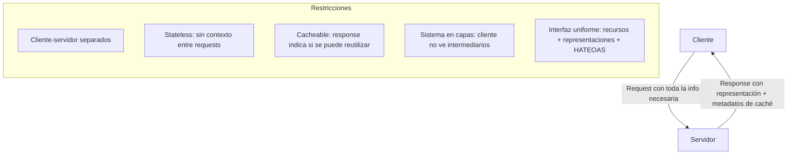
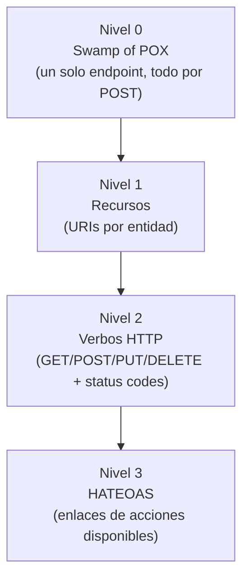

# Arquitectura REST

Este apunte presenta la arquitectura REST desde su origen conceptual: qué significa hablar de "arquitectura" en el contexto del software, qué es REST y de dónde surge, sus restricciones arquitectónicas, el concepto de recurso, la propiedad stateless, y el Modelo de Madurez de Richardson como herramienta para evaluar qué tan RESTful es realmente una API.

## De qué hablamos cuando hablamos de arquitectura

Antes de estudiar REST como estilo arquitectónico específico, conviene detenerse en una pregunta más general: ¿qué es, exactamente, la "arquitectura" de un sistema de software? La respuesta no es tan obvia como parece, y distintos autores la definen de maneras complementarias.

Una definición tradicional entiende la arquitectura como la organización fundamental de un sistema: cómo se conectan entre sí sus componentes de más alto nivel. Esta definición, aunque razonable, tiene un problema: no hay una forma objetiva de determinar qué es "fundamental" o de "alto nivel" en un sistema dado. Lo que es arquitectónicamente relevante en un proyecto puede ser un detalle de implementación irrelevante en otro.

Una perspectiva alternativa, propuesta por Ralph Johnson y frecuentemente citada, define la arquitectura como *"la comprensión compartida que los desarrolladores expertos tienen del diseño del sistema"*. Esta definición desplaza el foco: la arquitectura no es una propiedad objetiva del código, sino un consenso (a veces tácito, a veces documentado) entre quienes trabajan en el sistema sobre qué partes son importantes y cómo encajan entre sí. Johnson complementa esta idea con otra definición, más orientada a la práctica: la arquitectura son *"las decisiones que uno desearía haber tomado correctamente desde el principio"*, es decir, aquellas decisiones de diseño costosas de revertir una vez que el sistema creció. Su síntesis final es deliberadamente abierta: *"la arquitectura trata sobre lo importante. Sea lo que sea."*

Esta dificultad para definir con precisión qué es arquitectura tiene una consecuencia práctica relevante: la calidad de una arquitectura no se mide por adherencia a una definición formal, sino por su efecto observable en el desarrollo del sistema a lo largo del tiempo. Una arquitectura deficiente acumula lo que suele llamarse *cruft*: código y estructuras que dificultan cambios futuros, ralentizando progresivamente al equipo. A diferencia de otras dimensiones de calidad de software, como la experiencia de usuario, donde más calidad casi siempre implica más esfuerzo y tiempo, la calidad arquitectónica interna tiene una relación inversa con la velocidad de desarrollo: invertir en una arquitectura sólida suele acelerar, no retrasar, la entrega de funcionalidad futura, y esa inversión suele amortizarse en semanas, no en meses.

Este marco conceptual es el que permite entender por qué REST importa como *estilo arquitectónico*: no es simplemente una convención de cómo nombrar URLs o qué verbos HTTP usar, sino un conjunto de restricciones de diseño que, aplicadas consistentemente, buscan producir sistemas con propiedades deseables (escalabilidad, simplicidad, capacidad de evolucionar) a costa de renunciar a otras posibilidades de diseño.

## Qué es REST

**REST** (*Representational State Transfer*) es un estilo arquitectónico para sistemas distribuidos, formalmente definido por Roy Fielding en su tesis doctoral del año 2000, titulada *"Architectural Styles and the Design of Network-based Software Architectures"*, en la Universidad de California, Irvine. Fielding no inventó REST de la nada: lo formalizó a partir de la observación de seis años de participación directa en la definición de los estándares que sostienen la Web (HTTP 1.0, HTTP 1.1 y el estándar de URI), destilando en un marco teórico coherente las propiedades que ya hacían funcionar a la Web a gran escala.

Esta genealogía es importante para entender REST correctamente: no es un protocolo (como sí lo es HTTP), sino un **estilo arquitectónico**: un conjunto de restricciones de diseño que, aplicadas en conjunto, buscan ciertas propiedades del sistema resultante. HTTP es, en la práctica, el protocolo de transporte más habitual para implementar sistemas RESTful, pero REST como estilo no está atado a HTTP específicamente ni a ningún protocolo en particular; simplemente ocurre que HTTP ya satisface naturalmente buena parte de las restricciones que REST exige.

## Historia

REST surge, entonces, no como una propuesta de diseño abstracta y previa a la implementación, sino como una **descripción retrospectiva** de por qué la Web, tal como se había construido de facto hacia fines de los años 90, escalaba tan bien. La tesis de Fielding formaliza ese diseño empírico en un vocabulario preciso de restricciones, lo cual explica por qué REST se adoptó tan rápido en la industria: no pedía inventar nada nuevo, sino nombrar y sistematizar prácticas que la Web ya venía demostrando que funcionaban a escala global.

Esta historia también explica por qué, dos décadas después de la tesis original, el término "REST" se usa hoy de forma bastante más laxa en la industria que en la definición original de Fielding. Muchas APIs que se autodenominan "RESTful" en realidad cumplen solo parcialmente las restricciones que Fielding describió: usan HTTP y JSON, pero no implementan, por ejemplo, la restricción de interfaz uniforme completa (en particular HATEOAS, que se retoma más adelante en este apunte). Esta brecha entre la definición formal y el uso coloquial del término es, precisamente, lo que el Modelo de Madurez de Richardson intenta hacer explícito y medible, como se detalla en la última sección de este apunte.

## Restricciones arquitectónicas

Un sistema que aspira a ser RESTful, según la formulación original de Fielding, debe cumplir un conjunto de restricciones arquitectónicas. Cada una de estas restricciones, tomada individualmente, es una decisión de diseño que sacrifica algo (generalmente flexibilidad o rendimiento en un caso puntual) a cambio de una propiedad deseable a mayor escala:

- **Cliente-servidor.** Separación clara de responsabilidades entre el cliente (que gestiona la interfaz de usuario y el estado de la interacción) y el servidor (que gestiona el almacenamiento y el procesamiento de datos). Esta separación permite que ambas partes evolucionen de forma independiente: un cambio en la interfaz de usuario no debería requerir cambios en el servidor, y viceversa.
- **Stateless (sin estado).** El servidor no almacena ningún contexto sobre el cliente entre un request (solicitud) y el siguiente; cada request debe contener toda la información necesaria para ser entendido y procesado de forma autónoma. Esta restricción, que se retoma en detalle en la sección siguiente, es una de las que más impacto tiene en la escalabilidad del sistema.
- **Cacheable (cacheable).** Los responses (respuestas) deben, implícita o explícitamente, indicar si son cacheables o no. Esto permite que el cliente (o intermediarios en el camino, como un proxy) reutilicen una response previa para requests equivalentes futuras, reduciendo la cantidad de interacciones necesarias entre cliente y servidor.
- **Sistema en capas (layered system).** Un cliente no puede saber, ni necesita saber, si está conectado directamente al servidor que finalmente procesa su request o a un intermediario (un proxy, un balanceador de carga, una capa de caché). Esta restricción permite insertar o modificar capas intermedias sin que el cliente deba adaptarse.
- **Interfaz uniforme (uniform interface).** La restricción más distintiva de REST, que a su vez se descompone en varias sub-restricciones: identificación de recursos (cada recurso tiene un identificador único, típicamente una URI), manipulación de recursos a través de representaciones (el cliente interactúa con representaciones del recurso, como JSON o XML, no con el recurso "real" en sí), mensajes autodescriptivos (cada mensaje incluye la información necesaria para procesarlo, como su tipo de contenido) y HATEOAS (*Hypermedia As The Engine Of Application State*: los responses incluyen enlaces que describen qué acciones son posibles a continuación, en vez de que el cliente deba conocerlas de antemano).
- **Code on demand (opcional).** La única restricción opcional: el servidor puede extender temporalmente la funcionalidad del cliente enviándole código ejecutable (el ejemplo histórico es JavaScript entregado por el servidor y ejecutado por el navegador).

Vale la pena notar, honestamente, que la implementación real de la Web nunca cumplió estas restricciones de forma perfecta y absoluta. Las cookies, por ejemplo (omnipresentes en la Web moderna), violan en rigor la restricción de *stateless*: contienen datos opacos que el servidor asocia a un cliente específico entre requests, reintroduciendo estado del lado del servidor asociado a esa cookie, y generando problemas de sincronización y privacidad que un sistema perfectamente stateless no tendría. Esta tensión entre el ideal arquitectónico y la práctica real de la industria es, en sí misma, un tema recurrente al estudiar REST: es más útil como conjunto de principios orientadores que como checklist estricto de cumplimiento binario.



**Figura 1 — Restricciones arquitectónicas de REST.** Un sistema RESTful se define por la combinación de estas restricciones aplicadas simultáneamente: separación cliente-servidor, ausencia de estado entre requests, capacidad de cachear responses, transparencia ante capas intermedias, y una interfaz uniforme basada en recursos identificables y representaciones autodescriptivas.

## El concepto de recurso

En el vocabulario de REST, un **recurso** es cualquier concepto que pueda ser nombrado e identificado: un documento, una colección de elementos, un objeto de negocio (un usuario, una orden de compra), o incluso un valor puntual (la temperatura actual de una ciudad). Lo importante conceptualmente es distinguir el **recurso** de su **representación**: el recurso es la entidad abstracta ("el usuario con ID 42"), mientras que la representación es la forma concreta en la que ese recurso se transmite en un momento dado: un objeto JSON, un documento XML, un fragmento HTML.

Esta distinción no es un tecnicismo ocioso: es lo que permite que un mismo recurso tenga múltiples representaciones simultáneas (JSON para un cliente que consume la API programáticamente, HTML para un navegador que renderiza directamente el response) sin que eso implique que existan "varios recursos" distintos. El cliente negocia con el servidor qué representación prefiere recibir mediante headers como `Accept`, y el servidor responde con la representación solicitada del mismo recurso subyacente.

Cada recurso se identifica mediante una URI única. Esta identificación uniforme es la base sobre la que se apoya buena parte del resto del estilo REST: si cada recurso tiene una dirección propia y estable, resulta natural aplicar sobre esa dirección los verbos HTTP estándar (`GET` para obtener la representación actual, `PUT` para reemplazarla, `DELETE` para eliminar el recurso) en vez de inventar operaciones a medida para cada caso particular.

```javascript
// Ejemplo en Node.js (con Express): cada recurso tiene su propia URI,
// y los verbos HTTP se aplican de forma uniforme sobre esa URI.
import express from 'express';
const app = express();
app.use(express.json());

// El recurso "usuario" se identifica por su URI: /usuarios/:id
app.get('/usuarios/:id', (req, res) => {
  const usuario = buscarUsuarioPorId(req.params.id);
  if (!usuario) return res.status(404).json({ error: 'Usuario no encontrado' });
  res.json(usuario); // representación JSON del recurso
});

app.put('/usuarios/:id', (req, res) => {
  const usuarioActualizado = actualizarUsuario(req.params.id, req.body);
  res.json(usuarioActualizado);
});

app.delete('/usuarios/:id', (req, res) => {
  eliminarUsuario(req.params.id);
  res.status(204).end();
});
```

## La restricción stateless

La restricción *stateless* merece un desarrollo propio porque es, de las seis restricciones, la que más impacto tiene en la capacidad de un sistema de escalar horizontalmente. Bajo esta restricción, cada request del cliente debe contener toda la información necesaria para que el servidor la entienda y la procese, sin depender de ningún contexto almacenado de interacciones anteriores. Si una API necesita, por ejemplo, saber qué usuario está haciendo la request, esa información (típicamente un token de autenticación) debe viajar en el request mismo, en un header, por ejemplo, en vez de que el servidor recuerde "quién es" ese cliente a partir de una conexión previa.

Esta restricción tiene una consecuencia arquitectónica directa: como ninguna request depende de un estado guardado en un servidor específico, **cualquier instancia del servidor puede atender cualquier request**, sin necesidad de que el cliente se comunique siempre con la misma instancia física. Esto es exactamente lo que permite escalar horizontalmente agregando más instancias de servidor detrás de un balanceador de carga, sin ninguna lógica adicional de "afinidad de sesión" hacia una instancia particular. El costo de esta restricción es que cada request es, en cierto sentido, más pesada: debe repetir información que, en un modelo con estado, podría transmitirse una sola vez. Pero ese costo se paga a cambio de una escalabilidad mucho más simple de lograr.

```javascript
// Ejemplo en Node.js: cada request lleva su propia información de autenticación
// (un token), sin depender de que el servidor recuerde una sesión previa.
app.get('/pedidos', (req, res) => {
  const token = req.headers['authorization'];
  const usuario = validarToken(token); // toda la info necesaria viaja en esta request
  if (!usuario) return res.status(401).json({ error: 'No autorizado' });
  const pedidos = obtenerPedidosDeUsuario(usuario.id);
  res.json(pedidos);
});
```

Un matiz importante: *stateless* se refiere al estado de la **interacción cliente-servidor**, no a que la aplicación en su conjunto carezca de estado. Los datos persistentes (usuarios, pedidos, productos) siguen viviendo en el servidor, típicamente en una base de datos; lo que no debe existir es un estado de sesión asociado específicamente a una conexión particular con un cliente determinado, que impida atender la siguiente request de ese mismo cliente desde una instancia distinta del servidor.

## Modelo de Madurez de Richardson

Dado que, en la práctica, muchas APIs se llaman a sí mismas "REST" sin cumplir estrictamente todas las restricciones de Fielding, resulta útil contar con una herramienta que permita ubicar, con precisión, qué tan cerca está una API real del ideal RESTful completo. Esa herramienta es el **Modelo de Madurez de Richardson** (*Richardson Maturity Model*, RMM), propuesto por Leonard Richardson y popularizado por Martin Fowler en un artículo que se volvió referencia obligada del tema. El modelo describe cuatro niveles progresivos, donde cada nivel incorpora las características del anterior y agrega una restricción adicional:

- **Nivel 0 — El pantano de POX** (*The Swamp of POX*, "Plain Old XML"). Es el punto de partida: HTTP se usa meramente como mecanismo de túnel para un protocolo de comunicación propio. Existe un único endpoint (o unos pocos), y todas las operaciones (consultar, crear, eliminar) se envían como `POST` a esa misma dirección, con el detalle real de la operación descripto mediante un verbo dentro del body del mensaje, no en la URL. Por ejemplo:

  ```bash
  # Obtener un usuario en Nivel 0: un único endpoint "de servicio",
  # el verbo de la operación (getUserService) va en la URL misma.
  curl -X POST http://localhost:3000/getUserService \
    -H "Content-Type: application/json" \
    -d '{"id": 1}'
  ```

  Este enfoque es, en esencia, más parecido a RPC (*Remote Procedure Call*) que a REST: no hay concepto de recurso identificado por una URI, solo acciones remotas invocadas por nombre. Trae problemas concretos: los clientes deben conocer de memoria cada endpoint y el formato exacto de su body (sin poder inferir nada de la URL); las responses no son cacheables, porque `POST` no es cacheable por definición en HTTP; la falta de recursos identificables dificulta la escalabilidad y el uso de herramientas intermedias como proxies o CDNs; y herramientas de documentación automática (Postman, Swagger) no pueden inferir qué operaciones existen, porque las URLs describen acciones en vez de recursos.

- **Nivel 1 — Recursos.** Se introducen URIs individuales por recurso: en vez de `/getUserService`, la API expone `/users/1`. Sin embargo, este nivel todavía suele usar `POST` casi exclusivamente para todas las operaciones, incluidas actualizaciones y eliminaciones, expresando la acción en la URL en vez de en el método HTTP:

  ```bash
  # Nivel 1: hay un recurso identificable (/users/1), pero la acción
  # sigue codificada en la URL ("/update", "/delete") en vez del método HTTP.
  curl -X POST http://localhost:3000/users/1/update \
    -H "Content-Type: application/json" \
    -d '{"name": "Ana Gómez"}'

  curl -X POST http://localhost:3000/users/1/delete
  ```

  Es un avance real respecto del Nivel 0, ahora hay identidad de recurso, pero todavía no se aprovecha la semántica de los métodos HTTP: `update` y `delete` en la URL son, en el fondo, el mismo antipatrón del Nivel 0 aplicado a nivel de sub-ruta en vez de a nivel de endpoint completo.

- **Nivel 2 — Verbos HTTP.** El sistema usa los verbos HTTP con su semántica real: `GET` para lectura, `POST` para creación, `PUT` para reemplazo completo, `DELETE` para eliminación. Y usa códigos de estado apropiados a cada situación:

  ```bash
  curl -X GET http://localhost:3000/users/1        # → 200 OK
  curl -X POST http://localhost:3000/users \
    -d '{"name": "Laura"}'                          # → 201 Created
  curl -X PUT http://localhost:3000/users/1 \
    -d '{"name": "Ana Gómez"}'                       # → 200 OK
  curl -X DELETE http://localhost:3000/users/1      # → 204 No Content
  ```

  Este es el nivel donde se ubica la gran mayoría de las APIs que hoy se llaman a sí mismas "REST" en la industria.

- **Nivel 3 — Controles de hipermedia (HATEOAS).** El nivel más alto del modelo, e implementa la restricción de interfaz uniforme completa. Las responses no solo devuelven los datos del recurso solicitado, sino también enlaces (`links`) que describen qué acciones están disponibles a continuación:

  ```json
  {
    "id": 1,
    "name": "Ana",
    "email": "ana@example.com",
    "links": {
      "self": { "href": "/users/1", "method": "GET" },
      "update": { "href": "/users/1", "method": "PUT" },
      "delete": { "href": "/users/1", "method": "DELETE" },
      "allUsers": { "href": "/users", "method": "GET" }
    }
  }
  ```

  Esto permite que el cliente descubra dinámicamente las acciones posibles en lugar de tenerlas hardcodeadas de antemano, y que el servidor pueda modificar las URIs internas sin romper a los clientes existentes, siempre que estos naveguen siguiendo los enlaces provistos en vez de construir URIs por su cuenta, el mismo principio que un navegador aplica al seguir enlaces en HTML, en vez de adivinar direcciones.

Una aclaración importante que Fowler explicita en su artículo, y que Fielding mismo reafirmó públicamente: sin controles de hipermedia, una API no es RESTful según la definición original. Sin embargo, en la práctica el **Nivel 3 suele considerarse excesivo** para muchas aplicaciones: los clientes modernos, por ejemplo una SPA construida en React o Vue, suelen tener rutas predefinidas de antemano en su propio código, y no necesitan descubrir dinámicamente los endpoints disponibles en cada response. Implementar HATEOAS en ese contexto agrega complejidad de desarrollo (el servidor debe calcular qué acciones son válidas en cada estado del recurso) sin un beneficio claro para ese cliente en particular. Donde sí suele justificarse plenamente es en APIs públicas de uso masivo y evolución constante, como la de GitHub, donde múltiples clientes desconocidos entre sí se benefician de poder descubrir la API dinámicamente en vez de hardcodear rutas que podrían cambiar.

El Modelo de Madurez de Richardson, en definitiva, no pretende ser un mecanismo oficial de certificación REST, sino una **herramienta pedagógica**: permite tener una conversación precisa sobre qué tan lejos está una API concreta del ideal completo, sin caer en la discusión binaria de "es REST o no es REST".



**Figura 2 — Modelo de Madurez de Richardson.** Cada nivel incorpora las características del anterior: del Nivel 0 (un único endpoint que tuneliza todo por POST) al Nivel 3 (responses que incluyen hipermedia describiendo las acciones disponibles), pasando por la introducción de recursos individuales (Nivel 1) y el uso correcto de verbos HTTP y status codes (Nivel 2).

```javascript
// Ejemplo en Node.js: una response de Nivel 3, con HATEOAS.
// El cliente no necesita conocer de antemano la URI de "cancelar":
// la descubre en los enlaces (_links) de la propia response.
app.get('/turnos/:id', (req, res) => {
  const turno = buscarTurnoPorId(req.params.id);
  if (!turno) return res.status(404).json({ error: 'Turno no encontrado' });

  res.json({
    id: turno.id,
    fecha: turno.fecha,
    doctor: turno.doctorId,
    estado: turno.estado,
    _links: {
      self: { href: `/turnos/${turno.id}` },
      cancelar: turno.estado === 'confirmado'
        ? { href: `/turnos/${turno.id}/cancelar`, method: 'POST' }
        : undefined,
      doctor: { href: `/doctores/${turno.doctorId}` },
    },
  });
});
```

## Limitaciones y realidad práctica

Vale la pena cerrar el desarrollo conceptual con una mirada honesta a la distancia entre el ideal REST y su implementación real en la industria. HTTP fue diseñado en los años 90 para la transferencia de hipertexto; las aplicaciones web modernas tienen necesidades bastante más complejas (streaming, operaciones en tiempo real, autenticación avanzada) que seguir "HTTP tal como fue pensado" originalmente puede no resolver bien. El ejemplo más claro es la comunicación bidireccional: una aplicación de chat necesita que el servidor pueda enviar mensajes al cliente en cualquier momento, sin que medie una request previa, algo que el modelo request-response puro de HTTP no ofrece. Por eso este tipo de aplicaciones suele recurrir a WebSockets en lugar de HTTP clásico, precisamente porque HTTP no fue diseñado para ese caso de uso: en el modelo request-response puro, el servidor no puede "empujar" datos espontáneamente hacia el cliente sin que medie una request previa de este.

En la práctica, además, muchas APIs que se autodenominan "RESTful" no siguen estrictamente los principios de REST o de HTTP: usan `POST` para operaciones que semánticamente deberían ser `GET` (a veces por limitaciones de longitud en la URL), o directamente ignoran HATEOAS porque agrega complejidad de desarrollo y los clientes suelen tener rutas hardcodeadas de antemano. Esto no necesariamente convierte a esas APIs en "incorrectas": suele ser una decisión consciente que prioriza la simplicidad y las necesidades concretas del proyecto por sobre la pureza arquitectónica.

Esta tensión entre el ideal y la práctica también dio lugar a alternativas más recientes que atacan directamente algunas limitaciones de REST. **GraphQL**, por ejemplo, permite que el cliente especifique exactamente qué datos necesita en una única consulta, en vez de tener que encadenar varias requests HTTP a distintos recursos para reunir la misma información. Donde una API REST tradicional podría requerir dos requests separadas (`GET /users/123` seguido de `GET /users/123/orders`) para reunir un usuario y sus órdenes, GraphQL permite combinar ambas necesidades en una sola consulta, potencialmente más eficiente en escenarios donde el cliente necesita datos relacionados de múltiples recursos. Esto no invalida a REST como estilo arquitectónico general, pero sí muestra que, para ciertos patrones de consumo de datos, existen alternativas de diseño que resuelven mejor un problema puntual que REST no ataca directamente.

Por esta combinación de factores, la inmensa mayoría de las APIs que la industria llama "REST" hoy en día se ubican, en términos del Modelo de Madurez de Richardson, en el Nivel 2: usan URIs por recurso, aplican correctamente los verbos HTTP y los códigos de estado, pero no implementan hipermedia. Esto no las convierte en "API mal diseñadas": simplemente son APIs pragmáticas que adoptan las restricciones de REST que ofrecen mejor relación costo-beneficio en su contexto particular, sin perseguir la conformidad estricta con la definición original de Fielding. Entender esta brecha, y poder nombrarla con precisión usando el vocabulario del Modelo de Madurez, es, en definitiva, uno de los aprendizajes más útiles y aplicables de este apunte.

## Conclusión

REST es, ante todo, un estilo arquitectónico: un conjunto de restricciones de diseño (separación cliente-servidor, ausencia de estado, capacidad de caché, sistema en capas, interfaz uniforme) formalizadas por Roy Fielding a partir de la observación empírica de por qué la Web ya escalaba exitosamente antes de que existiera un nombre formal para describir ese diseño. El concepto de recurso, identificado unívocamente por una URI y accesible mediante representaciones intercambiables, es la unidad fundamental sobre la que se construye ese estilo, y la restricción stateless es la que más directamente habilita la escalabilidad horizontal característica de los sistemas RESTful.

El Modelo de Madurez de Richardson aporta el vocabulario preciso que falta en la conversación cotidiana sobre REST: permite distinguir una API que apenas tuneliza operaciones por HTTP (Nivel 0) de una que expone recursos identificables (Nivel 1), de una que además usa correctamente verbos HTTP y códigos de estado (Nivel 2), de una que implementa hipermedia completa según la visión original de Fielding (Nivel 3). Entender en qué nivel se ubica una API concreta, y por qué, es una habilidad más útil, en la práctica profesional, que debatir en abstracto si algo "es" o "no es" REST.

## Anexo 1 — REST vs. SOAP

Este anexo compara REST con SOAP (*Simple Object Access Protocol*), su alternativa histórica más relevante para construir servicios web, porque la comparación entre ambos ayuda a entender por contraste varias de las decisiones de diseño que caracterizan a REST.

### Protocolo vs. estilo arquitectónico

La diferencia más fundamental entre ambos es de categoría: **SOAP es un protocolo**, con una especificación formal y estricta de cómo deben construirse los mensajes, mientras que **REST es un estilo arquitectónico**, un conjunto de principios de diseño que puede implementarse con distintos grados de flexibilidad. SOAP define un formato de mensaje obligatorio: un "sobre" (*envelope*) XML que envuelve cada request y response siguiendo una estructura estandarizada. REST no impone un formato de mensaje único: una API RESTful puede transmitir JSON, XML, texto plano o incluso HTML, según lo que mejor se ajuste al caso de uso.

Esta diferencia de naturaleza tiene una consecuencia práctica directa en cómo se documentan los servicios de cada tipo. Los servicios SOAP suelen publicar un contrato formal mediante WSDL (*Web Services Description Language*), un documento que describe exhaustivamente las operaciones disponibles, sus parámetros de entrada y salida, y los tipos de datos involucrados. Este enfoque *contract-first* es una de las razones por las que SOAP se sigue usando en entornos de integración empresarial intensiva o en sectores regulados, donde contar con un contrato formal y verificable de antemano tiene valor por sí mismo.

### Formato de datos y transporte

SOAP exige XML como formato de mensaje, sin alternativa. REST, en cambio, admite múltiples formatos, y en la práctica moderna favorece JSON por su legibilidad y su compatibilidad casi universal con lenguajes de programación modernos, aunque nada en el estilo REST impide usar XML si el caso de uso lo requiere.

En cuanto a transporte, REST opera casi exclusivamente sobre HTTP, aprovechando directamente su semántica de verbos y códigos de estado. SOAP, en cambio, fue diseñado para ser independiente del protocolo de transporte subyacente: puede transportarse sobre HTTP, pero también sobre SMTP (correo electrónico) o TCP directamente, entre otros. Esta independencia de transporte le da a SOAP flexibilidad en escenarios de integración poco convencionales, a costa de no poder apoyarse en la semántica rica que HTTP ya ofrece de forma gratuita.

### Estado, rendimiento y escalabilidad

REST es, por definición, *stateless*, tal como se detalló en la sección correspondiente de este apunte: cada request se procesa de forma independiente. SOAP, en su uso más tradicional, tiende a mantener estado del cliente entre requests (por ejemplo, a través de sesiones), lo cual dificulta la escalabilidad horizontal: escalar un sistema SOAP con estado requiere mecanismos adicionales para replicar o compartir ese estado entre instancias del servidor, mientras que un sistema REST stateless puede escalarse simplemente agregando instancias detrás de un balanceador de carga, sin lógica adicional.

En términos de rendimiento, los mensajes SOAP tienden a ser considerablemente más grandes y complejos que sus equivalentes en JSON sobre REST, debido al overhead estructural del envelope XML y a los metadatos adicionales que SOAP suele incluir (como información de WS-Addressing o WS-Security). Esto se traduce en transmisiones más lentas y mayor uso de ancho de banda para operaciones equivalentes.

### Seguridad

SOAP incorpora un estándar propio y robusto de seguridad a nivel de mensaje, WS-Security, que permite firmar y cifrar partes específicas del mensaje de forma independiente del canal de transporte utilizado. Esta capacidad es valiosa en escenarios donde el mensaje atraviesa múltiples intermediarios y no alcanza con cifrar únicamente el canal de transporte, pero tiene un costo de rendimiento y complejidad de implementación no trivial. REST, en cambio, se apoya típicamente en la seguridad ya provista por el transporte (HTTPS), sin necesidad de un estándar adicional a nivel de mensaje, lo cual es más simple de implementar pero ofrece garantías distintas (protege el canal completo, no partes específicas del mensaje de forma independiente).

### Cuándo conviene cada uno

Esta comparación no debe leerse como un veredicto de que uno de los dos enfoques sea categóricamente superior: cada uno resuelve mejor un conjunto distinto de necesidades.

**REST tiende a ser la opción preferida cuando:**

- Se construyen aplicaciones web y móviles modernas, donde la simplicidad y la velocidad de desarrollo importan.
- Se necesitan APIs públicas ampliamente consumidas, donde la simplicidad de integración (JSON sobre HTTP) reduce la fricción para quienes las consumen.
- El sistema debe escalar horizontalmente sin complejidad adicional de gestión de estado.
- El contexto es de microservicios, IoT o computación serverless, donde la ligereza del formato y el protocolo importan especialmente.

**SOAP sigue siendo relevante cuando:**

- Se trabaja con sistemas legados que ya lo implementan, y migrar tendría un costo mayor que el beneficio.
- El entorno es de integración empresarial intensiva, con necesidad de contratos formales verificables (WSDL) entre las partes.
- Existen requisitos regulatorios o de cumplimiento normativo que exigen garantías específicas de seguridad a nivel de mensaje (WS-Security) o semántica transaccional estricta (ACID) que REST no ofrece de forma nativa.

```javascript
// Comparación conceptual: la misma operación ("obtener usuario 42")
// expresada como request REST y como esqueleto de request SOAP.

// REST: GET simple sobre una URI de recurso, response en JSON.
async function obtenerUsuarioREST(id) {
  const response = await fetch(`https://ejemplo.com/usuarios/${id}`, {
    method: 'GET',
    headers: { Accept: 'application/json' },
  });
  return response.json();
}

// SOAP: un único endpoint de servicio, la operación real viaja
// dentro de un envelope XML enviado por POST.
async function obtenerUsuarioSOAP(id) {
  const envelopeXml = `<?xml version="1.0"?>
    <soap:Envelope xmlns:soap="http://www.w3.org/2003/05/soap-envelope">
      <soap:Body>
        <ObtenerUsuario>
          <id>${id}</id>
        </ObtenerUsuario>
      </soap:Body>
    </soap:Envelope>`;

  const response = await fetch('https://ejemplo.com/servicioUsuarios', {
    method: 'POST',
    headers: { 'Content-Type': 'text/xml' },
    body: envelopeXml,
  });
  return response.text(); // XML a parsear
}
```

Este contraste en código ilustra, de forma concreta, la diferencia de fondo entre ambos enfoques: REST aprovecha la semántica de HTTP y la identidad propia de cada recurso; SOAP encapsula toda la información de la operación dentro de un mensaje autocontenido, transportado sobre un único endpoint de servicio, independientemente de qué protocolo de transporte se use por debajo.

## Bibliografía consultada

- Wikipedia (inglés). (s.f.). *REST*. Definición, origen en la tesis doctoral de Roy Fielding (2000), las seis restricciones arquitectónicas, concepto de recurso y representación, propiedad stateless, y limitaciones prácticas (cookies). https://en.wikipedia.org/wiki/REST
- Fowler, M. (s.f.). *Richardson Maturity Model*. Descripción de los cuatro niveles (Swamp of POX, Recursos, Verbos HTTP, Hypermedia Controls) y la aclaración de Roy Fielding sobre HATEOAS como requisito de REST. https://martinfowler.com/articles/richardsonMaturityModel.html
- Wikipedia (inglés). (s.f.). *Richardson Maturity Model*. Detalle complementario de los cuatro niveles del modelo. https://en.wikipedia.org/wiki/Richardson_Maturity_Model
- Fowler, M. (s.f.). *Architecture*. Definiciones de arquitectura de software (Ralph Johnson), por qué es difícil de definir, y su relación con la velocidad de desarrollo a largo plazo. https://martinfowler.com/architecture/
- Amazon Web Services (AWS). (s.f.). *The difference between SOAP and REST*. Comparación de formato de datos, gestión de estado, rendimiento, escalabilidad y seguridad entre ambos enfoques. https://aws.amazon.com/compare/the-difference-between-soap-rest/
- Red Hat. (s.f.). *What's the difference between SOAP and REST*. Definiciones, formato de datos, transporte, y casos de uso recomendados para cada enfoque. https://www.redhat.com/en/topics/integration/whats-the-difference-between-soap-rest
- Material de cátedra (Google Slides). *ARQUITECTURA REST v2.0*. Presentación de cátedra: definición de REST, las seis restricciones arquitectónicas, concepto de recurso y representación, Modelo de Madurez de Richardson con ejemplos por nivel (curl), limitaciones y realidad práctica (WebSockets, GraphQL). Consultada mediante el conector Google Drive; se usó únicamente la porción correspondiente a Arquitectura REST (el resto del material, sobre planeando endpoints, versionado de API y content negotiation, corresponde a Web APIs).
