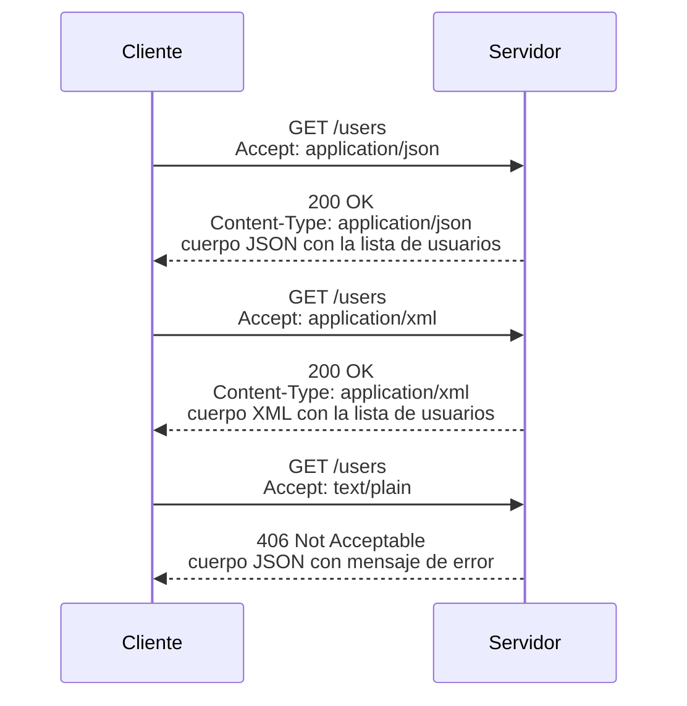
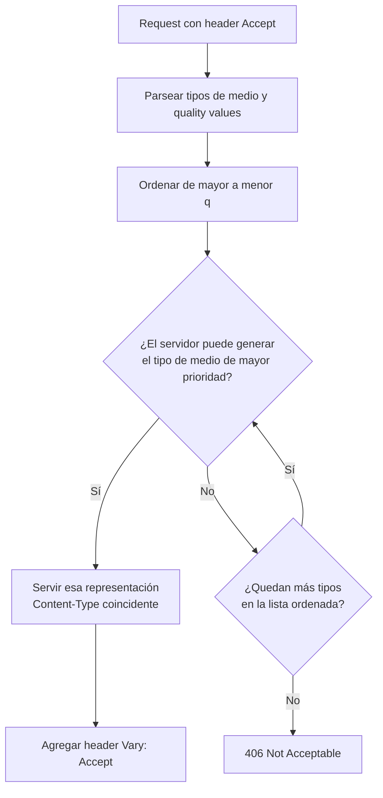

# Diseño de endpoints en Web APIs

Este apunte aborda las **Web APIs**: qué son, cómo se diferencian de una API convencional, ejemplos conocidos en la industria y cómo se planifican y diseñan los **endpoints** de una API HTTP con criterio profesional. Se cierra con el mecanismo de **content negotiation**, mostrando cómo un servidor decide qué representación de un recurso entregar según lo que el cliente declara aceptar, y cómo se traduce esa teoría en un endpoint real.

## Qué es una API

**API** es la sigla de *Application Programming Interface* (interfaz de programación de aplicaciones). Se trata de un conjunto de definiciones, herramientas y protocolos que permite que un componente de software se comunique con otro sin que ninguno de los dos necesite conocer los detalles internos de implementación del otro. En otras palabras, una API es un contrato: expone únicamente lo que un programador necesita para integrar una funcionalidad, y oculta deliberadamente el resto.

Wikipedia define a la interfaz de programación de aplicaciones de un modo equivalente: una API es la interfaz que expone un componente de software respecto a otros elementos, especificando qué llamadas o solicitudes pueden hacerse, cómo hacerlas, qué formatos de datos usar y qué convenciones seguir. Esta definición es útil porque separa dos ideas que suelen confundirse: la API es la interfaz (el contrato), mientras que la implementación detrás de esa interfaz puede cambiar libremente sin que el consumidor se entere, siempre que el contrato se respete.

Existen APIs en prácticamente todos los niveles de la pila de software:

- **APIs de sistema operativo**: por ejemplo, las syscalls que expone un kernel para manejo de archivos o procesos.
- **APIs de bases de datos**: los drivers que permiten ejecutar consultas desde un lenguaje de programación.
- **APIs de librerías y frameworks**: los métodos públicos que una librería expone para que otro código la consuma (piénsese en los métodos de un framework como Express en Node.js).
- **APIs de aplicaciones web**: el tema central de este apunte.

En general, la especificación de una API describe las estructuras de datos que intercambia, las clases o tipos involucrados, las variables de configuración y las llamadas remotas disponibles. Un buen diseño de API no es un detalle menor: si la interfaz es clara, consistente y predecible, el desarrollo de aplicaciones que la consumen se simplifica notablemente. Si es ambigua o inconsistente, cada integración se convierte en una fuente de errores.

Es importante notar que "API" es un concepto más amplio que "Web API". Una API puede no involucrar ninguna red: la interfaz de una librería de manipulación de fechas en Node.js es una API, y no requiere HTTP ni ningún protocolo de red para funcionar. Lo que estudiamos en este apunte es el subconjunto de APIs pensadas específicamente para operar sobre la web.

## Qué es una Web API

Una **Web API**, también llamada **web service** en cierta literatura, es una interfaz pensada para que aplicaciones se comuniquen entre sí a través de Internet, típicamente usando el protocolo HTTP como transporte. A diferencia de una API de librería (que se invoca con una llamada a función dentro del mismo proceso), una Web API se invoca mediante un intercambio de mensajes de red: un cliente envía un solicitud (request) y recibe una respuesta (response).

En el contexto del desarrollo web, una API queda definida por:

- Un conjunto de **especificaciones**: qué operaciones existen y qué significan.
- El formato de los **request messages** y **response messages**.
- La **estructura interna** de esos mensajes, habitualmente serializada en JSON o, con menor frecuencia hoy en día, en XML.

Aunque históricamente "web service" y "Web API" se usaban como sinónimos, la industria fue migrando desde una arquitectura orientada a servicios (enfocada en operaciones o acciones remotas, como en SOAP) hacia una arquitectura orientada a **recursos**, donde el foco está puesto en las entidades del dominio (usuarios, productos, pedidos) y no en las acciones que se ejecutan sobre ellas. Este cambio de enfoque es precisamente lo que caracteriza a REST, un estilo arquitectónico con el que conviene estar familiarizado para entender el diseño moderno de APIs. En este apunte nos concentramos en la parte práctica: cómo se traduce ese estilo arquitectónico en decisiones concretas de diseño de endpoints.

### Ejemplos de Web APIs conocidas

Buena parte de los servicios que usamos a diario exponen una Web API pública o semipública que permite integrarlos desde aplicaciones de terceros. Algunos ejemplos habituales en la industria:

- **X API** (anteriormente Twitter API): permite leer y publicar contenido de la red social de forma programática.
- **Google Maps API**: expone geocodificación, cálculo de rutas y renderizado de mapas para integrarlos en sitios y apps propias.
- **APIs de Azure/AWS**: los proveedores de nube exponen prácticamente toda su infraestructura (cómputo, almacenamiento, redes) como Web APIs, de forma que cualquier operación que se hace desde una consola web también puede automatizarse por API.
- **YouTube API**: permite buscar videos, gestionar reproducciones y manipular listas desde aplicaciones externas.
- **Spotify API**: expone catálogos, listas de reproducción y control de reproducción a aplicaciones de terceros.

Todas comparten un patrón: exponen recursos (usuarios, videos, mapas, canciones, instancias de cómputo) a través de URLs y devuelven representaciones de esos recursos, generalmente en JSON. Esta arquitectura orientada a recursos es la que un desarrollador de Web APIs modernas debe internalizar como punto de partida.

Más allá del recurso en sí, estas APIs comparten también un conjunto de preocupaciones transversales que conviene tener presentes desde el diseño:

- **Autenticación y autorización**: la mayoría exige identificar al consumidor mediante una API key, un token de tipo Bearer o un esquema OAuth 2.0 completo. La Web API de Google Maps, por ejemplo, requiere una clave asociada a un proyecto de facturación; la de X exige un token emitido tras un flujo de autorización.
- **Rate limiting**: como estas APIs son consumidas por miles o millones de aplicaciones de terceros simultáneamente, casi todas imponen límites de solicitudes por unidad de tiempo, comunicados habitualmente mediante headers de respuesta (`X-RateLimit-Limit`, `X-RateLimit-Remaining`) y el código de estado `429 Too Many Requests` cuando se excede el límite.
- **Documentación como contrato vivo**: dado que estas APIs son consumidas por equipos externos que no tienen acceso al código fuente del servidor, la documentación (a menudo generada a partir de una especificación como OpenAPI) cumple el rol que en un sistema monolítico cumpliría leer el código: es la única fuente de verdad sobre qué endpoints existen y qué esperan recibir.

Estas preocupaciones no reemplazan el diseño de endpoints propiamente dicho, pero conviene tenerlas en mente porque condicionan varias de las decisiones que se explican a continuación: por ejemplo, el versionado de la API suele ir de la mano de una política de deprecación que se comunica a través de la misma documentación.

## Planeando y creando endpoints

Un **endpoint** es, en esencia, una URL: el punto de acceso concreto a través del cual un cliente interactúa con un recurso de la API. Por ejemplo, `http://example.com/foo/bar` es un endpoint; como el dominio suele ser común a toda la API, en la práctica solemos referirnos a él simplemente como `/foo/bar`.

Diseñar buenos endpoints no es una tarea trivial ni puramente estética: una API con endpoints mal pensados es difícil de aprender, propensa a malentendidos entre cliente y servidor, y costosa de evolucionar. A continuación se detallan las decisiones de diseño más relevantes al momento de planificar una API.

### Recursos y operaciones sobre colecciones

El primer paso es identificar los **recursos** del dominio: las entidades sobre las que la API permitirá operar (usuarios, productos, pedidos, lugares). Cada recurso individual y cada colección de recursos deben tener su propia URL, siguiendo un patrón consistente. Para operaciones de lectura (`GET`), los patrones habituales son:

- `GET /resources`: retorna una lista paginada de recursos, en algún orden lógico por defecto.
- `GET /resources/X`: retorna únicamente el recurso identificado por `X` (puede ser un id numérico, un hash, un slug o cualquier identificador único para ese recurso).
- `GET /resources/X,Y,Z`: cuando el cliente necesita varios recursos puntuales a la vez, se le permite pedir varios identificadores en una sola solicitud.

Para las operaciones de borrado (`DELETE`), el patrón es análogo:

- `DELETE /resources/X`: elimina un único recurso.
- `DELETE /resources/X,Y,Z`: elimina varios recursos en una sola operación.
- `DELETE /resources`: es un endpoint potencialmente peligroso, ya que borraría *todos* los recursos de la colección. Muchas APIs directamente evitan exponerlo, o lo protegen con controles adicionales.
- `DELETE /resources/X/image`: elimina la imagen asociada a un recurso puntual.

Un detalle de diseño frecuentemente pasado por alto: conviene evitar que los identificadores de recursos sean valores **auto-incrementales** expuestos directamente (`/users/1`, `/users/2`). Cualquier consumidor de la API con acceso de lectura puede inferir, a partir de esos números, cuántos recursos existen en total, lo que puede filtrar información de negocio sensible (por ejemplo, cuántos usuarios se registraron en un período dado) a competidores u observadores externos. Preferir identificadores opacos (UUID, hashes) o al menos no correlativos.

### Sub-recursos

Cuando un recurso tiene una relación de pertenencia con otro, conviene modelarla como **sub-recurso** en la URL. Por ejemplo, si la API modela "lugares" (*places*) y cada lugar tiene "check-ins" asociados, son válidos endpoints como:

```
GET /places/X/checkins        -> todos los check-ins de un lugar específico
GET /users/X/checkins         -> todos los check-ins de un usuario específico
GET /users/X/checkins/Y       -> un check-in específico de un usuario específico
```

También es válido, dependiendo del diseño, exponer el check-in directamente bajo su propia colección de nivel superior: `GET /checkins/X`. La elección depende de si el check-in tiene sentido como entidad independiente (identificable y accesible sin pasar por su lugar o usuario "padre") o si solo tiene sentido en el contexto de la relación.

En Express, este tipo de jerarquía se modela con el objeto `Router`, que permite agrupar las rutas de un sub-recurso bajo el prefijo de su recurso padre sin repetir el segmento de la URL en cada handler:

```js
// places-router.js
// Sub-router que agrupa los endpoints de check-ins anidados bajo un lugar.
import express from 'express';
// mergeParams permite acceder a :placeId definido en el router padre.
const checkinsRouter = express.Router({ mergeParams: true });

const checkinsByPlace = new Map(); // placeId -> array de check-ins

// GET /places/:placeId/checkins -> todos los check-ins de ese lugar
checkinsRouter.get('/', (req, res) => {
  const list = checkinsByPlace.get(req.params.placeId) || [];
  res.status(200).json({ data: list });
});

// GET /places/:placeId/checkins/:checkinId -> un check-in específico
checkinsRouter.get('/:checkinId', (req, res) => {
  const list = checkinsByPlace.get(req.params.placeId) || [];
  const checkin = list.find((c) => c.id === req.params.checkinId);
  if (!checkin) {
    return res.status(404).json({ error: 'Checkin no encontrado' });
  }
  res.status(200).json({ data: checkin });
});

export default checkinsRouter;
```

```js
// server.js (fragmento)
// El router padre monta el sub-router bajo el segmento /:placeId/checkins,
// reflejando exactamente la jerarquía GET /places/X/checkins definida arriba.
const placesRouter = express.Router();
placesRouter.use('/:placeId/checkins', checkinsRouter);
app.use('/places', placesRouter);
```

Esta separación en routers no es solo prolijidad de código: refleja directamente la jerarquía de recursos que se decidió en el diseño, y facilita que cada archivo se mantenga responsable de un único recurso o sub-recurso, sin que crezca un único archivo de rutas monolítico a medida que la API incorpora nuevas entidades.

### Plural, singular, o ambos

Una decisión de diseño que suele generar discusión es si las colecciones deben nombrarse en singular o en plural. Consideremos el caso `/user/1` frente a `/user`: el primero identifica claramente a un usuario puntual, pero el segundo es ambiguo, ¿retorna el último usuario creado? ¿Retorna una lista? La ambigüedad se resuelve si distinguimos explícitamente colección de recurso individual: `/users` para la colección, `/users/1` para un elemento puntual.

La recomendación práctica es **usar plural para todo**, con matices de idioma (por ejemplo, `/opportunity/123` frente a `/opportunities`, donde el plural en inglés no siempre es una simple adición de "s"). Lo verdaderamente importante no es la elección en sí, sino la **consistencia**: una vez adoptada una convención, debe aplicarse en toda la API sin excepciones. Bajo esa convención:

```
GET /places        -> "voy a obtener una colección de lugares"
GET /places/45     -> "estoy hablando puntualmente del lugar 45"
GET /places/45,28  -> "quiero los lugares 45 y 28"
```

Y para sub-recursos, la misma lógica se extiende de forma natural:

```
GET /places
GET /places/45
GET /places/45/checkins
GET /places/45/checkins/91
GET /checkins/91
```

### Verbo o sustantivo en la URL

Tradicionalmente, muchos estilos de integración (SOAP, XML-RPC) modelaban la API como una colección de acciones remotas, expresadas como verbos en la URL:

```http
POST /SendUserMessage HTTP/1.1
Host: example.com
Content-Type: application/x-www-form-urlencoded

id=5&message=Hello!
```

Este enfoque es fundamentalmente distinto del estilo orientado a recursos: la acción queda codificada en el nombre del endpoint, y el método HTTP se vuelve casi irrelevante (todo viaja por `POST`). Un error habitual es creer que alcanza con anidar el verbo bajo el recurso para volverlo "más RESTful":

```http
POST /users/5/send-message HTTP/1.1
Host: example.com
Content-Type: application/json

{ "message": "Hello!" }
```

Esto tampoco funciona: el verbo `send-message` sigue viviendo en la URL, cuando en un diseño orientado a recursos el **único verbo permitido** debería ser el propio método HTTP. La forma correcta es modelar la acción como creación de un recurso (un mensaje) dentro de una colección:

```http
POST /users/5/messages HTTP/1.1
Host: example.com
Content-Type: application/json

{ "message": "Hello!" }
```

Aquí `POST` ya comunica la semántica de "crear", y `/users/5/messages` identifica sin ambigüedad la colección de mensajes de ese usuario. La regla general: si la URL necesita un verbo adicional para expresar la operación, probablemente el diseño está modelando una acción en lugar de un recurso.

### POST frente a PUT

Otra decisión frecuente es cuándo usar `POST` y cuándo `PUT` para crear o modificar un recurso. La distinción de fondo está en la **idempotencia**: `PUT` es idempotente (invocarlo una vez o múltiples veces produce el mismo resultado final), mientras que `POST` no lo es necesariamente.

Como criterio práctico: se usa `PUT` cuando el cliente **ya conoce de antemano** la URL completa del recurso y repetir la operación no genera efectos adicionales. Un ejemplo típico es la carga de una imagen asociada a un recurso ya identificado:

```http
PUT /places/1/image HTTP/1.1
Host: example.com
Content-Type: image/jpeg

<binario de la imagen>
```

Aquí el cliente conoce de antemano la URL (`/places/1/image`) y ejecutar el `PUT` una y otra vez simplemente reemplaza la imagen con el mismo resultado. En cambio, cuando el servidor es quien decide el identificador del nuevo recurso (por ejemplo, al crear un usuario nuevo y asignarle un id autogenerado), corresponde `POST` sobre la colección padre, ya que cada invocación crearía, en principio, un recurso distinto.

### Versionado de la API

Toda API evoluciona: en algún momento se reemplaza una funcionalidad existente, se agregan campos nuevos o se cambia la forma de representar un recurso. No existe una solución universalmente aceptada para versionar una Web API, pero las estrategias más habituales son tres.

**Versionado por URL.** La versión se incluye directamente en el path:

```
https://api.example.com/v1/places
```

o, alternativamente, como subdominio:

```
https://api-v1.example.com/places
```

Ventajas: extremadamente simple tanto para quien desarrolla la API como para quien la consume; las URLs son directamente copiables y pegables en documentación o en el navegador. Desventajas: en sentido estricto no es "RESTful" (la URL debería identificar un recurso, no una versión de la API); resulta incómodo separar versiones distintas en servidores físicamente distintos; y obliga a los consumidores a actualizar enlaces existentes cuando cambia la versión.

**Versionado por body o query params.** La versión se saca de la URL y se traslada al cuerpo del mensaje o a un parámetro de query string:

```http
POST /places HTTP/1.1
Host: api.example.com
Content-Type: application/json

{"version": "1.0"}
```

```
POST /places?version=1.0 HTTP/1.1
```

Ventajas: mantiene la URL estable cuando el parámetro va en el body; es conceptualmente algo más cercano al espíritu REST que incrustar la versión en la URI. Desventajas: distintos tipos de contenido (JSON, CSV) requieren manejar el parámetro de forma distinta, y algunos formatos simplemente no tienen un lugar natural donde ubicarlo; si el parámetro va en la query string, sigue obligando a actualizar enlaces existentes.

**Versionado por header personalizado.** La versión viaja en un header HTTP dedicado, a menudo dentro del propio header `Accept` mediante un tipo de medio (media type) personalizado:

```http
GET /customer/123 HTTP/1.1
Accept: application/vnd.company.myapp.customer-v1+xml
```

Ventajas: mantiene la URL completamente estable; es, de las tres opciones, la más alineada con los principios REST, ya que reutiliza el mecanismo de content negotiation en lugar de introducir un concepto ajeno a HTTP. Desventajas: requiere que tanto desarrolladores como sistemas de caché "sepan" inspeccionar ese header, lo cual puede generar confusión si no está bien documentado; los sistemas de caché HTTP intermedios pueden no discriminar automáticamente por esta variación salvo que se configure explícitamente (por ejemplo, mediante el header `Vary`).

En la práctica, muchas APIs públicas de gran escala (redes sociales, proveedores de nube) optan por el versionado en la URL, priorizando la simplicidad de uso sobre la pureza arquitectónica, exactamente en la misma línea de compromiso práctico que ya vimos al hablar de las limitaciones de REST en el uso cotidiano.

### Un endpoint completo en Node.js con Express

A modo de ilustración de los criterios anteriores, veamos cómo se implementaría en un servidor Node.js con el framework Express una colección de recursos "places" respetando plural consistente, identificadores no correlativos y semántica correcta de métodos:

```js
// server.js
// Servidor de ejemplo que expone una colección de "places" siguiendo
// las convenciones de diseño de endpoints discutidas: plural consistente,
// métodos HTTP con su semántica correcta y códigos de estado apropiados.
import express from 'express';
import crypto from 'node:crypto';

const app = express();
app.use(express.json());

// Almacenamiento en memoria solo para el ejemplo.
const places = new Map();

// GET /places -> lista de recursos
app.get('/places', (req, res) => {
  const allPlaces = Array.from(places.values());
  res.status(200).json({ data: allPlaces });
});

// GET /places/:id -> un recurso específico
app.get('/places/:id', (req, res) => {
  const place = places.get(req.params.id);
  if (!place) {
    // El recurso no existe: 404, no 200 con cuerpo vacío.
    return res.status(404).json({ error: 'Lugar no encontrado' });
  }
  res.status(200).json({ data: place });
});

// POST /places -> crea un recurso nuevo, el id lo decide el servidor
app.post('/places', (req, res) => {
  const id = crypto.randomUUID(); // identificador no correlativo, no auto-incremento
  const newPlace = { id, ...req.body };
  places.set(id, newPlace);
  // 201 Created, con Location apuntando al recurso recién creado
  res.status(201).location(`/places/${id}`).json({ data: newPlace });
});

// PUT /places/:id/image -> reemplaza la imagen; la URL ya es conocida
// de antemano por el cliente y la operación es idempotente.
app.put('/places/:id/image', express.raw({ type: 'image/*', limit: '5mb' }), (req, res) => {
  const place = places.get(req.params.id);
  if (!place) {
    return res.status(404).json({ error: 'Lugar no encontrado' });
  }
  place.image = req.body; // reemplazo total, no incremental
  res.status(200).json({ data: { id: place.id, imageUpdated: true } });
});

// DELETE /places/:id -> elimina un recurso específico
app.delete('/places/:id', (req, res) => {
  const existed = places.delete(req.params.id);
  if (!existed) {
    return res.status(404).json({ error: 'Lugar no encontrado' });
  }
  // 204 No Content: eliminación exitosa sin cuerpo de respuesta.
  res.status(204).send();
});

app.listen(3000, () => {
  console.log('API escuchando en el puerto 3000');
});
```

Nótese cómo cada decisión de diseño ya discutida queda reflejada en el código: la colección se llama `places` (plural, consistente en todos los endpoints), el identificador es un UUID generado con el módulo nativo `crypto` de Node.js (no auto-incremento), y cada método HTTP retorna el código de estado semánticamente correcto (`201` al crear, `204` al eliminar, `404` cuando el recurso no existe).

### Errores frecuentes al diseñar endpoints

Antes de pasar a content negotiation, vale la pena repasar algunos errores de diseño que aparecen con frecuencia en APIs reales, incluso en equipos con experiencia:

- **Mezclar niveles de anidamiento sin límite.** Es tentador reflejar toda relación del modelo de datos como sub-recurso anidado: `/companies/X/departments/Y/employees/Z/timesheets/W`. Más de dos o tres niveles de anidamiento suele ser señal de que conviene promover alguno de esos recursos a la raíz (por ejemplo, `/timesheets/W` con un query param `?employeeId=Z`), tal como se ilustró antes con `/checkins/91` como alternativa a `/users/X/checkins/91`.
- **Devolver `200 OK` para todo, incluidos los errores.** Un error de validación o un recurso inexistente debe reflejarse en el código de estado (`400`, `404`, `422`), no únicamente en un campo `"error"` dentro de un cuerpo con `200 OK`. Si el cliente no puede confiar en el código de estado, pierde la posibilidad de manejar errores de forma genérica (por ejemplo, reintentando automáticamente ante un `503` pero no ante un `400`).
- **Ignorar la paginación en colecciones grandes.** Un endpoint `GET /users` que devuelve millones de registros sin paginar es, en la práctica, inutilizable. La convención más extendida es aceptar parámetros de query como `?page=2&limit=50` o cursors opacos (`?cursor=eyJpZCI6MTAwfQ`), documentando siempre el comportamiento por defecto cuando el cliente no especifica nada.
- **No versionar desde el principio.** Postergar la decisión de versionado "para cuando haga falta" suele significar introducirla tarde, cuando ya existen consumidores en producción dependiendo de un contrato implícito de versión única. Adoptar alguna estrategia de versionado desde el primer release, aunque sea la más simple (`/v1/` en la URL), evita esa deuda.

### Documentar el contrato de la API

Todo lo discutido hasta acá (recursos, plural consistente, métodos HTTP, versionado) constituye un contrato entre el servidor y quienes consumen la API. Ese contrato debe quedar documentado de forma explícita y, preferentemente, verificable de manera automática. La práctica más extendida en la industria es describir la API mediante una especificación **OpenAPI** (heredera del antiguo formato Swagger), un documento en YAML o JSON que enumera cada endpoint, sus parámetros, los cuerpos de request y response esperados, y los códigos de estado posibles.

Una ventaja concreta de mantener esta especificación actualizada es que herramientas de terceros pueden generar automáticamente clientes tipados, documentación navegable e incluso pruebas de contrato a partir de ese único archivo. Volviendo a uno de los problemas señalados sobre el Nivel 0 del modelo de madurez de Richardson: herramientas como estas necesitan que la API describa recursos identificables por URI y métodos HTTP semánticamente correctos para poder inferir su comportamiento; frente a una API que expone únicamente acciones (`/getUserService`, `/createUserService`), esas herramientas no tienen forma de generalizar el comportamiento del endpoint, y la documentación termina siendo el único recurso disponible para entender la API. Diseñar endpoints siguiendo los criterios de este apunte no es entonces solo una cuestión de estilo: habilita directamente que el ecosistema de herramientas alrededor de la API (generadores de documentación, de clientes, de mocks) funcione sin intervención manual adicional.

## Content negotiation aplicado al diseño de un endpoint

El header (encabezado) `Accept` y sus variantes (`Accept-Language`, `Accept-Encoding`) ya fueron presentados como parte del vocabulario de mensajes HTTP: son las herramientas con las que un cliente declara sus preferencias de formato, idioma o codificación al servidor. Lo que interesa ahora es un ángulo distinto y más práctico: **cómo se diseña un endpoint que efectivamente resuelve esa negociación del lado del servidor**, decidiendo en tiempo de ejecución qué representación entregar.

**Content negotiation** (negociación de contenido) es el mecanismo que permite que un mismo recurso, identificado por una única URL, sea servido en distintas representaciones según lo que el cliente indique que puede procesar. La ventaja de este enfoque frente a exponer URLs distintas por formato (`/users.json`, `/users.xml`) es que el recurso conserva una identidad única e independiente de su representación, en línea con el principio de que la URL identifica al recurso, no a un archivo o formato concreto. La especificación HTTP moderna (RFC 9110) formaliza este mecanismo bajo el nombre de *proactive content negotiation*, en el que es el cliente quien, mediante los headers de la familia `Accept`, comunica sus preferencias antes de que el servidor elija una representación.

El flujo, visto desde el servidor, es el siguiente:

1. El cliente envía un `GET` con un header `Accept` que indica el o los tipos de medio (media types) que está dispuesto a aceptar, por ejemplo `Accept: application/json` o `Accept: application/xml`.
2. El servidor inspecciona ese header y decide, de entre las representaciones que sabe generar para ese recurso, cuál coincide mejor con lo solicitado.
3. El servidor responde incluyendo un header `Content-Type` que indica, sin ambigüedad, qué formato efectivamente se está devolviendo en el cuerpo del mensaje.
4. Si ninguna de las representaciones disponibles satisface lo que el cliente declaró aceptar, la respuesta correcta es el código de estado **406 Not Acceptable**, en lugar de forzar un formato no solicitado.

El siguiente diagrama de secuencia ilustra el intercambio completo para una colección de usuarios que el servidor puede servir tanto en JSON como en XML:



**Figura 1 — Flujo de content negotiation para un endpoint /users.** El cliente declara sus preferencias de formato mediante el header Accept, y el servidor responde con la representación correcta o 406 Not Acceptable si no puede satisfacer la solicitud.

### Implementación de negociación de contenido en Node.js

Veamos cómo se traduce ese diagrama en un endpoint real. El siguiente ejemplo usa Express, que ofrece el método `res.format()` específicamente pensado para resolver content negotiation basada en el header `Accept` del request entrante, delegando en la librería `accepts` (la misma que usa internamente el módulo `negotiator`, ampliamente adoptado en el ecosistema Node.js para este propósito):

```js
// users-endpoint.js
// Endpoint que resuelve content negotiation: la misma URL /users
// puede responder en JSON o XML según el header Accept del cliente.
import express from 'express';
const app = express();

const users = [
  { id: 1, name: 'Ana', email: 'ana@example.com' },
  { id: 2, name: 'Carlos', email: 'carlos@example.com' },
];

// Convierte la lista de usuarios a una representación XML simple.
function toXml(userList) {
  const items = userList
    .map((u) => `  <user><id>${u.id}</id><name>${u.name}</name><email>${u.email}</email></user>`)
    .join('\n');
  return `<?xml version="1.0" encoding="UTF-8"?>\n<users>\n${items}\n</users>`;
}

app.get('/users', (req, res) => {
  // res.format() inspecciona el header Accept y ejecuta el callback
  // que mejor coincide; fija Content-Type y Vary automáticamente.
  res.format({
    'application/json': () => {
      res.status(200).json({ users });
    },
    'application/xml': () => {
      res.status(200).type('application/xml').send(toXml(users));
    },
    // Callback por defecto cuando ninguna representación disponible
    // satisface el Accept del cliente.
    default: () => {
      res.status(406).json({
        error: 'Formato no soportado. Usa application/json o application/xml',
      });
    },
  });
});

app.listen(3000);
```

Con este endpoint, las tres solicitudes del diagrama anterior se comportan así en la práctica:

```bash
# Solicita JSON explícitamente
curl -X GET http://localhost:3000/users \
  -H "Accept: application/json"
# Respuesta: 200 OK, Content-Type: application/json
# {"users": [{"id": 1, "name": "Ana", ...}, ...]}

# Solicita XML explícitamente
curl -X GET http://localhost:3000/users \
  -H "Accept: application/xml"
# Respuesta: 200 OK, Content-Type: application/xml
# <?xml version="1.0" encoding="UTF-8"?><users>...</users>

# Solicita un formato que el servidor no sabe generar
curl -X GET http://localhost:3000/users \
  -H "Accept: text/plain"
# Respuesta: 406 Not Acceptable
# {"error": "Formato no soportado. Usa application/json o application/xml"}
```

Un detalle de diseño importante: cuando la respuesta de un mismo endpoint varía según el valor del header `Accept` (o de cualquier otro header de negociación), conviene que el servidor incluya el header de respuesta `Vary: Accept`. Este header le indica a cualquier caché intermedio (un proxy, una CDN) que no debe servir una respuesta cacheada indiscriminadamente para esa URL, sino que debe distinguir la copia cacheada según el valor del header declarado en `Vary`. Sin este cuidado, un cliente que pide XML podría recibir, desde una caché mal configurada, una respuesta en JSON servida originalmente a otro cliente. Express agrega `Vary: Accept` automáticamente al usar `res.format()`, pero es un punto a verificar explícitamente si la negociación se implementa "a mano" con una librería propia o con lógica manual sobre el header `Accept`.

### Negociación con múltiples preferencias ponderadas

Hasta acá los ejemplos asumieron que el cliente declara un único valor en `Accept`. En la práctica, un navegador o un cliente HTTP suele enviar varios tipos de medio en una sola solicitud, ordenados por preferencia mediante el parámetro `q` (quality value), un número entre 0 y 1 que indica cuánto "pesa" cada alternativa. Por ejemplo:

```
Accept: application/xml;q=0.9, application/json;q=1.0, text/plain;q=0.1
```

Aquí el cliente indica que prefiere JSON (`q=1.0`, el valor por defecto cuando no se especifica), acepta XML como alternativa razonable (`q=0.9`) y solo aceptaría texto plano como último recurso (`q=0.1`). El servidor debe entonces:

1. Parsear la lista de tipos de medio junto con sus quality values.
2. Ordenarlos de mayor a menor preferencia.
3. Recorrer esa lista ordenada hasta encontrar el primer tipo de medio que el servidor efectivamente sabe generar para ese recurso.
4. Si ninguno de los tipos declarados por el cliente tiene una representación disponible en el servidor, responder `406 Not Acceptable`.

Esta lógica de resolución no es exclusiva de `Accept`: el mismo esquema de quality values aplica a `Accept-Language` (`Accept-Language: es-AR;q=1.0, es;q=0.8, en;q=0.5`) y a `Accept-Encoding`. El siguiente diagrama resume el árbol de decisión que un servidor recorre internamente al resolver una negociación con múltiples valores ponderados:



**Figura 2 — Flujo de decisión interno del servidor al resolver content negotiation con múltiples tipos de medio ponderados.** El servidor ordena por preferencia (quality values), intenta servir el formato preferido y retrocede a alternativas si es necesario.

En Node.js, implementar este algoritmo a mano es poco recomendable: librerías como `negotiator` (la base de `res.format()` en Express) ya resuelven correctamente el parseo de quality values, el desempate entre tipos de medio con la misma prioridad y los comodines (`*/*`, `text/*`). Reimplementar ese parser manualmente suele terminar ignorando casos borde de la especificación, como el uso de comodines combinados con quality values explícitos.

### Negociación más allá del tipo de medio

Aunque el ejemplo anterior se centra en `Accept` (tipo de medio), el mismo principio de diseño aplica a los otros ejes de negociación ya conocidos:

- **`Accept-Language`**: el servidor puede decidir, según este header, en qué idioma devolver mensajes de error o contenido localizable, sirviendo el mismo recurso lógico con textos distintos.
- **`Accept-Encoding`**: el servidor decide si comprimir el cuerpo de la respuesta (por ejemplo con `gzip`) según lo que el cliente declara soportar, fijando el header `Content-Encoding` correspondiente en la respuesta.

En todos los casos, el patrón de diseño del endpoint es el mismo: inspeccionar el header de negociación relevante, elegir entre las representaciones disponibles la que mejor matchea, fijar el header de respuesta que documenta la elección tomada (`Content-Type`, `Content-Language`, `Content-Encoding`) y declarar `Vary` para que los cachés intermedios se comporten correctamente. Diseñar un endpoint que soporta negociación de contenido no es agregar una función aparte: es una decisión que atraviesa el handler completo del recurso, desde la elección del formato de serialización hasta el manejo del código de estado cuando ninguna representación es aceptable.

## Conclusión

Una Web API es la interfaz mediante la cual una aplicación expone sus recursos para ser consumidos por otros sistemas a través de la red, generalmente sobre HTTP. Diseñar bien sus endpoints exige decisiones consistentes y documentables: identificar correctamente los recursos y sus colecciones, preferir sustantivos plurales sobre verbos en la URL, delegar la semántica de la operación al método HTTP y no a la ruta, elegir entre `POST` y `PUT` según si el cliente conoce de antemano la URL final y si la operación es idempotente, evitar identificadores auto-incrementales que filtren información de negocio, y adoptar una estrategia de versionado explícita desde el comienzo del proyecto, sabiendo que cada alternativa (en la URL, en parámetros, en headers) tiene un costo distinto en simplicidad frente a pureza arquitectónica.

Content negotiation, por su parte, es el mecanismo que permite que un mismo endpoint sirva distintas representaciones de un recurso sin duplicar URLs por formato. Implementarlo correctamente en un servidor no se limita a leer el header `Accept`: implica devolver el `Content-Type` correcto, responder con el código `406 Not Acceptable` cuando corresponde, y declarar `Vary` para no romper el comportamiento de cachés intermedios. Estos criterios, sumados a los ya vistos sobre REST y el vocabulario de mensajes HTTP, forman el conjunto de herramientas conceptuales necesario para diseñar una Web API coherente, predecible y mantenible en el tiempo.

## Bibliografía consultada

- Wikipedia (en). *API*. Disponible en: https://en.wikipedia.org/wiki/API. Secciones "Overview" y "Web APIs" — definición de API, distinción entre API general y Web API, ejemplos de terceros.
- Apunte de cátedra (Google Slides, compartido con el módulo de Arquitectura REST). *Arquitectura REST v2.0*. Diapositivas correspondientes a "¿Qué son las APIs?", "WEB API", "Common third-party APIs", "Planeando y creando Endpoints" (GET resources, sub-resources, DELETE resources, POST versus PUT, plural o singular, verbo o sustantivo, versionado de API) y "Content negotiation". Fuente principal para el diseño de endpoints y el ejemplo backend de negociación de contenido. Documento: https://docs.google.com/presentation/d/1OVQsrihKZTSNCEdClNklMW9_cM7RkhAT/edit
- IETF. *RFC 9110: HTTP Semantics*, sección 12 ("Content Negotiation"). Disponible en: https://www.rfc-editor.org/rfc/rfc9110.html. Definición formal de *proactive content negotiation*, semántica de los headers `Accept`, `Accept-Language`, `Accept-Encoding` y `Vary`.
- MDN Web Docs. *HTTP Headers Reference*. Disponible en: https://developer.mozilla.org/en-US/docs/Web/HTTP/Reference/Headers. Referencia de los headers `Accept`, `Content-Type` y `Vary` usados en los ejemplos de negociación.
- MDN Web Docs. *HTTP Status codes (Reference)*. Disponible en: https://developer.mozilla.org/en-US/docs/Web/HTTP/Reference/Status. Semántica de los códigos 200, 201, 204, 404 y 406 usados en los ejemplos de endpoints.
- Express.js. *Documentación oficial: res.format()*. Disponible en: https://expressjs.com/en/api.html#res.format. Mecanismo del framework para resolver content negotiation basada en el header `Accept`.
- Node.js. *Documentación oficial: módulo crypto, método randomUUID()*. Disponible en: https://nodejs.org/api/crypto.html#cryptorandomuuid. Generación de identificadores no correlativos usada en el ejemplo de creación de recursos.
