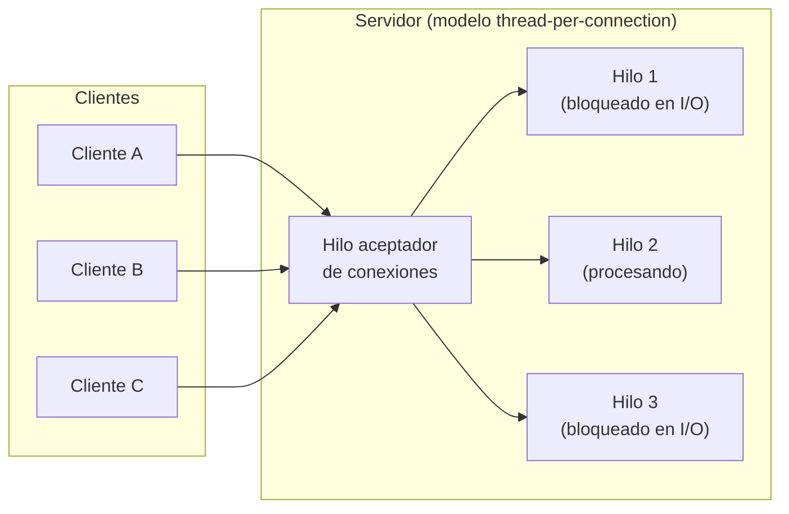
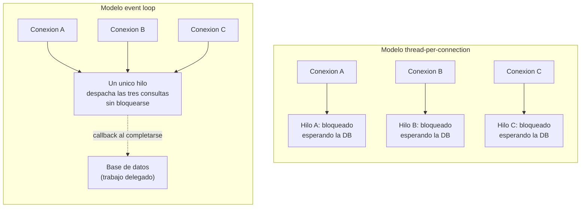
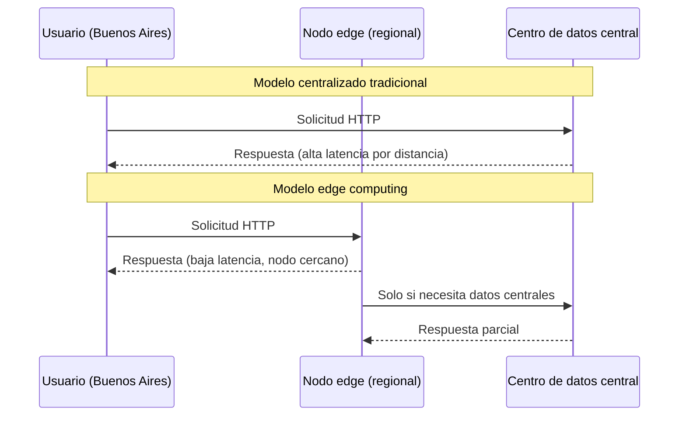

# Webservers — Parte 1

Este apunte aborda la primera gran decisión de diseño detrás de cualquier servidor web: cómo atender múltiples conexiones al mismo tiempo. Se presentan dos modelos de concurrencia enfrentados (el clásico de un hilo por conexión y el asíncrono basado en un bucle de eventos), se introduce la distinción entre trabajo limitado por entrada/salida (input/output, abreviado I/O) y trabajo limitado por procesamiento (CPU) como criterio central para decidir cuál modelo conviene en cada caso, y se cierra con una discusión sobre cómo estas ideas se proyectan en dos tendencias actuales de infraestructura: la computación *serverless* y el *edge computing*.

## Qué hace un webserver al recibir una conexión

Antes de comparar modelos de concurrencia conviene fijar qué problema están resolviendo. Un servidor web es, en su forma más básica, un programa que acepta conexiones entrantes, generalmente sobre el protocolo de transporte TCP, y por cada una de ellas necesita: aceptar la conexión, leer los datos que el cliente envía, procesarlos (interpretar un mensaje HTTP, ejecutar la lógica de la aplicación correspondiente) y devolver una respuesta. Ese ciclo se repite, en producción, para miles o millones de clientes que llegan de forma simultánea o casi simultánea.

La pregunta de diseño es simple de enunciar y compleja de resolver bien: si en un instante dado hay diez mil conexiones abiertas, ¿cómo organiza el servidor el trabajo de atenderlas todas sin que una conexión lenta bloquee o degrade a las demás? Existen, en términos generales, dos respuestas históricas a esta pregunta, y entenderlas bien es la puerta de entrada al resto de la arquitectura de un webserver moderno.

## Un hilo por conexión

La estrategia más directa, y también la más antigua en términos históricos, consiste en asignarle a cada conexión entrante un **hilo de ejecución** (*thread*) dedicado, provisto por el sistema operativo. Un hilo es una unidad de ejecución que el sistema operativo puede planificar de forma independiente dentro de un proceso: tiene su propia pila de llamadas (*call stack*) y su propio registro de estado, aunque comparte memoria con los demás hilos del mismo proceso. Bajo este esquema, conocido habitualmente como **thread-per-connection** (hilo por conexión), el servidor recibe una conexión nueva y, en lugar de atenderla en el hilo principal, la deriva a un hilo propio (idealmente tomado de un *pool* de hilos ya creados, para evitar el costo de crear uno nuevo en cada request) que se encarga exclusivamente de esa conexión durante todo su ciclo de vida.

La lógica detrás de este modelo es atractiva desde el punto de vista de quien programa: dentro de cada hilo, el código se escribe de forma completamente secuencial. Si el procesamiento de un request necesita leer un archivo, consultar una base de datos o esperar una respuesta de otro servicio, el hilo simplemente se detiene (se **bloquea**) hasta que esa operación termina, y luego continúa con la siguiente línea de código como si nada hubiera interrumpido el flujo. No hay que coordinar callbacks, ni preocuparse por en qué momento exacto llegará un dato: el modelo bloqueante es, en ese sentido, el más parecido a cómo se razona un algoritmo paso a paso.

Otra ventaja práctica de este modelo es el **aislamiento**: si el procesamiento de una conexión particular falla o se traba (por ejemplo, si el hilo entra en un bucle infinito o lanza una excepción no controlada), en general esa falla queda contenida dentro de ese hilo y no derriba, por sí sola, la capacidad del servidor de seguir atendiendo al resto de las conexiones activas en otros hilos. Servidores web tradicionales, como Apache HTTP Server en su configuración clásica basada en procesos o hilos (el módulo *mpm_prefork* o *mpm_worker*, según la versión y configuración), se apoyan en variantes de este modelo desde hace décadas, y siguen siendo una opción perfectamente válida para una enorme cantidad de escenarios de producción.

El problema de este enfoque no es conceptual sino de **eficiencia de recursos** a medida que la cantidad de conexiones simultáneas crece. Cada hilo, exista o no trabajo efectivo para hacer en un instante dado, consume memoria: necesita su propia pila de ejecución, que el sistema operativo reserva de antemano, y estructuras de control adicionales para que el planificador pueda gestionarlo. Cuando la cantidad de hilos activos crece, el sistema operativo además debe realizar más **cambios de contexto** (*context switches*), es decir, pausar la ejecución de un hilo, guardar su estado, y cargar el estado de otro hilo para que continúe ejecutándose en la CPU. Ese cambio de contexto no es gratuito: consume tiempo de procesador que no se traduce en ningún trabajo útil para ninguna de las conexiones involucradas.

El costo se vuelve particularmente visible cuando se considera que buena parte del tiempo de vida de una conexión típica no se pasa haciendo cómputo, sino **esperando**: esperando que el cliente termine de enviar el cuerpo del request, esperando la respuesta de una base de datos, esperando que otro servicio remoto conteste. Durante todo ese tiempo de espera, el hilo asignado a esa conexión permanece bloqueado, ocupando memoria y siendo, en principio, candidato a recibir turnos de CPU que no va a aprovechar. Cuantas más conexiones simultáneas sostiene el servidor, más hilos ociosos coexisten, y más se degrada la relación entre recursos consumidos y trabajo útil realizado. Este límite práctico del modelo de hilo por conexión, cuando la cantidad de conexiones concurrentes crece a varios miles, es uno de los antecedentes históricos del problema conocido en la industria como el problema de las diez mil conexiones (documentado extensamente en otro material de esta unidad), que no se desarrolla aquí en detalle porque pertenece al territorio de otro apunte.

El siguiente diagrama esquematiza el modelo de hilo por conexión, destacando el punto central: cada conexión activa implica un hilo del sistema operativo dedicado, sin importar si ese hilo está haciendo cómputo o simplemente esperando una respuesta de I/O.



**Figura 1 — Modelo thread-per-connection.** Un hilo aceptador recibe las conexiones entrantes y delega cada una a un hilo dedicado. La mayoría de esos hilos, en un instante dado, no están haciendo cómputo activo sino esperando el resultado de una operación de entrada/salida, y aun así cada uno consume memoria y participa de la planificación del sistema operativo.

Para dimensionar el costo concreto de este modelo conviene pensar en números aproximados. Un hilo de sistema operativo típico reserva, solo para su pila de ejecución, del orden de uno a varios megabytes de memoria (el valor exacto depende del sistema operativo y de la configuración, pero el orden de magnitud es ilustrativo), incluso si ese hilo nunca ejecuta código propio, porque el sistema operativo necesita reservar ese espacio de antemano. Sostener diez mil conexiones simultáneas bajo un esquema estricto de un hilo por conexión implica, entonces, comprometer varios gigabytes de memoria exclusivamente para pilas de hilos, antes de contar cualquier otro recurso que la aplicación necesite. A esto se suma el costo de planificación: el sistema operativo debe decidir, en cada instante, a qué hilo le corresponde el siguiente turno de CPU, y esa decisión (junto con el cambio de contexto que la acompaña) se vuelve más costosa cuantos más hilos compitan por el mismo recurso limitado, que es el tiempo de procesador disponible.

Esto no significa que el modelo de hilo por conexión sea inadecuado en todo escenario. Para servicios con una cantidad moderada de conexiones concurrentes, o para cargas de trabajo donde cada conexión efectivamente necesita cómputo sostenido (no solo espera por I/O), el modelo sigue siendo perfectamente razonable, y tiene además la ventaja de aprovechar de forma natural múltiples núcleos de CPU: como cada hilo es una unidad de ejecución independiente para el sistema operativo, este puede repartir hilos distintos entre distintos núcleos físicos, logrando paralelismo real sin que la aplicación tenga que gestionarlo de forma explícita. Esa es, de hecho, una limitación práctica que conviene anticipar del modelo de un único hilo con event loop: por definición, ese hilo único no puede, por sí mismo, aprovechar más de un núcleo de CPU. Para escalar horizontalmente en una misma máquina con múltiples núcleos, una aplicación de ese tipo necesita levantar varios procesos independientes, cada uno con su propio hilo principal y su propio event loop, y repartir las conexiones entrantes entre ellos, en lugar de escalar simplemente agregando más hilos dentro del mismo proceso como haría el modelo clásico.

Para ver el modelo thread-per-connection al nivel más bajo posible (la propia interfaz que el sistema operativo expone para trabajar con conexiones de red), conviene mirar un ejemplo mínimo en ANSI C usando **Berkeley sockets**, la API de sockets originada en BSD Unix a comienzos de los años 80 y adoptada luego, con pequeñas variantes, por prácticamente todos los sistemas operativos modernos:

```c
/* server.c — Servidor thread-per-connection minimo en ANSI C
 * con Berkeley sockets. Por cada conexion aceptada se crea un
 * hilo POSIX (pthread) dedicado que la atiende de forma bloqueante
 * e independiente de las demas. */
#include <stdio.h>
#include <stdlib.h>
#include <string.h>
#include <unistd.h>
#include <pthread.h>
#include <arpa/inet.h>
#include <sys/socket.h>
#include <netinet/in.h>

#define PUERTO 8080
#define TAM_BUFFER 1024

void *manejar_conexion(void *arg) {
    int socket_cliente = *(int *)arg;
    free(arg);

    char buffer[TAM_BUFFER];

    /* El hilo se bloquea aca, esperando datos del cliente, sin
     * afectar a los hilos que atienden otras conexiones. */
    ssize_t bytes_leidos = read(socket_cliente, buffer, TAM_BUFFER - 1);
    if (bytes_leidos > 0) {
        buffer[bytes_leidos] = '\0';
        printf("Recibido: %s\n", buffer);
    }

    const char *respuesta =
        "HTTP/1.1 200 OK\r\n"
        "Content-Type: text/plain\r\n\r\n"
        "Hola desde un hilo dedicado\r\n";
    write(socket_cliente, respuesta, strlen(respuesta));

    close(socket_cliente);
    return NULL;
}

int main(void) {
    int socket_servidor;
    struct sockaddr_in direccion;
    int opcion = 1;

    /* socket(): crea el descriptor de socket TCP/IPv4. */
    socket_servidor = socket(AF_INET, SOCK_STREAM, 0);
    if (socket_servidor < 0) {
        perror("socket");
        exit(EXIT_FAILURE);
    }

    setsockopt(socket_servidor, SOL_SOCKET, SO_REUSEADDR, &opcion, sizeof(opcion));

    direccion.sin_family = AF_INET;
    direccion.sin_addr.s_addr = INADDR_ANY;
    direccion.sin_port = htons(PUERTO);

    /* bind(): asocia el socket a un puerto local. */
    if (bind(socket_servidor, (struct sockaddr *)&direccion, sizeof(direccion)) < 0) {
        perror("bind");
        exit(EXIT_FAILURE);
    }

    /* listen(): marca el socket como pasivo, listo para aceptar conexiones. */
    if (listen(socket_servidor, 10) < 0) {
        perror("listen");
        exit(EXIT_FAILURE);
    }

    printf("Servidor escuchando en el puerto %d\n", PUERTO);

    for (;;) {
        struct sockaddr_in direccion_cliente;
        socklen_t tam_direccion = sizeof(direccion_cliente);

        /* accept() bloquea el hilo principal hasta que llega una
         * conexion nueva. */
        int *socket_cliente = malloc(sizeof(int));
        *socket_cliente = accept(socket_servidor,
                                  (struct sockaddr *)&direccion_cliente,
                                  &tam_direccion);
        if (*socket_cliente < 0) {
            perror("accept");
            free(socket_cliente);
            continue;
        }

        /* Se crea un hilo dedicado exclusivamente a esta conexion;
         * el hilo principal vuelve de inmediato a esperar la proxima. */
        pthread_t hilo_cliente;
        pthread_create(&hilo_cliente, NULL, manejar_conexion, socket_cliente);
        pthread_detach(hilo_cliente);
    }

    close(socket_servidor);
    return 0;
}
```

Este ejemplo deja visible, al nivel más elemental, exactamente lo que describe la Figura 1. La secuencia `socket()` → `bind()` → `listen()` prepara el socket pasivo que va a recibir conexiones; `accept()`, dentro del bucle principal, cumple el rol del hilo aceptador y se bloquea hasta que llega un cliente nuevo. Cada llamada a `pthread_create(...)` es la creación explícita de un hilo del sistema operativo dedicado a una única conexión, con su propio flujo de ejecución secuencial y bloqueante (`read()` detiene ese hilo en particular hasta que llegan datos, sin afectar a los demás), mientras el hilo principal vuelve de inmediato a `accept()` para esperar la próxima conexión. Si en un instante dado hay tres mil clientes conectados, este programa tiene, en ese instante, tres mil hilos vivos, cada uno reservando su propia pila de memoria, tal como se discutió más arriba: el código es simple de leer y razonar, pero el costo de recursos escala linealmente con la cantidad de conexiones. No es casualidad que esta misma API de Berkeley sockets sea, por debajo de varias capas de abstracción, la que termina invocando cualquier framework de alto nivel (incluido Node.js) cuando finalmente necesita comunicarse con la red.

## El modelo de event loop

La alternativa que popularizaron plataformas como Node.js (y, con variantes propias, servidores como NGINX) invierte la relación entre hilos y conexiones. En lugar de asignar un hilo por conexión, un único hilo (o un número muy reducido de ellos) se encarga de atender, en principio, todas las conexiones activas del servidor. La pieza que hace posible esto es el **event loop** (bucle de eventos): un ciclo continuo que ejecuta el código de la aplicación cuando hay trabajo pendiente y, cuando ese trabajo se completa, queda a la espera de que se produzcan nuevos eventos (una conexión nueva, datos disponibles para leer en un socket, una operación de disco que terminó) para reanudar la ejecución.

La clave conceptual de este modelo es que ninguna operación de entrada/salida bloquea el hilo principal a la espera de su resultado. Cuando el código de la aplicación necesita leer un archivo, consultar una base de datos o hacer una solicitud a otro servicio, la operación se inicia y el control regresa de inmediato a quien la invocó, sin esperar el resultado; ese resultado se entrega más adelante, cuando esté disponible, mediante un **callback** (una función que se ejecuta como reacción a ese evento) o, en un estilo de escritura más moderno pero equivalente por debajo, mediante una promesa (*promise*) resuelta con `async`/`await`. Mientras tanto, el único hilo de la aplicación queda libre para seguir atendiendo otras conexiones o ejecutando otro código pendiente.

El siguiente fragmento en Node.js contrasta ambos estilos de programación frente a la misma operación (leer un archivo), usando el módulo nativo `fs` (*file system*):

```javascript
// Estilo bloqueante (blocking): el hilo se detiene hasta
// que el archivo termina de leerse por completo.
import fs from 'node:fs';

const data = fs.readFileSync('./config.json');
console.log(data); // solo se ejecuta despues de terminar la lectura
```

```javascript
// Estilo asincrono (non-blocking): la lectura se dispara
// y el control vuelve de inmediato a quien la invoco.
import fs from 'node:fs';

fs.readFile('./config.json', (err, data) => {
  if (err) {
    console.error('No se pudo leer el archivo:', err);
    return;
  }
  console.log(data); // se ejecuta cuando el archivo ya esta disponible
});

console.log('Esta linea se ejecuta antes de que termine la lectura.');
```

Esta diferencia, que a primera vista parece un simple detalle de estilo de programación, tiene una consecuencia arquitectónica profunda: como ninguna operación de I/O retiene el hilo principal mientras espera su resultado, un único hilo puede tener docenas, cientos o miles de operaciones de I/O "en vuelo" simultáneamente, sin necesitar un hilo del sistema operativo por cada una. La concurrencia, en este modelo, no se logra mediante paralelismo real (múltiples hilos ejecutando instrucciones al mismo tiempo en distintos núcleos), sino intercalando en el tiempo, dentro del mismo hilo, la atención de distintas tareas según van estando disponibles sus resultados. Node.js documenta esta idea señalando que su curva de aprendizaje es relativamente plana en la superficie (los patrones de callbacks, promesas y `async`/`await` son razonablemente sencillos de usar), aunque la maquinaria interna que sostiene ese comportamiento asíncrono es considerablemente más compleja.

Una ventaja directa de este modelo es que evita, en gran medida, los costos de memoria y de cambios de contexto que penalizan al modelo de hilo por conexión cuando la cantidad de conexiones simultáneas es alta: no hace falta crear ni mantener un hilo de sistema operativo por cada cliente conectado, porque la espera por I/O no ocupa el único hilo de ejecución de la aplicación. Otra ventaja, señalada de forma recurrente en la discusión pública sobre cuándo conviene adoptar Node.js frente a otras plataformas, es que trabajar con un único hilo de ejecución de JavaScript libera en gran medida al desarrollador de una clase entera de errores de concurrencia (condiciones de carrera, necesidad de sincronizar el acceso a estructuras compartidas mediante mecanismos de exclusión mutua) que sí son un problema constante en plataformas que multiplexan trabajo entre varios hilos que comparten memoria.

El siguiente diagrama compara, de forma esquemática, cómo cada modelo resuelve la llegada de tres conexiones simultáneas, cada una de las cuales dispara una consulta a una base de datos:



**Figura 2 — Tres conexiones concurrentes bajo cada modelo.** En el modelo thread-per-connection, cada conexión inmoviliza un hilo completo mientras espera la respuesta de la base de datos. En el modelo event loop, las tres consultas se despachan desde el mismo hilo, que queda libre de inmediato para seguir atendiendo trabajo mientras las respuestas van llegando de forma asíncrona.

Este modelo también tiene límites, y conviene anticiparlos aquí aunque su desarrollo detallado (el mecanismo interno de demultiplexación de eventos que hace posible este comportamiento, y la arquitectura concreta que usa Node.js para implementarlo) corresponde a otro apunte de esta misma unidad. Lo que sí interesa remarcar en este punto es una limitación conceptual, no de implementación: si el único hilo de la aplicación queda ocupado ejecutando un cálculo largo y puramente de cómputo, ninguna otra conexión puede avanzar mientras tanto, porque no hay ningún otro hilo disponible para atenderla. Esa limitación conecta directamente con la distinción que se desarrolla a continuación.

## I/O bound frente a CPU bound

La pregunta de qué modelo de concurrencia conviene no tiene una respuesta universal: depende de la naturaleza del trabajo que el servidor debe realizar. Para razonar sobre esto de forma precisa conviene distinguir dos categorías de carga de trabajo.

Un programa (o, más específicamente en el contexto de un servidor web, un endpoint concreto de una API) está **limitado por entrada/salida** (*I/O bound*) cuando su tiempo de respuesta depende, principalmente, de la velocidad de algún recurso externo: una consulta a una base de datos, una solicitud de red a otro servicio, una lectura de disco. Durante la mayor parte del tiempo que ese endpoint tarda en responder, la CPU del servidor no está haciendo ningún trabajo útil: simplemente aguarda a que ese recurso externo entregue su resultado. Consultar un registro en una base de datos remota, esperar la respuesta de una pasarela de pagos, o leer un archivo grande desde un disco son ejemplos característicos de trabajo I/O bound.

Un programa está, en cambio, **limitado por CPU** (*CPU bound*) cuando su tiempo de respuesta depende, ante todo, de la capacidad de procesamiento disponible, sin que exista una espera significativa por ningún recurso externo. Calcular dígitos sucesivos de una serie matemática, comprimir una imagen, cifrar un bloque de datos con un algoritmo costoso, o ejecutar un algoritmo de aprendizaje automático sobre un conjunto de datos son ejemplos típicos: en todos estos casos, la CPU está efectivamente ocupada haciendo cómputo durante prácticamente todo el tiempo que dura la operación.

| Aspecto | I/O bound | CPU bound |
|---|---|---|
| Cuello de botella | Velocidad del recurso externo (red, disco, base de datos) | Capacidad de procesamiento del CPU |
| Uso del CPU durante la operación | Bajo: la mayor parte del tiempo se espera, no se procesa | Alto: el CPU está prácticamente saturado |
| Ejemplos típicos | Consultas a bases de datos, llamadas a APIs remotas, lectura de archivos | Cálculos matemáticos intensivos, compresión, cifrado, procesamiento de imágenes |
| Modelo que mejor lo aprovecha | Event loop: mientras se espera, se atiende a otros clientes | Multithreading real, procesos separados, workers |

Esta distinción es la que explica por qué el modelo event loop resulta tan atractivo para servidores web y APIs típicas: en la enorme mayoría de las aplicaciones web, la proporción de tiempo que un request pasa esperando I/O (una consulta a base de datos, una llamada a un servicio externo) es sustancialmente mayor que el tiempo que pasa siendo procesado activamente por la CPU. Si ese tiempo de espera no bloquea ningún recurso escaso (como sí ocurre en el modelo de hilo por conexión), un único hilo puede atender, en la práctica, una cantidad muy grande de conexiones simultáneas sin degradar el rendimiento general del servidor.

Pero esa misma ventaja se convierte en una desventaja cuando el trabajo es efectivamente CPU bound. Si un endpoint de una API realiza un cálculo largo y puramente de cómputo (por ejemplo, calcular de forma recursiva y no optimizada un término alto de la sucesión de Fibonacci, o procesar una imagen de gran tamaño de forma síncrona), ese cálculo ocupa por completo el único hilo disponible mientras dura, y ninguna otra conexión puede avanzar en ese lapso: el modelo que en el caso I/O bound permitía atender miles de clientes con un solo hilo se convierte, frente a una carga CPU bound, en un cuello de botella que afecta a todos los clientes por igual, incluidos aquellos cuyos requests no tienen nada que ver con el cálculo que está bloqueando el hilo.

Esta es precisamente la discusión que plantea un hilo muy citado en Stack Overflow sobre cuándo conviene o no conviene usar Node.js como plataforma de backend: la recomendación general que surge de esa discusión es que Node.js resulta especialmente adecuado para aplicaciones con alta proporción de trabajo I/O bound (servidores que agregan datos de múltiples fuentes remotas, APIs que actúan como intermediarias entre un cliente y varios servicios, aplicaciones en tiempo real con muchas conexiones concurrentes pero poco cómputo por conexión), y resulta, en cambio, una opción menos natural cuando el trabajo central es intensivo en cómputo puro, salvo que ese cómputo se delegue explícitamente fuera del hilo principal. Para esos casos, Node.js ofrece mecanismos como el módulo `worker_threads`, que permite ejecutar código JavaScript en hilos de sistema operativo genuinamente paralelos, separados del hilo principal del event loop, precisamente para no comprometer la capacidad de respuesta del servidor frente a trabajo CPU bound:

```javascript
// server.js — Delegar un calculo intensivo (CPU bound)
// a un worker thread, para no bloquear el event loop
// principal mientras se resuelven otras conexiones.
import { Worker } from 'node:worker_threads';

function computeHeavyTask(payload) {
  return new Promise((resolve, reject) => {
    const worker = new Worker('./heavy-task-worker.js', {
      workerData: payload,
    });
    worker.on('message', resolve);
    worker.on('error', reject);
  });
}

// El hilo principal del event loop sigue libre para atender
// otras conexiones mientras el worker procesa en paralelo.
computeHeavyTask({ size: 4096 }).then((result) => {
  console.log('Resultado del calculo intensivo:', result);
});
```

El criterio, entonces, no es "Node.js siempre" ni "un hilo por conexión siempre", sino identificar, para cada endpoint o cada componente de una arquitectura, si el trabajo dominante es esperar por recursos externos o procesar activamente, y elegir (o combinar) el modelo de concurrencia según corresponda: un modelo asíncrono de un solo hilo para la mayor parte de la lógica de aplicación orientada a I/O, y paralelismo real (procesos separados, hilos de trabajo, o incluso servicios especializados en otra plataforma) para los tramos genuinamente intensivos en cómputo.

En la práctica, conviene formular esta decisión como una serie de preguntas concretas sobre el endpoint o servicio que se está diseñando. ¿Qué proporción del tiempo de respuesta corresponde a esperar por un recurso externo (base de datos, API remota, sistema de archivos) frente a cómputo puro dentro del propio proceso? ¿Ese cómputo, si existe, es lo bastante largo como para bloquear de forma perceptible al resto de las conexiones activas mientras se ejecuta? ¿La carga es predecible y estable, o varía de forma abrupta según el momento del día o la estacionalidad del tráfico? Las respuestas a estas preguntas no solo orientan la elección entre un modelo bloqueante y uno asíncrono, sino que además anticipan si conviene reforzar el modelo elegido con alguna estrategia adicional: un pool de procesos o de hilos de trabajo para absorber los tramos CPU bound dentro de un servicio mayormente I/O bound, o directamente separar ese cómputo pesado en un servicio propio, optimizado y escalado de forma independiente del resto de la aplicación.

## Serverless y edge computing

Las dos secciones anteriores describen modelos de concurrencia dentro de un mismo servidor: cómo ese servidor, una vez que existe y está corriendo, organiza el trabajo entre las conexiones que recibe. Las últimas tendencias de infraestructura de la industria, sin embargo, empujan una pregunta distinta y anterior: ¿quién administra ese servidor, y dónde corre físicamente?

### Funciones como servicio

El modelo **serverless** (literalmente, "sin servidor", aunque el nombre es en cierto modo engañoso: el servidor sigue existiendo, simplemente no lo administra quien escribe el código) desplaza la responsabilidad de aprovisionar, escalar y mantener la infraestructura de ejecución hacia el proveedor de la nube. Quien desarrolla software escribe una función que responde a un evento (una solicitud HTTP, un mensaje en una cola, un archivo subido a un almacenamiento), la sube a una plataforma de **funciones como servicio** (*Function as a Service*, FaaS), y el proveedor se encarga de todo lo demás: aprovisionar el cómputo necesario solo cuando hay una solicitud que atender, escalar automáticamente la cantidad de instancias según la demanda, y facturar, característicamente, según el tiempo de ejecución real consumido y la cantidad de invocaciones, en lugar de cobrar por un servidor que permanece activo (y facturable) todo el tiempo, use o no use recursos.

Esta forma de facturación por ejecución tiene una consecuencia directa sobre el diseño de las funciones: como cada invocación se cobra de forma independiente y el tiempo de ejecución es parte del costo, minimizar la duración de cada invocación (y, en particular, el tiempo de arranque de la función antes de empezar a procesar el request) se vuelve una preocupación central de diseño, algo que no es tan crítico en un servidor tradicional que ya está corriendo y "caliente" desde hace tiempo.

Aquí es donde la discusión sobre modelos de concurrencia desarrollada en las secciones anteriores vuelve a ser relevante, aunque en un plano distinto. Una función serverless típica atiende, generalmente, una solicitud a la vez (o un número acotado de ellas) durante su ciclo de vida, que puede terminar apenas se completa esa solicitud. Ese ciclo de vida corto hace que el tiempo de **arranque en frío** (*cold start*, el tiempo que le toma a la plataforma inicializar una nueva instancia de la función antes de poder procesar la primera solicitud) sea un factor determinante de la latencia percibida. Un runtime con un modelo de ejecución liviano, que no necesite levantar hilos de sistema operativo adicionales ni estructuras pesadas para empezar a atender I/O de forma asíncrona, arranca en frío más rápido que uno que dependa de infraestructura de concurrencia más pesada. El modelo de un único hilo con event loop, precisamente por no requerir la creación de un pool de hilos del sistema operativo para empezar a funcionar, y por ser particularmente eficiente en cargas dominadas por I/O (que es, además, el patrón típico de una función serverless que suele actuar como intermediaria hacia una base de datos u otro servicio), encaja de forma natural con las exigencias de este entorno: no es casualidad que Node.js sea, junto con otros runtimes de arranque liviano, una de las opciones más utilizadas en plataformas de funciones como servicio.

### Cómputo cerca del usuario

El **edge computing** (computación en el borde) es una estrategia complementaria, y en ciertos casos convergente, con el modelo serverless: en lugar de ejecutar el código de la aplicación en un puñado de centros de datos centralizados y geográficamente distantes del usuario, el edge computing distribuye ese cómputo hacia una red de nodos ubicados en el "borde" de la red, físicamente más cerca de donde se origina cada solicitud.

La motivación central de esta estrategia es la **latencia**. Toda comunicación de red está limitada, en última instancia, por la velocidad a la que la información puede viajar entre dos puntos, y esa velocidad tiene un techo físico. Cuanto mayor es la distancia geográfica entre el cliente que hace un request y el servidor que lo atiende, mayor es el tiempo mínimo que ese viaje de ida y vuelta (*round-trip*) va a tomar, sin importar cuán rápido sea el servidor una vez que recibe la solicitud. Si un usuario en Buenos Aires solicita un recurso servido únicamente desde un centro de datos en el norte de Europa, buena parte del tiempo total de respuesta corresponde, simplemente, a la distancia que deben recorrer los datos, no al procesamiento en sí. Distribuir nodos de ejecución en múltiples ubicaciones geográficas y atender cada solicitud desde el nodo más cercano al cliente reduce ese componente de latencia asociado a la distancia.

Las **redes de distribución de contenido** (*Content Delivery Network*, CDN) fueron, históricamente, la primera aplicación extendida de esta idea, aunque limitada en un principio a distribuir contenido estático (imágenes, hojas de estilo, archivos) desde nodos cercanos al usuario. El edge computing extiende esa misma lógica geográfica a la ejecución de **código de aplicación**, no solo a la entrega de archivos: funciones que se ejecutan directamente en los nodos de borde de un proveedor, procesando la solicitud (autenticación, personalización de contenido, transformación de una respuesta) sin necesidad de que esa solicitud viaje hasta un centro de datos central y regrese.

El siguiente diagrama compara, de forma esquemática, el camino que recorre una solicitud en un modelo centralizado tradicional frente a un modelo de edge computing:



**Figura 3 — Comparación de latencia entre un modelo centralizado y edge computing.** En el modelo centralizado toda solicitud viaja hasta un único centro de datos, sin importar la ubicación del usuario. En edge computing, un nodo cercano geográficamente responde directamente a la mayoría de las solicitudes, y solo recurre al centro de datos central cuando necesita información que no está disponible en el borde.

Esta combinación entre serverless y edge computing (a veces referida como *edge functions* por distintos proveedores de nube) exige, otra vez, runtimes de arranque rápido y bajo consumo de recursos por instancia, porque cada nodo de borde suele tener capacidad de cómputo más acotada que un centro de datos central, y necesita poder levantar y bajar instancias de ejecución con mucha frecuencia, a medida que la demanda se desplaza geográficamente a lo largo del día. El mismo razonamiento que hace atractivo al modelo event loop para funciones serverless tradicionales (arranque liviano, buen aprovechamiento de cargas I/O bound, bajo costo de memoria por instancia activa) se aplica, con más fuerza todavía, en el contexto de edge computing, donde los recursos disponibles en cada nodo son, por definición, más limitados que los de un centro de datos completo.

Es importante no perder de vista, sin embargo, que ni serverless ni edge computing eliminan la distinción entre trabajo I/O bound y CPU bound desarrollada en la sección anterior: siguen aplicando exactamente los mismos criterios. Una función serverless o una función de borde que ejecuta un cálculo intensivo de CPU sigue estando limitada por la capacidad de cómputo disponible en esa instancia puntual, y sigue beneficiándose de las mismas estrategias (paralelismo, delegación a servicios especializados) que un servidor tradicional. Lo que cambia es el modelo de administración de la infraestructura subyacente (quién la aprovisiona, dónde corre físicamente, cómo se factura), no las leyes básicas que gobiernan cuándo un modelo de concurrencia de un solo hilo resulta ventajoso y cuándo no.

Para ilustrar cómo se ve esto en código, el siguiente fragmento representa una función típica escrita para correr en un entorno de edge computing: recibe un request HTTP, resuelve la respuesta con datos disponibles localmente en el propio nodo de borde siempre que sea posible, y solo recurre a un servicio central cuando es estrictamente necesario, minimizando así tanto la latencia de red como el tiempo total de ejecución facturable.

```javascript
// edge-function.js — Ejemplo de funcion pensada para un entorno
// de edge computing, con la API estandar de Fetch (Request/Response).
export default {
  async fetch(request) {
    const url = new URL(request.url);
    const cacheKey = url.pathname;

    // Intenta resolver la respuesta con una cache local al nodo
    // de borde, evitando un viaje de red hacia el origen central.
    const cachedResponse = await edgeCache.match(cacheKey);
    if (cachedResponse) {
      return cachedResponse;
    }

    // Solo si no hay dato disponible localmente, se consulta
    // al servicio de origen (mayor latencia, menos frecuente).
    const originResponse = await fetch('https://origin.example.com' + url.pathname);
    const responseBody = await originResponse.text();

    const response = new Response(responseBody, {
      status: originResponse.status,
      headers: { 'Content-Type': 'application/json' },
    });

    await edgeCache.put(cacheKey, response.clone());
    return response;
  },
};
```

Este patrón (resolver localmente cuando sea posible, delegar al origen central solo cuando haga falta) es, en esencia, una extensión geográfica de la misma idea que motiva el modelo event loop dentro de un único servidor: minimizar el tiempo que una solicitud pasa esperando por un recurso lejano, ya sea ese recurso otro hilo de sistema operativo, un disco, o ahora un centro de datos ubicado a miles de kilómetros de distancia. La API `Request`/`Response` que aparece en el ejemplo, estandarizada originalmente para el navegador y adoptada luego por Node.js y por buena parte de las plataformas de funciones de borde, refleja además una convergencia práctica de la industria: cada vez es más habitual que el mismo código de aplicación, escrito contra una API de fetch estándar, pueda ejecutarse indistintamente en un navegador, en un servidor Node.js tradicional o en un nodo de borde, sin reescrituras sustanciales.

## Conclusión

Elegir cómo un servidor atiende múltiples conexiones simultáneas no es una decisión aislada de infraestructura, sino una decisión que depende directamente de la naturaleza del trabajo que ese servidor realiza. El modelo clásico de un hilo por conexión ofrece un modelo de programación simple y aislamiento entre conexiones, a costa de un uso de recursos que se degrada cuando la cantidad de conexiones simultáneas crece y la mayoría de esos hilos pasan buena parte de su tiempo bloqueados esperando I/O. El modelo asíncrono basado en un event loop invierte esa relación: un único hilo puede atender una cantidad mucho mayor de conexiones concurrentes, siempre que el trabajo dominante sea esperar por recursos externos (I/O bound) y no cómputo puro (CPU bound), porque en ese segundo caso el mismo hilo que antes permitía alta concurrencia se convierte en un cuello de botella único para todas las conexiones.

Esta distinción entre I/O bound y CPU bound no es solo una curiosidad teórica: es el criterio práctico que orienta decisiones de diseño concretas, desde qué runtime elegir para un servicio determinado hasta cuándo delegar un cálculo a un hilo de trabajo separado en lugar de ejecutarlo en el hilo principal. Y esa misma lógica se proyecta, a otra escala, sobre dos tendencias centrales de la infraestructura web actual: el modelo serverless, que traslada la administración del servidor al proveedor de la nube y factura por ejecución real, y el edge computing, que además distribuye geográficamente esa ejecución para reducir la latencia asociada a la distancia entre el cliente y el servidor. En ambos casos, un modelo de concurrencia liviano y eficiente para cargas I/O bound, con arranque rápido y bajo consumo de recursos por instancia, resulta particularmente adecuado para el tipo de infraestructura efímera y distribuida que estas arquitecturas exigen.

## Bibliografía consultada

**Referencia curricular:**

- Stack Overflow. *How to decide when to use Node.js*. Hilo de discusión completo, particularmente las respuestas sobre casos de uso I/O bound frente a CPU bound y las limitaciones del modelo single-threaded frente a cómputo intensivo. https://stackoverflow.com/questions/5062614/how-to-decide-when-to-use-node-js

**Especificaciones oficiales y documentación técnica:**

- Node.js. *Introduction to Node.js*, guía oficial "Getting Started". Sección sobre la naturaleza asíncrona de Node.js y la cita sobre la curva de aprendizaje frente a la complejidad interna del runtime. https://nodejs.org/learn/getting-started/introduction-to-nodejs
- Node.js. Documentación oficial del módulo `worker_threads`, sección sobre ejecución paralela de JavaScript para tareas intensivas en cómputo. https://nodejs.org/api/worker_threads.html
- Node.js. Documentación oficial del módulo `fs`, sección sobre las variantes síncronas (`readFileSync`) y asíncronas (`readFile`) de acceso a archivos. https://nodejs.org/api/fs.html
- MDN Web Docs. *Concurrency model and the event loop*, referencia del lenguaje JavaScript. Sección sobre el modelo de un único hilo de ejecución y la naturaleza no bloqueante de las operaciones asíncronas. https://developer.mozilla.org/en-US/docs/Web/JavaScript/Reference/Execution_model
- The Open Group / IEEE. *POSIX.1-2017*, especificaciones de las funciones `socket()`, `bind()`, `listen()`, `accept()` y `pthread_create()`. Referencia de la API de Berkeley sockets y de hilos POSIX usada en el ejemplo de servidor thread-per-connection en ANSI C. https://pubs.opengroup.org/onlinepubs/9699919799/functions/accept.html
