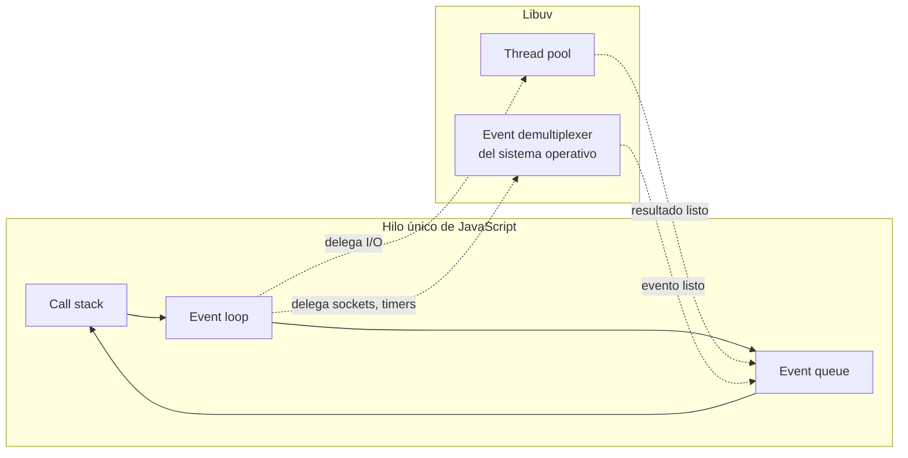
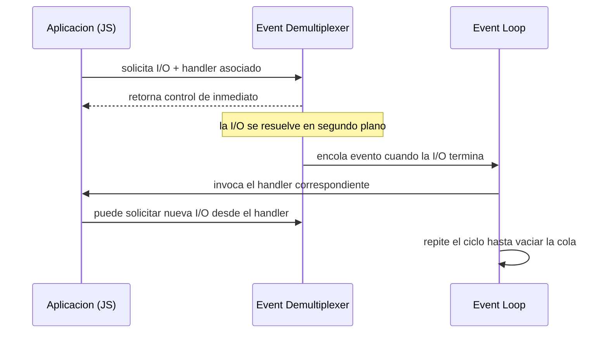
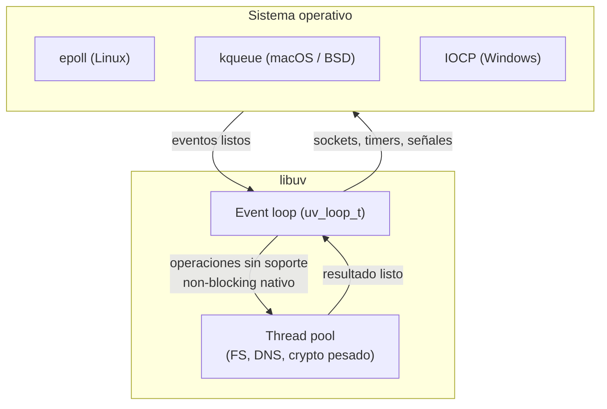

# Webservers — Parte 2

Este apunte continúa el análisis de la arquitectura interna de un servidor web, poniendo la lupa sobre el mecanismo concreto que le permite a un modelo asíncrono atender miles de conexiones sin multiplicar hilos de sistema operativo. Se parte de la distinción entre programación bloqueante (blocking) y no bloqueante (non-blocking input/output, abreviado I/O), se introduce el concepto de event demultiplexing como la pieza que hace viable el segundo modelo a escala, y se describe cómo Node.js aplica todo esto en su arquitectura interna a través del Reactor Pattern. Dos anexos cierran el desarrollo: el problema conocido como C10K, que motivó históricamente esta familia de soluciones, y libuv, la biblioteca en C que implementa el event loop de Node.js por debajo de la capa de JavaScript.

## Por qué la entrada/salida es el cuello de botella

Cualquier programa que interactúa con el mundo exterior (leer un archivo, escribir en una base de datos, enviar datos por la red, esperar la entrada de un usuario) realiza operaciones de entrada/salida, conocidas habitualmente por su sigla en inglés, I/O (Input/Output). Estas operaciones son, por una diferencia de varios órdenes de magnitud, las más lentas que un programa puede ejecutar.

Para dimensionar esa diferencia conviene comparar tiempos de acceso típicos. Acceder a un dato ya presente en memoria RAM toma del orden de 10⁻⁹ segundos (nanosegundos). Acceder a un dato en disco o a través de la red, en cambio, toma del orden de 10⁻³ segundos (milisegundos): una diferencia de aproximadamente un millón de veces. A esto se suma una asimetría adicional dentro de la propia I/O: las operaciones de escritura (*writes*) suelen ser considerablemente más costosas que las de lectura (*reads*), en el orden de cuarenta veces más lentas en discos mecánicos tradicionales, una brecha que se reduce pero no desaparece con almacenamiento de estado sólido.

Es importante precisar en qué consiste exactamente ese costo, porque suele malinterpretarse. La I/O no es costosa en términos de ciclos de CPU: mientras se espera el resultado de una lectura de disco o de una respuesta de red, el procesador no está "trabajando" en ese dato, simplemente aguarda. Lo que la I/O agrega es **demora** (*delay*, o *latencia*) entre el instante en que se invoca la operación y el instante en que el resultado está disponible para seguir procesando. Ese intervalo de espera es, en esencia, tiempo de CPU desperdiciado si no se hace nada útil mientras tanto, y es exactamente el problema que las distintas estrategias de concurrencia que se describen en este apunte intentan resolver.

Esta distinción entre "trabajo de cómputo" y "espera por I/O" da lugar a una clasificación útil para caracterizar el comportamiento de un programa o de un endpoint específico:

| Aspecto | I/O bound | CPU bound |
|---|---|---|
| Cuello de botella | Operaciones de entrada/salida | Procesamiento del CPU |
| Uso del CPU | Subutilizado (esperando I/O) | Prácticamente saturado |
| Ejemplos típicos | Consultas a bases de datos, solicitudes de red, lectura de archivos | Cálculos matemáticos intensivos, procesamiento de imágenes, compresión |
| Estrategia de optimización | Asincronía, *caching*, conexiones persistentes | Paralelismo, algoritmos más eficientes, delegar el cálculo a otro proceso o hilo |
| Impacto sobre la latencia percibida | Depende de la velocidad de la red o del disco | Depende de la velocidad de cómputo disponible |

Un programa está limitado por CPU (*CPU bound*) cuando su rendimiento depende, ante todo, de la capacidad de procesamiento disponible: calcular nuevos dígitos de π es un ejemplo típico, porque el programa solo realiza operaciones aritméticas y no espera ningún recurso externo. Un programa está limitado por I/O (*I/O bound*), en cambio, cuando sería más rápido si el subsistema de entrada/salida involucrado (disco, red, u otro) fuera más veloz: buscar un patrón dentro de un archivo enorme es un ejemplo clásico, aunque cada vez menos representativo a medida que los discos de estado sólido reducen la brecha entre acceso a memoria y acceso a almacenamiento persistente.

Esta clasificación es directamente aplicable al manejo de requests HTTP en un servidor web. Al aceptar una conexión, el webserver establece primero una conexión de transporte con el cliente. Una vez disponibles los datos en el socket, se leen y se interpreta (*parsea*) su contenido, una operación mayormente de cómputo (CPU bound). Esos datos, ya procesados, pasan a la capa de lógica de negocio, y es habitual que allí se disparen nuevas operaciones, esta vez hacia componentes remotos como una base de datos o una caché distribuida, que sí son I/O bound. En una aplicación web típica, la proporción de tiempo dedicado a esas esperas por I/O suele ser sustancialmente mayor que el tiempo de cómputo puro, lo cual vuelve crítico decidir cómo se administra ese tiempo de espera: un servidor que desperdicia recursos de sistema mientras aguarda una respuesta de base de datos está pagando un costo que no se traduce en ningún trabajo útil.

Esta misma distinción resulta valiosa al diseñar un endpoint dentro de una API: identificar si una ruta en particular es I/O bound o CPU bound orienta la estrategia de optimización apropiada. Un endpoint que consulta una base de datos se beneficia de *caching* y de manejar la espera de forma asíncrona; un endpoint que realiza un cálculo pesado se beneficia, en cambio, de paralelismo real (múltiples núcleos, procesos o *workers*) y de algoritmos más eficientes, porque ninguna estrategia de asincronía acelera un cómputo que efectivamente mantiene ocupado al procesador.

## El modelo de I/O bloqueante

El modelo más directo para programar operaciones de entrada/salida es el **bloqueante** (*blocking I/O*). En este modelo, cuando el código invoca una función de I/O, la ejecución del hilo (*thread*, unidad de ejecución que un sistema operativo puede planificar de forma independiente dentro de un proceso) se detiene por completo hasta que la operación termina. Esa espera puede ser de apenas unos milisegundos o extenderse por segundos, incluso minutos, según el recurso involucrado.

El siguiente fragmento en Node.js ilustra el patrón bloqueante usando el módulo nativo `fs` (*file system*) para leer un archivo de forma síncrona:

```javascript
// Ejemplo de I/O bloqueante (blocking) en Node.js.
import fs from 'node:fs';

const data = fs.readFileSync('filename.txt');
// La ejecución se detiene aquí hasta que el archivo
// termine de leerse por completo: se desperdicia
// tiempo de CPU que podría usarse en otra tarea.
console.log(data);
```

`readFileSync` es, según la documentación oficial de Node.js, una operación síncrona: el proceso no continúa hasta que el sistema operativo entrega el contenido completo del archivo. Durante ese intervalo, si este código corriera en el único hilo principal de un servidor, ninguna otra conexión podría ser atendida.

Frente a esta limitación, la estrategia tradicional para manejar concurrencia en un modelo bloqueante es asignar un hilo de sistema operativo por cada conexión entrante, idealmente extraído de un *pool* de hilos ya creados en lugar de crear uno nuevo por cada request, para no bloquear el hilo principal del proceso. Este es, precisamente, el modelo clásico de *thread-per-connection* (hilo por conexión) que caracteriza a servidores tradicionales como Apache en su configuración por defecto.

El problema de este enfoque no es conceptual, sino de eficiencia de recursos. Un hilo que está bloqueado esperando el resultado de una operación de I/O (por ejemplo, una consulta a una base de datos) permanece ocioso: consume memoria (cada hilo requiere su propia pila de ejecución y estructuras de control) y obliga al sistema operativo a realizar cambios de contexto (*context switches*) entre hilos activos e inactivos, un costo no trivial de conmutación que crece con la cantidad de hilos concurrentes. Crear un hilo tampoco es una operación gratuita: implica reservar memoria y registrar la nueva unidad de ejecución ante el planificador del sistema operativo. Por lo tanto, mantener un hilo por conexión durante todo el ciclo de vida de esa conexión, incluidos los largos tramos en que ese hilo no hace nada más que esperar una respuesta de I/O, no es una estrategia eficiente cuando la cantidad de conexiones simultáneas crece.

La pregunta que motiva el resto de este apunte es directa: si mientras se espera una operación de I/O el procesador no tiene nada útil para hacer en ese hilo en particular, ¿por qué no devolver el control de inmediato y ocuparlo en otra tarea, retomando el trabajo original solo cuando el dato esté efectivamente disponible?

## El modelo de I/O no bloqueante

La alternativa al modelo bloqueante es la **entrada/salida no bloqueante** (*non-blocking I/O*). En este modo de operación, la llamada al sistema (*system call*) que solicita una operación de I/O retorna de inmediato, sin esperar a que los datos estén listos. Si el dato aún no está disponible, la llamada devuelve un valor especial que indica esa situación, en lugar de suspender la ejecución del hilo. Un ejemplo histórico y bien documentado de esta técnica es la función `fcntl()` de los sistemas Unix, que permite manipular un descriptor de archivo (*file descriptor*) y marcarlo como no bloqueante mediante el flag `O_NONBLOCK`.

El costo de esta estrategia, sin embargo, es que el código que consume estas operaciones no bloqueantes necesita alguna forma de saber cuándo el dato finalmente está listo. La solución más ingenua es consultar repetidamente el estado de cada recurso dentro de un bucle, patrón conocido como *polling* o *busy-waiting* (espera activa):

```javascript
// Pseudocódigo de busy-waiting sobre un conjunto de recursos.
const resources = [socketA, socketB, socketC];

while (resources.length > 0) {
  for (let i = 0; i < resources.length; i++) {
    const resource = resources[i];
    const data = resource.read(); // intenta leer sin bloquear

    if (data === NO_DATA_AVAILABLE) {
      continue; // todavía no hay nada que leer
    }
    if (data === RESOURCE_CLOSED) {
      resources.splice(i, 1); // se remueve el recurso cerrado
    } else {
      consumeData(data); // se procesa el dato recibido
    }
  }
}
```

El problema de este patrón es evidente: la mayor parte del tiempo, cada recurso consultado no tiene datos disponibles, y sin embargo el bucle sigue consumiendo ciclos de CPU en preguntar una y otra vez. Se evita el bloqueo del hilo, sí, pero a costa de malgastar procesamiento en consultas que casi siempre son negativas. El *busy-waiting* resuelve el problema de no bloquear, pero introduce uno nuevo: desperdicio de CPU proporcional a la frecuencia de sondeo.

## Demultiplexación de eventos

La pieza que faltaba, la solución que los sistemas operativos modernos ofrecen para evitar tanto el bloqueo indefinido como el desperdicio del *busy-waiting*, se conoce como **demultiplexación de eventos** (*event demultiplexing*), implementada mediante lo que suele llamarse un demultiplexador síncrono de eventos o interfaz de notificación de eventos.

La idea central es delegar en el sistema operativo la tarea de vigilar un conjunto de recursos (típicamente descriptores de archivo) y notificar, en un único punto, cuáles de ellos tienen datos listos para ser leídos o escritos. En lugar de que el programa pregunte activamente por cada recurso, el programa se suscribe a un conjunto de recursos y luego se bloquea en una única llamada que solo retorna cuando al menos uno de esos recursos tiene un evento pendiente:

```javascript
// Pseudocódigo del patrón de event demultiplexing.
watchedList.add(socketA, FOR_READ);
watchedList.add(socketB, FOR_READ);

while ((events = demultiplexer.watch(watchedList))) {
  // Este bloque representa una iteración del event loop.
  for (const event of events) {
    // Esta lectura nunca bloquea: el demultiplexer
    // ya garantizó que hay datos disponibles.
    const data = event.resource.read();

    if (data === RESOURCE_CLOSED) {
      demultiplexer.unwatch(event.resource);
    } else {
      consumeData(data);
    }
  }
}
```

Los aspectos clave de este modelo son los siguientes. Primero, los recursos a observar se agregan a una estructura de datos común. Segundo, el demultiplexador se inicializa a partir de esa estructura y permanece bloqueado hasta que al menos un recurso tenga novedades, evitando así el desperdicio de ciclos de CPU del *busy-waiting*. Tercero, cuando se procesan los eventos disponibles, la lectura o escritura sobre cada recurso está garantizada como no bloqueante: el sistema operativo ya confirmó que hay datos, así que la operación se completa de inmediato. Cuando se agotan los eventos pendientes, el demultiplexador vuelve a bloquearse a la espera de nuevas novedades, cerrando el ciclo: esta secuencia de "esperar eventos, procesarlos todos, volver a esperar" es exactamente lo que se conoce como **event loop** (bucle de eventos).

De este modelo se desprenden varias consecuencias que explican por qué es tan atractivo para servidores web con alta concurrencia. Se puede manejar concurrencia real, en el sentido de múltiples operaciones de I/O en curso simultáneamente, utilizando un único hilo de ejecución. Las distintas tareas no corren en paralelo mediante múltiples hilos, sino que se intercalan en el tiempo dentro de ese mismo hilo. Se minimiza el tiempo ocioso, porque el hilo nunca queda bloqueado esperando un recurso individual, sino que espera de forma agregada a que cualquiera de los recursos observados tenga novedades. Y, como consecuencia directa de usar un solo hilo para toda la lógica de aplicación, quien programa contra este modelo queda liberado de lidiar con buena parte de los problemas clásicos de concurrencia con múltiples hilos (condiciones de carrera, necesidad de exclusión mutua sobre estructuras compartidas), porque solo hay un flujo de ejecución de JavaScript corriendo en un momento dado.

Existen distintas implementaciones concretas de esta idea de demultiplexador de eventos según el sistema operativo, un punto que se retoma con más detalle en el segundo anexo de este apunte: `select` y `poll` como interfaces más antiguas y portables, `epoll` en Linux, `kqueue` en macOS y en los sistemas derivados de BSD, y el modelo de puertos de finalización de I/O (*I/O Completion Port*, IOCP) en Windows.

## El event loop en la arquitectura interna de Node.js

Node.js aplica exactamente este modelo de demultiplexación de eventos como núcleo de su modelo de concurrencia. Según la propia documentación oficial del proyecto, Node.js "tiene una curva de aprendizaje bastante plana, pero la maquinaria que lo mantiene funcionando es compleja": la superficie de la API que se usa día a día (`fetch`, callbacks, promesas) es sencilla, pero por debajo coordina varios componentes que conviene distinguir con precisión.

El **event loop** es el mecanismo que le permite a Node.js manejar operaciones asíncronas dentro de un entorno de un solo hilo (*single-threaded*) para la ejecución de JavaScript. Es parte del *runtime* de Node.js y se encarga de tres tareas centrales: gestionar un ciclo que procesa eventos y tareas pendientes de manera continua, ejecutar de forma inmediata el código JavaScript síncrono, y delegar las operaciones asíncronas (sobre todo I/O) a un *thread pool* o directamente al sistema operativo, retomando el procesamiento de los resultados cuando estén disponibles.

Para entender cómo coordina todo esto, conviene identificar cuatro componentes:

- **Call stack** (pila de llamadas): la estructura donde se ejecuta el código JavaScript síncrono. Cuando una función invoca a otra, esta se apila sobre la anterior; cuando termina, se desapila. Mientras el call stack tiene algo pendiente de ejecutar, el event loop no puede atender ningún otro evento.
- **Event queue** (cola de eventos, también llamada cola de callbacks): donde se depositan los *callbacks* correspondientes a operaciones asíncronas que ya se completaron y están listos para ejecutarse en cuanto el call stack quede libre.
- **Thread pool**, gestionado por libuv: un conjunto de hilos de sistema operativo, administrados internamente, que ejecutan aquellas operaciones que el sistema operativo no puede ofrecer de forma verdaderamente no bloqueante (por ejemplo, ciertas operaciones sobre el sistema de archivos) o que son intensivas en cómputo dentro de los módulos nativos de Node.js.
- **Event loop** propiamente dicho: el ciclo que coordina todo lo anterior, ejecutando las tareas ya presentes en el call stack y, cuando este se vacía, tomando el siguiente callback disponible en la event queue para ejecutarlo.

Este esquema explica una afirmación que suele generar confusión entre quienes se inician en Node.js: decir que Node.js es "single-threaded" es preciso únicamente respecto de la ejecución del código JavaScript de la aplicación, que corre siempre en un único hilo. Por debajo, sin embargo, libuv mantiene un *thread pool* propio para delegar ciertas operaciones, y el propio sistema operativo maneja de forma nativa (sin hilos adicionales de Node.js) buena parte de las operaciones de red mediante su demultiplexador de eventos. La documentación oficial de Node.js dedica justamente una guía a las diferencias entre ejecutar JavaScript en Node.js y en un navegador: en ambos casos el modelo de ejecución de JavaScript respeta un único hilo con un event loop, pero el conjunto de APIs disponibles y los detalles del *runtime* por debajo difieren sustancialmente, porque un navegador no necesita, por ejemplo, leer archivos del sistema operativo o abrir sockets TCP arbitrarios.

La especificación de ECMA-262, a través de las definiciones incorporadas en el modelo de ejecución de JavaScript documentado por MDN, describe este comportamiento de forma más general y aplicable tanto a navegadores como a Node.js: JavaScript ejecuta su código en lo que se denomina un *run-to-completion*, es decir, cada función que comienza a ejecutarse corre hasta el final (o hasta una excepción) sin que otra tarea pueda interrumpirla a mitad de camino. Esa garantía es la que hace previsible el comportamiento del event loop: mientras una función síncrona está en el call stack, ninguna otra tarea puede colarse, ni siquiera si su callback ya está listo en la cola.

El siguiente diagrama resume la relación entre estos componentes:



**Figura 1 — Relación entre el event loop de Node.js y libuv.** El código de la aplicación corre en un único hilo, alternando entre el call stack y la event queue. Las operaciones que no pueden resolverse de forma inmediata se delegan a libuv, que utiliza tanto un thread pool interno como el demultiplexador de eventos nativo del sistema operativo, y ambos devuelven sus resultados a la event queue para que el event loop los procese en su próxima vuelta.

Esta arquitectura explica también las ventajas y limitaciones prácticas del modelo. Entre las ventajas, permite una alta concurrencia: un solo hilo puede manejar miles de conexiones simultáneas porque las operaciones de I/O no bloquean ese hilo principal, lo cual hace de Node.js una opción particularmente eficiente para aplicaciones I/O bound, como servidores web o APIs RESTful, donde la mayor parte del tiempo se pasa esperando por bases de datos, red o disco. Además, el modelo de un solo hilo evita buena parte de la complejidad de coordinar múltiples hilos, como las condiciones de carrera (*race conditions*) sobre estructuras compartidas.

Entre las limitaciones, el modelo no es ideal para tareas CPU bound: si un endpoint realiza un cálculo intensivo (por ejemplo, calcular un término alto de la sucesión de Fibonacci de forma recursiva y no memoizada), ese cálculo ocupa el call stack de principio a fin y bloquea el event loop mientras se ejecuta, deteniendo la atención de cualquier otra conexión hasta que termine. Para estos casos, Node.js ofrece el módulo `worker_threads`, que permite ejecutar JavaScript en hilos de sistema operativo genuinamente paralelos, separados del hilo principal:

```javascript
// server.js — Delegar un cálculo intensivo a un worker thread
// para no bloquear el event loop principal.
import { Worker } from 'node:worker_threads';

function runHeavyComputation(input) {
  return new Promise((resolve, reject) => {
    const worker = new Worker('./fibonacci-worker.js', {
      workerData: input,
    });
    worker.on('message', resolve);
    worker.on('error', reject);
  });
}

// El hilo principal sigue libre para atender otras conexiones
// mientras el worker calcula en paralelo.
runHeavyComputation(40).then((result) => {
  console.log('Resultado:', result);
});
```

Otra limitación relevante, documentada por el propio equipo de Node.js en su guía sobre el event loop, los *timers* y `process.nextTick`, es que el event loop no garantiza un orden estrictamente determinista de ejecución de todos los callbacks entre sí: el orden depende de en qué fase del ciclo se complete cada operación asíncrona y de mecanismos de priorización específicos, como `process.nextTick()` o las microtareas de promesas, que se ejecutan antes de continuar con la siguiente fase del event loop. Este es un punto sutil y una fuente frecuente de errores: asumir que dos operaciones asíncronas se resuelven en el mismo orden en que fueron disparadas, sin considerar en qué fase del ciclo cae cada una, puede llevar a comportamientos difíciles de depurar.

## El Reactor Pattern

El **Reactor Pattern** es el patrón de diseño que formaliza el modelo descrito hasta aquí, y es, junto con libuv, uno de los dos bloques de construcción básicos sobre los que se apoya la arquitectura de Node.js. La idea central es asociar un *handler* (una función de callback) a cada operación de I/O, de manera que ese handler sea invocado automáticamente cuando el evento correspondiente se produzca y el event loop lo procese.

El flujo de trabajo del patrón puede describirse en los siguientes pasos:

1. La aplicación inicia una operación de I/O enviando el request al demultiplexador de eventos (*Event Demultiplexer*), especificando además un handler que deberá invocarse cuando esa operación se complete.
2. Como la operación es no bloqueante, el control retorna de inmediato a la aplicación, que queda libre para seguir ejecutando otro código o para registrar nuevas operaciones.
3. Cuando la operación de I/O se completa, el demultiplexador de eventos genera un nuevo evento y lo coloca en la event queue.
4. El event loop, que está iterando continuamente sobre los eventos en cola, toma ese evento en su turno correspondiente.
5. Por cada evento, se invoca su handler asociado.
6. Una vez que el handler termina de ejecutarse, el control regresa al event loop, que puede continuar procesando el resto de los eventos pendientes. Es importante notar que, durante la propia ejecución del handler, pueden dispararse nuevas operaciones de I/O, lo cual generará nuevos eventos que se sumarán a los que ya estaban en cola.
7. Cuando se procesaron todos los eventos disponibles en esa vuelta, el event loop se bloquea nuevamente, a la espera de que el demultiplexador le notifique nuevos eventos.

Este ciclo (delegar la operación, retornar el control, recibir la notificación, invocar el handler) es la esencia del Reactor Pattern, y es exactamente lo que sostiene, por debajo, cada `fs.readFile`, cada request HTTP entrante y cada consulta a base de datos asíncrona que se escribe en Node.js con una función de callback o, sobre esa misma base, con `async`/`await`.



**Figura 2 — Ciclo del Reactor Pattern.** La aplicación nunca queda bloqueada esperando el resultado de una operación de I/O: delega la espera en el demultiplexador de eventos y retoma el control exclusivamente cuando el evento correspondiente ya está listo para procesarse, a través del handler que se registró al inicio.

El Reactor Pattern se apoya, a su vez, en el **patrón de callback** (*callback pattern*), que no es exclusivo de JavaScript. Antes de examinarlo en JavaScript, vale la pena recordar cómo se implementa la misma idea en ANSI C mediante punteros a función, porque expone con crudeza el mecanismo subyacente:

```c
/* Callback pattern implementado con punteros a función en ANSI C. */
typedef void (*OnDataCallback)(void *buffer, size_t size);

void handleSocket(OnDataCallback callback) {
    int ret = recv(socket, cxBuffer, bufferSize, 0);
    if (ret == -1) {
        printf("Error de recepcion: %s\n", strerror(errno));
    }
    callback(cxBuffer, bufferSize);
}
```

En JavaScript, esta misma idea se expresa de forma mucho más directa, porque las funciones son *first-class objects*: pueden asignarse a variables, pasarse como argumento de otra función y devolverse como resultado, algo que en C requiere manipular explícitamente punteros a función (razón por la cual algunos autores consideran a las funciones de C como ciudadanos de "segunda clase" del lenguaje, ya que no pueden crearse dinámicamente en tiempo de ejecución, aunque sí se las puede referenciar mediante punteros). A esto se suma que JavaScript ofrece *closures*: una función interna conserva acceso al ámbito (*scope*) de la función donde fue definida, incluso después de que esta última haya terminado de ejecutarse:

```javascript
// Callback pattern en JavaScript, apoyado en closures.
function addAsync(a, b, callback) {
  setTimeout(() => {
    callback(a + b); // el closure retiene "a" y "b"
  }, 100);
}

addAsync(1, 2, (result) => {
  console.log(result); // imprime 3 una vez transcurridos los 100 ms
});
```

Vale la pena señalar un error frecuente al trabajar con este patrón: como el handler se ejecuta de forma diferida, cualquier suposición sobre el orden relativo entre dos operaciones asíncronas independientes es frágil salvo que el propio código las encadene explícitamente (por ejemplo, con promesas o `async`/`await`, que en definitiva se construyen sobre este mismo mecanismo de callbacks y microtareas). Confundir "se ejecuta eventualmente" con "se ejecuta en el orden en que fue invocado" es una fuente habitual de errores de concurrencia en código asíncrono.

Sobre esta base (Reactor Pattern y libuv) se apoyan además otros componentes que completan la plataforma de Node.js: el motor de JavaScript V8, que compila y ejecuta el código; los *bindings* que exponen APIs de C++ hacia JavaScript; y, por encima de todo esto, los patrones de desarrollo habituales del ecosistema, como el propio patrón de callback recién descrito, las promesas y `async`/`await`.

## Servidores non-blocking en la práctica

Para cerrar la comparación entre modelos, conviene notar que este mismo enfoque de I/O no bloqueante mediante demultiplexación de eventos no es exclusivo de Node.js: es también el modelo interno de NGINX, un servidor web ampliamente utilizado en producción que, frente al modelo de un hilo por conexión de Apache en su configuración clásica, sostiene comparativamente muchas más conexiones concurrentes con un uso de memoria considerablemente menor, precisamente por evitar la creación de un hilo de sistema operativo por cada cliente conectado.

Un ejemplo mínimo de servidor HTTP en Node.js sirve para mostrar dónde exactamente entra en juego este modelo dentro de una aplicación cotidiana:

```javascript
// server.js — Servidor HTTP minimo con el modulo nativo http.
import http from 'node:http';
import fs from 'node:fs';

const server = http.createServer((req, res) => {
  // fs.readFile es no bloqueante: el event loop queda libre
  // para atender otras conexiones mientras se lee el archivo.
  fs.readFile('./index.html', (err, data) => {
    if (err) {
      res.writeHead(500);
      res.end('Error interno del servidor');
      return;
    }
    res.writeHead(200, { 'Content-Type': 'text/html' });
    res.end(data);
  });
});

server.listen(3000, () => {
  console.log('Servidor escuchando en el puerto 3000');
});
```

Cada request entrante dispara una lectura de archivo asíncrona; mientras esa lectura está en curso, delegada a libuv, el hilo principal de Node.js queda disponible para aceptar nuevas conexiones o atender otros requests ya en curso. Ningún hilo nuevo se crea por cada cliente: la concurrencia se logra multiplexando todas las conexiones sobre el mismo hilo de JavaScript, coordinado por el event loop.

## Conclusión

El modelo bloqueante de I/O, con un hilo dedicado por conexión, es conceptualmente sencillo pero escala mal: cada hilo ocioso esperando una operación de red o de disco consume memoria y genera cambios de contexto que no se traducen en trabajo útil. El modelo no bloqueante resuelve el desperdicio de tiempo de espera, pero por sí solo introduce el problema del *busy-waiting* si se lo implementa mediante sondeo activo. La pieza que cierra el círculo es la demultiplexación de eventos: delegar en el sistema operativo la tarea de vigilar múltiples recursos y notificar en bloque cuáles tienen novedades, evitando tanto el bloqueo indefinido como el sondeo constante.

Node.js construye su arquitectura interna exactamente sobre esta idea, formalizada como Reactor Pattern: un único hilo ejecuta el código JavaScript de la aplicación, mientras libuv coordina, por debajo, tanto el demultiplexador de eventos del sistema operativo como un thread pool propio para las operaciones que no admiten una versión verdaderamente no bloqueante. Entender esta separación (qué corre en el hilo de JavaScript, qué se delega a libuv, y cuándo conviene recurrir a paralelismo real con `worker_threads`) es la base para diagnosticar problemas de rendimiento habituales en servidores Node.js, como un event loop bloqueado por un cálculo síncrono demasiado costoso.

## Anexo 1 — El problema C10K

El término **C10K** proviene del título de un artículo influyente de Dan Kegel, publicado originalmente a fines de los años 90 y actualizado durante la década siguiente, que planteaba una pregunta concreta: ¿puede un servidor web atender **diez mil clientes simultáneos** (de ahí el nombre, *ten thousand clients*) sobre hardware convencional? En el momento en que Kegel escribió el artículo, la respuesta práctica era, en general, negativa para la mayoría de las arquitecturas de servidor entonces dominantes, y el problema se convirtió en una referencia habitual para discutir los límites de escalabilidad de un webserver.

La raíz del problema es exactamente el modelo de *thread-per-connection* descrito en el cuerpo de este apunte. Si un servidor asigna un hilo de sistema operativo (o, en arquitecturas todavía más costosas, un proceso completo) por cada conexión entrante, sostener diez mil conexiones simultáneas implica sostener diez mil hilos vivos al mismo tiempo. Aun si la mayoría de esas conexiones están, en un instante dado, ociosas esperando el próximo dato del cliente o una respuesta de un componente remoto, el sistema operativo igual debe reservar memoria para la pila de cada hilo y planificar su ejecución, incluyendo el costo de los cambios de contexto entre ellos. A partir de cierto número de hilos concurrentes, ese costo administrativo empieza a superar al trabajo útil que el servidor efectivamente realiza, y el rendimiento se degrada de forma pronunciada mucho antes de agotar otros recursos, como el ancho de banda de red disponible.

La solución que Kegel documenta, y que terminó consolidándose como el enfoque estándar de la industria, es exactamente la combinación de I/O no bloqueante y demultiplexación de eventos: en lugar de un hilo por conexión, un número reducido de hilos (en el caso extremo, uno solo) que utiliza mecanismos del sistema operativo como `select`, `poll`, `epoll` (en Linux) o `kqueue` (en BSD y macOS) para vigilar miles de sockets simultáneamente y ser notificado únicamente cuando alguno de ellos tiene datos disponibles. Bajo este esquema, la cantidad de conexiones concurrentes deja de estar directamente acoplada a la cantidad de hilos de sistema operativo necesarios, lo cual es precisamente lo que permite escalar más allá de las diez mil conexiones que le dan nombre al problema.

Node.js, NGINX y buena parte de los servidores web modernos de alto rendimiento adoptan esta misma estrategia como base de su diseño, en lugar del modelo clásico de hilo por conexión de servidores más antiguos. Esto no significa que el problema C10K haya "desaparecido": con el crecimiento sostenido del tráfico web, la misma pregunta se volvió a plantear en escalas mayores (a veces bajo el nombre C10M, un millón de conexiones concurrentes), pero la solución de fondo sigue siendo la misma familia de técnicas descriptas por Kegel: minimizar la cantidad de hilos de sistema operativo necesarios por conexión activa, apoyándose en la capacidad del sistema operativo de multiplexar eventos de I/O de forma eficiente.

## Anexo 2 — libuv

**libuv** es la biblioteca escrita en lenguaje C que implementa, por debajo de la capa de JavaScript, el event loop de Node.js. Según su documentación oficial de diseño, fue desarrollada originalmente como parte del proyecto Node.js para abstraer las diferencias entre los distintos mecanismos de demultiplexación de eventos que ofrece cada sistema operativo: `epoll` en Linux, `kqueue` en macOS y en los sistemas derivados de BSD, `event ports` en illumos/Solaris, y los puertos de finalización de I/O (*I/O Completion Ports*, IOCP) en Windows. Sin esta capa de abstracción, el propio Node.js debería reimplementar su lógica de manejo de eventos para cada plataforma soportada.

Una razón adicional que justifica la existencia de libuv, más allá de unificar interfaces distintas entre sistemas operativos, es que un mismo sistema operativo puede comportarse de forma inconsistente entre distintos tipos de recursos. Un caso documentado explícitamente en la propia guía de libuv es el de ciertas operaciones sobre el sistema de archivos en Linux, que no admiten una versión verdaderamente no bloqueante a través de los mecanismos estándar de demultiplexación de eventos del sistema operativo. Para simular un comportamiento no bloqueante en esos casos, libuv recurre a un **thread pool** interno: delega la operación bloqueante a uno de esos hilos internos, y notifica a la aplicación cuando el resultado está listo, exactamente con la misma interfaz de evento que usaría para una operación de red genuinamente no bloqueante. De este modo, desde el punto de vista de quien escribe código JavaScript, una lectura de archivo y una lectura de socket se comportan de forma equivalente (ambas son asíncronas y no bloqueantes), aunque su implementación interna en libuv sea distinta: la segunda se resuelve mediante el demultiplexador nativo del sistema operativo, y la primera mediante un hilo del thread pool.

La arquitectura interna de libuv puede resumirse en dos grandes componentes que trabajan en conjunto:

- El **event loop** propiamente dicho, que en términos de la biblioteca se representa mediante el tipo `uv_loop_t`, y que recorre de forma cíclica las distintas fases de procesamiento: *timers* vencidos, callbacks pendientes, callbacks de I/O, y así sucesivamente, según describe la guía oficial de libuv.
- El **thread pool**, un conjunto acotado de hilos de sistema operativo (cuatro por defecto, configurable mediante una variable de entorno según la documentación oficial) reservado para las operaciones que no pueden resolverse de forma no bloqueante mediante el demultiplexador nativo: ciertas operaciones de sistema de archivos, resolución de nombres DNS mediante `getaddrinfo`, y algunas rutinas criptográficas costosas en CPU que Node.js expone en su módulo `crypto`.

El siguiente diagrama esquematiza esta arquitectura, ya introducida en la Figura 1 pero ahora con el detalle interno de libuv:



**Figura 3 — Arquitectura interna de libuv.** El event loop de libuv delega dos tipos de trabajo por caminos distintos: las operaciones que el sistema operativo puede resolver de forma no bloqueante (sockets, timers) se envían al demultiplexador nativo de la plataforma, mientras que las que no tienen esa garantía (ciertas operaciones de sistema de archivos, resolución DNS, criptografía costosa) se delegan al thread pool interno de la propia biblioteca.

Un ejemplo mínimo tomado de la guía oficial de libuv, escrito directamente en C, muestra cómo se inicializa y se ejecuta un event loop utilizando la biblioteca:

```c
#include <stdio.h>
#include <stdlib.h>
#include <uv.h>

int main() {
    uv_loop_t *loop = malloc(sizeof(uv_loop_t));
    uv_loop_init(loop);

    /* Aqui se registrarian los handlers para sockets, */
    /* archivos o timers que el loop debe procesar. */

    uv_run(loop, UV_RUN_DEFAULT);
    uv_loop_close(loop);
    free(loop);
    return 0;
}
```

`uv_run` es la llamada que efectivamente pone en marcha el ciclo: procesa los eventos pendientes, invoca sus handlers asociados y, en el modo `UV_RUN_DEFAULT`, continúa ejecutándose mientras existan handlers activos registrados en el loop. Este es, en definitiva, el mecanismo concreto sobre el que se apoya el Reactor Pattern descripto en el cuerpo del apunte: cada `fs.readFile`, cada socket TCP y cada `setTimeout` de una aplicación Node.js termina traduciéndose, por debajo de la capa de JavaScript, en una llamada equivalente sobre esta misma API de libuv.

Entender esta capa no es un ejercicio puramente académico: explica, entre otras cosas, por qué ciertas operaciones de sistema de archivos en Node.js pueden saturar el thread pool si se ejecutan en cantidad (por ejemplo, muchas lecturas de archivo concurrentes en un servidor con alta carga), un límite que no aplica de la misma manera a las operaciones de red, que se resuelven a través del demultiplexador nativo del sistema operativo sin consumir hilos del pool.

## Bibliografía consultada

- Kegel, D. *The C10K problem*. Sección completa del artículo, particularmente la introducción al problema y la comparación de mecanismos de I/O (`select`, `poll`, `epoll`, `kqueue`). https://www.kegel.com/c10k.html
- Node.js. *Introduction to Node.js*, guía "Getting Started". Sección sobre la naturaleza asíncrona y no bloqueante de Node.js. https://nodejs.org/learn/getting-started/introduction-to-nodejs
- MDN Web Docs. *JavaScript execution model*, referencia del lenguaje JavaScript. Sección sobre *run-to-completion*, call stack y cola de tareas. https://developer.mozilla.org/en-US/docs/Web/JavaScript/Reference/Execution_model
- Node.js. *The Node.js event loop, timers, and process.nextTick()*, guía "Asynchronous work". Secciones sobre las fases del event loop y el orden de ejecución de callbacks. https://nodejs.org/learn/asynchronous-work/event-loop-timers-and-nexttick
- Node.js. *Differences between Node.js and the browser*, guía "Getting Started". Sección sobre APIs disponibles y modelo de ejecución de JavaScript en cada entorno. https://nodejs.org/learn/getting-started/differences-between-nodejs-and-the-browser
- libuv. *Design overview*, documentación oficial v1.x. Sección sobre la arquitectura del event loop y la abstracción de demultiplexadores de eventos por plataforma. https://docs.libuv.org/en/v1.x/design.html
- libuv. *Guide*, documentación oficial v1.x. Secciones sobre `uv_loop_t`, `uv_run` y el thread pool. https://docs.libuv.org/en/v1.x/guide.html
- Material de cátedra (Google Slides, unidad "Webservers"). Apuntes existentes: https://docs.google.com/presentation/d/1-pn0uaXetNM4C0_CqxZqblPrm3Ukszti/edit?usp=drive_link&ouid=115719858704539729206&rtpof=true&sd=true. Porción correspondiente a Webservers Parte 2: I/O bound y CPU bound, blocking y non-blocking I/O, event demultiplexing, event loop y componentes internos de Node.js, Reactor Pattern y libuv.
