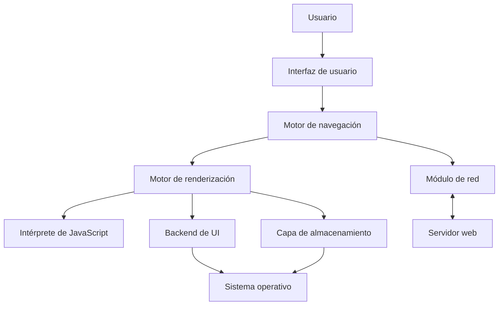
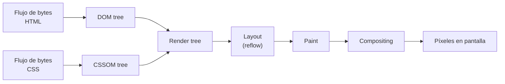
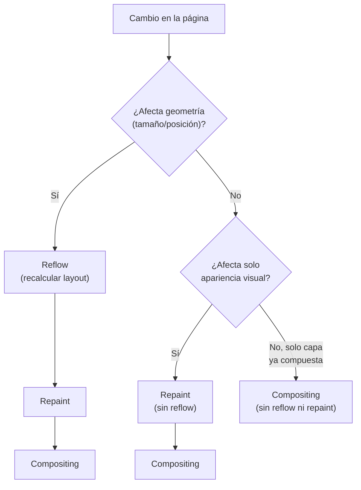

# Browsers — Parte 1

Como desarrolladores web pasamos gran parte del tiempo pensando en lo que ocurre en el servidor: qué endpoint exponer, cómo estructurar una respuesta, qué código de estado devolver. Pero la otra mitad de la arquitectura web vive del lado del cliente, dentro del navegador, y ese componente rara vez se explica con el mismo detalle con el que se explica un servidor HTTP. Entender la arquitectura interna de un navegador (sus componentes, su motor de renderización y el proceso que convierte HTML y CSS en píxeles) no es un ejercicio académico: explica por qué ciertas prácticas de desarrollo son recomendadas y otras penalizan el rendimiento. Este apunte cubre la funcionalidad principal del navegador, su rol dentro de la arquitectura cliente-servidor, los componentes internos con foco en el motor de renderización, y el fenómeno de **reflow** (recálculo de layout), central para entender el costo de ciertas operaciones sobre la página.

## Qué es un navegador y cuál es su función principal

Un **navegador web** (*browser*) es una aplicación cliente cuya función principal es solicitar, procesar, renderizar e interactuar con recursos web (HTML, CSS, JavaScript, imágenes, fuentes, video, etc.) obtenidos de servidores remotos. El navegador interpreta y ejecuta esos recursos siguiendo estándares web abiertos, y como resultado presenta una interfaz gráfica dinámica e interactiva. En la terminología de las especificaciones web, el navegador es el **user agent** por excelencia: el software que actúa "en nombre" del usuario para acceder a la Web, término que usan tanto las especificaciones HTTP como las de HTML para referirse a cualquier cliente que consume contenido web, sea un navegador de escritorio, uno móvil, un lector de pantalla o un rastreador automatizado (*crawler*).

La forma en que un navegador interpreta y muestra un documento HTML no queda librada a la implementación de cada fabricante: está definida en las especificaciones de HTML y CSS que mantiene el **W3C** (World Wide Web Consortium) en conjunto con el **WHATWG** (Web Hypertext Application Technology Working Group), que es hoy quien mantiene el HTML Living Standard. Que estas reglas estén estandarizadas es lo que permite que una misma página, en principio, se vea y se comporte de manera equivalente en distintos navegadores: sin una especificación común, cada fabricante interpretaría el marcado a su manera y la Web como plataforma interoperable dejaría de tener sentido.

Vale la pena notar que ningún navegador implementa el 100% de cada especificación de la misma forma ni al mismo tiempo. Las especificaciones evolucionan de forma continua, y cada motor de renderización adopta las nuevas funcionalidades a un ritmo propio, con matices de implementación que a veces generan diferencias de comportamiento observables entre navegadores. Por eso la elección de qué navegador soportar prioritariamente en un proyecto real suele apoyarse en datos de **cuota de mercado** (*market share*), información que sitios como StatCounter publican de forma agregada y que ayuda a decidir, por ejemplo, cuánto esfuerzo dedicar a compatibilidad con un motor minoritario, o si conviene usar una funcionalidad reciente de CSS sin un mecanismo de reserva (*fallback*) para navegadores más antiguos.

Esta tensión entre estandarización e implementación real es una constante en la historia de la Web. Durante buena parte de los años 2000, las diferencias de interpretación entre motores (particularmente entre Internet Explorer y el resto) obligaron a los desarrolladores a escribir código específico por navegador, una práctica costosa que las especificaciones modernas y la mayor adhesión a los estándares por parte de los fabricantes buscan minimizar. Hoy, gracias en gran parte a la convergencia hacia motores compartidos (como el hecho de que Edge adoptó Blink en lugar de mantener su propio motor Trident/EdgeHTML), la superficie de incompatibilidades reales entre navegadores mayoritarios es sensiblemente menor que hace una década, aunque no ha desaparecido del todo.

### Objetivos de diseño de un navegador

Más allá de renderizar contenido, un navegador moderno persigue dos objetivos que condicionan buena parte de su arquitectura interna:

- **Minimizar la latencia percibida por el usuario**: el tiempo que transcurre entre solicitar un recurso y mostrarlo en pantalla. Esto explica por qué el navegador no espera a tener el documento HTML completo para empezar a construir la página (como se detalla más adelante), y por qué existen mecanismos de precarga especulativa de recursos.
- **Gestionar su naturaleza mayormente de un solo hilo** (*single-threaded*): buena parte del trabajo de parsing, layout, pintado y ejecución de JavaScript compite por el mismo hilo principal (*main thread*), lo que obliga a optimizar cuidadosamente qué tareas se ejecutan y cuándo, para no bloquear la interfaz.

## El navegador dentro de la arquitectura cliente-servidor

El navegador es, ante todo, el **cliente** en el modelo cliente-servidor que estructura la Web. Opera enviando solicitudes y procesando respuestas según el protocolo **HTTP** (o su variante segura, HTTPS), y se apoya en protocolos de capas inferiores para que esa comunicación sea posible:

- **DNS** para resolver el nombre de dominio de una URL (por ejemplo `example.com`) a una dirección IP.
- **TCP/IP** (o **QUIC** en HTTP/3) para transportar los datos de manera confiable entre cliente y servidor.
- **TLS** para cifrar la comunicación cuando se usa HTTPS.

El ciclo básico de interacción es el patrón **request/response**: el navegador envía una solicitud HTTP (`GET`, `POST`, etc.) especificando un recurso, y el servidor responde con ese recurso (un documento `index.html`, un archivo JavaScript, una respuesta JSON de una API, una imagen) junto con metadatos en forma de encabezados (*headers*), incluyendo el tipo de contenido y su código de estado.

### El costo de establecer la conexión

Antes de que el navegador reciba el primer byte de contenido útil, debe completarse una secuencia de intercambios de red que introduce latencia acumulada:

1. **Resolución DNS**: traducir el nombre de host a una dirección IP. Solo es necesaria una vez por nombre de host único (los resultados se cachean), pero en el peor caso implica un viaje completo hasta un servidor DNS.
2. **Establecimiento de la conexión TCP**: mediante el protocolo de negociación de tres pasos (*three-way handshake*, `SYN` → `SYN-ACK` → `ACK`), que agrega otro viaje de ida y vuelta (*round-trip*) completo antes de poder enviar datos de aplicación.
3. **Negociación TLS** (si la conexión es HTTPS): implica intercambios adicionales para acordar el algoritmo de cifrado, verificar el certificado del servidor y establecer las claves de sesión.

Solo después de completados estos pasos el navegador puede enviar la solicitud HTTP real y comenzar a recibir la respuesta. Este acumulado de round-trips previos es una de las razones por las que técnicas como la reutilización de conexiones (`keep-alive`), la reducción de dominios distintos a resolver, o el uso de versiones más recientes del protocolo HTTP inciden directamente en el tiempo de carga percibido, aunque el detalle de esas técnicas de optimización excede el alcance de este módulo.

Una vez que la conexión está lista y la solicitud enviada, el servidor responde con los primeros bytes del documento. Esta primera respuesta suele rondar los 14 KB de datos HTML en la práctica: es el volumen aproximado de datos que cabe en los primeros paquetes TCP antes de que el mecanismo de **control de congestión** (*congestion control*) permita enviar más. TCP arranca de forma conservadora (fase conocida como *slow start*): la ventana de congestión (*congestion window*, CWND) se inicializa en un número reducido de segmentos de tamaño máximo (*maximum segment size*, MSS, típicamente 1500 bytes sobre Ethernet) y se va duplicando con cada confirmación (`ACK`) recibida, hasta que detecta congestión, momento en el que se reduce a la mitad. Esto explica por qué incluir el HTML, CSS y JavaScript crítico dentro de ese presupuesto inicial de bytes es una práctica de optimización real: todo lo que exceda ese primer envío debe esperar a una ronda adicional de confirmaciones antes de llegar al cliente.

El tiempo transcurrido entre el envío de la solicitud y la recepción del primer byte de la respuesta se conoce como **TTFB** (*Time to First Byte*), una de las métricas de rendimiento más básicas para diagnosticar si la lentitud de una página se origina en el servidor (procesamiento, base de datos) o en la red (distancia geográfica, congestión).

### Ciclo de vida de cargar una página

Una vez que el servidor responde, el navegador entra en un ciclo que puede resumirse en tres grandes fases, que en la práctica se solapan entre sí en lugar de ejecutarse estrictamente en secuencia:

1. **Solicitud de recursos**: el navegador pide el documento HTML principal y, a medida que lo va procesando, descubre y solicita recursos adicionales referenciados en el marcado (hojas de estilo CSS, scripts, imágenes, fuentes tipográficas). Muchas de estas solicitudes secundarias se disparan en paralelo apenas el analizador (*parser*) encuentra la referencia correspondiente, sin esperar a que el documento termine de descargarse.
2. **Procesamiento de los recursos recibidos**: el HTML se convierte en una estructura de datos manipulable en memoria (el **DOM**, que se explica en la sección siguiente), el CSS se convierte en su equivalente de estilos (el **CSSOM**), y el JavaScript se parsea y, según cómo esté referenciado, se ejecuta de inmediato o se difiere.
3. **Renderizado**: el navegador combina la estructura y los estilos procesados para calcular qué se debe dibujar, dónde y cómo, y finalmente presenta los píxeles resultantes en pantalla.

Esta secuencia no es un evento único sino un proceso continuo y progresivo. El navegador no espera a tener todo el documento HTML analizado para empezar a construir el árbol de renderizado: procesa el marcado de forma incremental y va mostrando partes del contenido a medida que están disponibles, lo cual es clave para que el usuario perciba la página como responsiva incluso mientras siguen llegando recursos por la red.

## Componentes del navegador

Un navegador no es un programa monolítico sino un conjunto de componentes con responsabilidades bien delimitadas que colaboran entre sí. Aunque la implementación concreta varía entre fabricantes, la arquitectura de alto nivel de la mayoría de los navegadores modernos comparte los siguientes bloques:

- **Interfaz de usuario** (*user interface*): todo lo que el usuario ve y con lo que interactúa fuera del contenido de la página en sí: la barra de direcciones, los botones de retroceder/avanzar, el menú de marcadores, las pestañas. Es la capa más visible pero, en términos de arquitectura, la más superficial.
- **Motor de navegación** (*browser engine*): actúa como coordinador entre la interfaz de usuario y el motor de renderización. Es quien traduce las acciones del usuario (por ejemplo, escribir una URL y presionar Enter) en instrucciones concretas para el resto de los componentes.
- **Motor de renderización** (*rendering engine*): el componente responsable de mostrar el contenido solicitado, transformando HTML y CSS en una representación visual. Es el foco central de este apunte y se desarrolla en detalle en la sección siguiente.
- **Módulo de red** (*networking*): responsable de las operaciones de red, como las solicitudes HTTP/HTTPS, la resolución DNS y la gestión de la caché de recursos.
- **Backend de interfaz de usuario** (*UI backend*): dibuja los widgets básicos de la interfaz (cuadros combinados, botones, ventanas), apoyándose en los métodos nativos del sistema operativo sobre el que corre el navegador. Esta capa es la que explica, por ejemplo, por qué un elemento `<select>` puede lucir ligeramente distinto en Windows, macOS o Android: el backend de UI delega en los widgets nativos de cada plataforma.
- **Intérprete de JavaScript** (*JavaScript engine*): parsea y ejecuta el código JavaScript de la página. Ejemplos concretos son **V8** (usado por Chrome, Edge y Node.js), **SpiderMonkey** (usado por Firefox) y **JavaScriptCore** (usado por Safari). Este motor sigue la especificación **ECMA-262** que define el lenguaje JavaScript (formalmente, ECMAScript).
- **Capa de almacenamiento** (*data storage*): la persistencia local que el navegador ofrece a las páginas web, por ejemplo cookies, `localStorage`, `sessionStorage`, IndexedDB y, en navegadores más antiguos, WebSQL (hoy obsoleto). Estas APIs están descritas en las especificaciones correspondientes del W3C/WHATWG, como la de *Web Storage*.

Un detalle de implementación relevante: en navegadores como Chrome, cada pestaña suele ejecutar su propia instancia del motor de renderización en un proceso separado del sistema operativo (lo que Chromium llama *site isolation*). Esto aísla fallos (una pestaña que se cuelga no debería tumbar el navegador completo), acota el impacto de vulnerabilidades de seguridad a un único proceso, y permite aprovechar múltiples núcleos de CPU distribuyendo pestañas entre ellos. La contrapartida es un consumo de memoria mayor que el de una arquitectura de un único proceso, ya que cada proceso de renderización mantiene su propia copia de buena parte del estado del motor.

Conviene distinguir con precisión los términos **navegador** (*browser*), **motor de navegación** (*browser engine*) y **motor de renderización** (*rendering engine*), que en el uso cotidiano suelen mezclarse. El navegador es la aplicación completa que el usuario instala y usa. El motor de renderización es específicamente el subsistema que convierte HTML/CSS en píxeles (Blink, Gecko, WebKit). El motor de navegación es la capa intermedia, más delgada, que conecta la interfaz de usuario con el motor de renderización y coordina, por ejemplo, la navegación entre páginas, el historial y las pestañas. Un mismo motor de renderización puede ser reutilizado por navegadores distintos: Chrome, Edge, Opera y Brave comparten Blink, aunque cada uno construye su propia interfaz de usuario, sus propias funcionalidades adicionales y, en algunos casos, su propio motor de navegación por encima de ese motor de renderización compartido.

La siguiente figura resume estos componentes y cómo se relacionan entre sí y con el exterior (servidor y sistema operativo).



**Figura 1 — Componentes del navegador.** El motor de navegación coordina la interfaz de usuario con el motor de renderización, que a su vez se apoya en el intérprete de JavaScript, el backend de UI y la capa de almacenamiento. El módulo de red es quien media toda la comunicación con el servidor mediante HTTP/HTTPS.

## El motor de renderización

El **motor de renderización** (*rendering engine*) es el componente que transforma los recursos HTML y CSS (y, en ciertos casos, imágenes) en la representación visual que el usuario ve en pantalla. Interpreta el marcado y los estilos según las especificaciones del W3C y coordina su trabajo con el intérprete de JavaScript y el módulo de red para producir una interfaz dinámica.

Los tres motores de renderización dominantes hoy son:

- **Blink**: desarrollado por Google, es el motor usado por Chrome, Microsoft Edge (desde su migración a Chromium) y Opera. Es un fork de WebKit, separado en 2013.
- **Gecko**: el motor de Mozilla, usado por Firefox.
- **WebKit**: desarrollado originalmente por Apple (basado a su vez en KHTML), usado por Safari y otros navegadores del ecosistema de Apple.

Aunque cada motor tiene su propia implementación interna, todos siguen conceptualmente el mismo proceso de alto nivel para convertir marcado en píxeles, conocido habitualmente como el **camino crítico de renderizado** (*critical rendering path*). Este proceso puede describirse en las siguientes etapas.

### Parsing y construcción del DOM y el CSSOM

El motor recibe el documento HTML como un flujo de bytes y lo convierte, en dos pasos, en una estructura de datos manipulable:

- **Tokenización**: es el análisis léxico del marcado, el proceso de reconocer y convertir la entrada en unidades discretas llamadas *tokens*. Entre los tokens HTML están las etiquetas de apertura, las de cierre y los valores de atributos. El tokenizador reconoce un token, lo envía al constructor del árbol, y avanza al siguiente carácter para reconocer el token siguiente, repitiendo el proceso hasta el final del documento.
- **Construcción del árbol**: los tokens se organizan en una estructura jerárquica de nodos: el **DOM** (*Document Object Model*), donde cada elemento HTML (`<div>`, `<p>`, `<script>`, etc.) se convierte en un nodo del árbol, con la etiqueta `<html>` como raíz.

Un detalle importante de HTML frente a otros lenguajes formales: su gramática **no es libre de contexto** (*not context-free*) en el sentido estricto, y los analizadores no pueden aplicarle las técnicas de parsing convencionales que sí funcionan con lenguajes más regulares. HTML es, además, deliberadamente tolerante a errores: si el marcado está mal formado (una etiqueta de cierre incorrecta como `</br>`, una tabla mal anidada, elementos sin cerrar), el navegador corrige el problema silenciosamente y continúa el análisis en lugar de detenerse con un error, tal como describe la propia especificación de parsing del HTML Living Standard del WHATWG. Esta tolerancia es una decisión de diseño deliberada, pensada para que documentos imperfectos (que abundan en la Web real) sigan siendo utilizables.

En paralelo, el motor procesa las hojas de estilo CSS (ya sea en archivos externos referenciados con `<link>`, en bloques `<style>` embebidos, o en estilos en línea) para construir el **CSSOM** (*CSS Object Model*), otro árbol que representa las reglas de estilo aplicables a cada nodo. El proceso de construcción del CSSOM sigue una lógica similar: tokenización de selectores, propiedades y valores, seguida de la construcción del árbol de reglas, resolviendo en el camino los conflictos de **cascada** y **especificidad** (qué regla prevalece cuando varias aplican al mismo elemento, considerando el orden de declaración, el uso de `!important`, y la especificidad numérica de cada selector).

A diferencia del parsing de HTML, el de CSS sí opera sobre una gramática libre de contexto, lo que permite usar herramientas de análisis léxico y sintáctico convencionales para procesarlo, y en la práctica suele ser sensiblemente más rápido que otras etapas del proceso.

### El problema del bloqueo por scripts y hojas de estilo

El modelo de ejecución de la Web es, por diseño, **síncrono**: cuando el analizador de HTML encuentra una etiqueta `<script>`, la expectativa histórica es que ese script se descargue (si es externo) y se ejecute de inmediato, deteniendo el análisis del resto del documento hasta que termine. Esto significa que un script mal ubicado o pesado puede retrasar de forma perceptible la construcción del resto de la página.

Para mitigar este comportamiento, HTML ofrece dos atributos que cambian la forma en que el navegador trata un script externo:

- **`async`**: le indica al navegador que puede descargar el script en paralelo mientras continúa analizando el resto del documento, pero en cuanto la descarga termina, el análisis se pausa para ejecutar el script inmediatamente. No garantiza ningún orden de ejecución entre distintos scripts `async`.
- **`defer`**: también permite descargar el script en paralelo sin bloquear el análisis, pero además pospone su ejecución hasta que el documento haya terminado de analizarse por completo, y garantiza que los scripts con `defer` se ejecuten en el orden en que aparecen en el documento.

```html
<!-- Bloquea el parsing hasta descargar y ejecutar -->
<script src="analytics.js"></script>

<!-- Se descarga en paralelo, se ejecuta apenas está listo -->
<script src="widget.js" async></script>

<!-- Se descarga en paralelo, se ejecuta al terminar el parsing, en orden -->
<script src="app.js" defer></script>
```

Las hojas de estilo CSS, por su parte, no bloquean el parsing del HTML en sí, pero sí bloquean la ejecución de JavaScript: si un script necesita consultar una propiedad de estilo computada, el motor debe asegurarse de que el CSSOM esté completo antes de permitir que ese script se ejecute, lo que en la práctica introduce un bloqueo indirecto.

Para compensar parte de esta latencia, los motores modernos implementan un **analizador especulativo** o **precargador** (*preload scanner*): un proceso que corre en paralelo al parsing principal y examina el marcado por adelantado para descubrir y empezar a descargar recursos de alta prioridad (hojas de estilo, scripts, fuentes) antes de que el parser "oficial" llegue a esa línea del documento, reduciendo el tiempo total de espera.

### Construcción del árbol de renderizado

Con el DOM y el CSSOM ya construidos, el motor los combina para crear el **árbol de renderizado** (*render tree*), que contiene únicamente los nodos que efectivamente van a mostrarse en pantalla. Quedan excluidos de este árbol elementos como `<head>` y su contenido, o cualquier nodo con la propiedad CSS `display: none` (que directamente no ocupa espacio ni se pinta). En cambio, un elemento con `visibility: hidden` sí forma parte del árbol de renderizado, porque sigue ocupando espacio en el layout aunque no sea visible.

Cada nodo del árbol de renderizado combina información de contenido (heredada del DOM) con información de estilo calculado (heredada del CSSOM), y esta etapa suele aparecer en las herramientas de desarrollo de los navegadores bajo el nombre "Recalculate Style".

### Layout y cálculo de geometría

En esta etapa, el motor recorre el árbol de renderizado y calcula las dimensiones exactas y la posición `(x, y)` de cada nodo, en función de las propiedades CSS que afectan la geometría (`width`, `height`, `margin`, `padding`, `position`, entre otras) y del tamaño de la ventana de visualización (*viewport*). El resultado es un árbol de layout con coordenadas y tamaños concretos para cada elemento.

Esta etapa es intrínsecamente **recursiva**: comienza en el nodo raíz del árbol de renderizado y desciende, y la geometría de un elemento suele depender de la de su contenedor y, en ciertos casos (por ejemplo con contenido de tamaño intrínseco variable), también de la de sus hijos. Esta característica recursiva es una de las razones centrales por las que el layout puede volverse costoso, como se detalla en la sección de **reflow**.

### El pintado

Una vez calculada la geometría, el motor convierte cada nodo del árbol de layout en píxeles concretos sobre la pantalla: colores de fondo, bordes, sombras, texto, imágenes. Esta etapa se conoce como **pintado** (*paint*) o rasterización.

El pintado tiene una restricción temporal estricta si se quiere lograr una experiencia fluida: para mantener 60 cuadros por segundo (*frames per second*, FPS), cada cuadro dispone de aproximadamente 16.67 milisegundos (1000 ms / 60) para completar todo el trabajo de layout, paint y composición. Superar ese presupuesto de tiempo se traduce en cuadros perdidos y una animación o desplazamiento que el usuario percibe como entrecortado (*jank*).

Para optimizar el pintado, los motores modernos pueden asignar ciertos elementos a **capas** (*layers*) independientes, de forma que solo esa capa necesite repintarse cuando cambia, en lugar de la página completa. Ciertas propiedades CSS son candidatas habituales para generar su propia capa, entre ellas `transform` (especialmente transformaciones 3D), `opacity`, `will-change`, y elementos como `<video>` o `<canvas>`.

### La composición

La última etapa combina todas las capas pintadas en la imagen final que efectivamente se muestra en pantalla, respetando el orden de apilamiento y las transformaciones que correspondan a cada una. Este paso lo gestiona el **compositor** del navegador, y es la etapa más económica en términos de costo computacional: cuando un cambio solo afecta a la composición (por ejemplo, desplazar una capa que ya tiene sus propias coordenadas mediante `transform`), el navegador puede evitar recalcular layout y repintar, y directamente pedirle a la GPU que recomponga las capas ya pintadas. Esta es la razón por la cual animar `transform` u `opacity` suele ser preferible, en términos de rendimiento, a animar propiedades como `top`, `left`, `width` o `height`.

La siguiente figura resume el camino crítico de renderizado completo, desde el flujo de bytes HTML/CSS hasta los píxeles finales en pantalla.



**Figura 2 — Camino crítico de renderizado.** El DOM y el CSSOM se combinan en el render tree, que alimenta el cálculo de layout, el pintado y finalmente la composición de capas en la imagen mostrada en pantalla. Un cambio posterior puede reingresar el flujo en cualquiera de estas etapas según qué propiedad se haya modificado.

### El árbol de accesibilidad

En paralelo a la construcción del render tree, el motor de renderización también construye el **árbol de accesibilidad** (*accessibility tree*, a veces referido con la sigla AOM por *Accessibility Object Model*), una versión semántica del DOM pensada para ser consumida por tecnologías asistivas como lectores de pantalla. Este árbol se actualiza cada vez que cambia el DOM, y es el mecanismo por el cual, por ejemplo, un lector de pantalla puede anunciar que un botón está deshabilitado o que un campo de formulario es obligatorio, sin depender de la representación visual de la página. Omitir atributos semánticos correctos en el marcado (usar un `<div>` con un manejador de clic en lugar de un `<button>`, por ejemplo) empobrece este árbol y degrada la experiencia de quienes dependen de tecnologías asistivas, incluso si visualmente la página luce idéntica.

### Tiempo hasta la interactividad

Un aspecto relacionado, aunque distinto del pintado en sí, es el momento en que la página se vuelve **interactiva**: capaz de responder a las acciones del usuario (clics, toques, teclado) dentro de una ventana de tiempo aceptable, habitualmente fijada en no más de 50 milisegundos. Esta métrica se conoce como **TTI** (*Time to Interactive*). Como el hilo principal del navegador es compartido entre parsing, layout, paint y ejecución de JavaScript, un script pesado que ocupe ese hilo (por ejemplo, un archivo de varios megabytes que debe descargarse, parsearse, compilarse y ejecutarse) puede hacer que el usuario vea la página completamente pintada mientras, al mismo tiempo, ningún clic ni desplazamiento (*scroll*) obtiene respuesta. Esta desconexión entre "la página se ve lista" y "la página responde" es una fuente frecuente de frustración para el usuario y una de las razones por las cuales dividir el JavaScript en fragmentos más pequeños, o postergar el que no es indispensable para la primera interacción, mejora la experiencia percibida.

Conviene remarcar, como ya se señaló, que todo este proceso es **incremental y progresivo**: el motor no espera a tener el HTML completo analizado para empezar a construir el árbol de renderizado ni para pintar. Se van analizando y mostrando fragmentos de contenido a medida que están disponibles, lo cual explica por qué es posible ver una página "aparecer" gradualmente en lugar de esperar a que cargue por completo antes de mostrar nada.

## Reflow

El término **reflow** (también llamado *layout* a secas, o en ciertas fuentes *relayout*) designa el recálculo de la geometría (posiciones y dimensiones) de los elementos de una página, ya sea el cálculo inicial de layout o cualquier recálculo posterior disparado por un cambio que afecte esa geometría.

### Qué dispara un reflow

Cualquier operación que altere la estructura del documento o las propiedades que determinan tamaño y posición puede disparar un reflow. Entre las causas más frecuentes:

- Insertar, eliminar o mover nodos del DOM.
- Cambiar propiedades CSS que afectan geometría: `width`, `height`, `margin`, `padding`, `border`, `position`, cambios de fuente (*font*) a nivel de documento.
- Redimensionar la ventana del navegador (*viewport*).
- Consultar ciertas propiedades del DOM que fuerzan al navegador a calcular el layout de inmediato, de forma síncrona, aunque no estuviera "sucio" (*dirty*) todavía: propiedades como `offsetHeight`, `offsetWidth`, `getComputedStyle()` o `getBoundingClientRect()`. A esta situación se la conoce como **layout forzado** o **layout thrashing** cuando se repite en un bucle, alternando lecturas y escrituras que fuerzan reflows consecutivos.
- Recursos que llegan sin dimensiones declaradas de antemano, como una imagen sin atributos `width`/`height` (ni su equivalente en CSS): cuando la imagen termina de descargarse y su tamaño real se conoce, el navegador debe recalcular el layout de los elementos vecinos para acomodar el espacio que realmente ocupa, lo que a su vez puede disparar un repintado en cascada.

### Por qué el reflow es costoso

El costo del reflow se origina en dos factores combinados. Primero, como se mencionó en la sección de layout, el cálculo de geometría es un **proceso recursivo** que empieza en el elemento raíz del árbol de renderizado: modificar la geometría de un elemento puede obligar a recalcular la de sus elementos hermanos y, en ciertos casos, la de sus ancestros y descendientes, dependiendo de cómo el layout de unos dependa de otros. Segundo, un reflow casi nunca ocurre de forma aislada: una vez recalculada la geometría, el navegador típicamente necesita repintar (*paint*) los elementos afectados y, según el caso, recomponer (*composite*) las capas involucradas. La secuencia habitual es entonces reflow → repaint → recomposite, y cuanto más alto en el árbol se ubique el elemento que cambió, mayor es la porción de la página que puede verse forzada a re-renderizarse.

Para mitigar este costo, los motores de renderización implementan optimizaciones como el uso de "bits sucios" (*dirty bits*): en lugar de recalcular todo el árbol ante cualquier cambio, cada nodo se marca como "sucio" (necesita layout) o con "hijos sucios" (algún descendiente necesita layout), lo que permite un **layout incremental** que solo procesa la porción del árbol efectivamente afectada, en vez de recorrer el documento completo en cada cambio.

### Relación entre reflow, paint y composición

Es útil pensar estas tres etapas como una jerarquía de costos crecientes según qué tipo de cambio se aplique a un elemento:

1. Un cambio que solo afecta apariencia visual sin alterar geometría ni requerir una nueva capa (por ejemplo, cambiar `color` o `background-color`) dispara únicamente un **repaint**, sin reflow.
2. Un cambio que altera geometría (`width`, `margin`, insertar un nodo) dispara **reflow**, seguido necesariamente de **repaint** del área afectada, y potencialmente de una nueva composición.
3. Un cambio que solo afecta a una capa ya compuesta de forma independiente (por ejemplo, animar `transform` u `opacity` sobre un elemento que el navegador ya promovió a su propia capa) puede resolverse únicamente en la etapa de **composición**, sin reflow ni repaint, lo cual es sensiblemente más económico en términos de tiempo de CPU/GPU.

Esta jerarquía es la base de una recomendación práctica muy extendida entre desarrolladores frontend: preferir animar propiedades que el navegador puede resolver solo en la etapa de composición (`transform`, `opacity`) en lugar de propiedades que fuerzan reflow (`top`, `left`, `width`, `height`), especialmente en animaciones y transiciones donde el objetivo es mantener 60 FPS de forma sostenida.

La siguiente figura ilustra esta cascada de costos y cómo un mismo cambio puede resolverse en distintos niveles según qué propiedad se modifique.



**Figura 3 — Costo en cascada de un cambio en la página.** Según qué propiedad se modifique, el navegador puede necesitar recalcular layout, repintar, o únicamente recomponer capas ya pintadas; cada nivel adicional de la cascada implica más trabajo de CPU/GPU.

### Un ejemplo concreto de layout thrashing

El siguiente fragmento de JavaScript de cliente ilustra un patrón que fuerza reflows repetidos, y una alternativa que evita el problema al separar lectura y escritura:

```javascript
// Patrón problemático: alterna lectura y escritura en un bucle,
// forzando un reflow síncrono en cada iteración
function resizeItemsBadly(items) {
  items.forEach((item) => {
    // Lectura: si el layout está "sucio", el navegador lo recalcula ahora mismo
    const currentWidth = item.offsetWidth;
    // Escritura: vuelve a ensuciar el layout
    item.style.width = `${currentWidth + 10}px`;
  });
}

// Alternativa: separar todas las lecturas de todas las escrituras,
// para que el navegador resuelva el layout una sola vez
function resizeItemsBatched(items) {
  // Fase de lectura
  const widths = items.map((item) => item.offsetWidth);
  // Fase de escritura
  items.forEach((item, index) => {
    item.style.width = `${widths[index] + 10}px`;
  });
}
```

Este patrón de separar lecturas de escrituras es una de las recomendaciones más citadas al optimizar interacciones que manipulan el DOM en JavaScript, precisamente porque cada consulta a una propiedad como `offsetWidth` en medio de una escritura pendiente obliga al navegador a resolver el layout de inmediato en lugar de esperar a agrupar los cambios.

El siguiente ejemplo compara, de forma más explícita, una animación implementada modificando una propiedad que dispara reflow contra una que solo requiere composición:

```javascript
// Variante costosa: anima "left", que afecta geometría
// y por lo tanto dispara reflow en cada cuadro
function animateWithLeft(element, distance, durationMs) {
  const start = performance.now();

  function step(now) {
    const elapsed = now - start;
    const progress = Math.min(elapsed / durationMs, 1);
    // Cada asignación a "left" invalida el layout del elemento
    element.style.left = `${distance * progress}px`;
    if (progress < 1) {
      requestAnimationFrame(step);
    }
  }

  requestAnimationFrame(step);
}

// Variante preferible: anima "transform", que el navegador
// puede resolver únicamente en la etapa de composición
function animateWithTransform(element, distance, durationMs) {
  const start = performance.now();

  function step(now) {
    const elapsed = now - start;
    const progress = Math.min(elapsed / durationMs, 1);
    // No afecta el layout: se resuelve como transformación de capa
    element.style.transform = `translateX(${distance * progress}px)`;
    if (progress < 1) {
      requestAnimationFrame(step);
    }
  }

  requestAnimationFrame(step);
}
```

El uso de `requestAnimationFrame` en ambos casos no es incidental: esta API, especificada por el W3C, sincroniza la ejecución del callback con el ciclo de refresco de pantalla del navegador, en lugar de usar temporizadores genéricos como `setTimeout`, que no tienen ninguna garantía de alinearse con el momento en que el navegador efectivamente va a pintar el siguiente cuadro.

## Conclusión

El navegador es mucho más que una ventana que muestra páginas: es un cliente HTTP sofisticado, compuesto por subsistemas especializados (interfaz de usuario, motor de navegación, módulo de red, intérprete de JavaScript, capa de almacenamiento) que colaboran para transformar una respuesta de red en una interfaz interactiva. El motor de renderización es el corazón de ese proceso: convierte HTML y CSS, a través de las etapas de parsing, construcción de DOM y CSSOM, render tree, layout, paint y composición, en los píxeles finales que ve el usuario. Entender ese camino crítico de renderizado, y en particular el fenómeno de reflow (por qué ocurre, qué lo dispara y por qué es costoso), es lo que permite explicar de forma fundamentada por qué ciertas prácticas de desarrollo frontend (declarar dimensiones de imágenes, evitar animar propiedades de geometría, agrupar lecturas y escrituras del DOM) tienen impacto real y medible en el rendimiento percibido de una aplicación web. Esta base conceptual sobre motores de renderización y su relación con HTML, CSS y JavaScript es también el punto de partida necesario para profundizar en los lenguajes de marcado y estilo que estructuran el contenido web.

## Bibliografía consultada

- **MDN Web Docs** — *How browsers work*. Sección completa: fases de navegación (DNS lookup, TCP handshake, negociación TLS), construcción de DOM y CSSOM, árbol de renderizado, layout/reflow, paint, compositing, árbol de accesibilidad y tiempo de interactividad (TTI). https://developer.mozilla.org/en-US/docs/Web/Performance/Guides/How_browsers_work
- **web.dev (Google)** — *How browsers work: behind the scenes of modern web browsers*. Secciones: arquitectura de alto nivel del navegador (componentes), proceso de parsing de HTML (tokenización y construcción del árbol, tolerancia a marcado inválido), construcción del CSSOM y cascada, layout/reflow como proceso recursivo con sistema de "dirty bits", relación entre layout, paint y compositing. https://web.dev/articles/howbrowserswork
- **W3C** — Document Object Model (DOM), especificación de referencia. https://www.w3.org/DOM/DOMTR
- **MDN Web Docs** — *Browser* (Glossary). https://developer.mozilla.org/en-US/docs/Glossary/Browser
