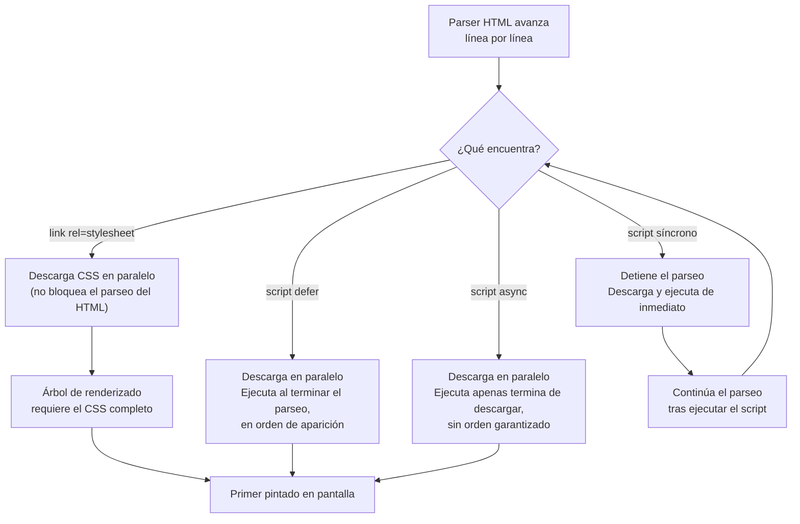
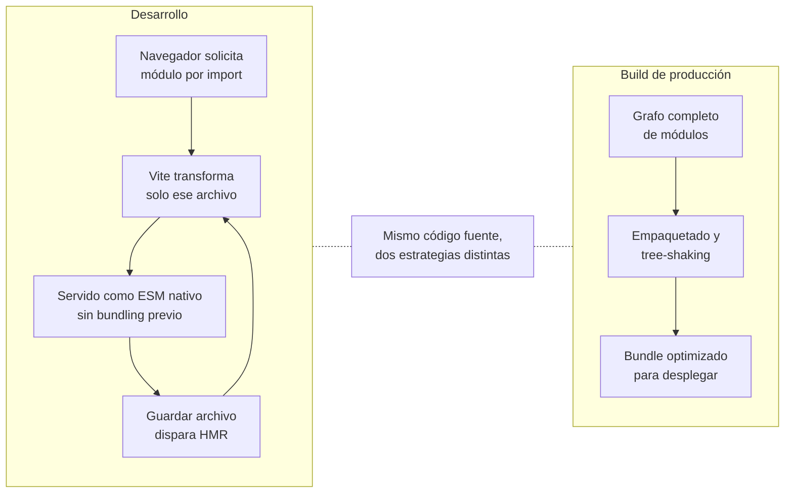

# Browsers — Parte 2

Este apunte profundiza el estudio del navegador como plataforma de ejecución, ahora enfocado en los tres lenguajes que un motor de renderización interpreta para construir una página: **HTML** (estructura y semántica), **CSS** (presentación visual) y **JavaScript** (comportamiento). Se revisan también dos APIs gráficas del navegador, **Canvas** y **WebGL**, el rol de **TypeScript** como superconjunto tipado de JavaScript, el orden en que el navegador procesa scripts y hojas de estilo durante el parseo del documento, los fundamentos de **Responsive Web Design (RWD)** y el papel de los **transpilers** y de **Vite** como herramienta de desarrollo moderna. El objetivo es entender no solo la sintaxis de cada tecnología, sino las decisiones de diseño que explican por qué el ecosistema evolucionó hacia los preprocesadores CSS, los frameworks utility-first y las herramientas de build basadas en ECMAScript Modules (ESM) nativos.

## Estructura y semántica en HTML

**HTML (HyperText Markup Language)** es el lenguaje de marcado que define la estructura y el significado del contenido de una página web. Según la documentación de MDN, HTML es "el bloque de construcción más básico de la web": no describe la apariencia visual (tarea de CSS) ni el comportamiento interactivo (tarea de JavaScript), sino que anota el contenido con **elementos** que expresan qué es cada fragmento de información, no cómo debe verse.

### Anatomía de un elemento

Un elemento HTML típico se compone de una etiqueta de apertura, contenido y una etiqueta de cierre:

```html
<p>El motor de renderización interpreta este párrafo.</p>
```

La etiqueta de apertura (`<p>`) delimita el inicio del elemento; la de cierre (`</p>`) es idéntica pero con una barra inclinada antes del nombre. Los **atributos** agregan información adicional dentro de la etiqueta de apertura, con la forma `nombre="valor"`:

```html

```

Existen además **atributos booleanos**, cuya sola presencia equivale a un valor verdadero (`disabled`, por ejemplo, en un campo de formulario), y **elementos vacíos** (*void elements*) que no envuelven contenido ni requieren etiqueta de cierre, como `<br>` o ``. El **anidamiento** de elementos debe respetar una jerarquía estricta: un elemento que se abre dentro de otro debe cerrarse antes que su contenedor; solapar etiquetas (`<p>texto <strong>énfasis</p></strong>`) produce un árbol del **Document Object Model (DOM)** inconsistente, que cada navegador puede reparar de forma distinta.

### El documento mínimo

Todo documento HTML válido sigue un esqueleto fijo:

```html
<!doctype html>
<html lang="es">
  <head>
    <meta charset="utf-8" />
    <title>Arquitectura Web</title>
  </head>
  <body>
    <p>Contenido visible de la página.</p>
  </body>
</html>
```

El `<!doctype html>` indica al navegador que interprete el documento en modo estándar (evitando el *quirks mode*, un modo de compatibilidad con páginas antiguas mal formadas). El elemento `<html>` es la raíz del árbol DOM; `<head>` agrupa metadatos no visibles (codificación de caracteres, título de la pestaña, enlaces a hojas de estilo y scripts); `<body>` contiene todo el contenido que el usuario efectivamente ve.

### Estructurar un documento con elementos semánticos

Antes de HTML5 era común construir toda la estructura de una página con `<div>` genéricos distinguidos únicamente por clases CSS. La especificación actual ofrece elementos con **significado estructural** propio:

| Elemento | Rol semántico |
|---|---|
| `<header>` | Contenido introductorio de la página o de una sección (`<article>`, `<section>`) |
| `<nav>` | Bloque de enlaces de navegación principal |
| `<main>` | Contenido único de la página; aparece una sola vez, hijo directo de `<body>` |
| `<article>` | Bloque de contenido autocontenido y redistribuible (una noticia, una entrada de blog) |
| `<section>` | Agrupación temática de contenido, normalmente con su propio encabezado |
| `<aside>` | Contenido relacionado tangencialmente con el contenido principal |
| `<footer>` | Cierre de la página o de una sección (información legal, contacto) |

```html
<body>
  <header>
    <h1>Arquitectura Web</h1>
    <nav>
      <ul>
        <li><a href="#inicio">Inicio</a></li>
        <li><a href="#contacto">Contacto</a></li>
      </ul>
    </nav>
  </header>

  <main>
    <article>
      <h2>Título del artículo</h2>
      <p>Contenido principal…</p>
      <section>
        <h3>Subsección</h3>
        <p>Detalle de la subsección…</p>
      </section>
    </article>
    <aside>
      <h2>Contenido relacionado</h2>
    </aside>
  </main>

  <footer>
    <p>&copy; 2026 — Arquitectura Web</p>
  </footer>
</body>
```

Usar semántica en lugar de `<div>` sin distinción tiene consecuencias concretas: los lectores de pantalla pueden anunciar "navegación principal" o "contenido principal" y permitir que la persona usuaria salte directamente a esa región, algo que un `<div class="nav">` no comunica a la API de accesibilidad del navegador. También favorece el posicionamiento en buscadores, porque el rastreador interpreta la jerarquía del contenido en lugar de adivinarla a partir de nombres de clase. `<div>` y `<span>` (su equivalente en línea) siguen siendo válidos, pero deben reservarse para agrupar contenido con fines de estilo o script cuando ningún elemento semántico se ajusta al propósito.

La jerarquía de encabezados (`<h1>` a `<h6>`) también es estructural, no solo tipográfica: debe descender de forma ordenada (un `<h1>` por página, seguido de `<h2>` para secciones principales y `<h3>` para subsecciones), porque las herramientas de accesibilidad construyen un índice de navegación a partir de esa jerarquía.

## Presentación separada del contenido

**CSS (Cascading Style Sheets)** es el lenguaje que controla la apariencia visual de los elementos HTML: colores, tipografía, espaciado, layout, animaciones. Su razón de ser es separar el contenido (qué es la información) de la presentación (cómo se ve), de modo que el mismo documento HTML pueda renderizarse con hojas de estilo distintas sin tocar el marcado.

Una regla CSS combina un **selector** (qué elementos se estilizan) con un **bloque de declaración** entre llaves, donde cada **declaración** asocia una **propiedad** con un **valor**:

```css
h1 {
  color: #1a1a2e;
  font-size: 2.5rem;
}
```

Cuando el navegador procesa una página, construye primero el árbol DOM a partir del HTML; en paralelo interpreta las reglas CSS (inline, embebidas o en archivos externos enlazados con `<link>`) y las combina con los estilos por defecto del user agent para producir un **árbol de renderizado** (*render tree*), que finalmente se pinta en pantalla. Cuando varias reglas compiten por la misma propiedad de un mismo elemento, el navegador resuelve el conflicto mediante la **cascada** (el orden en que las reglas aparecen y su origen) y la **especificidad** (el "peso" del selector: un selector de ID pesa más que uno de clase, que a su vez pesa más que uno de elemento).

### Box model

Todo elemento HTML renderizado como bloque se representa internamente como una caja rectangular compuesta por cuatro capas concéntricas: **content** (el contenido en sí), **padding** (espacio interno entre el contenido y el borde), **border** (el borde visible) y **margin** (espacio externo que separa la caja de sus vecinas). El modelo de caja determina cómo se calcula el ancho y alto final de un elemento:

```css
.card {
  width: 320px;
  padding: 16px;
  border: 1px solid #ccc;
  margin: 8px;
  box-sizing: border-box; /* padding y border se descuentan del width declarado */
}
```

Con `box-sizing: content-box` (el valor por defecto histórico), el `width` declarado corresponde solo al contenido, y el padding y el borde se **suman** al ancho final. Con `box-sizing: border-box`, el `width` declarado ya incluye padding y borde, lo que simplifica el cálculo de layouts y es la convención recomendada en proyectos modernos.

### Positioning y layouts

La propiedad `position` decide cómo se ubica una caja respecto del flujo normal del documento:

- `static` (por defecto): el elemento sigue el flujo normal.
- `relative`: se desplaza respecto de su posición original en el flujo, sin sacarlo de él.
- `absolute`: se posiciona respecto del ancestro posicionado más cercano (o del bloque inicial si no hay ninguno), fuera del flujo normal.
- `fixed`: se posiciona respecto de la ventana del navegador (*viewport*), y permanece fijo aunque la página haga scroll.
- `sticky`: híbrido entre `relative` y `fixed`, que "se pega" a un umbral de scroll dentro de su contenedor.

Para la organización de múltiples elementos en una superficie, CSS ofrece modelos de layout dedicados. **Flexbox** (`display: flex`) distribuye los hijos de un contenedor en una única dimensión (fila o columna), ideal para barras de navegación o listas de tarjetas que deben repartirse el espacio disponible:

```css
.toolbar {
  display: flex;
  justify-content: space-between;
  align-items: center;
  gap: 12px;
}
```

**Grid** (`display: grid`) organiza el contenido en dos dimensiones simultáneas (filas y columnas), apto para maquetaciones completas de página:

```css
.layout {
  display: grid;
  grid-template-columns: 240px 1fr;
  grid-template-rows: auto 1fr auto;
}
```

El documento **CSS Snapshot** del W3C, que reúne el conjunto de especificaciones que conforman el estado actual del lenguaje, agrupa estos módulos (box model, flexbox, grid, posicionamiento) entre las especificaciones estables o candidatas confiables, lo que confirma que forman parte del núcleo consolidado de CSS y no de propuestas experimentales.

### Animations y transitions

Las **transitions** interpolan de forma automática el cambio de una propiedad CSS entre dos valores, disparadas típicamente por un cambio de estado (`:hover`, una clase agregada por JavaScript):

```css
.button {
  background-color: #2563eb;
  transition: background-color 200ms ease-in-out;
}

.button:hover {
  background-color: #1d4ed8;
}
```

Las **animations** (`@keyframes`) permiten definir secuencias más ricas, con múltiples puntos intermedios y control sobre repetición y dirección, sin necesidad de un evento disparador:

```css
@keyframes pulse {
  0%   { transform: scale(1); }
  50%  { transform: scale(1.05); }
  100% { transform: scale(1); }
}

.badge {
  animation: pulse 1.2s ease-in-out infinite;
}
```

Ambas mecánicas se ejecutan en el hilo de composición del navegador cuando animan propiedades como `transform` u `opacity`, lo que evita recalcular layout en cada fotograma y produce animaciones más fluidas que animar propiedades como `width` o `top`, que sí disparan reflow.

### Tres enfoques para escalar CSS

A medida que una hoja de estilos crece, escribir CSS plano se vuelve repetitivo: los mismos colores y espaciados se repiten en decenas de selectores, y no hay forma nativa de anidar reglas o reutilizar bloques de declaraciones. El ecosistema respondió con tres estrategias distintas.

**Sass** es un lenguaje de hojas de estilo que se compila a CSS estándar. Según su documentación oficial, "Sass is a stylesheet language that's compiled to CSS", y ofrece variables, anidamiento de selectores, *mixins* (bloques de declaraciones reutilizables y parametrizables), funciones y partición de archivos mediante *partials* e *imports*:

```scss
// variables.scss
$color-primary: #2563eb;
$spacing-unit: 8px;

@mixin card-shadow {
  box-shadow: 0 1px 3px rgba(0, 0, 0, 0.12);
}

.card {
  padding: $spacing-unit * 2;
  border-radius: 4px;
  @include card-shadow;

  &:hover {
    border-color: $color-primary; // el "&" referencia el selector padre
  }
}
```

**LESS** ofrece un conjunto de capacidades muy similar (variables con `@`, anidamiento, *mixins*), con una sintaxis levemente distinta y, a diferencia de Sass, con un compilador que históricamente podía ejecutarse también en el propio navegador vía JavaScript. Ambos preprocesadores requieren un paso de compilación previo al despliegue: el navegador nunca ejecuta `.scss` ni `.less` directamente, solo el CSS resultante.

Buena parte de la necesidad histórica de estos preprocesadores fue absorbida por CSS nativo. El artículo de CSS-Tricks *"Is It Time to Un-Sass?"* señala que las **propiedades personalizadas** (`--color-primario: #2563eb;`, consumidas con `var(--color-primario)`) son, en varios sentidos, "más poderosas que las variables de Sass", porque pueden reasignarse dinámicamente dentro de *media queries* o según el tema activo, algo que las variables de Sass (resueltas en tiempo de compilación) no permiten. El **anidamiento nativo** de selectores llegó también a CSS estándar, con limitaciones frente al de Sass (no admite, por ejemplo, la concatenación directa de selectores típica de la convención BEM). Funciones como `color-mix()` cubren buena parte de lo que antes resolvían utilidades como `darken()` o `lighten()` de Sass. El autor concluye de forma pragmática: para un proyecto pequeño o un sitio personal, hoy puede prescindirse de Sass; para una base de código grande que ya depende de *mixins* o funciones sin equivalente nativo, mantenerlo sigue siendo razonable. La recomendación explícita es no refactorizar código existente solo por seguir una moda, sino evaluar caso por caso.

**Tailwind CSS** representa un tercer enfoque, denominado *utility-first*. En lugar de escribir selectores personalizados y asignarles nombres de clase semánticos (`.card`, `.btn-primary`), se componen los estilos aplicando directamente en el HTML clases de un solo propósito, cada una atada a una única propiedad CSS:

```html
<div class="mx-auto flex max-w-sm items-center gap-4 rounded-xl bg-white p-6 shadow-lg">
  
  <div>
    <p class="font-bold text-gray-900">Nombre</p>
    <p class="text-sm text-gray-500">Rol</p>
  </div>
</div>
```

La documentación de Tailwind argumenta que este modelo acelera el desarrollo porque evita inventar nombres de clase y saltar entre el archivo HTML y el archivo CSS; que los cambios son más seguros, ya que modificar las clases de un elemento no puede romper accidentalmente el estilo de otro elemento que comparta una clase con nombre semántico; y que, a diferencia de los estilos inline (`style="..."`), las utility classes sí admiten estados como `hover:` o *media queries* como `sm:`, apoyándose en un sistema de diseño con valores predefinidos (espaciados, colores, tamaños) en lugar de valores arbitrarios ("valores mágicos"). El costo de este enfoque es un marcado HTML más verboso, con muchas clases por elemento, que suele mitigarse extrayendo componentes reutilizables en el framework de UI que se esté usando (una función `VacationCard` en React, por ejemplo) en lugar de duplicar la lista de clases.

Los **frameworks CSS tradicionales** (con componentes preconstruidos como `.btn`, `.navbar`, `.modal`, ya con su apariencia visual definida) representan un tercer punto de comparación: resuelven rápidamente una interfaz estándar, pero suelen exigir sobrescribir sus estilos por defecto para lograr una identidad visual propia, mientras que Sass/LESS y Tailwind son, en cambio, herramientas de autoría que no imponen una estética particular. Ninguno de los tres enfoques es universalmente superior: la elección depende del tamaño del equipo, de si existe ya un sistema de diseño, y de cuánto control visual fino se necesite frente a la velocidad de entrega.

Conviene notar que estos tres enfoques no son mutuamente excluyentes en la práctica: es habitual encontrar un proyecto que usa Tailwind para la mayoría de los componentes y recurre a una capa fina de Sass, o a propiedades personalizadas de CSS, para centralizar tokens de diseño (paleta de colores, escalas tipográficas) que luego alimentan la configuración de Tailwind. La pregunta relevante para un equipo no es "cuál preprocesador o framework es el correcto" sino "qué problema concreto de mantenimiento tiene hoy la hoja de estilos": si el problema es la falta de convenciones y la duplicación de valores, un preprocesador con variables ayuda; si el problema es la lentitud de iterar sobre el marcado y la proliferación de nombres de clase sin usar, un enfoque utility-first ayuda más directamente.

## Gráficos 2D dibujados por script

El elemento `<canvas>` habilita, según su definición, "renderizado dinámico y programable de formas 2D e imágenes bitmap". A diferencia de HTML y CSS declarativos, canvas es un lienzo en blanco que solo cobra contenido mediante JavaScript: no tiene marcado interno que describa lo dibujado, sino una superficie de píxeles que el script modifica directamente.

Introducido por Apple en 2004 para el motor WebKit (usado en el widget *Dashboard* de Mac OS X y en Safari), fue adoptado luego por Gecko (Firefox, 2005) y Opera (2006), hasta estandarizarse bajo WHATWG como parte de la especificación de HTML. Su modelo es **inmediato** (*immediate mode*): cada operación de dibujo modifica el bitmap de inmediato y no queda una referencia editable a la forma dibujada, a diferencia de SVG, donde cada figura permanece como un nodo del DOM que puede seleccionarse y modificarse después.

Para dibujar, se obtiene un **contexto de renderizado** a partir del elemento, que determina qué API utilizar: el contexto `'2d'` habilita el dibujo de formas planas, y el mismo elemento admite también un contexto WebGL para renderizado 3D.

```html
<canvas id="scene" width="400" height="200"></canvas>
```

```javascript
// obtener el contexto 2D del canvas
const canvas = document.getElementById('scene');
const ctx = canvas.getContext('2d');

// dibujar un rectángulo relleno
ctx.fillStyle = '#2563eb';
ctx.fillRect(20, 20, 150, 100);

// dibujar un trazo simple
ctx.strokeStyle = '#1a1a2e';
ctx.lineWidth = 3;
ctx.beginPath();
ctx.moveTo(200, 20);
ctx.lineTo(350, 120);
ctx.stroke();

// texto sobre el canvas
ctx.font = '16px sans-serif';
ctx.fillStyle = '#000';
ctx.fillText('Canvas 2D', 200, 160);
```

La API 2D del contexto de canvas está especificada por WHATWG dentro de la especificación de HTML, y documentada de forma práctica en MDN (`CanvasRenderingContext2D`). Su uso habitual incluye gráficos generados dinámicamente (charts sin librería externa), editores de imagen en el navegador y juegos 2D sencillos, donde redibujar un fotograma completo en cada `requestAnimationFrame` resulta más eficiente que animar cientos de nodos DOM independientes.

## Gráficos 3D con WebGL y three.js

**WebGL** es una API de bajo nivel que expone en el navegador, a través de un contexto de `<canvas>`, capacidades de renderizado 3D acelerado por hardware (equivalentes en espíritu a OpenGL ES). Programar directamente contra WebGL exige escribir *shaders* (programas que corren en la GPU), gestionar buffers de vértices y matrices de transformación de forma manual, un nivel de detalle que resulta apropiado para motores de juego pero excesivo para la mayoría de las visualizaciones 3D de una aplicación web.

**three.js** es una librería de JavaScript que, según su documentación, simplifica el trabajo con WebGL ofreciendo abstracciones de alto nivel: en lugar de escribir shaders a mano, se construye una escena combinando objetos con roles bien definidos:

| Concepto | Rol en la escena |
|---|---|
| `Scene` | Contenedor raíz de todos los objetos 3D |
| `Camera` | Punto de vista desde el que se observa la escena (`PerspectiveCamera` para perspectiva realista, `OrthographicCamera` sin distorsión de profundidad) |
| `Renderer` | Dibuja la escena vista desde la cámara sobre un `<canvas>`, apoyándose internamente en WebGL |
| `Geometry` | Define la forma de un objeto (vértices, caras) |
| `Material` | Define la apariencia de la superficie (color, textura, reacción a la luz) |
| `Mesh` | Combina una `Geometry` con un `Material` para producir el objeto visible |
| `Light` | Ilumina la escena (ambiental, direccional, puntual) |

Un ejemplo mínimo, conceptual, de escena con un cubo:

```javascript
import * as THREE from 'three';

// escena, cámara y renderer conectado a un canvas del documento
const scene = new THREE.Scene();
const camera = new THREE.PerspectiveCamera(75, window.innerWidth / window.innerHeight, 0.1, 100);
const renderer = new THREE.WebGLRenderer();
renderer.setSize(window.innerWidth, window.innerHeight);
document.body.appendChild(renderer.domElement);

// geometría + material = mesh (el objeto visible)
const geometry = new THREE.BoxGeometry(1, 1, 1);
const material = new THREE.MeshStandardMaterial({ color: 0x2563eb });
const cube = new THREE.Mesh(geometry, material);
scene.add(cube);

// una luz direccional, imprescindible para materiales que reaccionan a la luz
scene.add(new THREE.DirectionalLight(0xffffff, 1));

camera.position.z = 5;

function animate() {
  requestAnimationFrame(animate);
  cube.rotation.y += 0.01; // rotación simple en cada fotograma
  renderer.render(scene, camera);
}
animate();
```

La elección entre WebGL puro y three.js es análoga a la elección entre manipular el DOM directamente o usar un framework de UI: WebGL da control total sobre cada shader, al costo de mucho código repetitivo; three.js resuelve los patrones comunes (cámara, luces, materiales estándar) para que el desarrollador se concentre en la escena, no en el pipeline gráfico.

## JavaScript y TypeScript en el navegador

**JavaScript** es el lenguaje que el navegador ejecuta para dotar de comportamiento a la página: responde a eventos del usuario, modifica el DOM en tiempo real, realiza peticiones de red y controla animaciones programáticas. Es un lenguaje **dinámicamente tipado**: una variable puede contener un número y luego una cadena sin que el motor lo impida en tiempo de análisis, y muchos errores de tipo solo se manifiestan en tiempo de ejecución.

**TypeScript** es un superconjunto de JavaScript que agrega un sistema de **tipado estático opcional**, verificado por un compilador antes de ejecutar el código. El código TypeScript se transpila a JavaScript estándar (el navegador nunca ejecuta `.ts` directamente):

```typescript
// definición de tipos para la forma de los datos que se esperan
interface Product {
  id: number;
  name: string;
  price: number;
}

function applyDiscount(product: Product, percentage: number): number {
  return product.price * (1 - percentage / 100);
}

// el compilador de TypeScript rechaza esta llamada antes de ejecutar nada
// applyDiscount({ id: 1, name: "Mouse" }, 10); // falta "price": error de compilación
```

El valor principal del tipado estático es detectar en tiempo de compilación (o directamente en el editor, mediante el servidor de lenguaje) errores que en JavaScript puro solo aparecerían al ejecutar el código con datos concretos: propiedades mal escritas, funciones llamadas con el número o tipo incorrecto de argumentos, valores `undefined` no manejados. En proyectos grandes, con muchos archivos y colaboradores, esto reduce una categoría entera de errores de integración y mejora el autocompletado del editor, porque este conoce de antemano la forma exacta de cada estructura de datos. El costo es un paso de compilación adicional y una curva de aprendizaje sobre el sistema de tipos, que en casos complejos (tipos genéricos, condicionales) puede volverse tan elaborado como el propio lenguaje.

Es importante remarcar que el sistema de tipos de TypeScript es puramente **estático**: existe solo mientras se analiza y compila el código, y desaparece por completo del JavaScript resultante. Esto significa que TypeScript no agrega ninguna verificación en tiempo de ejecución ni ninguna sobrecarga de rendimiento en el navegador; un valor que llega desde una respuesta de red mal tipada (por ejemplo, el resultado de `fetch` seguido de `.json()`) puede violar el tipo declarado sin que nada lo detecte en producción, porque la verificación ya ocurrió (o no) durante la compilación. Por esa razón, en código que consume datos externos suele combinarse TypeScript con una validación explícita en tiempo de ejecución (por ejemplo, con una librería de *schema validation*) para los puntos de entrada de datos no controlados por el propio programa, algo que el compilador no puede garantizar por sí solo.

## Orden de procesamiento de scripts y hojas de estilo

El navegador construye la página de forma incremental a medida que recibe el HTML, y el orden en que aparecen `<script>` y `<link rel="stylesheet">` determina cuánto se retrasa esa construcción.

Cuando el parser HTML encuentra un `<script src="...">` sin atributos adicionales, debe **detener el parseo del documento**, descargar el script (si es externo) y ejecutarlo por completo antes de continuar interpretando el HTML restante. Esto se debe a que un script puede invocar `document.write()` o modificar el DOM de forma que altere lo que el parser va a construir a continuación, así que el navegador no puede seguir de forma segura sin ejecutar primero ese script.

```html
<!-- bloquea el parseo del resto del documento hasta descargar y ejecutar -->
<script src="analytics.js"></script>
```

El atributo `defer` le indica al navegador que puede seguir parseando el HTML mientras descarga el script en paralelo, pero pospone su ejecución hasta que el parseo del documento haya terminado, respetando el orden relativo entre varios scripts `defer`:

```html
<script src="app.js" defer></script>
```

El atributo `async` también permite continuar el parseo mientras se descarga el script, pero lo ejecuta apenas la descarga termina, sin esperar a que el parseo concluya y sin garantizar el orden entre varios scripts `async`:

```html
<script src="widget-independiente.js" async></script>
```

`defer` es la opción adecuada para scripts que dependen del DOM completo o que deben ejecutarse en un orden específico (el caso típico de la lógica principal de una aplicación); `async` conviene para scripts independientes entre sí, como código de analítica que no interactúa con el resto de la página.

Las **hojas de estilo** siguen una lógica distinta: un `<link rel="stylesheet">` no bloquea el parseo del HTML, pero sí es **render-blocking**: el navegador no pinta ningún contenido en pantalla hasta tener resuelto el árbol de renderizado completo, que requiere conocer todas las reglas CSS aplicables. Además, si un `<script>` síncrono aparece después de una hoja de estilos aún en descarga, el navegador retrasa la ejecución de ese script hasta que el CSS termine de descargarse, porque el script podría necesitar leer estilos computados (por ejemplo, mediante `getComputedStyle`) que todavía no están disponibles.

El siguiente diagrama resume el flujo de decisión que sigue el navegador al toparse con cada tipo de recurso durante el parseo:



**Figura 1 — Procesamiento de scripts y hojas de estilo durante el parseo.** El script síncrono bloquea el parseo del HTML; `defer` y `async` lo evitan, pero difieren en cuándo y en qué orden ejecutan el código una vez descargado. El CSS nunca bloquea el parseo del HTML, pero sí bloquea el primer pintado en pantalla, porque el árbol de renderizado necesita conocer todas las reglas de estilo aplicables antes de dibujar.

## Responsive Web Design

**Responsive Web Design (RWD)** es el conjunto de técnicas que permite que una misma página se adapte de forma fluida a distintos tamaños de pantalla y dispositivos, en lugar de mantener versiones separadas para escritorio y para móvil. Se apoya en tres pilares técnicos.

El primero es la etiqueta **viewport**, que indica al navegador móvil cómo escalar la página en lugar de renderizarla a un ancho fijo de escritorio y luego reducirla:

```html
<meta name="viewport" content="width=device-width, initial-scale=1" />
```

Sin esta etiqueta, muchos navegadores móviles asumen un ancho de página de alrededor de 980px y aplican zoom para que quepa en la pantalla, produciendo texto ilegible sin hacer zoom manual.

El segundo pilar son las **media queries**, reglas condicionales de CSS que aplican un bloque de estilos solo cuando se cumple una característica del entorno de visualización (ancho de viewport, orientación, resolución):

```css
/* estilos base pensados para pantallas pequeñas */
.container {
  display: flex;
  flex-direction: column;
}

/* a partir de 768px de ancho, cambia a un layout de dos columnas */
@media (min-width: 768px) {
  .container {
    flex-direction: row;
  }
}
```

El tercer pilar es la estrategia **mobile-first**: escribir primero los estilos base pensados para la pantalla más pequeña y usar `min-width` en las media queries para ir agregando complejidad de layout a medida que crece el espacio disponible, en lugar del enfoque inverso (*desktop-first*, con `max-width`). Mobile-first suele producir hojas de estilo más simples, porque el caso base (una columna, elementos apilados) es también el más restrictivo, y evita que el navegador móvil descargue reglas pensadas para pantallas grandes que nunca va a aplicar.

Tailwind, el framework de utilidades mencionado más arriba, adopta mobile-first como su modelo por defecto y lo hace explícito en la forma de sus clases. Define cinco *breakpoints* predefinidos (`sm` a partir de 640px, `md` desde 768px, `lg` desde 1024px, `xl` desde 1280px y `2xl` desde 1536px), y cualquier clase de utilidad puede prefijarse con uno de ellos para que solo aplique a partir de ese ancho:

```html

```

En este ejemplo, `w-16` fija el ancho de la imagen en el caso base (pantallas chicas, sin prefijo), `md:w-32` lo amplía a partir de 768px, y `lg:w-48` lo amplía aún más a partir de 1024px. La clase sin prefijo nunca deja de aplicar: sencillamente queda sobrescrita por la que corresponda una vez que el viewport supera cada umbral, exactamente el mismo mecanismo de cascada que en una media query escrita a mano con `min-width`.

Esto lleva a un error frecuente entre quienes recién empiezan con el framework: escribir `sm:text-center` esperando que el texto se centre "en pantallas chicas", cuando en realidad `sm:` significa "a partir de 640px en adelante", no "hasta 640px". El resultado de `class="sm:text-center"` sola es que el texto queda sin centrar en el celular y se centra recién en tablets y pantallas más grandes, justo lo opuesto de lo buscado. La forma correcta de expresar "centrado en el celular, alineado a la izquierda desde 640px" es declarar primero el caso base y después la excepción: `class="text-center sm:text-left"`.

Para el caso inverso (una regla que debe dejar de aplicar a partir de cierto ancho, equivalente a un `max-width` manual), Tailwind ofrece variantes `max-*` que pueden combinarse con las variantes normales para acotar un rango exacto: `md:max-xl:flex` aplica `flex` únicamente entre 768px y 1280px, y `max-sm:hidden` oculta un elemento solo por debajo de 640px. Estas variantes `max-*` son la excepción deliberada al modelo mobile-first del framework, reservada para los casos (poco frecuentes) en los que de verdad hace falta pensar "desktop-first" para un componente puntual.

Las unidades relativas (`rem`, `%`, `vw`/`vh`) y los layouts flexibles (flexbox, grid) completan el conjunto de herramientas: en vez de fijar anchos en píxeles absolutos, los componentes se dimensionan en proporción al contenedor o al viewport, lo que reduce la cantidad de *breakpoints* explícitos que hace falta declarar.

Un error frecuente al implementar RWD es confundir "responsive" con "solo agregar una media query para pantallas chicas": un diseño verdaderamente responsivo se piensa desde el componente individual, no solo desde el layout general de la página. Por ejemplo, una tabla con muchas columnas no se resuelve agregando una media query que reduzca su tamaño de fuente, porque el contenido seguiría desbordando el viewport en un teléfono; la solución suele requerir un patrón distinto de presentación por debajo de cierto ancho (columnas apiladas en tarjetas, scroll horizontal contenido o una vista simplificada de la misma información). El objetivo del RWD no es que "todo se vea parecido en todos los tamaños", sino que cada componente exponga la mejor forma posible de su contenido según el espacio disponible.

## Transpilers y Vite

Un **transpiler** (contracción de *transpiling compiler*) es una herramienta que traduce código fuente de un lenguaje, o de una versión de un lenguaje, a otro código fuente de nivel de abstracción similar, en lugar de compilarlo a código máquina. **Babel** es el ejemplo canónico en el ecosistema JavaScript: permite escribir código con sintaxis moderna de ECMAScript (o con extensiones como JSX) y obtener como salida JavaScript compatible con navegadores más antiguos que no implementan esas características. TypeScript también transpila (su compilador `tsc` traduce `.ts` a `.js`, eliminando las anotaciones de tipo, que no tienen representación en tiempo de ejecución).

Antes de Vite, el flujo de desarrollo típico dependía de un bundler (Webpack, por ejemplo) que procesaba **toda** la aplicación (resolviendo el grafo completo de módulos, aplicando transpilación y empaquetando el resultado) antes de poder servir una sola página en el navegador durante el desarrollo. La documentación de Vite resume el problema con precisión: cuanto más grande la aplicación, más tiempo había que esperar a que el servidor de desarrollo arrancara o reflejara un cambio.

Vite ataca ese problema separando dos responsabilidades. Las **dependencias** de terceros (que cambian con poca frecuencia) se pre-empaquetan una única vez con herramientas de compilación muy rápidas. El **código fuente propio** del proyecto, en cambio, se sirve bajo demanda: el navegador solicita cada módulo mediante **ECMAScript Modules (ESM) nativos** (`import`/`export` interpretados directamente por el navegador, sin que un bundler los combine previamente), y Vite transforma cada archivo únicamente cuando el navegador lo pide. Esto permite que el servidor de desarrollo arranque casi instantáneamente, sin importar el tamaño total del proyecto, porque nunca procesa módulos que el navegador no solicitó todavía.

Sobre esa misma base de ESM nativos, Vite implementa **Hot Module Replacement (HMR)**: cuando se guarda un archivo, solo ese módulo se reemplaza en el navegador, preservando el estado de la aplicación en memoria, en lugar de recargar la página completa como hacían las configuraciones de HMR más rudimentarias de generaciones anteriores de herramientas.

Para producción, servir cientos de módulos sin empaquetar sigue siendo ineficiente (implica cientos de peticiones HTTP encadenadas y no permite optimizaciones globales como el *tree-shaking* agresivo o la fusión de módulos pequeños), así que Vite conserva un paso de *build* con empaquetado. Su documentación actual indica que este paso se apoya en herramientas escritas en Rust para ese propósito, sucesoras de la combinación histórica de esbuild (para pre-empaquetar dependencias) y Rollup (para el build de producción) que Vite usó en sus primeras versiones. El principio de diseño se mantiene: usar la estrategia más rápida disponible en cada etapa, sin bundling en desarrollo, con bundling optimizado en producción.



**Figura 2 — Dos estrategias de Vite según el entorno.** En desarrollo, cada módulo se sirve sin empaquetar y se actualiza de forma incremental vía HMR; en producción, el mismo código fuente pasa por un paso de empaquetado y optimización antes de desplegarse. Esta separación es la que permite arranques casi instantáneos del servidor de desarrollo sin sacrificar el rendimiento del artefacto final.

Este diseño explica por qué Vite desplazó en gran medida a configuraciones de Webpack ajustadas manualmente para proyectos nuevos: el tiempo de espera durante el desarrollo (arranque del servidor, reflejo de cada cambio) pasó a depender del tamaño del módulo tocado, no del tamaño total de la aplicación, mientras que el resultado final de producción sigue beneficiándose de un bundle optimizado equivalente al que producían las herramientas anteriores.

## Conclusión

Los tres lenguajes que interpreta el navegador (HTML, CSS y JavaScript) mantienen una separación de responsabilidades explícita: estructura y semántica, presentación visual, y comportamiento. Esa separación no es solo estilística: tiene consecuencias medibles en accesibilidad, en la forma en que el motor de renderización construye el árbol de renderizado, y en qué recursos bloquean o no el primer pintado en pantalla. El ecosistema de CSS evolucionó incorporando al lenguaje nativo buena parte de lo que antes exigía un preprocesador, sin eliminar por completo la necesidad de Sass o LESS en proyectos grandes, y sumó un enfoque alternativo, utility-first, que prioriza velocidad de iteración sobre nomenclatura semántica de clases. Canvas y WebGL extienden el navegador con superficies de dibujo programático, desde formas 2D inmediatas hasta escenas 3D aceleradas por GPU, donde librerías como three.js absorben la complejidad de trabajar directamente contra shaders. TypeScript, por su parte, no reemplaza a JavaScript sino que agrega una capa de verificación estática que se descarta antes de llegar al navegador. Y las herramientas de build modernas, con Vite como caso de referencia, resolvieron el problema de escalar el ciclo de desarrollo apoyándose en una capacidad que el propio navegador ya ofrecía (ESM nativos), reservando el empaquetado tradicional para el momento en que realmente aporta valor: el artefacto final de producción.

## Bibliografía consultada

- MDN Web Docs. "HTML." *MDN Web Docs*, Mozilla. Sección introductoria (definición de HTML y su relación con CSS y JavaScript). https://developer.mozilla.org/en-US/docs/Web/HTML
- MDN Web Docs. "Structuring content." Módulo *Learn web development — Core*, Mozilla. Índice general del módulo (sintaxis básica, metadatos, texto, estructura, multimedia, formularios). https://developer.mozilla.org/en-US/docs/Learn_web_development/Core/Structuring_content
- MDN Web Docs. "Basic HTML syntax." Módulo *Learn web development — Core*, Mozilla. Secciones "Anatomy of an HTML element", "Attributes", "Nesting elements", "Anatomy of an HTML document" y "Whitespace in HTML". https://developer.mozilla.org/en-US/docs/Learn_web_development/Core/Structuring_content/Basic_HTML_syntax
- MDN Web Docs. "Structuring documents." Módulo *Learn web development — Core*, Mozilla. Secciones sobre elementos semánticos (`header`, `nav`, `main`, `article`, `section`, `aside`, `footer`) y su rol en accesibilidad y SEO. https://developer.mozilla.org/en-US/docs/Learn_web_development/Core/Structuring_content/Structuring_documents
- MDN Web Docs. "What is CSS?" Módulo *Learn web development — Core*, Mozilla. Secciones "CSS syntax" y "How is CSS applied to HTML". https://developer.mozilla.org/en-US/docs/Learn_web_development/Core/Styling_basics/What_is_CSS
- W3C. "CSS Snapshot 2026." *W3C Technical Reports*. Secciones "Introduction" y clasificación de módulos por estado de estabilidad (especificaciones estables, recomendaciones candidatas, módulos relativamente estables). https://www.w3.org/TR/css-2026/
- Sass. "Sass Documentation." Secciones "Sass Basics" (variables, nesting, mixins, partials e imports, funciones). https://sass-lang.com/documentation/
- Tailwind CSS. "Styling with utility classes." Documentación oficial. Secciones "Why not just use inline styles?", "Thinking in utility classes" y "Managing duplication". https://tailwindcss.com/docs/styling-with-utility-classes
- Tailwind CSS. "Responsive design." Documentación oficial. Breakpoints por defecto, prefijos de variantes responsivas, enfoque mobile-first y variantes `max-*`. https://tailwindcss.com/docs/responsive-design
- CSS-Tricks. "Is It Time to Un-Sass?" Artículo de opinión técnica sobre la relación entre Sass y las capacidades nativas de CSS moderno (propiedades personalizadas, nesting nativo, `color-mix()`). https://css-tricks.com/is-it-time-to-un-sass/
- Wikipedia (en). "Canvas element." Secciones "Overview", "History" y "Usage" (contexto 2D y contexto WebGL). https://en.wikipedia.org/wiki/Canvas_element
- three.js. "Fundamentals." Manual oficial. Sección sobre los componentes básicos de una escena (Scene, Camera, Renderer, Geometry, Material, Mesh, Light). https://threejs.org/manual/#en/fundamentals
- Vite. "Why Vite." Guía oficial. Secciones "The Problem", "Vite's answer: leveraging ESM" y "Why Bundle for Production". https://vite.dev/guide/why
