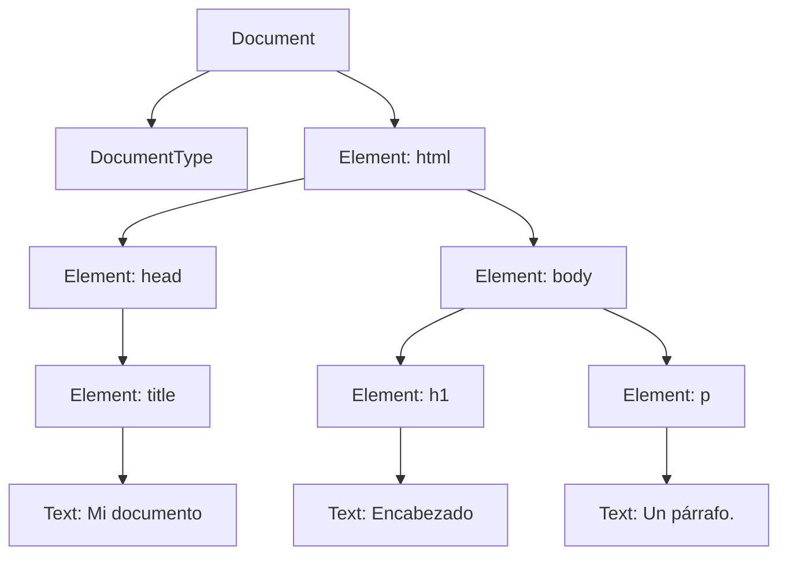
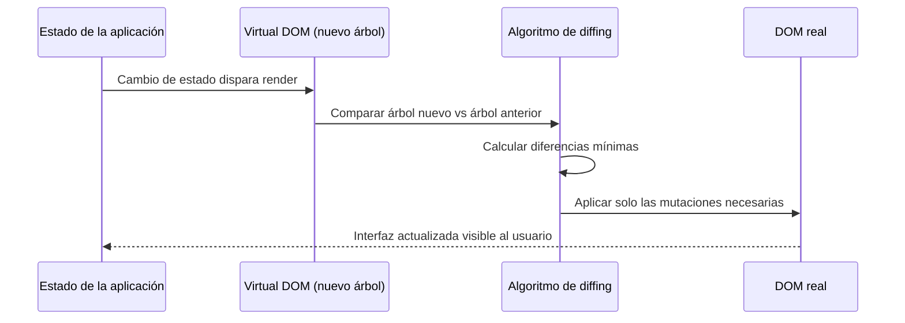
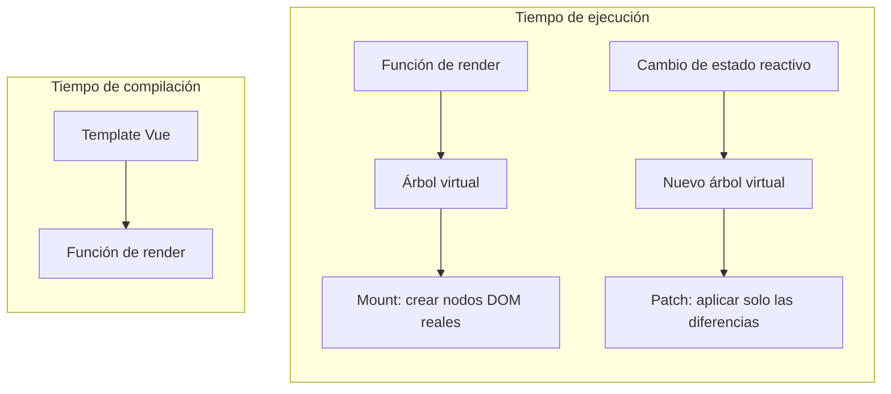

# DOM, Virtual DOM y frameworks modernos

Este apunte aborda cómo el navegador representa un documento HTML en memoria a través del **DOM** (*Document Object Model*, Modelo de Objetos del Documento), cómo se lo consulta y modifica con la API correspondiente, y por qué las aplicaciones web complejas evolucionaron hacia un modelo de manipulación indirecta basado en el **Virtual DOM**. También se estudian los mecanismos de **data binding** y de **template engines** (motores de plantillas), y se contrastan las filosofías de dos frameworks de referencia: **React** y **Vue**.

## Construcción del árbol DOM

El DOM es una interfaz de programación que conecta un documento (típicamente HTML, aunque también aplica a XML y SVG) con un lenguaje de scripting, en la práctica JavaScript. Según lo define MDN, el DOM no es un lenguaje ni una tecnología del navegador exclusivamente: es una **representación en árbol** del documento, donde cada nodo corresponde a una parte de ese documento, y cada nodo expone propiedades y métodos que permiten leer o modificar su contenido, sus atributos y su posición dentro de la estructura.

Es importante fijar una distinción que suele generar confusión entre quienes recién se inician: el DOM **no es JavaScript**. El DOM es una *Web API*, es decir, una interfaz que el navegador expone; JavaScript es simplemente el lenguaje más habitual para consumir esa interfaz, pero conceptualmente el DOM podría ser accedido desde cualquier lenguaje que el navegador soportara (de hecho, históricamente también se usó desde otros lenguajes de scripting embebidos).

### Del HTML parseado al árbol DOM

Cuando el navegador recibe una respuesta HTTP con contenido HTML, un componente del motor de renderizado (el **parser HTML**) lee el flujo de bytes, lo tokeniza y construye progresivamente el árbol DOM. El proceso, a grandes rasgos, sigue estos pasos:

1. El parser convierte la secuencia de caracteres en **tokens** (etiquetas de apertura, de cierre, texto, comentarios).
2. Cada token se transforma en un **nodo** del árbol, siguiendo las reglas de anidamiento del HTML.
3. Los nodos se van uniendo entre sí según su relación jerárquica: un elemento `<body>` que contiene un `<h1>` se traduce en un nodo `body` con un nodo `h1` como hijo.
4. El resultado final es un árbol **enraizado**: un único nodo `Document` en la cima, del cual cuelgan el resto de los nodos.

Por ejemplo, el siguiente documento:

```html
<!doctype html>
<html lang="es">
  <head>
    <title>Mi documento</title>
  </head>
  <body>
    <h1>Encabezado</h1>
    <p>Un párrafo.</p>
  </body>
</html>
```

produce, conceptualmente, el árbol:

```
Document
├── DocumentType (<!doctype html>)
└── Element (html)
    ├── Element (head)
    │   └── Element (title)
    │       └── Text: "Mi documento"
    └── Element (body)
        ├── Element (h1)
        │   └── Text: "Encabezado"
        └── Element (p)
            └── Text: "Un párrafo."
```

Un matiz frecuente al enseñar este tema: el árbol DOM que el navegador construye **no siempre es idéntico** al HTML tal cual fue escrito. El parser corrige errores de anidamiento, cierra etiquetas implícitamente omitidas (por ejemplo `<p>` seguido de otro `<p>` sin cierre explícito) y normaliza la estructura según el algoritmo de construcción del árbol descrito por la especificación HTML de WHATWG. Esto explica por qué inspeccionar el DOM en las herramientas de desarrollador a veces muestra una estructura distinta de la que aparece en el código fuente original.

## Tipos de nodo del DOM

El DOM modela cualquier documento como una colección de **nodos** (*nodes*), cada uno con un tipo (`nodeType`) que determina qué datos contiene y qué tipos de nodo puede tener como hijos. Los principales tipos, según la anatomía descrita por MDN, son:

| Tipo de nodo | `nodeType` | Contenido (`nodeValue`) | Hijos válidos |
|---|---|---|---|
| `Document` | 9 | `null` | `DocumentType`, `Element` |
| `DocumentType` | 10 | `null` | Ninguno |
| `Element` | 1 | `null` | `Element`, `Text`, `Comment` |
| `Text` | 3 | cadena de texto | Ninguno |
| `Comment` | 8 | cadena de texto | Ninguno |
| `Attr` | 2 | cadena de texto | Ninguno |

Cada nodo tiene, como mínimo, un padre (excepto el nodo raíz `Document`) y puede tener cero o más hijos. Todos los tipos de nodo heredan de una interfaz común, `Node`, que expone propiedades genéricas de navegación (`parentNode`, `childNodes`, `nextSibling`) y de identificación (`nodeType`, `nodeName`, `nodeValue`). Sobre esa base, `Element` extiende `Node` agregando las capacidades específicas de un elemento HTML: atributos, clases, y la posibilidad de tener estilos y eventos asociados.

Una distinción útil en la práctica es la que separa la **navegación por todos los nodos** (incluye texto y comentarios) de la **navegación solo por elementos**. Por ejemplo, `parentNode` devuelve el nodo padre sea cual sea su tipo, mientras que `parentElement` devuelve `null` si el padre no es un `Element`. Esta distinción cobra importancia porque el espacio en blanco entre etiquetas (indentación, saltos de línea) se traduce en nodos `Text`, que "ensucian" la navegación por `childNodes` si el objetivo es trabajar solo con elementos.



**Figura 1 — Árbol DOM resultante del parseo de un documento HTML.** El nodo raíz `Document` contiene un único `DocumentType` y un único elemento `html`, del cual cuelgan `head` y `body`. Cada elemento de texto visible en la página se representa como un nodo `Text` hijo del elemento que lo contiene, nunca como parte del propio elemento.

## La DOM API

La **DOM API** es el conjunto de interfaces, métodos y propiedades que permiten leer y modificar el árbol descrito arriba. Conviene dividirla en cuatro bloques funcionales: selección de nodos, recorrido (*traversal*) del árbol, construcción/actualización del árbol, y manejo de eventos.

### Selección de nodos

La forma moderna y recomendada de ubicar elementos es la **Selectors API**, expuesta a través de `querySelector()` y `querySelectorAll()`, disponibles tanto en `Document` como en cualquier `Element` o `DocumentFragment`.

```javascript
// Devuelve el primer elemento que matchea el selector CSS, o null
const firstWarning = document.querySelector("p.warning");

// Devuelve una NodeList estática con todas las coincidencias
const allWarnings = document.querySelectorAll("p.warning, p.note");

allWarnings.forEach((element) => {
  console.log(element.textContent);
});
```

Ambos métodos aceptan cualquier selector CSS válido, incluidas combinaciones (`div > p`, listas separadas por coma). Una precisión que suele pasar inadvertida: la `NodeList` que retorna `querySelectorAll()` es **estática** (no "viva"): si el DOM cambia después de la consulta, la colección no se actualiza automáticamente. Esto contrasta con métodos históricos como `getElementsByClassName()` o `getElementsByTagName()`, que sí retornan colecciones dinámicas (`HTMLCollection`) reflejadas en tiempo real contra el árbol.

Antes de la Selectors API, ubicar un nodo requería iterar manualmente sobre `childNodes` comparando atributos o etiquetas: un patrón notoriamente más verboso y más costoso en tiempo de desarrollo, aunque en algunos motores de navegador el acceso directo por `id` puede seguir siendo más rápido que un selector CSS complejo.

### Recorrido del árbol (traversal)

Una vez ubicado un nodo, suele ser necesario **navegar** hacia sus parientes: su padre, sus hijos, sus hermanos. El DOM ofrece dos familias de propiedades: una que opera sobre **cualquier nodo** y otra que opera **solo sobre elementos**.

```javascript
// Navegación genérica (incluye nodos Text y Comment)
node.parentNode;
node.childNodes;      // NodeList con todos los hijos
node.firstChild;
node.lastChild;
node.previousSibling;
node.nextSibling;

// Navegación restringida a elementos (omite Text y Comment)
element.parentElement;
element.children;             // HTMLCollection solo de Element
element.firstElementChild;
element.lastElementChild;
element.previousElementSibling;
element.nextElementSibling;
element.childElementCount;
```

Un ejemplo típico que combina selección y traversal:

```javascript
// HTML: <p class="note" id="intro">Este es un párrafo.</p>
const p = document.querySelector("p");

console.log(p.parentElement);        // <body>
console.log(p.nextElementSibling);   // siguiente elemento hermano, si existe
console.log(p.getAttribute("class")); // "note"
console.log(p.classList);             // DOMTokenList ["note"]
console.log(p.textContent);           // "Este es un párrafo."
```

Para comparar nodos entre sí, el DOM expone `isSameNode()` (identidad de referencia), `isEqualNode()` (igualdad estructural, es decir, mismos atributos e hijos aunque sean objetos distintos) y `compareDocumentPosition()`, que retorna una máscara de bits indicando la relación relativa entre dos nodos (si uno precede al otro, si uno contiene al otro, etc.).

### Construcción y actualización del árbol

Modificar el DOM implica, típicamente, tres pasos: crear un nodo, configurarlo, e insertarlo en el árbol en la posición deseada.

```javascript
// 1. Crear elementos y nodos de texto
const heading = document.createElement("h2");
const headingText = document.createTextNode("Sección generada dinámicamente");

// 2. Configurar el nuevo nodo antes de insertarlo (mejor rendimiento)
heading.appendChild(headingText);
heading.setAttribute("class", "generated");

// 3. Insertar el nodo en el árbol
document.body.appendChild(heading);
```

Un patrón recurrente al construir estructuras compuestas, como una tabla, es crear los nodos de **arriba hacia abajo** conceptualmente (tabla, luego filas, luego celdas) pero **insertarlos de abajo hacia arriba**: primero el texto dentro de la celda, luego la celda dentro de la fila, luego la fila dentro del cuerpo de la tabla, y finalmente la tabla dentro del documento.

```javascript
// Construye una tabla de 2x2 con datos generados
function generateTable() {
  const table = document.createElement("table");
  const tableBody = document.createElement("tbody");

  for (let row = 0; row < 2; row++) {
    const tr = document.createElement("tr");
    for (let col = 0; col < 2; col++) {
      const td = document.createElement("td");
      const cellText = document.createTextNode(`fila ${row}, columna ${col}`);
      td.appendChild(cellText);
      tr.appendChild(td);
    }
    tableBody.appendChild(tr);
  }

  table.appendChild(tableBody);
  document.body.appendChild(table);
  table.setAttribute("border", "1");
}
```

Para eliminar o reemplazar nodos existen `removeChild()` y `replaceChild()`, y para duplicar un subárbol, `cloneNode(deep)`, donde el parámetro booleano indica si se clonan también los descendientes. Vale una advertencia habitual sobre `innerHTML`: asignar una cadena a esta propiedad es más conciso que construir nodos uno por uno con la API, pero fuerza al navegador a volver a parsear HTML en cada asignación, y si la cadena incluye contenido no confiable (por ejemplo, texto ingresado por un usuario), abre una vía de inyección de código (*cross-site scripting*). Por eso, cuando el contenido proviene de una fuente no controlada, la práctica recomendada es preferir `textContent` o construir los nodos explícitamente con `createElement()`/`createTextNode()`.

### Eventos del DOM

El tercer pilar de la API es el modelo de eventos, que permite reaccionar a interacciones del usuario o cambios de estado del documento. El mecanismo moderno y recomendado es `addEventListener()`, que admite múltiples escuchas (*listeners*) sobre el mismo nodo y evento, y que pueden removerse selectivamente.

```javascript
const button = document.querySelector("button");

function handleClick(event) {
  console.log("Se hizo clic en:", event.target);
}

button.addEventListener("click", handleClick);

// Remover el listener cuando ya no se necesita
button.removeEventListener("click", handleClick);
```

Un evento del DOM atraviesa, conceptualmente, tres fases: **captura** (*capturing*), en la que el evento viaja desde la raíz del documento hacia el nodo destino; el nodo destino en sí (*target*); y **burbujeo** (*bubbling*), en la que el evento vuelve a subir desde el destino hacia la raíz. Por defecto, `addEventListener()` registra el listener para la fase de burbujeo; para escuchar durante la captura, se pasa `{ capture: true }` como tercer argumento.

```javascript
// Escuchar durante la fase de captura
container.addEventListener("click", handler, { capture: true });

// Escuchar durante la fase de burbujeo (comportamiento por defecto)
container.addEventListener("click", handler);
```

Esta propagación en dos direcciones habilita un patrón muy usado en aplicaciones con listas dinámicas: la **delegación de eventos**. En lugar de agregar un listener a cada elemento hijo (lo cual además obliga a re-registrar listeners cada vez que se agregan elementos nuevos), se agrega un único listener al contenedor y se inspecciona `event.target` para determinar qué hijo disparó el evento.

```javascript
const list = document.querySelector("#list");

list.addEventListener("click", (event) => {
  // Solo actuar si el clic ocurrió sobre un <li>
  if (event.target.tagName === "LI") {
    console.log("Elemento clickeado:", event.target.textContent);
  }
});
```

Dentro del manejador, `event.stopPropagation()` corta la propagación del evento hacia el resto del árbol (útil, por ejemplo, para evitar que un clic dentro de un modal cierre el modal mismo si el contenedor externo también escucha clics), mientras que `event.preventDefault()` cancela el comportamiento por defecto asociado al evento, como el envío de un formulario o el seguimiento de un enlace:

```javascript
form.addEventListener("submit", (event) => {
  event.preventDefault(); // evita el envío tradicional del formulario
  // lógica propia de validación o envío vía fetch
});
```

Es importante no confundir `stopPropagation()` (afecta la propagación por el árbol) con `preventDefault()` (afecta la acción nativa del navegador asociada al evento): son ortogonales y pueden usarse juntos o por separado según el caso.

El DOM también permite crear y disparar eventos personalizados mediante `CustomEvent`, útil para comunicar componentes entre sí sin acoplarlos directamente:

```javascript
const productSelected = new CustomEvent("product-selected", {
  detail: { id: 42 },
  bubbles: true,
});

productCard.addEventListener("click", () => {
  productCard.dispatchEvent(productSelected);
});

document.addEventListener("product-selected", (event) => {
  console.log("Producto elegido:", event.detail.id);
});
```

## Más allá del DOM

El DOM es la API central para representar y modificar un documento, pero no es la única interfaz que el navegador expone a JavaScript. El conjunto más amplio de **client-side APIs** (o *Browser APIs*) incluye, entre otras categorías: APIs para obtener datos del servidor de forma asíncrona (como `fetch`), APIs de dibujo y gráficos (Canvas, WebGL), APIs de audio y video, APIs de almacenamiento en el cliente (Web Storage, IndexedDB) y APIs de acceso al dispositivo (geolocalización, sensores). MDN distingue además entre estas **Browser APIs**, que vienen integradas por defecto en el navegador, y las **APIs de terceros**, cuyo código debe incorporarse explícitamente desde un servicio externo (por ejemplo, un SDK de mapas o de pagos). El tratamiento detallado de estas APIs excede el alcance de este apunte, centrado en el DOM y en los frameworks de interfaz; alcanza con reconocer que el DOM es apenas una de varias superficies de programación que el navegador ofrece para construir una aplicación completa.

## Por qué la manipulación directa del DOM no escala

Trabajar con la DOM API tal como se describió es perfectamente viable para páginas simples: pocos elementos, pocas interacciones, actualizaciones esporádicas. El problema aparece cuando la aplicación crece en complejidad de estado y de interfaz, un escenario habitual en lo que se conoce como **aplicaciones de página única** (*single-page applications*).

Hay al menos tres razones concretas por las que la manipulación manual del DOM se vuelve difícil de sostener:

1. **Sincronización manual entre estado y vista.** Cada vez que un dato cambia, el desarrollador debe localizar explícitamente todos los nodos del DOM afectados y actualizarlos uno por uno. En una aplicación con decenas de piezas de estado interrelacionadas (un carrito de compras, un formulario con validaciones cruzadas, una lista filtrable), ese código de sincronización crece de forma no lineal y se vuelve propenso a inconsistencias: es fácil olvidar actualizar un nodo, o actualizarlo dos veces con datos distintos.
2. **Costo de las operaciones sobre el DOM real.** Cada modificación al árbol (insertar un nodo, cambiar un atributo que afecta el layout) puede disparar recálculos de estilo y de geometría en el motor de renderizado. Si el código realiza muchas modificaciones pequeñas y dispersas en el tiempo, el navegador puede terminar recalculando el layout repetidas veces por segundo, en detrimento del rendimiento percibido.
3. **Dificultad para razonar sobre el código.** Un programa que manipula el DOM imperativamente ("buscá este nodo y cambiale este atributo", "agregá este hijo acá") entremezcla la lógica de negocio con los detalles de bajo nivel de cómo se representa esa lógica visualmente. Cuando la aplicación crece, se vuelve difícil predecir en qué estado va a quedar la interfaz después de una secuencia larga de operaciones.

La respuesta que popularizaron frameworks como React y, más tarde, Vue, consistió en invertir el problema: en lugar de que el desarrollador describa *cómo* transformar el DOM paso a paso, describe *cómo debería lucir* la interfaz en función del estado actual, y deja que el framework calcule las transformaciones necesarias. A esa técnica se la conoce como **renderizado declarativo**, y su pieza central de implementación es el **Virtual DOM**.

## Virtual DOM y diffing

El **Virtual DOM** (VDOM) es, según lo resume la entrada de Wikipedia dedicada al tema, una representación ligera del DOM real implementada como estructuras de datos de JavaScript ordinarias (objetos planos), mantenida en memoria y sincronizada con el DOM real por una biblioteca como React o Vue. La idea de fondo es simple de enunciar: generar un árbol de objetos JavaScript es mucho más barato que crear y modificar nodos DOM reales, porque el DOM real conlleva overhead adicional del navegador (cálculo de estilos, geometría, accesibilidad) que un objeto plano no tiene.

Un nodo virtual (*vnode*) suele representarse como un objeto con esta forma general:

```javascript
// Representación simplificada de un vnode
const vnode = {
  type: "div",
  props: { id: "hello", className: "container" },
  children: [
    { type: "p", props: {}, children: ["Contenido dinámico"] },
  ],
};
```

El ciclo de trabajo típico de un framework basado en Virtual DOM sigue estos pasos:

1. **Render:** cuando el estado de la aplicación cambia, el framework vuelve a ejecutar la función (o el template compilado) que describe la interfaz, generando un **nuevo árbol virtual** completo.
2. **Diffing:** el framework compara el árbol virtual nuevo con el árbol virtual anterior, nodo por nodo, para identificar qué cambió: qué nodos se agregaron, cuáles se eliminaron, y en cuáles cambiaron atributos o contenido.
3. **Reconciliation (reconciliación):** a partir del resultado del diffing, el framework calcula el conjunto mínimo de operaciones necesarias sobre el **DOM real** y las aplica, en lugar de reconstruir el árbol completo desde cero.

Como señala la fuente consultada, dado que generar un árbol virtual es relativamente barato, el framework puede permitirse recalcularlo con frecuencia (incluso en cada cambio de estado) sin que eso implique, por sí solo, un costo de rendimiento inaceptable; el costo real que se busca minimizar es el de las operaciones sobre el DOM real, que son las que efectivamente activan recálculos de layout y repintado. La ganancia de rendimiento del patrón proviene entonces de reemplazar muchas mutaciones directas y dispersas por un lote acotado de mutaciones calculadas una sola vez por ciclo de actualización.



**Figura 2 — Ciclo de actualización basado en Virtual DOM.** Un cambio de estado dispara la generación de un nuevo árbol virtual; el algoritmo de diffing lo compara contra el árbol anterior y calcula el conjunto mínimo de mutaciones, que recién entonces se aplican sobre el DOM real. El desarrollador no interactúa directamente con el DOM real en este ciclo.

Conviene una aclaración honesta, presente también en la fuente: el patrón de Virtual DOM no es intrínsecamente más rápido que una manipulación directa del DOM escrita a mano de forma óptima; de hecho, introduce el costo adicional de mantener y comparar árboles en memoria. Su ventaja real es de **productividad y mantenibilidad**: permite que el desarrollador escriba código declarativo (describir el estado deseado) sin tener que razonar manualmente sobre cada mutación incremental, a costa de un overhead que en la práctica resulta aceptable para la mayoría de las aplicaciones. No es casual que frameworks más recientes, como Svelte, hayan optado por prescindir del Virtual DOM: en su lugar, mueven el análisis de qué actualizar del tiempo de ejecución al tiempo de compilación, generando código imperativo optimizado de antemano.

## CSS parsing y el CSSOM

Mientras el parser HTML construye el DOM, el navegador procesa en paralelo las hojas de estilo (ya sea enlazadas con `<link>`, incluidas con `<style>`, o en línea) y construye una estructura análoga para las reglas CSS: el **CSSOM** (*CSS Object Model*). Al igual que el DOM, el CSSOM es un árbol de objetos que representa las reglas de estilo aplicables, sus selectores y sus declaraciones de propiedades. La construcción del árbol de renderizado final (que determina qué se dibuja y con qué apariencia) requiere combinar la información estructural del DOM con la información de estilo del CSSOM: por cada nodo visible del DOM, el motor de renderizado necesita conocer sus propiedades computadas antes de poder calcular su geometría (layout) y pintarlo en pantalla. El detalle de ese proceso de construcción del árbol de renderizado, el cálculo de layout y el pintado corresponden a un tratamiento específico de la arquitectura del motor de renderizado; a los fines de este apunte, basta con retener que el DOM y el CSSOM son estructuras hermanas, construidas de forma independiente pero combinadas antes de mostrar cualquier contenido en pantalla, y que ambas pueden actualizarse dinámicamente desde JavaScript: así como `element.classList.add("active")` modifica el DOM, esa modificación puede disparar una reevaluación de las reglas del CSSOM que aplican a ese nodo.

## Motores de plantillas

Un **motor de plantillas** (*template engine* o *template processor*) es, según la definición general recogida por Wikipedia, un software diseñado para combinar una **plantilla** (un documento con marcadores o instrucciones de sustitución) con un **modelo de datos**, produciendo como resultado un documento final. Históricamente, estos motores operaban del lado del servidor (con nombres como *JavaServer Pages*, *Active Server Pages* o equivalentes en Python, PHP o Ruby): el servidor combinaba una plantilla con datos y generaba HTML final que se enviaba al cliente ya renderizado. El concepto es simple: marcadores embebidos en el documento de salida, con soporte para variables, condicionales y bucles, se sustituyen por sus valores en tiempo de procesamiento.

### Velocity y FreeMarker

Dos ejemplos representativos de esa generación de motores server-side, todavía vigentes en aplicaciones Java heredadas, son **Apache Velocity** y **Apache FreeMarker**. Ambos comparten el mismo objetivo (separar la lógica de presentación de la lógica de negocio) pero con lenguajes de plantilla propios: Velocity usa **VTL** (*Velocity Template Language*) y FreeMarker usa **FTL** (*FreeMarker Template Language*). Ninguno de los dos pretende ser un "lenguaje de programación de propósito general": son procesados, no compilados, y su sintaxis se limita deliberadamente a variables, condicionales y bucles.

Velocity, integrado típicamente a través de `VelocityViewServlet` u otro framework compatible, sigue el patrón **Modelo-Vista-Controlador** (MVC) como alternativa directa a *Java Server Pages* (JSP) o PHP: el diseñador de la página HTML incluye **referencias** (marcadores) que Velocity resuelve contra un objeto `Context`, esencialmente una tabla hash con métodos `get`/`set` para leer y escribir valores. El motor soporta control de flujo básico, como bucles (`#foreach`) y condicionales (`#if`/`#else`), y permite invocar métodos Java arbitrarios, incluir otros archivos y definir macros reutilizables. Más allá de páginas web, Velocity también se usa para generación de código fuente, envío automático de correos electrónicos y transformaciones XML.

```
#* Fragmento de plantilla Velocity (VTL): itera sobre una colección y aplica un condicional *#
#foreach ($product in $products)
  <li>$product.name
    #if ($product.inStock)
      (disponible)
    #end
  </li>
#end
```

FreeMarker resuelve el mismo problema con una sintaxis distinta (FTL) pero el mismo principio de fondo: una biblioteca Java que combina plantillas con un modelo de datos cambiante para producir texto de salida, ya sean páginas HTML, correos, archivos de configuración o código fuente. La elección entre Velocity y FreeMarker en un proyecto Java legado suele responder más a convenciones del equipo o del framework que a una diferencia de capacidades.

### Handlebars y las plantillas de cliente

Antes de que React y Vue popularizaran el ciclo de Virtual DOM, ya existían motores de plantillas pensados para ejecutarse en el navegador, sin ese paso de diffing. **Handlebars** es un ejemplo representativo: compila una cadena de plantilla (con la misma sintaxis de doble llave `{{ }}` que popularizó Mustache) en una función JavaScript que, invocada con un objeto de contexto, produce directamente una cadena HTML final.

```javascript
// Plantilla embebida en el HTML, dentro de un <script type="text/x-handlebars-template">
const source = $("#entry-template").html();
const template = Handlebars.compile(source);

const context = { title: "My New Post", body: "This is my first post!" };
const html = template(context);
// html === '<div class="entry"><h1>My New Post</h1><div class="body">This is my first post!</div></div>'
```

Handlebars también soporta iteración sobre colecciones con el helper `#each`, de forma análoga a los bucles de Velocity o FreeMarker:

```html
<h1>Comments</h1>
<div id="comments">
  {{#each comments}}
    <h2><a href="/posts/{{../permalink}}#{{id}}">{{title}}</a></h2>
    <div>{{body}}</div>
  {{/each}}
</div>
```

La diferencia de fondo con React y Vue no es la sintaxis de doble llave (Vue la retoma casi igual) sino el **resultado del render**: Handlebars produce una cadena de HTML final que típicamente se inserta de una sola vez con `innerHTML`, sin árbol virtual intermedio ni diffing posterior; si el contexto cambia, hay que volver a compilar y volver a insertar el HTML completo del fragmento afectado. Es, en ese sentido, un puente conceptual entre los motores de servidor y los frameworks reactivos: ya corre en el cliente, pero todavía no resuelve el problema de actualizar solo lo que cambió.

Los frameworks modernos de interfaz llevaron ese mismo patrón conceptual (combinar una plantilla con datos) un paso más allá, integrándolo con el ciclo de Virtual DOM descrito antes: en lugar de regenerar una cadena HTML completa en cada cambio, generan un árbol virtual y aplican solo las mutaciones mínimas sobre el DOM real. React resuelve esto con **JSX**, una extensión de sintaxis de JavaScript que permite escribir marcado similar a HTML directamente dentro del código:

```jsx
// JSX: la plantilla y la lógica conviven en el mismo archivo
function ProductList({ products }) {
  return (
    <ul>
      {products.map((product) => (
        <li key={product.id}>
          {product.name} — ${product.price}
        </li>
      ))}
    </ul>
  );
}
```

Vue, en cambio, ofrece **templates** con una sintaxis más cercana al HTML tradicional, con directivas propias (`v-for`, `v-if`) que el compilador de Vue transforma en funciones de render:

```html
<!-- Template de Vue -->
<ul>
  <li v-for="product in products" :key="product.id">
    {{ product.name }} — ${{ product.price }}
  </li>
</ul>
```

La diferencia de fondo reside en el **momento y lugar de ejecución**: los motores de servidor producen HTML estático una sola vez, antes de la respuesta HTTP, mientras que JSX y los templates de Vue se recompilan (o revalúan) en el cliente cada vez que cambia el estado, y su salida no es HTML final sino un árbol virtual que después pasa por el ciclo de diffing y reconciliación. En ese sentido, los frameworks modernos trasladan la lógica de plantillas del servidor al navegador, acoplandola a la reactividad.

## Data binding en frameworks web

**Data binding** (enlace de datos) es el mecanismo que conecta el estado de una aplicación con la representación que el usuario ve y con la que puede interactuar, de manera que un cambio en uno se refleje automáticamente en el otro sin que el desarrollador tenga que escribir código explícito de sincronización para cada caso particular. El concepto no es exclusivo de la web: la documentación de Windows Presentation Foundation (WPF), el framework de interfaces de escritorio de Microsoft para .NET, ofrece una definición general útil precisamente porque describe el mecanismo por fuera del contexto de un navegador. Según esa documentación, un binding típico tiene cuatro componentes: un objeto destino (*binding target*), una propiedad destino, un objeto origen (*binding source*) y una ruta hacia el valor dentro de ese origen. El **modo** del binding determina la dirección del flujo de datos:

- **OneWay** (unidireccional origen → destino): los cambios en el origen actualizan automáticamente el destino, pero los cambios en el destino no se propagan de vuelta al origen. WPF recomienda este modo cuando la propiedad destino no ofrece ninguna forma de edición por parte del usuario.
- **TwoWay** (bidireccional): los cambios en cualquiera de los dos lados se propagan automáticamente al otro. Es el modo por defecto para controles editables, como el texto de un campo de formulario.
- **OneWayToSource**: la dirección inversa de OneWay, actualiza el origen cuando cambia el destino, pero no a la inversa.
- **OneTime**: el destino toma el valor del origen una única vez, al inicializarse, y no vuelve a actualizarse aunque el origen cambie después.

Esta clasificación (que WPF resuelve con una propiedad `Binding.Mode` explícita) sirve como marco conceptual genérico para entender cómo cada framework web resuelve el mismo problema con su propio mecanismo.

### Data binding unidireccional en React

React adopta, como decisión de diseño central, un **flujo de datos unidireccional**: el estado siempre fluye desde los componentes padres hacia los hijos a través de **props**, y nunca en sentido inverso de forma implícita. Si un componente hijo necesita comunicar un cambio hacia arriba, la única vía es que el padre le pase explícitamente una función como prop, y que el hijo la invoque.

```jsx
// El padre mantiene el estado y lo pasa hacia abajo como prop
function SearchBox() {
  const [query, setQuery] = useState("");

  return (
    <input
      value={query}
      onChange={(event) => setQuery(event.target.value)}
    />
  );
}
```

En este ejemplo, `value={query}` establece el flujo unidireccional (el estado determina lo que se muestra en el input), y `onChange` es el mecanismo explícito mediante el cual el input, ante la interacción del usuario, dispara una actualización del estado que React vuelve a propagar hacia la vista en el siguiente render. No hay, a diferencia de WPF, un "modo TwoWay" implícito: el desarrollador arma manualmente el ciclo completo (leer el estado para mostrarlo, escuchar el evento, actualizar el estado), aunque el resultado percibido sea similar al de un binding bidireccional.

### Data binding bidireccional en Vue

Vue, en cambio, ofrece una directiva, `v-model`, que encapsula ese mismo ciclo (mostrar el valor y escuchar el evento de cambio) en una sola declaración, comportándose como un binding **bidireccional** explícito:

```html
<template>
  <input v-model="query" />
  <p>Buscando: {{ query }}</p>
</template>

<script setup>
import { ref } from "vue";
const query = ref("");
</script>
```

`v-model` es, en esencia, azúcar sintáctico: internamente combina un binding del valor del input con un listener del evento de entrada que actualiza la referencia reactiva. La diferencia con React no es de capacidad (React puede lograr el mismo resultado, como se vio arriba) sino de **quién asume la responsabilidad de escribir el ciclo completo**: Vue lo abstrae en una directiva, React lo deja explícito en manos del desarrollador como parte de su filosofía general de mantener el flujo de datos visible y predecible.

Vale mencionar que Vue no fue el primer framework en ofrecer binding bidireccional integrado: **AngularJS**, uno de los frameworks pioneros de aplicaciones de página única, ya incorporaba data binding de dos vías como una de sus características centrales, sincronizando automáticamente el modelo (un objeto JavaScript plano) con la vista (el HTML extendido con directivas propias) sin que el desarrollador tuviera que escribir manualmente el ciclo de lectura y escucha de eventos. La diferencia arquitectónica relevante es que AngularJS resolvía esa sincronización mediante un mecanismo de *dirty checking* (verificación periódica de cambios sobre todo el árbol de datos observado), un enfoque que los frameworks basados en Virtual DOM, con su ciclo explícito de render y diffing, terminaron reemplazando por ser más costoso a medida que crecía la cantidad de datos vigilados.

## Componentes en React

React organiza toda aplicación como una composición de **componentes**: unidades de interfaz reutilizables y anidables, que van desde un botón simple hasta una página completa. Según la propia documentación de React, un componente no es más que una función de JavaScript que retorna una descripción de lo que debe mostrarse, escrita habitualmente con JSX.

```jsx
function Profile() {
  return ;
}

function Gallery() {
  return (
    <section>
      <h1>Científicas destacadas</h1>
      <Profile />
      <Profile />
    </section>
  );
}
```

Dentro de JSX, las llaves `{ }` permiten intercalar expresiones de JavaScript arbitrarias, lo que habilita renderizado condicional y renderizado de listas con la sintaxis propia del lenguaje, sin necesidad de aprender una sintaxis de plantilla separada:

```jsx
function TodoItem({ name, isDone }) {
  return (
    <li>
      {name} {isDone && "✅"}
    </li>
  );
}

function TodoList({ todos }) {
  return (
    <ul>
      {todos.map((todo) => (
        <TodoItem key={todo.id} name={todo.name} isDone={todo.isDone} />
      ))}
    </ul>
  );
}
```

Nótese el atributo `key` en cada elemento de la lista: React lo utiliza durante el proceso de diffing descrito antes para identificar de forma estable cada elemento entre un render y el siguiente, en lugar de comparar por posición. Sin una `key` adecuada (o usando el índice del arreglo como key en listas que pueden reordenarse), el algoritmo de reconciliación puede aplicar actualizaciones incorrectas, como reutilizar el estado interno de un elemento para otro distinto tras un reordenamiento.

Un principio adicional que React remarca es que los componentes deben comportarse, en la medida de lo posible, como **funciones puras**: dado el mismo conjunto de props y de estado, deben retornar siempre la misma descripción de interfaz, sin producir efectos secundarios visibles durante el render (como mutar una variable externa). Este principio es lo que permite que React pueda invocar la función de un componente varias veces, en cualquier orden, sin que eso altere el resultado final, una propiedad que el motor de reconciliación aprovecha internamente.

```jsx
// Impuro: depende de y modifica una variable externa
let counter = 0;
function BadCounter() {
  counter = counter + 1;
  return <p>Contador: {counter}</p>;
}

// Puro: el resultado depende únicamente de las props recibidas
function GoodCounter({ value }) {
  return <p>Contador: {value}</p>;
}
```

Finalmente, React modela la aplicación completa como un **árbol de renderizado** (*render tree*), que refleja las relaciones padre-hijo entre componentes, en un paralelismo directo con el árbol DOM que ese mismo árbol de componentes termina produciendo tras pasar por el ciclo de reconciliación.

## Pipeline de renderizado de Vue

La documentación oficial de Vue describe el mecanismo de renderizado como un **pipeline de tres pasos**: compilación, montaje (*mount*) y actualización (*patch*).

1. **Compile (compilar):** los templates de Vue, escritos con una sintaxis próxima al HTML, se compilan (en tiempo de build o, en configuraciones sin paso de compilación, en tiempo de ejecución) en **funciones de render**. Estas funciones, al ejecutarse, retornan un árbol de nodos virtuales, análogo al vnode descrito en la sección de Virtual DOM.
2. **Mount (montar):** el runtime de Vue invoca la función de render, recorre el árbol virtual resultante y crea los nodos DOM reales correspondientes, como parte de un efecto reactivo vinculado al estado del componente.
3. **Patch (parchear):** cuando alguna dependencia reactiva utilizada en el render cambia, Vue genera un nuevo árbol virtual, lo compara contra el anterior, y aplica al DOM real únicamente las actualizaciones necesarias.



**Figura 3 — Pipeline de renderizado de Vue.** El template se compila una vez en una función de render; en tiempo de ejecución, esa función produce árboles virtuales que se montan la primera vez y se "parchean" (actualizan de forma incremental) en cada cambio reactivo posterior.

Lo distintivo del enfoque de Vue, según su propia documentación, es que al compilar templates (en lugar de depender exclusivamente de JSX evaluado en tiempo de ejecución, como React) el compilador puede incorporar información adicional en el árbol virtual generado, optimizaciones que un enfoque puramente en tiempo de ejecución no puede aplicar con la misma facilidad:

- **Static hoisting** (aislar partes estáticas): las porciones del template que nunca cambian se generan una sola vez y se reutilizan en cada render, evitando volver a crearlas y a compararlas en cada ciclo de diffing.
- **Patch flags** (marcas de parcheo): los nodos que sí tienen contenido dinámico reciben una marca que indica exactamente qué tipo de dato puede cambiar (una clase, un estilo, texto), de modo que el runtime puede aplicar operaciones de bits para verificar solo lo que efectivamente puede haber cambiado, sin comparar el nodo completo.
- **Tree flattening** (aplanado del árbol): durante la reconciliación, solo se recorren y comparan los nodos que tienen alguna marca de parcheo, saltando por completo los subárboles enteramente estáticos.

Estas optimizaciones también benefician el proceso de **hidratación** en renderizado del lado del servidor (SSR): al saber de antemano qué partes son dinámicas, Vue puede hidratar de forma parcial o más rápida, sin tener que recorrer nodo por nodo todo el árbol recibido desde el servidor.

La documentación de Vue es explícita en recomendar el uso de templates por sobre funciones de render manuales para la mayoría de los casos, precisamente porque los templates habilitan estas optimizaciones de análisis estático y porque, al ser más cercanos al HTML, resultan más legibles para quien los mantiene. Las funciones de render manuales quedan reservadas para lógica de renderizado altamente dinámica que no puede expresarse cómodamente con la sintaxis declarativa de un template.

## Contraste de filosofías

Con el contenido desarrollado hasta aquí, es posible sintetizar las diferencias de fondo entre ambos frameworks, más allá de la sintaxis superficial:

- **Origen del árbol virtual:** React genera el árbol virtual evaluando JSX en tiempo de ejecución, sin un paso de compilación que analice qué partes son estáticas o dinámicas (más allá de las optimizaciones del compilador de JavaScript). Vue compila templates a funciones de render que incluyen información adicional (patch flags, hoisting de nodos estáticos) que reduce el trabajo del algoritmo de diffing en tiempo de ejecución.
- **Dirección del data binding:** React privilegia un flujo unidireccional explícito, con props hacia abajo y eventos hacia arriba, sin una directiva integrada de "dos vías". Vue ofrece `v-model` como mecanismo de conveniencia para el caso común de sincronizar un input con una variable reactiva, comportándose como binding bidireccional.
- **Sintaxis de plantilla:** JSX extiende JavaScript con marcado embebido; los templates de Vue extienden HTML con directivas (`v-if`, `v-for`, `v-model`) y con la sintaxis de interpolación `{{ }}`.

Ninguna de las dos filosofías es objetivamente superior en abstracto: ambas resuelven el mismo problema (mantener sincronizados el estado y la interfaz sin manipulación manual del DOM) con compromisos de diseño distintos, y la elección entre una u otra suele depender más de preferencias de equipo, del ecosistema de herramientas disponible y de la naturaleza del proyecto que de una diferencia de capacidades técnicas.

## Conclusión

El DOM es la pieza fundacional que conecta cualquier documento HTML con JavaScript: una representación en árbol donde cada nodo, de un tipo bien definido, puede seleccionarse, recorrerse, crearse, modificarse y escuchar eventos a través de una API estandarizada. Manipular esa API directamente resulta razonable para páginas simples, pero se vuelve difícil de sostener a medida que crece la cantidad de estado y de interacciones que hay que mantener sincronizadas con la interfaz visible.

El Virtual DOM surgió como respuesta a ese problema: en lugar de mutar el árbol real paso a paso, los frameworks modernos generan árboles virtuales livianos, los comparan mediante un algoritmo de diffing, y aplican al DOM real solo el conjunto mínimo de cambios detectados. Sobre esa misma base, React y Vue construyen filosofías de trabajo distintas (JSX evaluado en tiempo de ejecución frente a templates compilados con optimizaciones estáticas; flujo de datos unidireccional explícito frente a binding bidireccional con `v-model`), pero comparten el objetivo de permitir que el desarrollador describa la interfaz deseada de forma declarativa, delegando en el framework el trabajo de calcular cómo transformar el DOM real para alcanzarla.

Comprender esta cadena completa (parseo de HTML a DOM, CSSOM en paralelo, API de manipulación, Virtual DOM y su ciclo de diffing/reconciliación, y las dos filosofías de binding que ofrecen los frameworks dominantes) es lo que permite razonar con criterio sobre por qué una aplicación se comporta de determinada manera, y no solamente memorizar la sintaxis particular de un framework.

## Bibliografía consultada

- MDN Web Docs. *Document Object Model*. Sección "Introduction". https://developer.mozilla.org/en-US/docs/Web/API/Document_Object_Model — definición general del DOM, distinción entre DOM y JavaScript, listado de interfaces fundamentales (`Document`, `Node`, `Element`, `EventTarget`).
- MDN Web Docs. *Anatomy of the DOM*. https://developer.mozilla.org/en-US/docs/Web/API/Document_Object_Model/Anatomy_of_the_DOM — tipos de nodo (`nodeType`), estructura jerárquica del árbol, propiedades de navegación genérica y por elemento, comparación de nodos.
- MDN Web Docs. *Selection and traversal on the DOM tree*. https://developer.mozilla.org/en-US/docs/Web/API/Document_Object_Model/Selection_and_traversal_on_the_DOM_tree — Selectors API (`querySelector`, `querySelectorAll`), diferencia entre `NodeList` estática y `HTMLCollection` dinámica.
- MDN Web Docs. *Building and updating the DOM tree*. https://developer.mozilla.org/en-US/docs/Web/API/Document_Object_Model/Building_and_updating_the_DOM_tree — `createElement`, `createTextNode`, `appendChild`, `removeChild`, patrón de construcción top-down/bottom-up, advertencias sobre `innerHTML`.
- MDN Web Docs. *DOM Events*. Sección "Event bubbling and capture", "Adding and removing event listeners". https://developer.mozilla.org/en-US/docs/Web/API/Document_Object_Model/Events — `addEventListener`, fases de captura y burbujeo, `stopPropagation`, `preventDefault`, delegación de eventos, `CustomEvent`.
- MDN Web Docs. *Introduction to client-side APIs*. Sección "What are APIs?", "Browser APIs". https://developer.mozilla.org/en-US/docs/Learn_web_development/Extensions/Client-side_APIs/Introduction — categorías de Browser APIs (DOM, datos del servidor, gráficos, audio/video, dispositivo, almacenamiento) y distinción con APIs de terceros.
- Wikipedia (en inglés). *Virtual DOM*. https://en.wikipedia.org/wiki/Virtual_DOM — definición del Virtual DOM, proceso de diffing y reconciliación, costo relativo frente a manipulación directa, mención de frameworks que lo adoptan y de Svelte como alternativa sin VDOM.
- React (react.dev). *Describing the UI*. Secciones "Your first component", "Passing props to a component", "Conditional rendering", "Rendering lists", "Keeping components pure", "UI as a tree". https://react.dev/learn/describing-the-ui — componentes como funciones, JSX, props, renderizado condicional y de listas, componentes puros, árbol de renderizado.
- Vue.js (vuejs.org). *Rendering Mechanism*. Secciones "Virtual DOM", "Render Pipeline", "Compiler-Informed Virtual DOM". https://vuejs.org/guide/extras/rendering-mechanism.html — pipeline compile/mount/patch, estructura de un vnode, static hoisting, patch flags, tree flattening, beneficios para hidratación en SSR.
- Wikipedia (en inglés). *Template processor*. https://en.wikipedia.org/wiki/Template_processor — definición de motor de plantillas, componentes del proceso (modelo de datos, plantilla, motor, documento resultante), ejemplos de motores del lado del servidor.
- Microsoft Learn. *Data binding overview - WPF*. Secciones "What is data binding?", "Basic data binding concepts", "Direction of the data flow". https://learn.microsoft.com/en-us/dotnet/desktop/wpf/data/ — definición general de data binding fuera del contexto web, componentes de un binding (target, source, path), modos OneWay/TwoWay/OneWayToSource/OneTime, usado en este apunte solo como ilustración del concepto genérico.
- Apunte de cátedra (Google Slides). *Front end development*. https://docs.google.com/presentation/d/1PuLMMOFokhCP9d736YLUUA9K1AUiS8Vf/edit — motores de plantillas de servidor (Velocity/VTL, FreeMarker/FTL) con ejemplos de referencias, `#foreach`/`#if` y objeto `Context`; Handlebars como motor de plantillas de cliente previo al Virtual DOM, con ejemplo de compilación y helper `#each`; data binding OneWay/TwoWay y mención de AngularJS como framework pionero de binding bidireccional.
