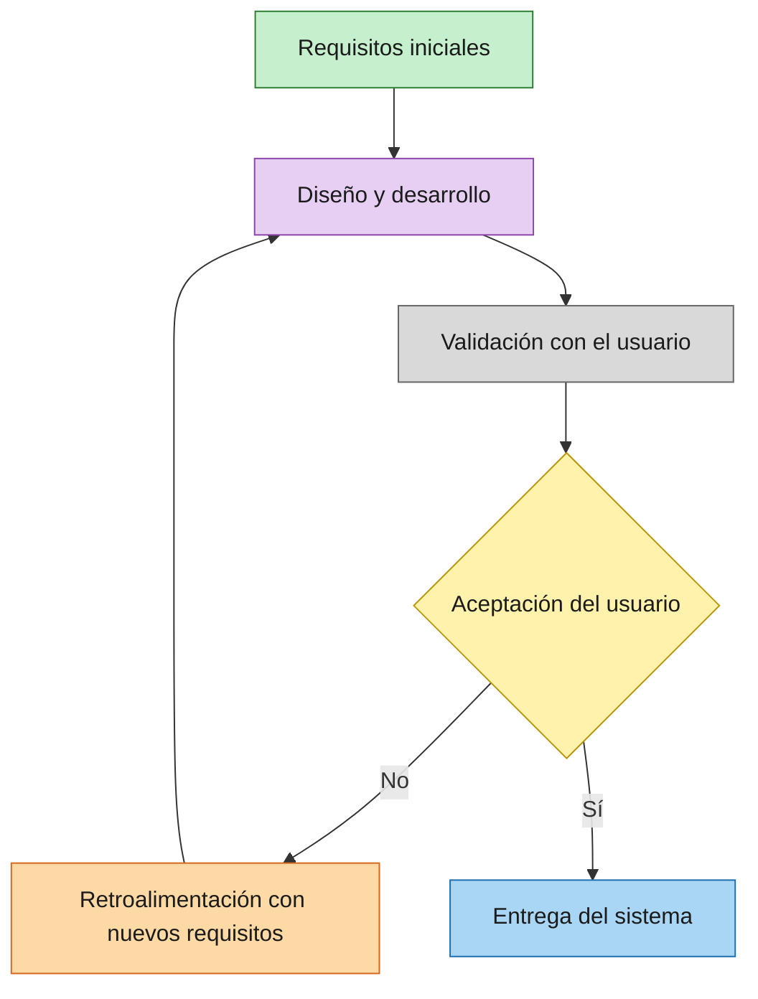

# Introducción: Web Development

Este apunte introductorio presenta, de forma breve y con definiciones simples, las nociones que se retoman a lo largo de toda la materia: qué es la ingeniería de software, qué es el desarrollo de software como actividad concreta dentro de ella, cómo se distinguen el frontend y el backend dentro de una aplicación web, y qué roles profesionales existen alrededor de esa división (frontend developer, backend developer, full stack developer, DevOps engineer y software architect).

## Ingeniería de software

La **ingeniería de software** es la disciplina que aplica principios de ingeniería (métodos sistemáticos, medibles y repetibles) al diseño, desarrollo, prueba y mantenimiento de software. La idea central es tratar la construcción de software no como un oficio artesanal e improvisado, sino como un proceso de ingeniería: con etapas definidas, documentación, control de calidad y capacidad de mantenimiento a lo largo del tiempo.

Esta disciplina abarca más que la escritura de código. Incluye actividades como el relevamiento de requisitos (entender qué necesita resolver el software y para quién), el diseño de la arquitectura (cómo se organizan sus componentes y cómo se comunican entre sí), la implementación, las pruebas (verificar que el software funciona como se espera) y el mantenimiento (corregir errores y adaptar el sistema a necesidades que cambian con el tiempo). La ingeniería de software le da a la materia su marco general: los conceptos de arquitectura web que se estudian en los módulos siguientes son, en definitiva, decisiones de ingeniería de software aplicadas al contexto específico de la Web.

## Desarrollo de software

El **desarrollo de software** es el conjunto de actividades concretas mediante las cuales se concibe, especifica, diseña, programa, documenta, prueba y corrige el software. Si la ingeniería de software es el marco disciplinar, el desarrollo de software es la actividad práctica dentro de ese marco: es el proceso que efectivamente produce el sistema, siguiendo (con mayor o menor formalidad, según el contexto y la metodología elegida) las etapas que la ingeniería de software propone.

En la práctica, el desarrollo de software rara vez ocurre en un único paso. Suele organizarse en ciclos o iteraciones, donde se construye una versión inicial, se la evalúa, y se ajusta el resultado antes de continuar. Existen distintas metodologías para organizar este proceso (por ejemplo, enfoques ágiles frente a enfoques más tradicionales o en cascada), pero todas comparten el mismo objetivo: convertir una necesidad o un requisito en un sistema de software que funcione de manera confiable.

Un ejemplo simple de este enfoque iterativo es el **modelo de prototipado evolutivo** (*evolutionary prototyping*): se parte de requisitos iniciales, se construye una versión de prueba, y esa versión se somete a validación con el usuario antes de decidir si el sistema está listo para entregarse o si necesita otra vuelta de ajustes.

**Figura 1 — Modelo de prototipado evolutivo.** A partir de los requisitos iniciales se diseña y desarrolla una versión del sistema, que se valida con el usuario; si no es aceptada, la retroalimentación con nuevos requisitos vuelve a alimentar el diseño, y el ciclo se repite hasta lograr la aceptación y entregar el sistema.

## Frontend y backend

Toda aplicación web moderna suele dividirse, a los fines de su desarrollo, en dos grandes capas: el frontend y el backend. Distinguir con claridad qué responsabilidad tiene cada una es una de las primeras intuiciones necesarias para entender la arquitectura de cualquier sistema web.

- **Frontend.** Es la parte de la aplicación con la que el usuario interactúa directamente: lo que se muestra y se ejecuta en el navegador. Comprende la interfaz visual, la maquetación de las páginas y el comportamiento interactivo del lado del cliente, típicamente construido con HTML (estructura del contenido), CSS (presentación visual) y JavaScript (comportamiento e interactividad). El frontend es responsable de la experiencia de usuario: cómo se ve la aplicación y cómo responde a las acciones de quien la usa.
- **Backend.** Es la parte de la aplicación que corre en el servidor, fuera del alcance directo del usuario. Se encarga de la lógica de negocio, el acceso y almacenamiento de datos (por ejemplo, en una base de datos), la autenticación de usuarios y la exposición de servicios que el frontend consume, generalmente a través de una API. El backend es responsable de que los datos se procesen correctamente, de manera segura y consistente, independientemente de qué cliente (un navegador, una aplicación móvil, otro servidor) esté solicitando la información.

Ambas capas se comunican entre sí, casi siempre mediante el protocolo HTTP, que es precisamente el punto de partida de los próximos módulos de esta materia: el frontend envía solicitudes (*requests*) al backend, y el backend responde con los datos o el resultado de la operación solicitada. Esta división de responsabilidades (presentación e interacción de un lado, lógica y datos del otro) es la base sobre la que se apoya la arquitectura de la inmensa mayoría de las aplicaciones web actuales, y es el punto de partida conceptual para todo lo que sigue en la materia.

## Roles dentro del desarrollo web

Esta división entre frontend y backend se refleja también en los roles profesionales del sector. Conocer sus nombres y responsabilidades básicas ayuda a ubicar, más adelante, en qué parte del stack se sitúa cada tema de la materia.

- **Frontend developer.** Se dedica a construir la interfaz de usuario de un sitio o aplicación, asegurando que se vea bien y sea fácil de usar. Trabaja principalmente con HTML (estructura), CSS (presentación) y JavaScript (interactividad), a menudo con la ayuda de frameworks como React o Vue, y colabora con diseñadores y con el equipo de backend para integrar la interfaz con los datos reales.
- **Backend developer.** Se dedica a crear y mantener los componentes del lado servidor: desarrollo de APIs, operaciones sobre bases de datos, gestión de autenticación, integración con servicios externos y optimización del rendimiento. Suele trabajar con lenguajes como Python, Java, PHP, JavaScript (sobre Node.js) o .NET, junto con bases de datos relacionales o no relacionales.
- **Full stack developer.** Combina habilidades de frontend y de backend: puede construir tanto la interfaz de usuario como la lógica de negocio, las bases de datos y las APIs que la sustentan, y a menudo también participa en llevar el producto a producción. No implica necesariamente ser experto absoluto en cada tecnología, sino poder cubrir cualquier parte del proceso de desarrollo web cuando es necesario.
- **DevOps engineer.** Actúa como puente entre los equipos de desarrollo y de operaciones, con el objetivo de acelerar la entrega de software sin sacrificar calidad. Sus responsabilidades incluyen automatizar pipelines de integración y despliegue continuo (CI/CD), gestionar infraestructura (frecuentemente en la nube, con contenedores como Docker o Kubernetes), y configurar monitoreo y alertas para mantener sistemas escalables y resilientes.
- **Software architect.** Es responsable de las decisiones técnicas de alto nivel sobre cómo se organiza un sistema: qué componentes lo integran, cómo se comunican entre sí, qué tecnologías se adoptan y qué compromisos (*trade-offs*) se asumen entre atributos como rendimiento, escalabilidad, seguridad y mantenibilidad. A diferencia de un rol centrado en la implementación día a día, el software architect piensa la estructura general del sistema y guía al equipo de desarrollo para que esas decisiones se respeten de forma consistente.

## Bibliografía

- Wikipedia (en). *Software engineering*. https://en.wikipedia.org/wiki/Software_engineering
- Wikipedia (en). *Software development*. https://en.wikipedia.org/wiki/Software_development
- Wikipedia (en). *Software development* — Figura del modelo de prototipado evolutivo (Evolutionary prototyping model). https://en.wikipedia.org/wiki/Software_development#/media/File:Evolutionary_prototyping_model.jpg
- AWS (es). *The difference between frontend and backend*. https://aws.amazon.com/es/compare/the-difference-between-frontend-and-backend/
- roadmap.sh. *Frontend Developer Roadmap*. https://roadmap.sh/frontend?fl=1
- roadmap.sh. *Backend Developer Roadmap*. https://roadmap.sh/backend
- roadmap.sh. *Full Stack Developer Roadmap*. https://roadmap.sh/full-stack
- roadmap.sh. *DevOps Roadmap*. https://roadmap.sh/devops
- roadmap.sh. *Software Architect Roadmap*. https://roadmap.sh/software-architect
